# Module 1-2 - Spring MVC 3-layer & REST API

> Mục tiêu: hiểu bản chất đường đi của HTTP request và xây được REST CRUD Product + Category theo 3 lớp, dùng đúng DTO, status code và pagination.

## 1. Bức tranh tổng thể

Client gửi request:

```http
GET /api/products/10
```

Backend trả response:

```http
HTTP/1.1 200 OK
Content-Type: application/json

{"id":10,"name":"Keyboard","price":1500000}
```

Một response có hai phần chính:

- **Status code** cho biết kết quả xử lý.
- **Body** chứa dữ liệu, thường ở dạng JSON.

REST API là hợp đồng giữa client và server. Client chỉ cần biết URL, HTTP method, request JSON, response JSON và status code; client không cần biết Java class bên trong backend.

Luồng xử lý:

```text
Client
  -> DispatcherServlet
  -> Controller
  -> Service
  -> Repository
  -> Service
  -> Controller
  -> HTTP response
```

`DispatcherServlet` là cửa vào của Spring MVC. Nó tìm Controller phù hợp, chuyển JSON thành Java object và chuyển object trả về thành JSON. Spring Boot cấu hình nó sẵn.

### Sơ đồ 1 - Từ client đến dữ liệu

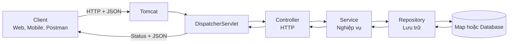

**Cách đọc sơ đồ 1:**

1. `Client` là nơi phát sinh request, ví dụ browser, mobile app hoặc Postman.
2. Mũi tên `HTTP + JSON` nghĩa là dữ liệu đang đi qua mạng, chưa phải Java object trong ứng dụng.
3. `Tomcat` nhận kết nối, parse HTTP và giao request cho Spring MVC.
4. `DispatcherServlet` tìm Controller method phù hợp.
5. `Controller` nhận dữ liệu HTTP đã được chuyển thành kiểu Java và gọi Service.
6. `Service` áp dụng business rule rồi gọi Repository.
7. `Repository` đọc/ghi vào `Map` hoặc database.
8. Các mũi tên quay ngược biểu diễn kết quả được trả về qua từng lời gọi Java.
9. Tại `DispatcherServlet`, Java response object được serialize thành JSON rồi gửi lại Client.

Điểm cần nhớ: chỉ đoạn Client ↔ Backend dùng HTTP; Controller ↔ Service ↔ Repository là lời gọi method Java trong cùng JVM.

## 2. Kiến trúc 3-layer

### Sơ đồ 2 - Mỗi lớp sở hữu một loại quyết định

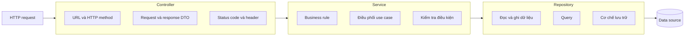

**Cách đọc sơ đồ 2:**

- Khối `Controller` sở hữu quyết định thuộc giao tiếp HTTP: URL, method, DTO, status và header.
- Mũi tên Controller → Service nghĩa là Controller chuyển yêu cầu thành một lời gọi use case.
- Khối `Service` sở hữu business rule, ví dụ kiểm tra SKU trùng hoặc Category có tồn tại.
- Mũi tên Service → Repository nghĩa là nghiệp vụ cần đọc hoặc thay đổi dữ liệu.
- Khối `Repository` sở hữu chi tiết truy cập dữ liệu và query.
- `Data source` là nơi dữ liệu thật sự được lưu: hiện tại có thể là `Map`, sau này là PostgreSQL.

Khi không biết một đoạn code nên đặt ở đâu, hãy hỏi: nó đang quyết định chuyện HTTP, chuyện nghiệp vụ hay chuyện lưu trữ?

### Controller - hiểu HTTP

Controller chịu trách nhiệm:

- Nhận URL, HTTP method, path variable, query parameter và JSON body.
- Gọi Service.
- Trả status code, header và response body.

Controller không nên chứa nghiệp vụ hoặc gọi Repository trực tiếp.

```java
@RestController
@RequestMapping("/api/products")
public class ProductController {
    private final ProductService productService;

    public ProductController(ProductService productService) {
        this.productService = productService;
    }

    @GetMapping("/{id}")
    public ResponseEntity<ProductResponse> getById(@PathVariable Long id) {
        return ResponseEntity.ok(productService.getById(id));
    }
}
```

### Service - hiểu nghiệp vụ

Service chịu trách nhiệm:

- Thực thi business rule.
- Phối hợp một hoặc nhiều Repository.
- Kiểm tra điều kiện trước khi tạo, sửa hoặc xóa.
- Mapping model và DTO nếu chưa có Mapper riêng.

Business rule của `shopcore` có thể gồm:

- SKU không được trùng.
- Category phải tồn tại trước khi tạo Product.
- Giá Product phải lớn hơn `0`.
- Không xóa Category nếu vẫn còn Product thuộc Category đó.

```java
@Service
public class ProductService {
    private final ProductRepository productRepository;
    private final CategoryRepository categoryRepository;

    public ProductService(
            ProductRepository productRepository,
            CategoryRepository categoryRepository) {
        this.productRepository = productRepository;
        this.categoryRepository = categoryRepository;
    }

    public ProductResponse create(CreateProductRequest request) {
        if (productRepository.existsBySku(request.getSku())) {
            throw new DuplicateSkuException(request.getSku());
        }

        Category category = categoryRepository.findById(request.getCategoryId())
                .orElseThrow(() ->
                        new CategoryNotFoundException(request.getCategoryId()));

        Product product = new Product(
                null, request.getSku(), request.getName(),
                request.getPrice(), category.getId());

        return toResponse(productRepository.save(product));
    }
}
```

Kiến thức M1-1 xuất hiện ở đây: Service không tự `new Repository()`. Spring inject dependency qua constructor.

### Repository - hiểu cách lưu dữ liệu

Repository chịu trách nhiệm đọc và ghi dữ liệu, đồng thời che giấu cách lưu dữ liệu khỏi Service.

```java
public interface ProductRepository {
    Product save(Product product);
    Optional<Product> findById(Long id);
    List<Product> findAll();
    boolean existsById(Long id);
    boolean existsBySku(String sku);
    void deleteById(Long id);
}
```

M1-2 có thể dùng `Map<Long, Product>` làm kho dữ liệu tạm. Sang M1-3, ta thay implementation này bằng Spring Data JPA. Controller và phần lớn Service không cần thay đổi.

Quy tắc cần nhớ:

```text
Controller -> Service -> Repository
```

- Controller biết Service.
- Service biết Repository.
- Repository không biết Controller.
- Service không trả `ResponseEntity` vì đó là khái niệm HTTP.

## 3. Annotation quan trọng

### `@RestController`

Đánh dấu class là REST Controller. Object trả về được chuyển thành JSON.

### `@RequestMapping`

Đặt URL gốc cho Controller:

```java
@RestController
@RequestMapping("/api/products")
public class ProductController {}
```

### HTTP mapping

```java
@GetMapping
@PostMapping
@PutMapping
@PatchMapping
@DeleteMapping
```

### `@PathVariable`

Dùng để xác định một resource cụ thể:

```java
@GetMapping("/{id}")
public ProductResponse getById(@PathVariable Long id) { ... }
```

`GET /api/products/10` có `id = 10`.

### `@RequestParam`

Dùng cho tìm kiếm, lọc, sắp xếp và phân trang:

```java
@GetMapping
public List<ProductResponse> search(
        @RequestParam(required = false) String keyword,
        @RequestParam(defaultValue = "0") int page,
        @RequestParam(defaultValue = "20") int size) { ... }
```

```http
GET /api/products?keyword=keyboard&page=0&size=20
```

### `@RequestBody`

Yêu cầu Spring chuyển JSON body thành Java object:

```java
@PostMapping
public ProductResponse create(@RequestBody CreateProductRequest request) { ... }
```

M1-4 sẽ bổ sung `@Valid`; M1-2 cần hiểu JSON binding trước.

### Sơ đồ 3 - Annotation lấy dữ liệu từ vị trí nào?

```mermaid
flowchart LR
    REQ[HTTP request] --> PATH[Path<br/>/products/10]
    REQ --> QUERY[Query string<br/>?page=0&size=20]
    REQ --> HEADER[Headers<br/>Authorization, Content-Type]
    REQ --> BODY[Body<br/>JSON]

    PATH --> PV[@PathVariable]
    QUERY --> RP[@RequestParam]
    HEADER --> RH[@RequestHeader]
    BODY --> RB[@RequestBody]

    PV --> METHOD[Controller method arguments]
    RP --> METHOD
    RH --> METHOD
    RB --> METHOD
```

**Cách đọc sơ đồ 3:**

1. Một HTTP request được tách thành `path`, `query string`, `headers` và `body`.
2. `@PathVariable` yêu cầu Spring lấy giá trị nằm trong URL template.
3. `@RequestParam` yêu cầu Spring lấy giá trị sau dấu `?`.
4. `@RequestHeader` lấy một HTTP header.
5. `@RequestBody` đọc body, sau đó message converter/Jackson biến JSON thành object.
6. Các mũi tên hội tụ tại `Controller method arguments`: trước khi method chạy, Spring phải chuẩn bị xong tất cả argument.

Nếu một argument không chuyển đổi được, ví dụ `abc` không thành `Long`, Controller method có thể chưa được gọi. Annotation không tạo dữ liệu; nó chỉ mô tả dữ liệu cần lấy từ đâu.

## 4. Path variable và query parameter

| Loại | Ví dụ | Ý nghĩa |
|---|---|---|
| Path variable | `/products/10` | Xác định Product cụ thể |
| Query parameter | `/products?categoryId=10` | Lọc danh sách Product |

ID của resource thường nằm trong path. Filter, search, page và sort thường nằm trong query string.

Không nên dùng `GET /products/getById?id=10`; nên dùng `GET /products/10`.

### Sơ đồ 4 - Giải phẫu một URL

Với URL:

```text
https://shopcore.dev/api/products/10?includeCategory=true&page=0
```

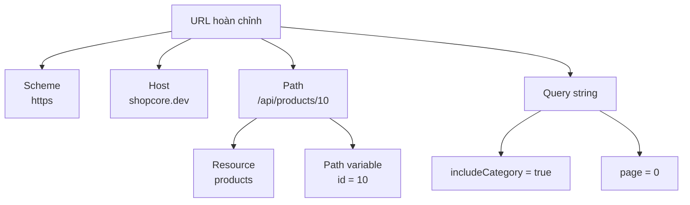

**Cách đọc sơ đồ 4:**

- `https` là scheme, cho biết giao thức và việc kết nối được mã hóa bằng TLS.
- `shopcore.dev` là host, cho biết request cần đi đến máy chủ nào.
- `/api/products/10` là path dùng để định tuyến request.
- `products` biểu diễn loại resource; `10` là định danh resource cụ thể.
- Phần sau dấu `?` là query string.
- Dấu `&` ngăn cách nhiều query parameter: `includeCategory=true` và `page=0`.

Path trả lời “đang thao tác resource nào”; query trả lời “muốn lọc hoặc trình bày kết quả theo cách nào”.

## 5. HTTP methods

| Method | Mục đích | Ví dụ |
|---|---|---|
| GET | Đọc dữ liệu | `GET /products/10` |
| POST | Tạo resource mới | `POST /products` |
| PUT | Cập nhật đầy đủ | `PUT /products/10` |
| PATCH | Cập nhật một phần | `PATCH /products/10` |
| DELETE | Xóa resource | `DELETE /products/10` |

- **Safe**: request không làm thay đổi state server. GET nên safe.
- **Idempotent**: gửi cùng request nhiều lần thì trạng thái cuối vẫn giống nhau.

GET, PUT và DELETE có tính idempotent. POST thường không idempotent vì gửi hai lần có thể tạo hai resource.

## 6. Status code

| Status | Khi nào dùng |
|---|---|
| `200 OK` | Đọc thành công; update có response body |
| `201 Created` | Tạo resource thành công |
| `204 No Content` | Thành công và không có body, thường dùng khi xóa |
| `400 Bad Request` | Input sai định dạng hoặc validation |
| `404 Not Found` | Resource không tồn tại |
| `409 Conflict` | Xung đột với state hiện tại, ví dụ trùng SKU |

```text
GET thành công             -> 200
POST tạo mới thành công    -> 201
DELETE thành công, no body -> 204
Input sai                  -> 400
Không tìm thấy resource    -> 404
Trùng SKU/tên              -> 409
```

`ResponseEntity<T>` giúp Controller điều khiển body, status và header:

```java
@PostMapping
public ResponseEntity<ProductResponse> create(
        @RequestBody CreateProductRequest request) {
    ProductResponse created = productService.create(request);
    URI location = URI.create("/api/products/" + created.getId());
    return ResponseEntity.created(location).body(created);
}
```

```java
@DeleteMapping("/{id}")
public ResponseEntity<Void> delete(@PathVariable Long id) {
    productService.delete(id);
    return ResponseEntity.noContent().build();
}
```

`204 No Content` không nên có body.

### Sơ đồ 5 - Chọn status code theo nguyên nhân

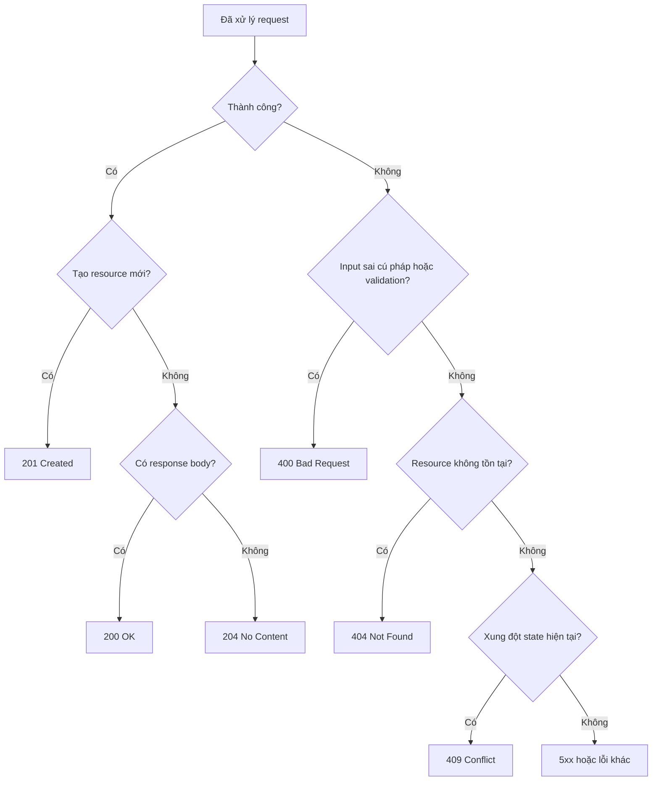

**Cách đọc sơ đồ 5:**

1. Bắt đầu bằng câu hỏi request thành công hay thất bại.
2. Nếu thành công và vừa tạo resource mới, chọn `201 Created`.
3. Nếu thành công, không tạo mới và có body, thường chọn `200 OK`.
4. Nếu thành công nhưng cố ý không trả body, chọn `204 No Content`.
5. Nếu thất bại vì dữ liệu client gửi sai, chọn `400 Bad Request`.
6. Nếu input hợp lệ nhưng resource cần tìm không tồn tại, chọn `404 Not Found`.
7. Nếu resource tồn tại nhưng thao tác xung đột với state hiện tại, chọn `409 Conflict`.
8. Nhánh `5xx` dành cho lỗi phía server hoặc lỗi chưa được xử lý phù hợp.

Status code mô tả kết quả nhìn từ HTTP contract, không phải tên exception Java.

## 7. DTO và model/entity

DTO là object mang dữ liệu qua biên hệ thống, ví dụ request và response JSON.

```java
public class CreateProductRequest {
    private String sku;
    private String name;
    private BigDecimal price;
    private Long categoryId;

    public CreateProductRequest() {
    }

    // Getter/setter hoặc Lombok @Getter @Setter.
}

public class UpdateProductRequest {
    private String name;
    private BigDecimal price;
    private Long categoryId;

    public UpdateProductRequest() {
    }

    // Getter/setter hoặc Lombok @Getter @Setter.
}

public class ProductResponse {
    private Long id;
    private String sku;
    private String name;
    private BigDecimal price;
    private Long categoryId;

    public ProductResponse() {
    }

    public ProductResponse(
            Long id,
            String sku,
            String name,
            BigDecimal price,
            Long categoryId) {
        this.id = id;
        this.sku = sku;
        this.name = name;
        this.price = price;
        this.categoryId = categoryId;
    }

    // Getter/setter hoặc Lombok @Getter @Setter.
}
```

Không nên dùng entity cho cả request và response vì:

- Có thể lộ field nội bộ như `passwordHash`.
- Client có thể gửi field không được phép sửa.
- Thay đổi database model có thể làm vỡ API contract.
- Quan hệ hai chiều có thể gây JSON đệ quy vô hạn.

DTO giúp tách hợp đồng API khỏi cách lưu và xử lý nội bộ.

Mapping thủ công:

```java
private ProductResponse toResponse(Product product) {
    return new ProductResponse(
            product.getId(), product.getSku(), product.getName(),
            product.getPrice(), product.getCategoryId());
}
```

Mapping thủ công phù hợp M1-2 vì rõ ràng và dễ debug. MapStruct chỉ là tùy chọn khi mapping nhiều và lặp lại.

### Sơ đồ 6 - DTO bảo vệ ranh giới API

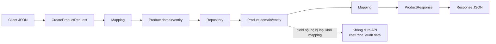

**Cách đọc sơ đồ 6:**

1. Client gửi JSON và Jackson tạo `CreateProductRequest`.
2. Mapping chuyển request DTO thành Product nội bộ.
3. Repository chỉ làm việc với model/entity phù hợp với tầng lưu trữ, không cần biết JSON ban đầu.
4. Khi đọc dữ liệu, Repository trả Product nội bộ.
5. Mapping chiều về tạo `ProductResponse`.
6. Jackson serialize ProductResponse thành JSON cho Client.
7. Mũi tên nét đứt cho biết field nội bộ như `costPrice` bị loại khỏi response mapping.

Request DTO kiểm soát client **được phép gửi gì**; response DTO kiểm soát client **được phép nhìn thấy gì**. Hai DTO không cần có cùng field.

## 8. CRUD Product và Category

| Chức năng | Method + URL | Thành công |
|---|---|---|
| Danh sách | `GET /api/products` | `200` + page JSON |
| Chi tiết | `GET /api/products/{id}` | `200` hoặc `404` |
| Tạo | `POST /api/products` | `201` hoặc `400/404/409` |
| Cập nhật | `PUT /api/products/{id}` | `200` hoặc `404/409` |
| Xóa | `DELETE /api/products/{id}` | `204` hoặc `404` |

Category dùng cấu trúc tương tự:

```text
GET    /api/categories
GET    /api/categories/{id}
POST   /api/categories
PUT    /api/categories/{id}
DELETE /api/categories/{id}
```

Nếu xóa Category vẫn đang có Product, nên trả `409 Conflict`: request đúng cú pháp nhưng xung đột với trạng thái hệ thống.

### Sơ đồ 7 - CRUD là các thao tác trên vòng đời resource

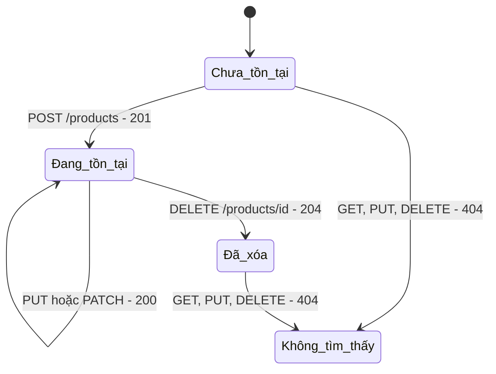

**Cách đọc sơ đồ 7:**

- Ban đầu Product ở trạng thái `Chưa tồn tại`.
- `POST /products` tạo resource, server trả `201`, Product chuyển sang `Đang tồn tại`.
- `GET` chỉ đọc nên Product vẫn ở trạng thái đang tồn tại.
- `PUT/PATCH` thay đổi dữ liệu nhưng vẫn là cùng resource đó, thường giữ nguyên id.
- `DELETE` chuyển resource sang trạng thái không còn tồn tại và thường trả `204`.
- GET/PUT/DELETE với id chưa từng tồn tại hoặc đã bị xóa dẫn đến `404`.

URL đại diện cho resource; HTTP method mô tả ý định đối với resource. Đây là lý do không cần URL dạng `/createProduct` hoặc `/deleteProduct`.

## 9. Pagination

Không nên trả toàn bộ Product vì sẽ tốn database, RAM, băng thông và làm frontend chậm.

```http
GET /api/products?page=0&size=20&sort=name,asc
```

Trong Spring Data, page index thường bắt đầu từ `0`.

### `Pageable`

Mô tả yêu cầu của client: page number, page size và sort.

```java
@GetMapping
public Page<ProductResponse> getAll(Pageable pageable) {
    return productService.getAll(pageable);
}
```

### `Page<T>`

Chứa:

- `content`: dữ liệu trang hiện tại.
- `number`: số trang hiện tại.
- `size`: kích thước trang.
- `totalElements`: tổng phần tử.
- `totalPages`: tổng số trang.
- `first`, `last`: có phải trang đầu/cuối không.

```java
public Page<ProductResponse> getAll(Pageable pageable) {
    return productRepository.findAll(pageable)
            .map(this::toResponse);
}
```

`Page.map()` giữ nguyên metadata và chỉ chuyển Product thành ProductResponse.

Nên giới hạn page size, ví dụ tối đa `100`, để tránh request `size=1000000`.

Ở M1-2 bạn học hợp đồng phân trang. M1-3 mới dùng `JpaRepository.findAll(pageable)` để query database thật. Nếu chưa có Spring Data, có thể dùng `PageResponse<T>` từ M0-1 hoặc `PageImpl<T>` cho dữ liệu in-memory.

### Sơ đồ 8 - Một tập dữ liệu được chia thành nhiều trang

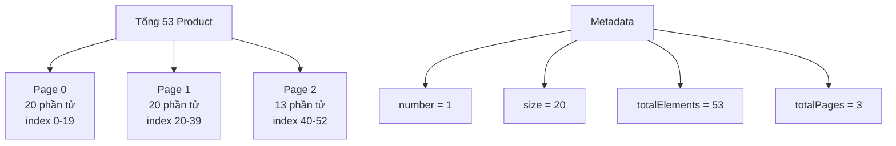

**Cách đọc sơ đồ 8:**

1. Tập dữ liệu có tổng cộng `53` Product.
2. Với `size=20`, hai trang đầu có 20 phần tử, trang cuối còn 13.
3. Spring Data thường đánh số từ `0`, nên `page=0` là trang đầu và `page=1` là trang thứ hai.
4. `number` cho biết index trang hiện tại, không phải tổng số trang.
5. `totalElements` là tổng số bản ghi thỏa điều kiện tìm kiếm.
6. `totalPages = ceil(totalElements / size)`, ở đây là `ceil(53 / 20) = 3`.
7. `content` chỉ chứa phần tử của trang hiện tại.

Pagination đúng nghĩa phải cắt dữ liệu tại Repository/database. Lấy toàn bộ 53 hoặc một triệu dòng về RAM rồi mới cắt chỉ là “giả phân trang”.

## 10. Package structure gợi ý

```text
com.shopcore
├── product
│   ├── Product.java
│   ├── ProductController.java
│   ├── ProductService.java
│   ├── ProductRepository.java
│   └── dto
│       ├── CreateProductRequest.java
│       ├── UpdateProductRequest.java
│       └── ProductResponse.java
├── category
│   ├── Category.java
│   ├── CategoryController.java
│   ├── CategoryService.java
│   ├── CategoryRepository.java
│   └── dto
│       ├── CreateCategoryRequest.java
│       ├── UpdateCategoryRequest.java
│       └── CategoryResponse.java
└── common
    └── PageResponse.java
```

Chia theo feature giúp code liên quan Product nằm gần nhau. Chưa cần áp dụng kiến trúc phức tạp hơn ở module này.

## 11. Trace request tạo Product

```http
POST /api/products
Content-Type: application/json

{"sku":"KB-001","name":"Keyboard","price":1500000,"categoryId":2}
```

1. `DispatcherServlet` tìm `ProductController.create()`.
2. Jackson chuyển JSON thành `CreateProductRequest`.
3. Controller gọi `productService.create(request)`.
4. Service kiểm tra SKU và Category.
5. Service tạo Product rồi gọi Repository.
6. Repository lưu Product và gán id.
7. Service mapping Product thành ProductResponse.
8. Controller trả `201 Created`, header `Location` và body.
9. Jackson chuyển response object thành JSON.

Bạn cần tự kể lại được luồng này mà không nhìn tài liệu.

## 12. Phần đào sâu: Spring thực sự chạy code của bạn như thế nào?

Phần này dành đúng cho trường hợp của bạn: đã từng viết dự án, nhìn code Controller/Service/Repository rất quen, nhưng chưa rõ **ai tạo object, ai gọi method và vì sao annotation hoạt động**.

### 12.1 Hai thời điểm hoàn toàn khác nhau

Đừng trộn hai giai đoạn sau:

```text
Giai đoạn A: ứng dụng khởi động
Giai đoạn B: có request chạy vào
```

Khi ứng dụng khởi động, Spring chuẩn bị “bộ máy”. Khi request đến, Spring dùng bộ máy đã chuẩn bị để gọi code của bạn.

### 12.2 Chuyện gì xảy ra khi ứng dụng khởi động?

Giả sử ta chạy:

```java
SpringApplication.run(ShopcoreApplication.class, args);
```

Theo mô hình đơn giản, các bước diễn ra như sau:

1. Spring Boot tạo `ApplicationContext`.
2. Component scanning tìm `@RestController`, `@Service`, `@Repository`, `@Component` và các cấu hình liên quan.
3. Spring tạo bean và inject dependency qua constructor.
4. Embedded web server, thường là Tomcat, được khởi động và mở một cổng như `8080`.
5. Spring Boot đăng ký `DispatcherServlet` với servlet container.
6. Spring MVC đọc các annotation mapping trên Controller.
7. Nó xây một bảng ánh xạ giữa request và Controller method.

### Sơ đồ 9 - Những gì được chuẩn bị lúc startup

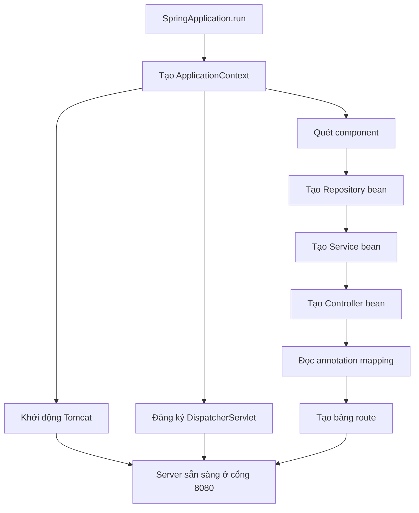

**Cách đọc sơ đồ 9:**

1. `SpringApplication.run` bắt đầu quá trình bootstrap.
2. Spring tạo `ApplicationContext`, nơi quản lý bean.
3. Component scanning tìm class được đánh dấu bằng stereotype annotation.
4. Repository bean được tạo và có thể được inject vào Service bean.
5. Service bean tiếp tục được inject vào Controller bean.
6. Spring MVC đọc mapping trên Controller để tạo bảng route.
7. Song song về mặt ý tưởng, Spring Boot khởi động Tomcat và đăng ký `DispatcherServlet`.
8. Khi Tomcat mở cổng và bảng route đã sẵn sàng, server mới có thể phục vụ request.

Sơ đồ mô tả quan hệ logic, không cam kết từng bước luôn chạy tuần tự đúng theo thứ tự mũi tên. Ý chính là Spring chuẩn bị object graph và hạ tầng web **trước request đầu tiên**.

Ví dụ bảng ánh xạ về mặt ý tưởng:

```text
GET    /api/products       -> ProductController.getAll(...)
GET    /api/products/{id}  -> ProductController.getById(...)
POST   /api/products       -> ProductController.create(...)
PUT    /api/products/{id}  -> ProductController.update(...)
DELETE /api/products/{id}  -> ProductController.delete(...)
```

Vì vậy, annotation không phải “phép thuật chạy mỗi lần request”. Chúng chủ yếu là metadata để Spring đọc và chuẩn bị cấu hình lúc khởi động.

Nếu hai method có mapping trùng nhau khiến Spring không biết chọn method nào, ứng dụng có thể lỗi ngay khi khởi động thay vì chờ đến lúc client gọi.

### 12.3 Bean nào được tạo trước?

Giả sử có chuỗi phụ thuộc:

```text
ProductController
  cần ProductService
    cần ProductRepository
    cần CategoryRepository
```

Spring phải có các dependency để tạo object phụ thuộc chúng. Hình dung:

```text
ProductRepository bean ─┐
                       ├─> ProductService bean
CategoryRepository bean ┘          |
                                   v
                         ProductController bean
```

Bạn không cần phụ thuộc vào thứ tự chi tiết nội bộ. Điều cần hiểu là `ApplicationContext` quản lý object graph và bảo đảm constructor nhận đúng dependency.

Code sau:

```java
public ProductController(ProductService productService) {
    this.productService = productService;
}
```

không có nghĩa Controller tự đi tìm Service. Spring đã có Service bean và truyền reference của bean đó vào constructor.

### 12.4 Có request chạy vào thì ai nhận đầu tiên?

Giả sử client gọi:

```http
GET /api/products/10
```

Luồng gần với runtime hơn:

```text
Client
  -> TCP connection
  -> Tomcat
  -> Servlet Filter chain
  -> DispatcherServlet
  -> HandlerMapping
  -> HandlerInterceptor.preHandle()
  -> HandlerAdapter
  -> Argument resolvers / HttpMessageConverter
  -> ProductController.getById(10)
  -> ProductService.getById(10)
  -> ProductRepository.findById(10)
  <- ProductResponse
  <- HttpMessageConverter/Jackson tạo JSON
  <- HTTP response
```

Không cần thuộc toàn bộ tên ngay. Hãy hiểu vai trò của từng thành phần.

### Sơ đồ 10 - Một request chạy qua Spring MVC

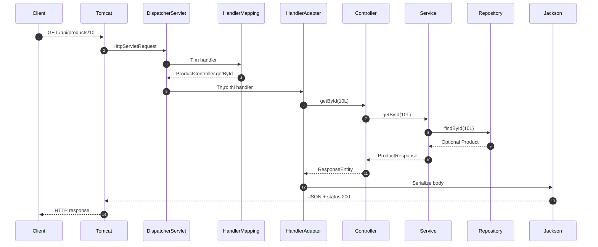

**Cách đọc sơ đồ 10:**

1. Client gửi request đến cổng do Tomcat lắng nghe.
2. Tomcat tạo request object của Servlet API và giao cho `DispatcherServlet`.
3. `DispatcherServlet` hỏi `HandlerMapping`: request này thuộc handler nào?
4. `HandlerMapping` trả về `ProductController.getById` cùng execution chain liên quan.
5. `DispatcherServlet` giao handler cho `HandlerAdapter` phù hợp.
6. `HandlerAdapter` dùng argument resolver để biến chuỗi `10` thành `Long 10L`.
7. Từ Controller đến Repository là các lời gọi Java đồng bộ bình thường.
8. Repository trả dữ liệu, Service mapping thành `ProductResponse`.
9. Controller trả `ResponseEntity`, vẫn chỉ là Java object mô tả response.
10. Jackson serialize body thành JSON; Tomcat ghi status, header và body về Client.

`HandlerMapping` **chọn method**; `HandlerAdapter` **chuẩn bị argument, gọi method và xử lý return value**.

### 12.5 Tomcat và Spring MVC khác nhau thế nào?

Tomcat là servlet container/web server. Nó làm những việc tầng thấp hơn:

- Mở cổng mạng.
- Nhận kết nối HTTP.
- Parse request thành `HttpServletRequest`.
- Tạo `HttpServletResponse`.
- Quản lý thread xử lý request.
- Giao request cho Filter và Servlet phù hợp.

Spring MVC chạy bên trên Servlet API. `DispatcherServlet` chính là một Servlet do Spring cung cấp.

Mô hình cần nhớ:

```text
Tomcat nhận HTTP
Spring MVC định tuyến request
Code của bạn xử lý nghiệp vụ
```

### 12.6 `DispatcherServlet` là Front Controller

Front Controller nghĩa là nhiều request đi qua một cổng trung tâm trước khi tới Controller cụ thể.

Nếu không có cổng trung tâm, mỗi Controller phải tự làm các việc lặp lại như:

- Tìm URL có khớp không.
- Đọc path variable.
- Chuyển JSON thành object.
- Xử lý exception.
- Chuyển object thành JSON.

`DispatcherServlet` điều phối các thành phần chuyên trách để làm những việc này. Controller của bạn chỉ tập trung vào endpoint.

### 12.7 `HandlerMapping` tìm method nào?

Khi khởi động, `RequestMappingHandlerMapping` đã đọc các annotation như:

```java
@RequestMapping("/api/products")
@GetMapping("/{id}")
```

Khi request `GET /api/products/10` đến, nó xét nhiều điều kiện:

- HTTP method có phải GET không?
- Path có khớp `/api/products/{id}` không?
- `Content-Type` và `Accept` có phù hợp không, nếu mapping có yêu cầu?
- Các điều kiện header/parameter khác có khớp không?

Kết quả không chỉ là một URL. Nó là một handler method cụ thể trên một Controller bean cụ thể.

### 12.8 `HandlerAdapter` để làm gì?

`DispatcherServlet` tìm được handler nhưng không tự gọi mọi loại handler theo một cách cố định. Nó dùng `HandlerAdapter` để biết cách thực thi handler đó.

Với annotated Controller, thành phần quan trọng là `RequestMappingHandlerAdapter`. Nó điều phối:

- Chuẩn bị argument cho method.
- Gọi Controller method.
- Xử lý return value.

Hãy hình dung:

```java
getById(@PathVariable Long id)
```

Java không tự biết `id` lấy từ URL. HandlerAdapter dùng argument resolver phù hợp để tạo giá trị `Long id` trước khi gọi method.

### 12.9 Argument resolver biến HTTP thành Java argument

Mỗi loại Controller parameter có cách giải quyết riêng:

```java
@PathVariable Long id
@RequestParam int page
@RequestHeader String authorization
@RequestBody CreateProductRequest request
Principal principal
Pageable pageable
```

Về mặt ý tưởng:

```text
@PathVariable -> lấy biến từ URL template
@RequestParam  -> lấy giá trị trong query string
@RequestHeader -> lấy HTTP header
Principal      -> lấy người dùng đã xác thực
Pageable       -> ghép page, size, sort
@RequestBody   -> đọc HTTP body qua message converter
```

Đó là lý do method Controller có thể nhận parameter rất “đẹp”. Spring đã chuyển dữ liệu HTTP thô thành kiểu Java trước khi gọi method.

Nếu client gửi:

```http
GET /api/products/abc
```

nhưng Controller cần `Long id`, quá trình chuyển kiểu thất bại trước khi code bên trong `getById()` chạy. Service chưa được gọi.

### 12.10 `@RequestBody` và Jackson hoạt động ra sao?

Request:

```http
POST /api/products
Content-Type: application/json

{"sku":"KB-001","price":1500000}
```

Luồng rút gọn:

```text
HTTP body là bytes
  -> HttpMessageConverter phù hợp với application/json
  -> Jackson đọc JSON
  -> tạo CreateProductRequest
  -> Controller nhận Java object
```

`Content-Type` mô tả định dạng body client đang gửi. Nếu client nói body là JSON nhưng nội dung JSON hỏng, Jackson không tạo được DTO và Controller method thường chưa chạy.

Chiều trả về diễn ra ngược lại:

```text
ProductResponse Java object
  -> HttpMessageConverter/Jackson
  -> JSON bytes
  -> HTTP response body
```

`@RestController` khiến return value được coi là response body thay vì tên một HTML view.

### 12.11 `Accept` và `Content-Type` không giống nhau

```http
Content-Type: application/json
Accept: application/json
```

- `Content-Type`: body tôi gửi cho server có định dạng gì.
- `Accept`: tôi muốn server trả về định dạng gì.

Đây là content negotiation. Trong API JSON thông thường, cả hai thường là `application/json`, nên ta dễ quên rằng chúng có ý nghĩa khác nhau.

### 12.12 `ResponseEntity` được xử lý như thế nào?

Controller trả:

```java
return ResponseEntity
        .created(location)
        .body(response);
```

Đây chưa phải HTTP response được gửi ngay qua mạng. Nó là một Java object mô tả:

- Status `201`.
- Header `Location`.
- Body là `ProductResponse`.

Spring MVC xử lý return value, đặt status/header vào `HttpServletResponse`, rồi dùng message converter ghi body thành JSON.

Vì vậy:

```text
ResponseEntity = mô tả toàn bộ HTTP response bằng Java
ProductResponse = chỉ mô tả response body
```

### 12.13 Exception đi đâu?

Giả sử Service ném:

```java
throw new ProductNotFoundException(id);
```

Exception đi ngược call stack:

```text
Repository <- Service <- Controller <- Spring MVC
```

Nếu không xử lý, client có thể nhận lỗi server mặc định. Khi có `@ExceptionHandler` hoặc `@ControllerAdvice`, Spring dùng `HandlerExceptionResolver` để tìm cách chuyển exception thành HTTP response.

Mô hình:

```text
ProductNotFoundException
  -> exception handler
  -> status 404
  -> error DTO/ProblemDetail
  -> JSON response
```

Service chỉ nói bằng ngôn ngữ nghiệp vụ: “không có Product”. Lớp web quyết định điều đó tương ứng HTTP `404`. M1-4 sẽ học sâu phần này.

### Sơ đồ 11 - Exception đi ngược ra ngoài

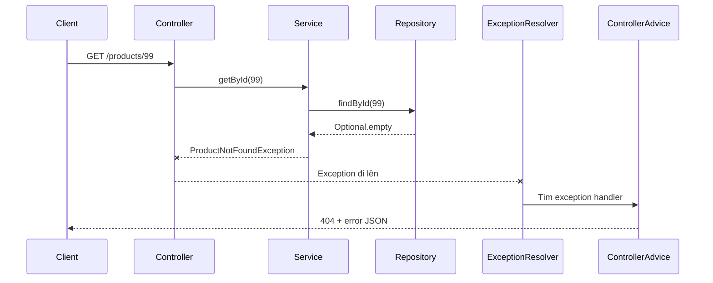

**Cách đọc sơ đồ 11:**

1. Request đi vào Controller và tiếp tục xuống Service, Repository như bình thường.
2. Repository không tìm thấy Product nên trả `Optional.empty()`.
3. Service diễn giải kết quả đó thành `ProductNotFoundException`.
4. Dấu `x` trên mũi tên thể hiện luồng bình thường bị ngắt bởi exception.
5. Exception đi ngược call stack qua Controller về cơ chế xử lý lỗi của Spring MVC.
6. `HandlerExceptionResolver` tìm `@ExceptionHandler` hoặc `@ControllerAdvice` phù hợp.
7. Handler tạo status `404` và error body, sau đó Spring serialize thành JSON.

Service diễn đạt lỗi bằng ngôn ngữ nghiệp vụ; web layer chuyển nó thành hợp đồng HTTP. Repository không nên tự tạo `ResponseEntity.notFound()`.

### 12.14 Filter, Interceptor và Controller khác nhau ở đâu?

Đây là ba vị trí khác nhau trên đường đi của request:

```text
Filter -> DispatcherServlet -> Interceptor -> Controller
```

**Filter** thuộc Servlet layer:

- Chạy trước hoặc sau `DispatcherServlet`.
- Có thể áp dụng cho request rất rộng.
- Thường dùng cho security filter, CORS, request wrapping và logging tầng thấp.

**Interceptor** thuộc Spring MVC:

- Chạy trước/sau Controller handler.
- Biết handler nào sắp được gọi.
- Thường dùng cho logging, đo thời gian hoặc kiểm tra điều kiện MVC.

**Controller** xử lý use case HTTP cụ thể.

Không đặt business rule Product vào Filter hay Interceptor.

### Sơ đồ 12 - Filter và Interceptor nằm ở đâu?

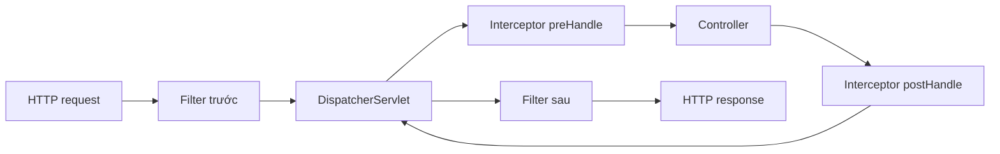

**Cách đọc sơ đồ 12:**

1. Filter nhận request trước `DispatcherServlet` vì nó thuộc Servlet layer.
2. Filter có thể chặn request hoặc gọi tiếp filter chain.
3. Sau khi `DispatcherServlet` tìm được handler, Interceptor chạy `preHandle` trước Controller.
4. Nếu `preHandle` cho phép, Controller được gọi.
5. Sau Controller, Interceptor có thể chạy logic hậu xử lý.
6. Response đi ngược qua `DispatcherServlet` rồi qua phần “sau” của Filter.

Filter bao quanh Servlet; Interceptor bao quanh Controller handler. Business rule Product vẫn thuộc Service, không thuộc hai thành phần này.

### 12.15 3-layer không phải cơ chế bắt buộc của Spring

Spring MVC không bắt buộc Controller phải gọi Service rồi gọi Repository. Bạn hoàn toàn có thể viết:

```java
@GetMapping("/{id}")
public Product get(@PathVariable Long id) {
    return repository.findById(id).orElseThrow();
}
```

Code này vẫn chạy. 3-layer là **quyết định kiến trúc của đội phát triển**, không phải yêu cầu để framework hoạt động.

Ta chọn 3-layer để tách các lý do thay đổi:

```text
HTTP contract thay đổi      -> Controller/DTO
Business rule thay đổi      -> Service
Cách lưu dữ liệu thay đổi   -> Repository
```

Đây là ý nghĩa sâu hơn của Separation of Concerns và SRP mà bạn đã học ở M0-2.

### 12.16 Một method call vẫn chỉ là Java bình thường

Sau khi Spring đã gọi Controller, dòng sau vẫn là Java method call bình thường:

```java
productService.getById(id);
```

Không có HTTP chạy giữa Controller và Service. Không có JSON chạy giữa Service và Repository. Các object đang ở cùng JVM và thường chỉ truyền reference cho nhau.

```text
Client -> backend       : HTTP + JSON
Controller -> Service   : Java method call + Java object
Service -> Repository   : Java method call + Java object
Backend -> client       : HTTP + JSON
```

Chỉ khi Repository nói chuyện với database thì mới có giao thức/database driver ở ranh giới đó. M1-3 sẽ đào sâu phần này.

### 12.17 Controller singleton và nhiều request đồng thời

Mặc định, Controller, Service và Repository Spring bean thường có scope singleton: mỗi bean có một instance trong `ApplicationContext`.

Điều đó không có nghĩa mỗi lần chỉ xử lý một request. Nhiều request có thể được nhiều thread gọi vào cùng một Controller instance.

### Sơ đồ 13 - Một singleton bean phục vụ nhiều request

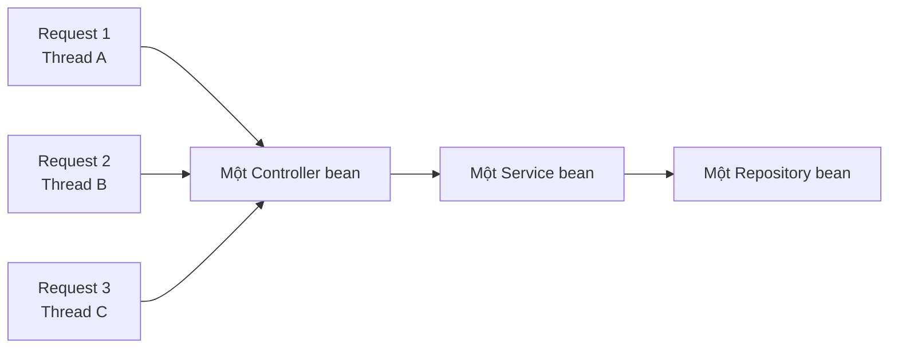

**Cách đọc sơ đồ 13:**

- `Thread A/B/C` biểu diễn ba request có thể được xử lý đồng thời.
- Cả ba cùng gọi vào **một** Controller bean vì scope mặc định là singleton.
- Controller cũng thường giữ reference đến một Service singleton.
- Service tiếp tục dùng Repository singleton.
- Mỗi method call có biến local riêng trên stack của thread, nên `@PathVariable Long id` dạng biến local không bị dùng chung.
- Field mutable trên bean lại được tất cả thread nhìn thấy, nên có thể bị ghi đè hoặc race condition.

Vì vậy Controller và Service nên stateless. Dependency `final` là reference dùng chung ổn định; request data phải nằm trong parameter hoặc biến local.

Vì vậy không nên lưu dữ liệu riêng của request trong field mutable:

```java
@RestController
public class ProductController {
    // Sai: nhiều request có thể cùng sửa field này.
    private Long currentProductId;
}
```

Nên giữ Controller/Service stateless:

```java
@GetMapping("/{id}")
public ProductResponse get(@PathVariable Long id) {
    // id là biến local, riêng cho lần gọi method này.
    return productService.getById(id);
}
```

Dependency field `final` thường an toàn vì nó là reference được gán một lần, không phải state riêng của từng request.

### 12.18 HTTP stateless nghĩa là gì?

Mỗi HTTP request nên mang đủ thông tin cần thiết để server hiểu và xử lý nó. Server không nên phụ thuộc vào biến tạm trong Controller từ request trước.

Stateless không có nghĩa hệ thống không lưu dữ liệu. Product vẫn nằm trong database, cache hoặc storage. Nó chỉ có nghĩa request không dựa vào state hội thoại ẩn trong Controller instance.

Sau này JWT là một ví dụ: mỗi request gửi token để server biết danh tính người gọi.

### 12.19 DTO là boundary chứ không chỉ là class chứa field

Nếu chỉ nghĩ DTO là “class giống entity”, ta sẽ không thấy giá trị của nó.

DTO đánh dấu ranh giới:

```text
Thế giới bên ngoài       | Nội bộ backend
JSON contract            | Domain/entity
CreateProductRequest  -> | Product
ProductResponse       <- | Product
```

Ví dụ Product nội bộ có `costPrice`, nhưng API public không được trả field đó. Response DTO bảo vệ boundary.

Create DTO và Update DTO khác nhau vì quyền thay đổi khác nhau:

- Create có thể yêu cầu SKU.
- Update có thể không cho đổi SKU.
- Response có id do server tạo.
- Entity có field audit mà client không được kiểm soát.

### 12.20 Repository interface thật sự trừu tượng hóa điều gì?

Service muốn hỏi bằng ngôn ngữ nghiệp vụ:

```java
productRepository.existsBySku(sku);
productRepository.findById(id);
```

Service không cần biết dữ liệu đến từ:

- `Map` trong RAM.
- PostgreSQL.
- Một API khác.
- Cache.

Repository interface là boundary giữa nghiệp vụ và cơ chế lưu trữ. Tuy nhiên, không nên hiểu rằng thay database luôn miễn phí; query capability, transaction và performance vẫn có thể ảnh hưởng thiết kế.

### Sơ đồ 14 - Service phụ thuộc contract, không phụ thuộc nơi lưu

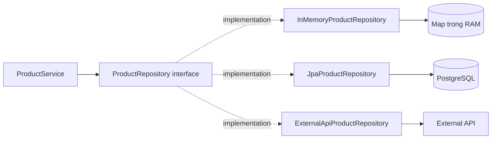

**Cách đọc sơ đồ 14:**

1. `ProductService` chỉ phụ thuộc `ProductRepository` interface.
2. Interface mô tả các khả năng Service cần như `findById`, `save`, `existsBySku`.
3. Mũi tên nét đứt `implementation` cho biết có nhiều cách thực hiện contract.
4. In-memory implementation dùng `Map` trong RAM, phù hợp học M1-2.
5. JPA implementation truy cập PostgreSQL, sẽ học ở M1-3.
6. Một implementation khác về lý thuyết có thể gọi external API.
7. Spring DI chọn implementation phù hợp và inject nó vào Service.

Service gọi cùng một contract; implementation quyết định dữ liệu đến từ đâu. Đây là DIP và Strategy ở mức kiến trúc, nhưng không có nghĩa đổi mọi database luôn hoàn toàn miễn phí.

### 12.21 Service không chỉ là lớp chuyển tiếp

Service tệ:

```java
public Product save(Product product) {
    return repository.save(product);
}
```

Nếu mọi method chỉ chuyển tiếp một dòng và không có use case/business rule, hãy đặt câu hỏi Service có đang mang ý nghĩa gì không.

Service có giá trị khi nó mô tả use case:

```java
public ProductResponse createProduct(CreateProductRequest request) {
    ensureSkuIsUnique(request.getSku());
    Category category = getExistingCategory(request.getCategoryId());
    Product product = createProductFrom(request, category);
    return toResponse(productRepository.save(product));
}
```

Tên method Service nên nói ngôn ngữ nghiệp vụ, không chỉ lặp tên CRUD của Repository.

### 12.22 Pagination thật sự xảy ra ở đâu?

Trong code:

```java
repository.findAll(pageable);
```

Nhưng mục đích cuối cùng là database chỉ trả một phần dữ liệu, tương tự ý tưởng:

```sql
SELECT * FROM product
ORDER BY name
LIMIT 20 OFFSET 40;
```

Nếu Repository lấy toàn bộ một triệu dòng về RAM rồi Service mới cắt 20 phần tử, response trông vẫn phân trang nhưng hệ thống không thật sự được tối ưu.

Ở M1-2, in-memory pagination giúp học contract. Sang M1-3, phải bảo đảm pagination được đẩy xuống database.

### 12.23 Phân biệt MVC và 3-layer

Hai khái niệm này liên quan nhưng không đồng nhất:

| Khái niệm | Trọng tâm |
|---|---|
| Spring MVC | Cơ chế web: route, bind request, gọi handler, tạo response |
| 3-layer | Cách tổ chức trách nhiệm: Controller, Service, Repository |

Spring MVC giải quyết câu hỏi: “HTTP request tới Java method bằng cách nào?”

3-layer giải quyết câu hỏi: “Sau khi vào code của mình, trách nhiệm nên đặt ở đâu?”

### Sơ đồ 15 - Spring MVC khác 3-layer

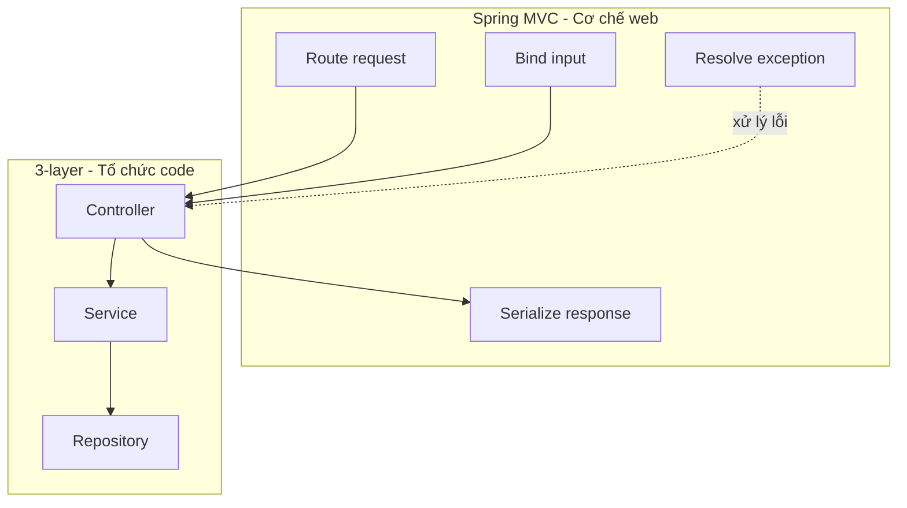

**Cách đọc sơ đồ 15:**

- Khung `Spring MVC` chứa cơ chế web do framework cung cấp: route request, bind input, serialize response và resolve exception.
- Khung `3-layer` chứa cách đội phát triển tổ chức code: Controller → Service → Repository.
- Mũi tên từ route/bind sang Controller cho thấy Spring MVC là cầu nối từ HTTP vào code của bạn.
- Mũi tên từ Controller sang serialize cho thấy return value quay lại cơ chế web để trở thành HTTP response.
- Mũi tên nét đứt biểu diễn exception từ code có thể được Spring MVC bắt và chuyển thành error response.

Spring MVC trả lời “HTTP request tới Java method bằng cách nào?”. 3-layer trả lời “sau khi request vào code, mỗi trách nhiệm nên đặt ở đâu?”. Hai khái niệm phối hợp với nhau nhưng không đồng nhất.

### 12.24 Trace lỗi theo vị trí

Khi debug, hãy hỏi request dừng ở đâu:

```text
Không kết nối được cổng          -> server/Tomcat chưa chạy hoặc sai port
404 endpoint                     -> mapping/path không khớp
405 Method Not Allowed           -> đúng path nhưng sai HTTP method
400 trước khi vào Controller     -> bind/convert JSON, path hoặc query lỗi
415 Unsupported Media Type       -> Content-Type không được hỗ trợ
406 Not Acceptable               -> server không tạo được format client yêu cầu
Exception trong Service          -> business rule/use case
Lỗi Repository/database          -> data access, query, connection
500                              -> exception chưa được chuyển thành response phù hợp
```

Đây là cách debug dựa trên luồng, thay vì sửa annotation ngẫu nhiên.

### 12.25 Mental model hoàn chỉnh

```text
LÚC KHỞI ĐỘNG
Spring tạo bean
-> inject dependency
-> đọc mapping annotation
-> tạo bảng route
-> khởi động Tomcat

LÚC CÓ REQUEST
Tomcat nhận HTTP
-> Filter
-> DispatcherServlet
-> HandlerMapping chọn Controller method
-> HandlerAdapter chuẩn bị argument
-> Controller gọi Service
-> Service chạy nghiệp vụ
-> Repository truy cập dữ liệu
-> Controller nhận kết quả
-> return value handler + Jackson tạo JSON
-> Tomcat gửi HTTP response

LÚC CÓ LỖI
Exception đi ngược call stack
-> HandlerExceptionResolver / ControllerAdvice
-> status code + error body
```

Nếu hiểu được sơ đồ này, bạn không còn chỉ “biết viết ba lớp”; bạn đã hiểu framework đang nối ba lớp đó với HTTP như thế nào.

## 13. Các lỗi thường gặp

- Controller gọi Repository trực tiếp: nghiệp vụ bị phân tán và khó test.
- Service trả `ResponseEntity`: Service bị phụ thuộc vào HTTP.
- Trả entity trực tiếp: dễ lộ field và làm API phụ thuộc schema.
- Dùng `200` cho mọi trường hợp.
- Dùng POST cho cả đọc, sửa và xóa.
- Đặt URL bằng động từ như `/getAllProducts` thay vì `/products`.
- Tự `new Service()` trong Controller, phá IoC/DI.
- Trả toàn bộ danh sách mà không phân trang.
- Dùng `double` cho tiền thay vì `BigDecimal`.

## 14. PUT và PATCH

- `PUT`: cập nhật đầy đủ representation.
- `PATCH`: cập nhật một phần.

PATCH phức tạp hơn vì phải quy định field vắng mặt nghĩa là “giữ nguyên” hay “gán null”. Ở M1-2, có thể dùng PUT với Update DTO đầy đủ trước.

## 15. Service có bắt buộc có interface không?

Không. Có thể dùng trực tiếp:

```java
@Service
public class ProductService {}
```

Chỉ tạo `ProductService` + `ProductServiceImpl` khi có nhiều implementation hoặc kiến trúc thật sự cần boundary. Tạo interface chỉ để có hậu tố `Impl` là over-engineering.

Repository interface hữu ích hơn vì ta sẽ thay implementation in-memory bằng JPA.

## 16. Bài thực hành `shopcore`

### Category

- Tạo model, request/response DTO, Repository, Service và Controller.
- Hoàn thành năm endpoint CRUD.
- Không cho trùng tên Category.
- Không tìm thấy trả `404`; trùng tên trả `409`.

### Product

- Có `id`, `sku`, `name`, `price`, `categoryId`.
- SKU duy nhất, Category phải tồn tại, giá lớn hơn `0`.
- Không tìm thấy Product khi sửa/xóa thì trả `404`.

### Pagination

```http
GET /api/products?page=0&size=10
```

Response cần có content, page number, page size, total elements và total pages.

### Kiểm tra bằng curl

```bash
curl -i http://localhost:8080/api/products

curl -i -X POST http://localhost:8080/api/categories \
  -H 'Content-Type: application/json' \
  -d '{"name":"Accessories"}'

curl -i -X POST http://localhost:8080/api/products \
  -H 'Content-Type: application/json' \
  -d '{"sku":"KB-001","name":"Keyboard","price":1500000,"categoryId":1}'
```

Hãy quan sát status code, header và body, không chỉ nhìn JSON.

## 17. Kế hoạch học 4 buổi

1. HTTP, Spring MVC, Controller và các loại input.
2. Kiến trúc 3-layer và Category CRUD.
3. DTO, mapping, Product CRUD và status code.
4. Pagination, kiểm tra tình huống lỗi và ôn luồng request.

## 18. Câu hỏi tự kiểm tra

1. Vì sao Controller không nên gọi Repository trực tiếp?
2. Category không tồn tại khi tạo Product thì lớp nào phát hiện?
3. Lớp nào quyết định trả `201 Created`?
4. Vì sao Service không nên trả `ResponseEntity`?
5. `/products/10` và `/products?categoryId=10` khác nhau thế nào?
6. Vì sao trùng SKU phù hợp với `409` hơn `400`?
7. Request DTO và response DTO có cần giống nhau không?
8. Vì sao không nên trả entity trực tiếp?
9. `Page<T>` chứa gì ngoài content?
10. Khi thay in-memory Repository bằng JPA, lớp nào nên ít thay đổi nhất?

### Đáp án ngắn

1. Để giữ nghiệp vụ trong Service và tách HTTP khỏi data access.
2. Service phát hiện bằng cách hỏi CategoryRepository.
3. Controller, vì status code thuộc HTTP.
4. Để Service dùng được ngoài môi trường HTTP.
5. Cái đầu xác định Product id 10; cái sau lọc theo Category id 10.
6. Request hợp lệ nhưng xung đột với state hiện tại.
7. Không; mỗi DTO phục vụ một contract riêng.
8. Tránh lộ field và tránh API phụ thuộc model lưu trữ.
9. Page number, size, total elements, total pages, sort, first/last.
10. Controller; Service cũng chỉ nên thay đổi rất ít.

## 19. Checklist trước khi thi

- [ ] Vẽ được luồng `Client -> Controller -> Service -> Repository`.
- [ ] Nói đúng trách nhiệm của từng lớp.
- [ ] Dùng đúng GET/POST/PUT/PATCH/DELETE.
- [ ] Phân biệt path variable, query parameter và request body.
- [ ] Chọn đúng 200/201/204/400/404/409.
- [ ] Hiểu `ResponseEntity`.
- [ ] Giải thích DTO khác model/entity.
- [ ] Mapping được model sang response DTO.
- [ ] Hiểu `Pageable` và `Page<T>`.
- [ ] CRUD Product + Category chạy trong `shopcore`.

> Không tự tick M1-2 trong `01_LO_TRINH.md`. Chỉ cập nhật sau khi bài kiểm tra đạt ít nhất 85% và deliverable đạt yêu cầu.

## 20. Tóm tắt cần nhớ

```text
Controller: hiểu HTTP, nhận input, gọi Service, trả status + DTO.
Service: hiểu nghiệp vụ, phối hợp Repository, mapping và ném exception.
Repository: đọc/ghi dữ liệu, không biết HTTP.
DTO: hợp đồng JSON giữa API và client.
Pageable: yêu cầu trang, kích thước và sort.
Page<T>: content kèm metadata phân trang.
```

> **Controller hiểu HTTP, Service hiểu nghiệp vụ, Repository hiểu cách lưu dữ liệu. DTO là hợp đồng với bên ngoài.**

## 21. Tài liệu official để đọc tiếp

- [Spring MVC - DispatcherServlet](https://docs.spring.io/spring-framework/reference/web/webmvc/mvc-servlet.html): Front Controller và các thành phần delegate.
- [Spring MVC - Request processing](https://docs.spring.io/spring-framework/reference/web/webmvc/mvc-servlet/sequence.html): trình tự xử lý request và exception.
- [Spring MVC - Annotated Controllers](https://docs.spring.io/spring-framework/reference/web/webmvc/mvc-controller.html): mô hình Controller dựa trên annotation.
- [Controller method arguments](https://docs.spring.io/spring-framework/reference/web/webmvc/mvc-controller/ann-methods/arguments.html): Spring tạo `@PathVariable`, `@RequestParam`, `@RequestBody` và các argument khác như thế nào.
- [HTTP message converters](https://docs.spring.io/spring-framework/reference/web/webmvc/mvc-config/message-converters.html): chuyển đổi giữa HTTP body và Java object.
