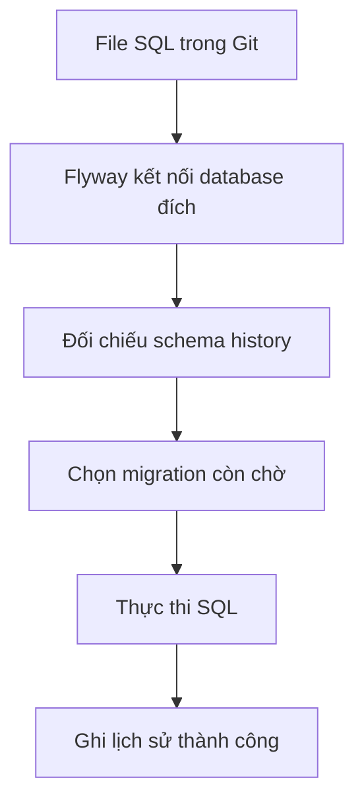

# M2-3 · Lesson 01: Migration và lịch sử schema

> Học 45–60 phút. Mục tiêu: hiểu vì sao database cần lịch sử thay đổi, đọc tên migration và dự đoán file nào chạy. Chỉ đọc và làm đề là đủ cho buổi này; chưa cần cài thêm công cụ.

**Đọc theo nhu cầu:** cần hiểu mục 1–7 và tự viết một ALTER ngắn. Không cần thuộc cấu trúc nội bộ của bảng history hoặc thuật toán checksum. Kiến thức này giúp cả backend lẫn dịch vụ AI nâng cấp schema lưu document/job/result mà không làm mỗi môi trường một kiểu.

## 1. Vấn đề bạn đã gặp khi code JPA

Bạn thêm `description` vào Product rồi chạy app. Máy bạn có cột mới, nhưng máy đồng đội hoặc database deploy vẫn chỉ có `id`, `sku`, `name`, `price`. Cùng một Java code mà schema khác nhau thì query có thể thất bại.

Entity mô tả dữ liệu mà code mong đợi. Migration mô tả **các bước đưa database từ trạng thái cũ sang trạng thái mới**. Hai việc này liên quan nhưng không giống nhau.

Ví dụ muốn thêm cột:

```sql
ALTER TABLE products ADD COLUMN description TEXT;
```

Nếu chỉ chạy tay rồi quên ghi lại, người khác không biết phải làm gì. Ta lưu lệnh SQL vào Git để mỗi môi trường nhận cùng một thay đổi, có thứ tự và có dấu vết.

## 2. Flyway làm gì?

Flyway nhận migration trong ứng dụng, kết nối database đích và đối chiếu với lịch sử đã chạy của **database đó**. Versioned migration chạy theo phiên bản và mỗi phiên bản áp dụng một lần; checksum hỗ trợ phát hiện file đã đổi. [Nguồn: versioned migrations](https://documentation.red-gate.com/flyway/flyway-concepts/migrations/versioned-migrations).



Ý nghĩa từng bước:

1. File SQL là yêu cầu thay đổi, chưa phải bằng chứng đã chạy.
2. Database đích là nơi thực sự bị thay đổi. Cùng file nhưng kết nối DB khác sẽ có lịch sử khác.
3. Schema history trả lời “DB này đã áp dụng phiên bản nào?”.
4. Flyway chọn những bước còn thiếu theo cấu hình hiện tại.
5. PostgreSQL thực thi CREATE/ALTER/INSERT; Flyway không thay thế engine SQL.
6. Sau thành công, lịch sử giúp lần sau không thực hiện lại versioned migration đó.

Flyway không đọc Entity rồi tự nghĩ ra SQL nâng cấp. Bạn viết migration hoặc dùng quy trình tạo migration phù hợp, rồi review nó.

## 3. Tên file có ý nghĩa gì?

```text
src/main/resources/db/migration/
  V1__create_catalog.sql
  V2__add_product_description.sql
  V3__add_product_price_index.sql
```

`V2__add_product_description.sql` gồm: `V` là versioned, `2` là phiên bản, `__` là hai dấu gạch dưới phân cách, phần cuối là mô tả. Mỗi version phải duy nhất. Thứ tự là số phiên bản: V2 trước V10, không phải thứ tự từ điển của tên file. [Quy tắc naming](https://documentation.red-gate.com/flyway/flyway-concepts/migrations/versioned-migrations).

`V2_add_column.sql` không theo naming mặc định. Nếu muốn phát hiện tên sai sớm, bật kiểm tra naming ở Lesson 02; đừng chỉ nhìn tên rồi nghĩ file chắc chắn được chạy.

Ví dụ hai người cùng thêm `V3__add_stock.sql` và `V3__add_price_index.sql`: hai mô tả khác nhau vẫn **trùng version 3**. Không có quy tắc “chọn file tạo trước” để xử lý. Nếu cả hai chưa áp dụng lên môi trường chung, nhóm thống nhất thứ tự và đổi một file sang version chưa dùng; kiểm cả phụ thuộc SQL. Nếu một file đã phát hành thì giữ nguyên version/file đó, thay đổi mới dùng version mới phù hợp.

## 4. Một chuỗi migration nhỏ, đọc được từ đầu

`V1__create_catalog.sql`:

```sql
CREATE TABLE categories (
    id BIGINT GENERATED BY DEFAULT AS IDENTITY PRIMARY KEY,
    name TEXT NOT NULL UNIQUE
);

CREATE TABLE products (
    id BIGINT GENERATED BY DEFAULT AS IDENTITY PRIMARY KEY,
    sku TEXT NOT NULL UNIQUE,
    name TEXT NOT NULL,
    price NUMERIC(12,2) NOT NULL CHECK (price > 0),
    category_id BIGINT NOT NULL REFERENCES categories(id)
);
```

Ta tạo categories trước vì products tham chiếu nó. Những constraint chính là kiến thức M2-2, không phải cú pháp riêng của Flyway.

`V2__add_product_description.sql`:

```sql
ALTER TABLE products ADD COLUMN description TEXT;
```

Thêm cột nullable để dòng cũ chưa có mô tả vẫn hợp lệ. Đừng thêm NOT NULL vào một cột mới trên bảng đã có dữ liệu mà chưa có kế hoạch cấp giá trị cho dòng cũ.

`V3__add_product_price_index.sql`:

```sql
CREATE INDEX idx_products_category_price
    ON products(category_id, price DESC, id ASC);
```

Đây là index minh họa nối với M2-1, không phải tuyên bố mọi dự án cần index này. Khi DB đã áp dụng V1, lần migrate tiếp theo còn V2 và V3. Khi DB trống, cần cả ba.

## 5. Schema history và checksum

Bảng `flyway_schema_history` lưu thông tin các migration đã thực hiện. Bạn có thể quan sát version, description, checksum và trạng thái; đây không phải bảng Product và không chứa bản sao đầy đủ của mọi dữ liệu nghiệp vụ.

Ví dụ minh họa:

| Version | Description | Success |
|---|---|---|
| 1 | create catalog | true |
| 2 | add product description | true |

Repository Git có thêm V3. Khi migrate, V3 là bước mới cần áp dụng.

Bạn có thể đọc lịch sử bằng SQL:

```sql
SELECT installed_rank, version, description, success
FROM flyway_schema_history
ORDER BY installed_rank;
```

`installed_rank` thể hiện thứ tự bản ghi được cài; `version` thể hiện phiên bản migration. Bảng phải tồn tại trong schema history đã cấu hình; snippet dùng tên/schema mặc định. Lệnh SELECT chỉ giúp quan sát, không hướng dẫn sửa tay history.

Checksum giống dấu nhận diện nội dung mà Flyway đối chiếu với lịch sử, không phải phép chứng minh hai database có mọi bảng/cột giống nhau. Sửa schema bằng SQL tay có thể làm schema lệch mà không đổi checksum file.

`validate` kiểm tra migration khả dụng so với lịch sử và có thể báo mismatch. Nó không chạy tất cả SQL để tái dựng schema rồi so từng cột. [Nguồn: validate](https://documentation.red-gate.com/flyway/reference/commands/validate).

## 6. Vì sao không sửa V1 đã chạy trên môi trường chung?

V1 ở dev đã tạo bảng có name. Bạn sửa V1 thêm description; DB mới sẽ có description nhưng DB cũ đã chạy V1 không tự chạy lại. Lịch sử trở nên không nhất quán, còn validation có thể phát hiện checksum khác.

Cách thông thường: giữ V1 đã phát hành, thêm V2 chứa ALTER. Nếu V1 chưa từng được chia sẻ và chỉ chạy trên DB local bỏ được, bạn có thể sửa rồi dựng lại DB local. Phải biết rõ phạm vi, không áp dụng thói quen đó lên dữ liệu cần giữ.

## 7. Migration, Hibernate và HTTP request

```text
App khởi động -> migration -> JPA kiểm tra schema -> app sẵn sàng
Sau đó: HTTP request -> Controller -> Service -> Repository -> SQL
```

Flyway thuộc quá trình chuẩn bị database khi khởi động hoặc deploy. Nó không chạy lại tất cả migration mỗi khi client gọi GET products. `ddl-auto=update` cũng không cung cấp quy trình lịch sử SQL được review tương đương. Lesson 02 sẽ dùng Flyway quản lý thay đổi và Hibernate validate Entity.

## 8. Tự luyện và tài liệu

Với DB có V1/V2 và repository có V1/V2/V3/V10, hãy dự đoán thứ tự cần chạy: V3 rồi V10, nếu validation và cấu hình không có vấn đề. Nếu có hai file cùng V3, cần giải quyết xung đột phiên bản trước.

- [Official: versioned migrations](https://documentation.red-gate.com/flyway/flyway-concepts/migrations/versioned-migrations): đọc naming, thứ tự, bất biến file đã phát hành.
- [Official: validate](https://documentation.red-gate.com/flyway/reference/commands/validate): đọc checksum và lỗi lịch sử.
- Video tùy chọn: tìm `Flyway schema history versioned migration PostgreSQL beginner`; kiểm tra ví dụ có chạy app lần hai và giải thích file nào không chạy lại.

Bạn đã hiểu khi tự nói được: Entity cần schema nào; migration đưa DB đến schema đó thế nào; lịch sử của mỗi DB lưu gì.

**Tự kiểm bằng lời:** “DB A đã ở V2, DB B trống. Cả hai cùng nhận V3. A chỉ chạy bước mới, B dựng từ V1; cuối cùng schema mong muốn giống nhau. File SQL đã phát hành được giữ nguyên để lịch sử còn đáng tin.” Nếu kể được ý này bằng cách nói của bạn thì không cần học thuộc định nghĩa migration.

Làm [đề Lesson 01](../../../Exams/de-kiem-tra/M2-3-flyway__2026-10-05__lesson1-lan1.md). Đáp án riêng, chưa mở trước khi làm.
