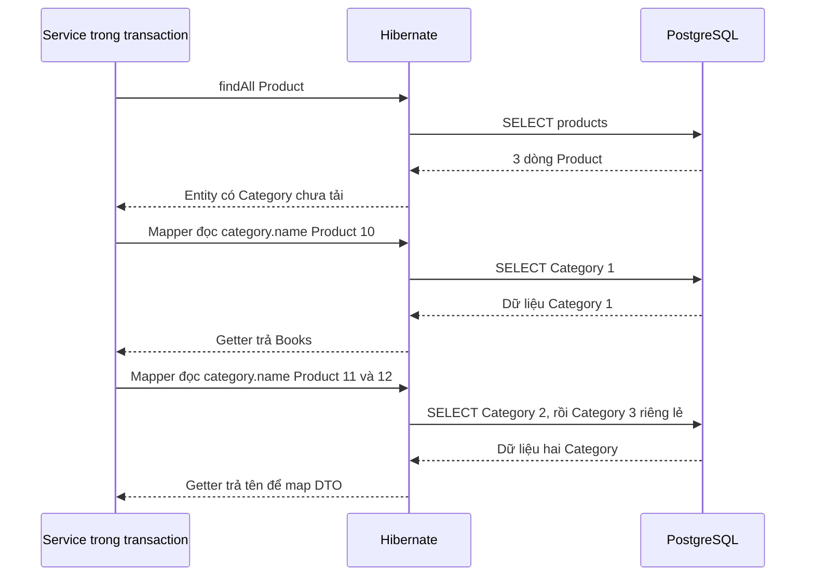

# M2-4 · Lesson 01: N+1 từ code đến SQL

> Học 60 phút. Cần M1-3 JPA và JOIN M2-1. Mục tiêu: tìm dòng code làm phát sinh thêm query, dự đoán số query có điều kiện, phân biệt N+1 với LazyInitializationException.

**Cần nắm:** nhìn mapping + dữ liệu + dòng đọc quan hệ để giải thích SQL phụ. **Chỉ tra cứu:** logger name và Statistics API. Không cần thuộc tên exception để được công nhận hiểu: nói đúng “đọc quan hệ chưa tải khi session đóng” vẫn thể hiện ý chính.

### Bốn từ dùng trong bài

- **Persistence context:** nơi Hibernate theo dõi entity trong một phạm vi làm việc; Category id=1 đã tải có thể được dùng lại ở đây.
- **Proxy/quan hệ chưa initialize:** Hibernate đã biết ID để tải dữ liệu, nhưng chưa cần có đủ name và các field khác. Đọc dữ liệu chưa có có thể kích hoạt SQL.
- **Session/EntityManager:** API và phạm vi làm việc của ORM; không đồng nhất với socket DB hay một JDBC connection vật lý.
- **Round-trip:** một lượt app gửi yêu cầu đến DB rồi nhận kết quả. Nhiều lượt nhỏ có thể tốn thời gian dù từng query đơn giản.

## 1. Chậm ở đâu nếu code chỉ có một findAll?

Bạn thấy một dòng `productRepository.findAll()` rồi nghĩ app chỉ query một lần. Nhưng entity có quan hệ, và lúc mapper đọc quan hệ Hibernate có thể thực hiện thêm SQL. Số lần gọi repository trong Java không bằng số SQL chạy trên database.

Ví dụ dưới dùng DTO **class**, phù hợp cách bạn viết. Snippet nằm trong các package ghi ở đầu, giả định dự án có JPA và Lombok. Đây là mẫu để đọc, không tạo project mới.

```java
// com.shopcore.category.Category
@Entity
@Table(name = "categories")
@Getter
@NoArgsConstructor(access = AccessLevel.PROTECTED)
public class Category {
    @Id
    @GeneratedValue(strategy = GenerationType.IDENTITY)
    private Long id;
    private String name;
}

// com.shopcore.product.Product
@Entity
@Table(name = "products")
@Getter
@NoArgsConstructor(access = AccessLevel.PROTECTED)
public class Product {
    @Id
    @GeneratedValue(strategy = GenerationType.IDENTITY)
    private Long id;
    private String name;

    @ManyToOne(fetch = FetchType.LAZY, optional = false)
    @JoinColumn(name = "category_id", nullable = false)
    private Category category;
}
```

Imports: annotation Entity/Table/Id/... từ `jakarta.persistence`, Lombok Getter/NoArgsConstructor/AccessLevel; Product import Category. Không dùng `@Data` mặc định trên toàn entity vì toString/equals có thể kéo thêm quan hệ ngoài ý muốn.

```java
// com.shopcore.product.dto.ProductResponse
@Getter
@AllArgsConstructor
public class ProductResponse {
    private Long id;
    private String name;
    private String categoryName;
}

// Repository extends JpaRepository<Product, Long>
public interface ProductRepository extends JpaRepository<Product, Long> {}

@Service
@RequiredArgsConstructor
public class ProductService {
    private final ProductRepository productRepository;

    @Transactional(readOnly = true)
    public List<ProductResponse> list() {
        return productRepository.findAll().stream()
                .map(p -> new ProductResponse(
                        p.getId(), p.getName(), p.getCategory().getName()))
                .toList();
    }
}
```

Service import List, ProductResponse, Spring Service/Transactional và Lombok RequiredArgsConstructor. Mapping nằm trong transaction nên truy cập LAZY còn có thể tải dữ liệu. **Có transaction không có nghĩa là hết N+1**.

## 2. Dữ liệu để trace không mơ hồ

| Product id | name | category_id |
|---|---|---|
| 10 | Java Book | 1 |
| 11 | Mouse | 2 |
| 12 | Coffee | 3 |

| Category id | name |
|---|---|
| 1 | Books |
| 2 | Electronics |
| 3 | Food |

Giả định: persistence context ban đầu chưa chứa Category nào; không cache cấp hai; quan hệ LAZY được Hibernate hỗ trợ và chưa fetch; không batch; gọi mapper trong transaction. Khi đó trace minh họa:

```sql
SELECT id, name, category_id FROM products; -- 1 query
SELECT id, name FROM categories WHERE id = 1; -- khi map Product 10
SELECT id, name FROM categories WHERE id = 2; -- khi map Product 11
SELECT id, name FROM categories WHERE id = 3; -- khi map Product 12
```

Ba Product và ba Category khác nhau tạo tổng 4 query trong giả định này. Tên cột/SQL thực tế phụ thuộc mapping, nhưng pattern là một query lấy danh sách rồi thêm query để tải quan hệ.

Vì sao có thể chậm? Nếu mỗi lượt giao tiếp có chi phí nền, 101 lượt cho 100 quan hệ thường đắt hơn gom dữ liệu cần thiết trong ít lượt. Tuy nhiên một JOIN quá lớn cũng có thể tốn nhiều dữ liệu/memory; bài sau sẽ chọn cách fetch và vẫn đo thời gian, không lấy số query làm tiêu chí duy nhất.

## 3. Ý nghĩa từng bước chạy



`category_id` có trong Product không có nghĩa `Category.name` cũng đã có. Hibernate biết khóa để tải Category, nhưng chỉ có dữ liệu name sau khi fetch. Chỗ đọc `getCategory().getName()` mới là điểm cần dữ liệu bổ sung trong ví dụ.

## 4. Vì sao không luôn đúng N+1 query?

Đổi dữ liệu: cả ba Product cùng Category 1. Trong cùng persistence context, Category đã tải có thể được dùng lại; không nhất thiết có ba SELECT Category giống nhau. Khi batch hoặc cache có tác dụng, số query cũng khác. `N+1` là tên của kiểu vấn đề, không phải công thức đúng tuyệt đối cho mọi quan hệ/dữ liệu.

Trong đúng mô hình to-one ở đây, không batch/cache cấp hai và context lạnh, cách đếm hữu ích là **1 query Product + số Category ID khác nhau thực sự cần tải**. Ba Product cùng Category 1 thường cho 2 SELECT dữ liệu; ba Category khác nhau cho 4. Không suy rộng công thức này sang collection, nhiều tầng fetch hay query paging có count.

Với collection như mỗi Category có list Product, một query lấy N Category rồi N query lấy collection cũng tạo pattern tương tự. Với nhiều tầng quan hệ, số query có thể lớn hơn một tầng N+1.

LAZY trì hoãn tải, không tự loại N+1. EAGER yêu cầu quan hệ được tải nhưng không bảo đảm ORM dùng một JOIN duy nhất; có thể vẫn phát sinh secondary SELECT. Hãy quan sát SQL. [Hibernate: fetching](https://docs.hibernate.org/orm/7.1/userguide/html_single/#fetching).

## 5. Quan sát thay vì đoán

Cho profile dev, ví dụ Hibernate 6/7:

```yaml
logging:
  level:
    org.hibernate.SQL: DEBUG
    org.hibernate.orm.jdbc.bind: TRACE
spring:
  jpa:
    properties:
      hibernate:
        generate_statistics: true
```

SQL log cho biết các statement; bind log cho biết giá trị tham số. Không bật bind TRACE bừa trên production vì giá trị có thể nhạy cảm và log lớn. Trong buổi quan sát, chọn một request, nhìn query Product rồi query Category lặp lại.

Statistics ví dụ:

```java
SessionFactory sf = entityManagerFactory.unwrap(SessionFactory.class);
Statistics statistics = sf.getStatistics();
statistics.clear();
productService.list();
long statements = statistics.getPrepareStatementCount();
```

Imports: `jakarta.persistence.EntityManagerFactory`, `org.hibernate.SessionFactory`, `org.hibernate.stat.Statistics`. Ví dụ đặt ở harness/dev code đã có các bean, gọi Service qua Spring proxy. Statistics phải được bật. Bộ đếm là chung của SessionFactory, nên test một request riêng và tránh request nền làm nhiễu. Clear statistics không tự clear persistence context hoặc mọi cache. Prepared statement count là chỉ số quan sát statement, không phải thời gian hay số row. Paging có thể thêm count query.

## 6. N+1 khác lỗi session đóng

| Tình huống | Có thể thấy |
|---|---|
| Đọc Category chưa tải trong transaction còn mở | Tải thêm SQL, có nguy cơ N+1 |
| Đọc LAZY chưa tải khi entity đã detached, không session hỗ trợ | LazyInitializationException |
| Quan hệ đã được fetch trước khi detach | Có thể đọc dữ liệu đã tải, không cần query mới |

Nếu trả entity ra Controller rồi Jackson đọc category.name, query hoặc lỗi có thể xảy ra lúc serialize. DTO mapping trong Service giúp chọn trước dữ liệu response, nhưng mapper vẫn có thể tạo N+1 nếu fetch plan thiếu. **DTO không tự sửa hiệu năng query**.

**Bạn thử giải thích:** nếu bỏ `p.getCategory().getName()` và response chỉ có Product id/name, ví dụ LAZY này không cần tải Category để dựng response. Việc “có quan hệ trong Entity” không có nghĩa mọi request đều phát sinh SELECT quan hệ. Đừng nhầm lỗi thiết kế của một use case với việc toàn bộ mapping LAZY là sai.

## 7. Tài liệu và tự luyện

- [Hibernate User Guide: fetching](https://docs.hibernate.org/orm/7.1/userguide/html_single/#fetching): LAZY/EAGER và các cách fetch.
- [Hibernate: statistics](https://docs.hibernate.org/orm/7.1/userguide/html_single/#statistics): tra bộ đếm đúng phiên bản ORM.
- Video tùy chọn: tìm `Hibernate N+1 lazy eager SQL log many to one`; ưu tiên video hiển thị SQL cả trước và sau.

Tự luyện: đổi bảng Product thành cùng category_id rồi kể lại vì sao không thể giữ công thức 1+3 mà không kiểm log. Lesson 02 sẽ sửa fetch plan; bài này chỉ phát hiện đúng.

Làm [đề Lesson 01](../../../Exams/de-kiem-tra/M2-4-perf-jpa__2026-10-05__lesson1-lan1.md).
