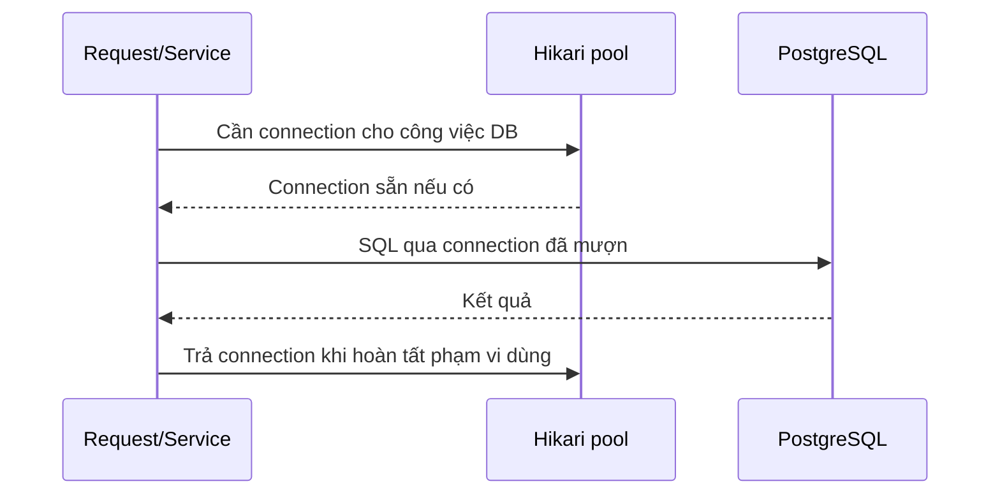

# M2-4 · Lesson 04: HikariCP và đo hiệu năng có bằng chứng

> Học 75–90 phút, có thể chia hai buổi: pool trước, benchmark sau. Mục tiêu: hiểu connection được mượn/trả; đọc cấu hình, chẩn đoán timeout/leak warning; thiết kế phép đo trước–sau. Không cần dựng load test để làm đề.

**Phần cần nắm:** mục 1–2, maximum-pool-size/connection-timeout/leak detection, tổng ngân sách connection và so sánh latency đúng điều kiện. **Phần để tra:** validation/idle/lifetime, meter name và mẫu báo cáo. Bài vẫn dạy chúng để đọc config không nhầm, nhưng không yêu cầu thuộc tất cả con số hoặc dựng dashboard. Với hướng AI Engineer, tránh giữ DB connection trong lúc chờ model/network là ứng dụng trực tiếp của bài.

## 1. Connection pool là gì?

JDBC connection là kênh ứng dụng giao tiếp với DB. Mở một connection mới có chi phí. Pool quản lý tập connection có thể dùng lại: code mượn connection, thực hiện SQL rồi trả để công việc khác dùng.

Spring Boot với starter JDBC/JPA thường dùng HikariCP khi có trên classpath và chưa tùy chỉnh DataSource khác. Giữ dependency do Boot quản lý; không thêm bản Hikari mới tùy ý chỉ vì thấy số version trên GitHub.



Không nhất thiết Controller trực tiếp gọi pool; Hibernate/JDBC và transaction manager thực hiện việc lấy/trả. Với connection wrapper trong pool, close thường trả connection để tái sử dụng, không phải đóng socket vật lý sau mọi query. Lỗi, hết lifetime hoặc quản lý pool có thể dẫn tới đóng connection thật.

Một HTTP request có thể không dùng DB, dùng một connection trong transaction, hoặc thực hiện nhiều phạm vi DB riêng. Không được lấy “số người dùng” làm “số connection cần”.

Ví dụ đơn giản: 100 request tới nhưng chỉ 10 request đang thực sự giữ connection; 90 request khác có thể đang xử lý CPU/network hoặc chờ. 100 người dùng đồng thời không bắt buộc pool=100. Ngược lại 10 request giữ connection lâu vẫn có thể làm pool=10 hết connection khả dụng.

## 2. Pool đầy thì request mới làm gì?

Giả sử pool có tối đa 2 connection, cả hai đang được A/B sử dụng. C cần DB thì chờ lấy connection. Nếu A trả kịp, C có thể tiếp tục. Nếu hết thời gian chờ mà không lấy được, getConnection có thể thất bại; không phải query C đã chạy rồi bị chậm.

```text
DB query chậm / transaction giữ connection lâu / tải cao / leak
 -> ít connection khả dụng
 -> request chờ pool
 -> có thể hết connection-timeout
```

Pool timeout là triệu chứng cần điều tra. Chỉ tăng pool có thể chuyển tắc nghẽn vào DB, gây thêm cạnh tranh CPU/I/O/lock. [Hikari: pool sizing](https://github.com/brettwooldridge/HikariCP/wiki/About-Pool-Sizing).

## 3. Cấu hình để đọc, không phải bộ số tối ưu chung

```yaml
spring:
  datasource:
    hikari:
      pool-name: shopcore-pool
      maximum-pool-size: 10
      minimum-idle: 2
      connection-timeout: 3000
      validation-timeout: 1000
      idle-timeout: 600000
      max-lifetime: 1500000
      leak-detection-threshold: 10000
```

Đơn vị thời gian trong ví dụ là ms. Các giá trị chỉ phục vụ giải thích; phải đối chiếu phiên bản Hikari do Boot dùng và hạ tầng DB khi cấu hình thật.

| Cấu hình | Ý nghĩa |
|---|---|
| maximum-pool-size | Giới hạn tổng connection trong pool: đang dùng và idle |
| minimum-idle | Mức idle pool cố duy trì |
| connection-timeout | Thời gian tối đa chờ mượn connection |
| validation-timeout | Giới hạn kiểm connection còn sống; nhỏ hơn connection-timeout |
| idle-timeout | Chính sách thu hồi connection idle dư, có ý nghĩa khi minimum-idle nhỏ hơn max |
| max-lifetime | Tuổi connection trong pool; không phải query timeout |
| leak-detection-threshold | Cảnh báo connection đã mượn quá lâu; 0 tắt |

Hikari không thu hồi connection đang dùng chỉ vì hết maxLifetime; retirement thực hiện khi trả lại. Leak detection log nghi ngờ, không tự rollback/đóng connection đang dùng. [Hikari configuration](https://github.com/brettwooldridge/HikariCP#configuration-knobs-baby).

Ví dụ SQL chạy 8 giây dù connection-timeout=3000: hoàn toàn có thể, vì timeout đó chỉ giới hạn **chờ mượn**. Muốn giới hạn query/lock/transaction phải xem JDBC/JPA/PostgreSQL timeout thích hợp; không đổi nhầm pool setting rồi nghĩ đã giới hạn SQL.

## 4. Leak warning không luôn là leak thật

Connection mượn 12 giây với threshold 10 giây có thể do query chậm, lock hoặc transaction gọi API bên ngoài lâu. Nếu sau đó trả đúng thì warning không chứng minh connection bị quên vĩnh viễn.

Khi thấy warning:

1. Đọc stack trace nơi connection được acquire và request liên quan.
2. Xem SQL chạy lâu/đang chờ lock và thời gian transaction.
3. Xem có gọi network/model API khi còn giữ connection không.
4. Với JDBC tự quản lý, kiểm try-with-resources đóng đúng; với JPA/Spring kiểm ranh giới và lifecycle.
5. Chỉnh threshold dựa trên thời gian bình thường, đồng thời sửa nguyên nhân; đừng tắt log chỉ để hết cảnh báo.

Leak detection là dụng cụ chẩn đoán. Tăng threshold không sửa connection leak nếu có thật.

## 5. Tổng ngân sách connection khi nhiều instance

Pool size áp dụng cho **mỗi pool của mỗi instance**, không phải toàn hệ thống. Ba instance mỗi cái max=10 có thể dùng tổng 30 connection cho ba pool, cộng job, công cụ admin, migration hoặc app khác.

Ví dụ DB cho ứng dụng ngân sách 40 connection sau khi dành phần khác. Bốn instance max=15 có trần 60, vượt ngân sách dù mỗi máy chỉ nhìn thấy “15”. Cần tính tổng khả năng dùng, dự phòng đợt deploy có instance cũ/mới cùng chạy, rồi load test.

Ngân sách DB là trần an toàn, không phải bảo đảm mức đó tối ưu throughput. Hikari pool-sizing guide giải thích vì sao nhiều connection hơn có thể làm chậm. Không chọn một công thức mà bỏ qua số replica, query workload và năng lực DB.

### Đọc một thử nghiệm tune pool

Số **giả định**, cùng endpoint/dataset/CPU/tải concurrency/cache, mỗi lần chỉ đổi pool size; response đúng:

| Pool max | Pending | p95 | Throughput | DB CPU |
|---|---|---|---|---|
| 5 | Cao | 700 ms | 90 req/s | 45% |
| 10 | Thấp | 250 ms | 140 req/s | 70% |
| 30 | Thấp | 600 ms | 110 req/s | 98% |

Từ 5 lên 10 cải thiện trong mẫu; lên 30 giảm chờ pool nhưng DB gần bão hòa và kết quả xấu hơn. Trong ba lựa chọn này, 10 là ứng viên tốt hơn để kiểm tiếp, không phải “số tối ưu cho mọi dự án”. Không được nhìn pending thấp rồi bỏ qua p95/error/DB load. Còn cần xét ngân sách tổng replica và đo lặp trước quyết định.

## 6. Metrics dùng để suy luận

| Dấu hiệu | Hướng điều tra |
|---|---|
| active gần max, idle thấp, pending tăng | Connection bị dùng lâu hoặc tải vượt khả năng |
| acquire timeout tăng | Request không lấy được connection kịp |
| connection usage time tăng | Transaction/query/ngoài DB giữ connection lâu |
| DB CPU/lock cao | DB đang chịu áp lực; tăng pool có thể xấu hơn |

Trong hệ thống đo bằng Micrometer/Actuator có thể quan sát active/idle/pending, acquisition/usage và timeout. Tên meter/tag phụ thuộc phiên bản. [Boot datasource metrics](https://docs.spring.io/spring-boot/reference/actuator/metrics.html#actuator.metrics.supported.jdbc).

Nếu muốn thử local, cần actuator dependency và exposure/metrics setup phù hợp; đừng nghĩ chỉ viết một dòng YAML là có dashboard. Không public endpoint quản trị chứa thông tin nhạy cảm. Bài này yêu cầu biết đọc chỉ số, chưa yêu cầu học toàn Actuator của M5-4.

## 7. Đo N+1 và pool: đừng đổi mọi thứ cùng lúc

Mục tiêu thứ nhất: kiểm fetch plan có giảm query mà giữ dữ liệu đúng. Mục tiêu thứ hai: kiểm pool phù hợp tải. Nếu vừa đổi fetch, index, pool và máy chạy cùng lúc, bạn không biết thay đổi nào tạo kết quả.

Kế hoạch trước–sau:

1. Chọn endpoint, filter, page/size/sort và dataset đại diện: đủ Product, số Category khác nhau, không chỉ ba dòng demo.
2. Giữ schema/index, JVM, app/DB version, máy, cache policy, concurrency và công cụ đo như nhau. Warm-up trước khi ghi số, ghi rõ cold/warm, không trộn.
3. Xác nhận response/status/ID/content/metadata đúng. Đếm SQL trong phép đo cô lập; phân biệt count query với N+1.
4. Chạy nhiều request trong điều kiện xác định, ghi latency p50/p95, throughput, error rate và pool metrics. Nếu dùng log TRACE để chẩn đoán, đừng bật ở một phía benchmark và tắt ở phía kia.
5. Đổi một nhóm chính, ví dụ fetch plan, rồi lặp đủ số lần; ghi cả tác dụng phụ row count/memory.
6. Nếu muốn tune pool, giữ fetch plan sau sửa, thử các mức pool có ngân sách DB, đo lại ở cùng concurrency.

## 8. Đọc một bảng kết quả có điều kiện

**Số sau là dữ liệu giả định để luyện đọc, không phải benchmark đã chạy.** Cùng endpoint/page/dataset/cấu hình ngoài fetch plan, cùng tải và warm-up; response đều đúng:

| Bản | Statement/request | p50 | p95 | Throughput | Error |
|---|---|---|---|---|---|
| A trước sửa | 22 | 180 ms | 520 ms | 80 req/s | 0% |
| B sau sửa fetch | 2 | 70 ms | 140 ms | 130 req/s | 0% |

22 có thể gồm query data, count và 20 lần tải quan hệ; 2 có thể là data+count, cần SQL log xác nhận. p50 là mốc giữa phân bố thời gian đo, p95 cho biết khoảng 95% request trong mẫu không vượt mức đó. Nó không phải thời gian chậm nhất hay cam kết mọi request tương lai.

Trong điều kiện giả định này B tốt hơn ở query, latency và throughput. Không kết luận hệ thống nào cũng nhanh đúng tỷ lệ đó. Dataset nhỏ, cache khác, DB khác hoặc tải cao hơn có thể cho kết quả khác.

Nếu chỉ có một request sau sửa 50 ms và trước sửa 200 ms, bằng chứng yếu: JIT, cache, network, background job có thể tạo khác biệt. Nếu query giảm nhưng p95 tăng, xem payload/row tăng, join quá lớn, DB plan hoặc pool wait; không ép kết luận “ít query nên chắc chắn tốt”.

## 9. Mẫu ghi báo cáo để dùng sau này

```text
Endpoint + input/page/sort:
App/ORM/PostgreSQL version và schema/index:
Dataset: số Product, Category, phân bố quan hệ:
Cold/warm cache, warm-up, số lần đo, concurrency:
Thay đổi duy nhất / nhóm thay đổi:
Tính đúng response và metadata:
SQL count trước/sau (có count query không):
p50/p95, throughput, error rate:
Pool active/idle/pending/acquire/usage; DB CPU/lock:
Row/payload/memory có tăng không:
Kết luận có điều kiện, giới hạn và bước tiếp theo:
```

Bạn học concept có thể mô tả kế hoạch bằng lời. Chỉ ghi “đã benchmark” khi có dữ liệu đo thật. Phần deliverable trong roadmap vẫn chưa được chứng minh chỉ bằng đọc lesson.

## 10. Tài liệu và tự luyện

- [Hikari configuration](https://github.com/brettwooldridge/HikariCP#configuration-knobs-baby): phân biệt timeout và lifetime.
- [Hikari pool sizing](https://github.com/brettwooldridge/HikariCP/wiki/About-Pool-Sizing): vì sao không tăng pool tùy ý.
- [Boot metrics](https://docs.spring.io/spring-boot/reference/actuator/metrics.html#actuator.metrics.supported.jdbc): nguồn chỉ số khi có setup.
- Video tùy chọn: tìm `HikariCP connection timeout leak detection pool sizing Spring Boot`; chọn video tách wait-for-connection khỏi query execution time.

Tự luyện: pool đầy là nguyên nhân hay triệu chứng? Hãy kể một trường hợp do query chậm, một do transaction dài, một do budget replica sai; không tự giả định tất cả đều leak.

Làm [đề Lesson 04](../../../Exams/de-kiem-tra/M2-4-perf-jpa__2026-10-06__lesson4-lan1.md).
