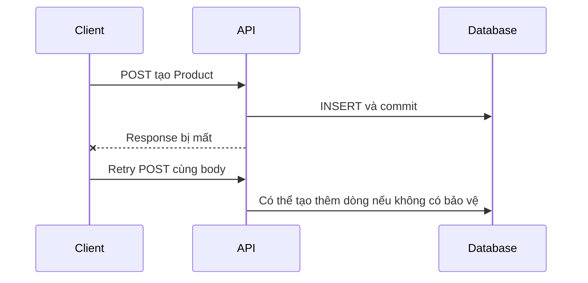

# M3-1 — Lesson01: Resource, versioning và idempotency

> Mục tiêu: từ một request, giải thích được contract, ảnh hưởng tới client cũ và điều gì xảy ra khi client retry. Không học lại annotation CRUD từ đầu.

## Tài liệu / video

- [Spring MVC request mapping](https://docs.spring.io/spring-framework/reference/web/webmvc/mvc-controller/ann-requestmapping.html): đọc class-level/method-level mapping.
- [HTTP semantics, RFC9110](https://www.rfc-editor.org/rfc/rfc9110.html#section-9.2.2): đọc safe/idempotent; PUT/DELETE ở mục9.3.4/9.3.5. Đây là nguồn cho nghĩa HTTP, không quy định mọi API phải đặt version trong URL.
- [PATCH, RFC5789](https://www.rfc-editor.org/rfc/rfc5789.html#section-2): chỉ đọc phân biệt PATCH/PUT, không bắt triển khai patch document.
- Video tìm thêm: `REST API versioning breaking changes PUT DELETE idempotency examples`. Chưa kiểm chứng video cụ thể; ưu tiên đọc request/response trong bài trước.

## 1. Bạn đã biết code; bây giờ nhìn bằng mắt client

Client không thấy ServiceImpl. Nó biết contract gồm method+URL, input, output, status và ý nghĩa hành động.

```http
GET /api/v1/products/10
Accept: application/json
```

```http
HTTP/1.1 200 OK
Content-Type: application/json

{"id":10,"name":"Keyboard","price":120.00,"categoryId":2}
```

Frontend có thể đang đọc `body.price`. Bạn đổi thành `amount` thì Java compile vẫn được nhưng frontend không còn lấy giá đúng. **Đổi contract có thể gây lỗi ở client dù backend không lỗi compile.**

Resource là đối tượng client thao tác, không phải tên method Java. Quy ước shopcore dùng danh từ số nhiều: products/categories. Đây là lựa chọn thiết kế nhất quán, không phải luật HTTP cấm mọi URL có động từ.

## 2. Một contract nhỏ và rõ

| Tác vụ | Request | Success theo quy ước bài |
|---|---|---|
| List | GET /api/v1/products | 200 + page DTO |
| Detail | GET /api/v1/products/10 | 200 + Product DTO |
| Create | POST /api/v1/products | 201 + DTO + Location |
| Replace writable fields | PUT /api/v1/products/10 | 200 + DTO |
| Delete | DELETE /api/v1/products/10 | 204, không body |

GET một Product không có:404. List hợp lệ nhưng không có kết quả:200, content rỗng. Nếu POST tạo id11, Location là `/api/v1/products/11`, không phải URL v0/v2 khác route vừa dùng. Bài này không yêu cầu viết lại CRUD.

```java
@RestController
@RequestMapping("/api/v1/products")
public class ProductController {
    // Các method mapping nằm dưới base path này.
}
```

`/api/v1` là API contract version, không phải phiên bản database migration, Java21 hay model AI đang dùng. Version public cần được quản lý riêng.

## 3. Breaking change là gì?

Trong bài, client v1 đã được viết theo contract công bố. Thay đổi làm client hợp lệ trước đó không còn hoạt động đúng là breaking change.

| Thay đổi | Đánh giá cần làm |
|---|---|
| Đổi price thành amount, xóa price | Breaking với client đọc price |
| Number price đổi thành object | Breaking với client xử lý number |
| Thêm field optional, client bỏ qua field lạ | Thường tương thích với giả định client này |
| Đổi page từ0-based thành1-based | Breaking semantics dù tên field không đổi |
| Request thêm field bắt buộc | Client cũ không gửi có thể bị từ chối |

Không nói “thêm field luôn an toàn”: client deserialize strict có thể từ chối field lạ. Không tạo v2 cho mọi bugfix nội bộ; cần phân biệt implementation với public contract.

## 4. Cách chuyển version mà không bỏ rơi client

Giả sử muốn đổi price thành amount:

```text
Client cũ → /api/v1/products → ProductV1Response(price)
Client mới → /api/v2/products → ProductV2Response(amount)
                           → có thể dùng chung nghiệp vụ Service
```

Mũi tên biểu diễn **route và representation**, không phải mỗi version cần database khác. Controller/mapper có thể khác DTO nhưng dùng cùng domain logic. Cần thời gian chuyển client, thông báo ngừng v1 và theo dõi người dùng còn gọi v1; không chỉ sửa string route rồi xóa v1 ngay.

Với shopcore đang học, chọn URL versioning cho đơn giản. Header/media-type versioning có tồn tại nhưng chỉ cần biết lựa chọn khác, không phải bài triển khai.

## 5. Idempotency: xét tác động lên state, không xét chuỗi response

Định nghĩa cần hiểu: lặp cùng request có intended effect lên server như thực hiện một lần. Safe là thao tác có nghĩa đọc, không yêu cầu thay state nghiệp vụ. GET nên safe; PUT/DELETE không safe nhưng có thể idempotent. Log/audit mỗi request không làm mất idempotency của intended resource effect.

Ví dụ state ban đầu Product10.name="Old":

```http
PUT /api/v1/products/10
Content-Type: application/json

{"name":"Keyboard","price":120.00,"categoryId":2}
```

Gửi hai lần, các trường writable cuối vẫn Keyboard/120/2. Không có nghĩa hai request phải trả cùng timestamp, status hoặc response bytes. Điều kiện bài: không có tác nhân khác sửa Product xen giữa; chúng ta đang xét effect của thao tác được thiết kế.

## 6. PUT là gán trạng thái, không phải cộng dồn

Quy ước PUT trong bài thay toàn bộ **writable representation**: name/price/categoryId; id là từ path, createdAt do server quản lý. Không bắt client gửi lại mọi field DB. SKU ở ví dụ PUT không sửa được; contract phải ghi rõ điều này.

Nếu code mỗi PUT lại làm `stock = stock + request.stock`, hai retry từ5 với input3 thành8 rồi11. Đó là tăng stock, không phải gán stock=3 như contract replacement; không thể gọi idempotent chỉ vì annotation là PutMapping.

Nếu cần partial update, phải quy định field vắng/null; PATCH không tự bảo đảm idempotent. “Gán name=Keyboard” có thể lặp an toàn, “tăng stock thêm3” có thể không. Chưa yêu cầu implement JSON Patch.

## 7. DELETE lặp lại và response khác nhau

Giả sử Product10 có trước request đầu:

```text
DELETE lần1 → xóa → 204
DELETE lần2 → không còn → 404 theo policy shopcore bài này
State cuối: Product10 không tồn tại, giống sau lần1.
```

Vẫn idempotent về intended effect. Dự án khác có thể chọn204 khi đã vắng; cần công bố policy thống nhất. Không kết luận policy404 làm DELETE mất idempotency.

Đừng trộn DELETE resource với hành động “mỗi lần DELETE đều hoàn thêm120 tiền”. Side effect cộng dồn khi retry có thể phá thiết kế nghiệp vụ, dù Product chỉ bị xóa một lần.

## 8. Retry sau timeout: server có thể đã làm xong



Đọc từng bước: request đầu đã ghi DB; mất response không hoàn tác commit. Client chưa biết kết quả nên gửi lại; POST thường có thể tạo resource khác. Unique SKU có thể chặn trùng và trả conflict, nhưng không tự trở thành cơ chế replay cùng response.

Idempotency key là một hướng thiết kế cho create/action có retry; ở đây **chỉ nhận diện**, không đòi Redis hoặc triển khai lưu key. Khi tạo AI job có chi phí, timeout cũng không chứng minh model chưa chạy; không mù quáng retry rồi tính phí hai lần.

## 9. Tự kiểm tra trước đề

- Giải thích một breaking change bằng ví dụ client đang đọc field nào.
- Phân biệt API version với DB migration version.
- Dự đoán state sau retry PUT/DELETE; không chỉ nhìn status.
- Phân biệt timeout nhận response với rollback server.

Đọc [đề Lesson01](../../../Exams/de-kiem-tra/M3-1-rest-bp__2026-10-07__lesson1-lan1.md). Không cần chạy project; phải giải được ý nghĩa request và state.
