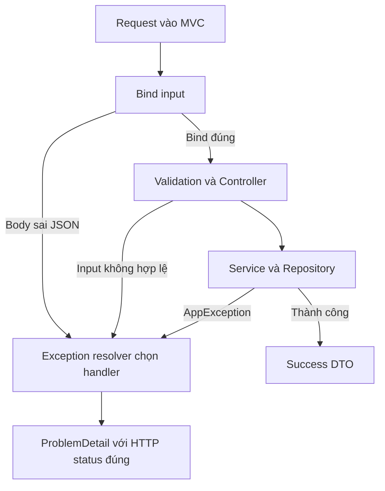

# M3-1 — Lesson03: ProblemDetail, luồng lỗi và HATEOAS

> Mục tiêu: giữ ý tưởng business AppException/ErrorCode của bạn nhưng chuẩn hóa lỗi ra HTTP; biết handler nào xử lý và giới hạn của nó. HATEOAS chỉ nhận diện.

## Tài liệu / video

- [RFC9457 Problem Details](https://www.rfc-editor.org/rfc/rfc9457.html): mục3 về format, mục5 về bảo mật. RFC9457 thay RFC7807; ghi chú M1-4 dùng tên chuẩn cũ, không có nghĩa bạn phải học lại toàn bộ.
- [Spring MVC Error Responses](https://docs.spring.io/spring-framework/reference/web/webmvc/mvc-ann-rest-exceptions.html): ProblemDetail và ResponseEntityExceptionHandler.
- [ProblemDetail API](https://docs.spring.io/spring-framework/docs/current/javadoc-api/org/springframework/http/ProblemDetail.html): tra factory/setProperty.
- [MVC ExceptionHandler](https://docs.spring.io/spring-framework/reference/web/webmvc/mvc-controller/ann-exceptionhandler.html): cách resolve handler.
- [Spring HATEOAS](https://docs.spring.io/spring-hateoas/docs/current/reference/html/): chỉ đọc link/relation/representation, không cài thư viện.
- Video tìm thêm: `Spring ProblemDetail RFC 9457 ResponseEntityExceptionHandler`; `HATEOAS HAL links explained`. Chưa kiểm chứng video cụ thể.

## 1. Đừng trộn exception Java với HTTP body

Trong code hiện tại của bạn:

```text
Service throw AppException(ErrorCode.PRODUCT_NOT_FOUND)
→ Advice lấy status/message từ ErrorCode
→ tạo ApiErrorResponse
→ client nhận HTTP404 + code/message
```

Ý tưởng ErrorCode cho business error hợp lý. M3-1 thay **public representation lỗi**, không bắt bỏ AppException hay chuyển mọi framework exception thành business error.

Ví dụ contract mới:

```http
HTTP/1.1 404 Not Found
Content-Type: application/problem+json

{
  "type":"urn:shopcore:problem:product-not-found",
  "title":"Product not found",
  "status":404,
  "detail":"Product không tồn tại.",
  "instance":"/api/v1/products/999",
  "code":"PRODUCT_NOT_FOUND"
}
```

Type nhận diện loại problem; title mô tả ngắn loại lỗi; status là mã HTTP; detail nói trường hợp cụ thể an toàn cho client; instance nhận diện lần xuất hiện/ngữ cảnh request. `code` là extension riêng dự án. RFC không bắt mọi field luôn hiện diện; bài chọn xuất đủ năm field chuẩn để contract dễ đọc. Đây là format lỗi, không thay ProductResponse success.

## 2. HTTP status, code nghiệp vụ và message không cùng một thứ

Trong enum của bạn, PRODUCT_NOT_FOUND và CATEGORY_NOT_FOUND đều có code số404. HTTP404 phân nhóm lỗi, nhưng không phân biệt business case. Có thể giữ code số cho compatibility và thêm errorKey, hoặc contract mới chọn `code=errorCode.name()` như bài. **Không âm thầm đổi kiểu code số sang string trong v1 đã có client.**

Client quyết định logic bằng stable type/code công bố, không parse text message vì có thể đổi ngôn ngữ/câu chữ. Title/detail không nên chứa SQL, password, stack trace hoặc raw request secret.

ProblemDetail không tự chọn business status. Handler phải map đúng: Product không có404; trùngSKU409; input sai400; lỗi bất ngờ500. Nếu dùng HTTP200 và body.status404, nhiều client/monitoring vẫn nhìn thành success; phải giữ hai status khớp.

## 3. Luồng lỗi: dừng ở đâu, ai xử lý?



Mỗi nhánh là một chỗ có thể dừng, **không phải lỗi luôn phải đi xuống Service rồi quay lên**:

- Body JSON hỏng: converter ném HttpMessageNotReadableException trước Controller method.
- `page=abc` cho int: MethodArgumentTypeMismatchException trước Controller method.
- DTO đã bind nhưng @Valid không đạt: thường MethodArgumentNotValidException ở nhánh argument validation; Service không chạy.
- DTO hợp lệ nhưng SKU trùng: Service có thể ném AppException; exception bubble ra MVC, resolver tìm handler tương ứng.

ControllerAdvice là nơi khai báo handler, không phải middleware mà mọi request tự chạy qua trước Controller. Framework gọi handler khi resolve exception phù hợp. Validation method-level có thể dùng exception khác; không bắt mọi validation luôn cùng một class.

## 4. Chuẩn hóa business error theo style hiện có

Đoạn dưới **minh họa thay method trong handler hiện tại**, không thêm handler trùng song song. Imports chuẩn: java.net.URI, AppException/ErrorCode trong common và các annotation/http class Spring đã dùng; request là jakarta.servlet.http.HttpServletRequest. Chưa sửa source app.

```java
@ExceptionHandler(AppException.class)
public ResponseEntity<ProblemDetail> handleAppException(
        AppException ex, HttpServletRequest request) {
    ErrorCode error = ex.getErrorCode();
    ProblemDetail body = ProblemDetail.forStatusAndDetail(
            error.getHttpStatus(), error.getMessage());
    body.setTitle(error.getMessage());
    body.setType(URI.create("urn:shopcore:problem:"
            + error.name().toLowerCase(java.util.Locale.ROOT)
                    .replace('_', '-')));
    body.setInstance(URI.create(request.getRequestURI()));
    body.setProperty("code", error.name());
    return ResponseEntity.status(error.getHttpStatus())
            .contentType(MediaType.APPLICATION_PROBLEM_JSON)
            .body(body);
}
```

Đọc từng phần: lấy metadata business từ enum → dựng body với đúng status → set loại lỗi/context → extension code → trả cùng HTTP status/media type. Jackson Spring hỗ trợ đưa extension thành field JSON top-level; không tự bọc ProblemDetail vào `data` nếu muốn format trực tiếp như mẫu.

Đây là contract mẫu mới, không tự đổi enum hay behavior project đang dùng. Dùng URI request không query để tránh vô tình đưa secret query vào response; thiết kế instance/traceId phải theo chính sách bảo mật thực tế.

## 5. Framework errors cũng cần cùng format

Chỉ đổi handler AppException chưa đủ: invalid JSON/type/validation vẫn có thể trả ApiErrorResponse cũ. Cần thống nhất các nhánh đó và lỗi MVC khác.

Hướng Spring hỗ trợ: một `@RestControllerAdvice` kế thừa `ResponseEntityExceptionHandler` để xử lý các MVC exceptions tiêu chuẩn; override các method cần điều chỉnh, giữ status/headers do framework xác định. Thêm handler AppException riêng. Không thêm annotation handler trùng loại exception mà superclass đã xử lý; tra signature theo Spring đang dùng. Nếu dùng Boot auto ProblemDetail support, kiểm thứ tự Advice và không giả định setting tự xử lý business exception của bạn.

Validation body mẫu:

```json
{
  "type":"urn:shopcore:problem:invalid-request",
  "title":"Invalid request",
  "status":400,
  "detail":"Có trường không hợp lệ.",
  "instance":"/api/v1/products",
  "code":"INVALID_REQUEST",
  "errors":[{"field":"name","message":"Không được để trống."}]
}
```

`errors` là extension do dự án định nghĩa, không field chuẩn bắt buộc RFC. Không trả rejectedValue chứa password/token. Khi client gửi sai method, framework có thể trả405 và header Allow; đừng catch-all mọi Exception thành500 rồi làm mất status/header phù hợp. Lỗi bất ngờ thật thì500, message an toàn và log nội bộ có correlation ID, không gửi stack trace cho client.

## 6. Giới hạn: không phải mọi lỗi đều do MVC Advice bắt

| Tình huống | Phạm vi xử lý cần hiểu |
|---|---|
| Bind/validate hoặc exception từ handler trong MVC | MVC resolver/Advice thích hợp |
| AppException bubble từ Service qua Controller | MVC handler AppException |
| Startup DB fail | App chưa ready; không phải response business từ Service |
| Filter trước DispatcherServlet ném lỗi | Không tự được MVC Advice xử lý; cần cơ chế filter/container phù hợp |
| Security authentication/authorization fail | Cơ chế Security như entry point/access denied handler; học ởM3-2 |
| Response đã commit rồi serialize/network fail | Không bảo đảm viết lại được một ProblemDetail mới |

Vì vậy “toàn API thống nhất” cần kiểm nhiều đường đi; một Advice không chứng minh bao phủ toàn server. Bài này chỉ yêu cầu chuẩn hóa phần MVC/business đang học và nhận diện giới hạn, không bắt triển khai Security sớm.

## 7. HATEOAS: response có link với ý nghĩa

Ví dụ HAL-style minh họa, không phải output app đã chạy:

```json
{
  "id":10,
  "name":"Keyboard",
  "_links":{
    "self":{"href":"/api/v1/products/10"},
    "category":{"href":"/api/v1/categories/2"}
  }
}
```

`self` chỉ resource hiện tại; `category` là relation dẫn tới resource liên quan. Client có thể dùng link thay vì tự ghép mọi URL. HATEOAS nói về khả năng khám phá/điều hướng qua hypermedia; không đồng nghĩa pagination và không chỉ thêm một field bất kỳ tên url. Full hypermedia còn nhiều chuyện, roadmap chỉ yêu cầu nhận diện, không bắt dùng Spring HATEOAS hoặc HAL cho toàn API. Có `/api/v1` chưa chứng minh HATEOAS.

## 8. Một checklist review có thể làm mà không dựng app

Chọn GET detail/list và POST Product; lập bảng success/errors từng endpoint. Kiểm route/version, method, Location, DTO/metadata, status/media type/error code. Đi qua bốn case: body sai → validation sai → business conflict → lỗi bất ngờ. Không viết chung “test lỗi” mà không chỉ request và response kỳ vọng.

Đối với API model/AI job sau này, nguyên tắc vẫn vậy: input không hợp lệ và lỗi xử lý nội bộ không bị giả thành200 success. Không công bố prompt/token/credential trong detail.

Làm [đề Lesson03](../../../Exams/de-kiem-tra/M3-1-rest-bp__2026-10-07__lesson3-lan1.md), rồi đọc bài giải. Không cần thuộc signature override để đạt phần tư duy.
