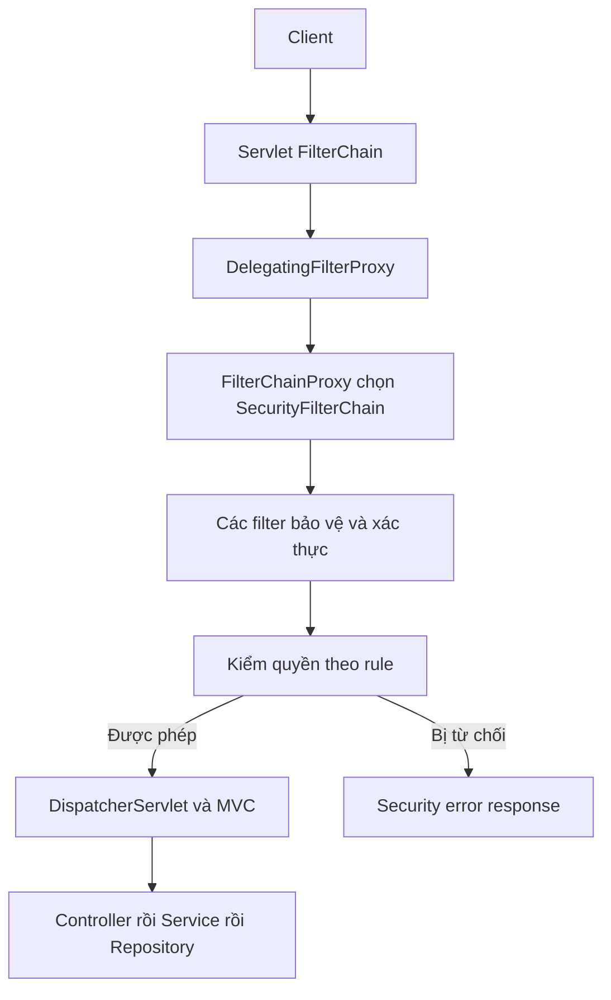

# M3-2 — Lesson01: Security đứng ở đâu trong request?

> Mục tiêu: biết request dừng trước Controller vì lý do gì. Bạn không cần thuộc danh sách vài chục filter; cần giải thích được ai xác thực, ai quyết định quyền.

## Tài liệu / video

- [Security Servlet Architecture](https://docs.spring.io/spring-security/reference/servlet/architecture.html): filter, proxy và chain.
- [Authentication Architecture](https://docs.spring.io/spring-security/reference/servlet/authentication/architecture.html): AuthenticationManager/provider/context.
- [HTTP Basic](https://docs.spring.io/spring-security/reference/servlet/authentication/passwords/basic.html): flow credentials/challenge.
- Video tìm thêm: `Spring Security filter chain authentication authorization explained`. Chưa kiểm chứng video cụ thể. Đọc flow dưới trước, không cần học custom JWT filter.

## 1. Hai câu hỏi khác nhau

**Authentication: bạn là ai, bằng chứng có hợp lệ không?** Ví dụ username/password đúng → principal là user Lan. **Authorization: principal đó được làm gì?** Lan có ROLE_USER không có ROLE_ADMIN nên không được xóa Product theo policy bài.

Password đúng chưa có nghĩa được mọi quyền. Chưa có password đúng thì đừng nói “thiếu role” như thể danh tính đã được xác nhận. Một resource public có thể cho người chưa đăng nhập đọc; không phải lúc nào cũng phải authenticate trước để được phép đọc public resource.

Giả định case minh họa: endpoints tồn tại; Basic auth; GET không bị CSRF chặn; không CORS error; GET products public, GET me cần đăng nhập, DELETE Product cần ADMIN. Quyền xong mới đến nghiệp vụ: ADMIN vẫn có thể nhận404 vì Product không tồn tại.

## 2. Security nằm trước MVC



Đọc từng mũi tên: container đưa request vào filters; proxy nối filter của container với Spring bean; FilterChainProxy chọn chain phù hợp; filter trong chain có thể đọc credentials/chặn request; quyền được phép thì tiếp tục tới MVC. Không phải Security là một Controller tự gọi trước Controller của bạn.

Sơ đồ rút gọn, không mô tả thứ tự mọi filter: CSRF/CORS có thể chặn trước khi auth/password hoàn tất. Vì vậy403 không tự chứng minh password đã đúng.

## 3. HTTP Basic: không cần tự viết login Controller để thấy flow

```text
Authorization: Basic <base64(username:password)>
```

Base64 là encoding có thể đảo ngược, **không phải encryption**. Không log header này; dùng HTTPS ngoài môi trường local học tập. Với Basic, client gửi credentials theo request; không tự nhận JWT hay refresh token.

Luồng rút gọn khi có Basic credentials:

```text
Basic filter đọc username/password
→ AuthenticationManager nhận authentication request
→ provider phù hợp kiểm user/password
→ authentication thành công có principal + authorities
→ đặt vào SecurityContext của request
→ rule authorization kiểm quyền
→ MVC nếu được phép
```

Authentication trước kiểm chứng mang credentials chưa đáng tin; sau kiểm chứng là kết quả có danh tính/quyền. **SecurityContext không phải database User**, mà giữ thông tin authentication cho thực thi hiện tại. Cách lưu/khôi phục qua request khác phụ thuộc session policy, học bài04.

## 4. 401 và403 theo điều kiện cụ thể

| Case (auth/rule, không CSRF/CORS lỗi) | Kết quả security | Controller chạy? |
|---|---|---|
| GET me không gửi credentials |401 cần authentication | Không |
| GET me sai password |401 authentication thất bại | Không |
| User đúng password nhưng không ADMIN gọi admin endpoint |403 không đủ quyền | Không |
| ADMIN đúng gọi endpoint được phép | Đi tiếp MVC | Có thể chạy |

401 thường qua AuthenticationEntryPoint;403 do user đã xác thực không đủ quyền qua AccessDeniedHandler. Basic401 cần WWW-Authenticate challenge phù hợp. Lỗi401/403 không mặc định do MVC @RestControllerAdvice, vì chặn ở security filter.

Nếu được security cho qua, Controller vẫn có thể trả400/404/409 theo nghiệp vụ. “Auth thành công” không đồng nghĩa HTTP cuối luôn200.

## 5. Public không phải bỏ hết security

`permitAll` cho phép tại **authorization rule** đó. Request vẫn qua chain, có thể chịu CORS/CSRF và authentication filter. Public endpoint không credentials có thể qua; nhưng gửi Basic password sai vẫn có thể bị Basic filter từ chối trước khi đến permitAll. Đừng suy ra “public nên header sai chắc chắn bị bỏ qua”.

Khác `web.ignoring`: bỏ security filter chain cho request matched, nên có thể bỏ cả bảo vệ/header khác. Trong bài ưu tiên permitAll cho public routes, không dùng ignoring để chữa lỗi.

## 6. SecurityFilterChain là cấu hình, không tự tạo danh tính

Bean SecurityFilterChain mô tả filter/rule áp dụng. `http.build()` tạo chain từ HttpSecurity. Nó không tự tạo User table, không tự hash password đăng ký, không biết mọi business role của bạn nếu chưa cấu hình nguồn user.

Nhiều chain là phần chỉ cần nhận diện: chain đầu tiên match được dùng, không chạy cộng dồn mọi chain. Chain chỉ `/api/**` có thể để URL ngoài đó không được chain bảo vệ nếu không có fallback. Bài03 dùng một chain bao toàn request cho dễ hiểu.

Không dùng WebSecurityConfigurerAdapter cũ; chọn bean/lambda DSL. Tên framework lớp cần biết để đặt breakpoint: FilterChainProxy, filter Basic; không bắt thuộc toàn bộ filter order.

## 7. Cách debug mà không học vẹt

Với request bị401/403, kiểm theo thứ tự:

1. URL/method có đúng và match chain/rule nào?
2. Request có credentials gì? Có được xác thực không? Không in raw password/header.
3. Authorities thực tế là USER hay ROLE_USER, có đúng prefix không?
4. Có CSRF/CORS chặn trước hay không? Controller breakpoint có vào không?
5. Nếu đã vào Service, lỗi có thể là business AppException, không phải Security từ chối.

Bài02 giải thích provider lấy UserDetails và hash; bài03 rules; bài04 browser protections. Không sửa mọi lỗi bằng permitAll hoặc csrf.disable.

## 8. Tự kiểm

Lan đúng password nhưng thiếu ADMIN khác Lan sai password chỗ nào? Nếu Controller chưa chạy thì handler MVC có chắc được gọi không? Vẽ lại flow bằng6–8 bước của chính bạn rồi làm [đề01](../../../Exams/de-kiem-tra/M3-2-security-core__2026-10-07__lesson1-lan1.md).
