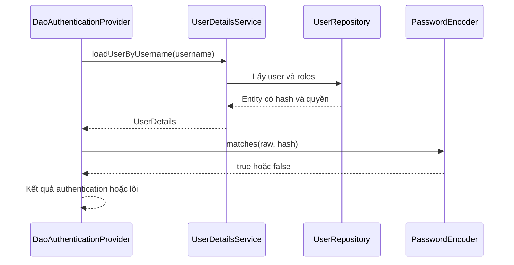

# M3-2 — Lesson02: User/Role, BCrypt và UserDetailsService

> Mục tiêu: thấy rõ password đi vào để kiểm chứng, hash nằm trong DB, UserDetails là dữ liệu cho Security; không tự viết if so sánh password ở Controller.

## Tài liệu / video

- [UserDetailsService](https://docs.spring.io/spring-security/reference/servlet/authentication/passwords/user-details-service.html): nạp user theo username.
- [DaoAuthenticationProvider](https://docs.spring.io/spring-security/reference/servlet/authentication/passwords/dao-authentication-provider.html): phối hợp service và encoder.
- [Password storage](https://docs.spring.io/spring-security/reference/features/authentication/password-storage.html): adaptive hash, salt và DelegatingPasswordEncoder.
- [UserDetails API](https://docs.spring.io/spring-security/site/docs/current/api/org/springframework/security/core/userdetails/UserDetails.html): tra account flags/authorities.
- Video tìm thêm: `Spring Security UserDetailsService BCrypt DaoAuthenticationProvider database roles`. Không học JWT filter/register hoàn chỉnh trong bài này.

## 1. Dữ liệu domain và dữ liệu Security khác vai trò

Schema minh họa (không tự tạo trong app):

```text
app_users(id PK, username UNIQUE NOT NULL, password_hash NOT NULL, enabled NOT NULL)
roles(id PK, name UNIQUE NOT NULL)
user_roles(user_id FK app_users, role_id FK roles, PK(user_id, role_id))
```

`app_users` tránh tên bảng user dễ gây nhầm/reserved. User có thể có nhiều role; cùng role có nhiều user nên join table. DB lưu hash, **không lưu raw password**. Username unique ở DB chặn race, không chỉ existsByUsername kiểm trước.

Role name trong bài lưu `USER`/`ADMIN` không prefix; khi tạo authorities dùng roles builder để thêm ROLE_. Tất cả phải theo một convention, không vừa lưu ROLE_ADMIN vừa gọi roles("ROLE_ADMIN").

## 2. BCrypt không phải mã hóa có khóa để giải ngược

```java
@Bean
PasswordEncoder passwordEncoder() {
    return new BCryptPasswordEncoder();
}
```

Lần tạo/đổi password:

```java
String hash = encoder.encode(rawPassword);
// Lưu hash vào password_hash, không lưu rawPassword.
```

Lần xác thực:

```java
boolean valid = encoder.matches(candidatePassword, storedHash);
```

Salt ngẫu nhiên khiến cùng password encode hai lần thường ra hai hash khác nhau. Không làm `encode(candidate).equals(storedHash)`; matches đọc thông tin trong hash để kiểm. Không “decrypt password” để so sánh.

BCrypt có giới hạn input72 byte, không phải72 ký tự; ký tự Unicode có thể nhiều byte. Không tự cắt password âm thầm, cần policy/validation phù hợp encoder. Cost tăng làm hash chậm hơn, cần chọn/đo phù hợp tài nguyên; không đặt cost cực cao theo cảm tính gây quá tải login.

Một số setup dùng DelegatingPasswordEncoder với hash `{bcrypt}...`; bài chọn BCryptPasswordEncoder trực tiếp để dễ nhìn, không tự trộn hai format. Đây là hash để chống lộ raw password, không thay HTTPS, rate limiting hay quản lý account; không ghi password demo vào Git.

## 3. Ai kiểm mật khẩu?



Mũi tên đầu chỉ truyền username để tìm user; UserDetailsService không phải method nhận raw password để tự login. Provider kiểm account status và dùng encoder so password; thất bại không có nghĩa Service nghiệp vụ phải throw AppException.

UserDetails chứa username/hash/authorities/account flags cho Security, không phải response DTO gửi client. Không đưa UserDetails/Authentication nguyên object ra JSON vì có thể lộ dữ liệu không cần thiết.

## 4. Role và authority: prefix chỉ là convention có tác dụng thật

```java
User.withUsername("lan").password(storedHash).roles("USER").build();
// authorities có ROLE_USER
```

`hasRole("ADMIN")` mặc định kiểm `ROLE_ADMIN`. `hasAuthority("ADMIN")` kiểm đúng chuỗi ADMIN, khác ROLE_ADMIN. `authorities("ROLE_ADMIN")` nhận nguyên chuỗi, không tự thêm prefix như roles.

ADMIN không tự thừa kế USER nếu chưa cấu hình role hierarchy hoặc cấp cả hai. Nếu endpoint cần USER hoặc ADMIN, dùng hasAnyRole("USER","ADMIN") hoặc cấp quyền tương ứng; không đoán từ tên ADMIN.

## 5. Entity class minh họa theo style Lombok

Đoạn này cần JPA/Lombok khi thực hành; không phải source đã được cài/chạy. Hai class nằm ở file riêng, annotations từ jakarta.persistence, Lombok; RoleName enum USER/ADMIN. Tránh @Data cho entity quan hệ vì equals/toString có thể duyệt quan hệ hoặc lộ hash.

```java
@Entity
@Table(name = "app_users")
@Getter @Setter @NoArgsConstructor @AllArgsConstructor @Builder
public class ApplicationUser {
    @Id @GeneratedValue(strategy = GenerationType.IDENTITY)
    private Long id;

    @Column(nullable = false, unique = true)
    private String username;

    @Column(name = "password_hash", nullable = false)
    private String passwordHash;

    @Builder.Default
    @Column(nullable = false)
    private boolean enabled = true;

    @Builder.Default
    @ManyToMany(fetch = FetchType.LAZY)
    @JoinTable(name = "user_roles",
        joinColumns = @JoinColumn(name = "user_id"),
        inverseJoinColumns = @JoinColumn(name = "role_id"))
    private Set<RoleEntity> roles = new HashSet<>();
}
```

```java
@Entity
@Table(name = "roles")
@Getter @Setter @NoArgsConstructor @AllArgsConstructor @Builder
public class RoleEntity {
    @Id @GeneratedValue(strategy = GenerationType.IDENTITY)
    private Long id;

    @Enumerated(EnumType.STRING)
    @Column(nullable = false, unique = true)
    private RoleName name;
}
```

DB migration cần khớp schema và unique(user_id,role_id) của join table; Java Set không thay constraint DB. Không cascade REMOVE từ user sang roles dùng chung. Model này chưa là full user lifecycle/password reset.

## 6. Nạp entity rồi map thành UserDetails khi context còn mở

```java
public interface UserRepository extends JpaRepository<ApplicationUser, Long> {
    @EntityGraph(attributePaths = "roles")
    Optional<ApplicationUser> findByUsername(String username);
}
```

```java
@Service
@RequiredArgsConstructor
public class DatabaseUserDetailsService implements UserDetailsService {
    private final UserRepository repository;

    @Override
    @Transactional(readOnly = true)
    public UserDetails loadUserByUsername(String username) {
        ApplicationUser user = repository.findByUsername(username)
                .orElseThrow(() -> new UsernameNotFoundException("User not found"));
        String[] roles = user.getRoles().stream()
                .map(role -> role.getName().name())
                .toArray(String[]::new);
        return org.springframework.security.core.userdetails.User
                .withUsername(user.getUsername())
                .password(user.getPasswordHash())
                .roles(roles)
                .disabled(!user.isEnabled())
                .build();
    }
}
```

Fully-qualified Security User để không nhầm entity. Constructor injection nối repository; EntityGraph yêu cầu fetch roles, mapping chạy trong transaction và trả Security object độc lập, không giữ LAZY entity cho filter đọc sau session đóng. ReadOnly không tự fetch; graph/việc map mới chủ động dữ liệu.

Không thấy user ném UsernameNotFoundException; public auth failure nên generic, không leak “username có tồn tại” trong detail. Provider có thể che lỗi user-not-found thành bad credentials; không bắt client dựa message exception nội bộ.

## 7. Thay nguồn user không cần thay mọi rule

Lesson03 dùng InMemoryUserDetailsManager chỉ để minh họa mà không phụ thuộc DB. Khi dùng DB, thay bằng bean DatabaseUserDetailsService, không để hai nguồn user hoạt động mơ hồ rồi nghĩ Security tự chọn đúng.

Với cấu hình chuẩn một UserDetailsService và PasswordEncoder, Security có thể dựng provider password auth; nếu tự cung cấp AuthenticationManager/provider khác phải wire dependencies rõ. Không hard-code constructor provider từ tutorial phiên bản cũ; tra API theo BOM đang dùng.

Client request không được tự chọn roleADMIN. DTO đăng ký (module sau) không bind cả entity/roles/passwordHash; quyền được gán theo policy server. UserResponse public chỉ id/username hoặc thông tin được phép, không hash/credentials.

## 8. Tự kiểm

Vì sao hash A≠hash B mà cùng password vẫn matches? Ai đọc DB, ai kiểm password? RoleADMIN từ request có đáng tin không? Đọc [đề02](../../../Exams/de-kiem-tra/M3-2-security-core__2026-10-07__lesson2-lan1.md) để tự giải trước bài giải.
