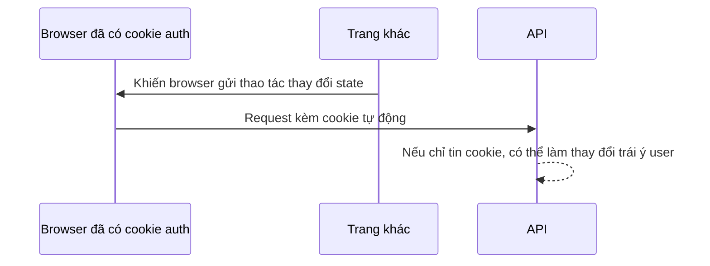

# M3-2 — Lesson04: Session/stateless, CSRF và CORS

> Mục tiêu: không tắt bảo vệ theo khẩu hiệu “REST stateless”. Nhìn cách credentials được gửi để quyết định; phân biệt lỗi browser với lỗi quyền.

## Tài liệu / video

- [Security session management](https://docs.spring.io/spring-security/reference/servlet/authentication/session-management.html): authentication persistence và STATELESS.
- [CSRF](https://docs.spring.io/spring-security/reference/servlet/exploits/csrf.html): browser tự gửi credentials, token và stateless considerations.
- [Security CORS integration](https://docs.spring.io/spring-security/reference/servlet/integrations/cors.html): preflight trước security authentication.
- [Spring MVC CORS](https://docs.spring.io/spring-framework/reference/web/webmvc-cors.html): origin/credentials/config.
- Video tìm thêm: `Spring Security CSRF vs CORS stateless cookies Basic authentication preflight`. Chưa kiểm chứng video; ưu tiên tự phân loại case dưới.

## 1. Session là cách nhớ auth qua request

Session-based minh họa:

```text
Login đúng → server lưu authentication theo session
→ browser nhận cookie session ID
→ request sau browser gửi cookie
→ server khôi phục authentication tương ứng
```

Cookie session ID không phải raw password và không tự chứa mọi role. Ai giữ session hợp lệ có thể dùng danh tính đó nên cookie cần bảo vệ. Session fixation là lý do framework đổi/bảo vệ session khi login; chỉ cần nhận diện, không tự code ở bài này.

Stateless authentication: mỗi request đưa bằng chứng phù hợp, không dựa HttpSession để nhớ SecurityContext. Với Basic demo, thường kiểm credentials lại theo request; module JWT sau dùng token thay password. STATELESS không ngăn mọi component app tạo session, không làm request miễn password, không tự bật/tắt CORS/CSRF.

## 2. CSRF: browser gửi quyền của nạn nhân ngoài ý muốn

Giả định app dùng cookie auth, cookie đủ điều kiện được browser gửi, và request có thể được phát từ trang khác:



Ý nghĩa: attacker không nhất thiết đọc cookie hoặc response; gây được **hành động với credentials tự gửi** đã nguy hiểm. SameSite/cookie policy có thể giảm một số đường tấn công, không thay việc đánh giá đầy đủ. CORS không tự chặn mọi request thay state, nên không là bảo vệ CSRF thay thế.

CSRF token thêm bằng chứng request được tạo từ context hợp lệ. Với request unsafe như POST/PUT/DELETE, CSRF bật mà thiếu/sai token có thể bị403 **trước Controller, có thể trước password auth**. Public permitAll POST vẫn có thể chịu CSRF.

## 3. Stateless và token không đủ để kết luận

| Kiểu credentials | Nhận định trong bài |
|---|---|
| Session cookie tự gửi | Cần đánh giá/bật bảo vệ CSRF cho thao tác state-changing |
| Basic browser có thể tự gửi credentials | Không mặc nhiên miễn CSRF dù không dùng auth session |
| Token nằm cookie tự gửi | Có JWT/stateless vẫn có thể cần CSRF protection |
| Chỉ Authorization bearer header do client chủ động gắn, không cookie/Basic auto auth | Có thể cân nhắc disable CSRF cho API scope này sau khi xác minh threat model |

Bearer chỉ nhận diện trước moduleJWT, không yêu cầu tạo/verify token. Điều kiện cuối không nói an toàn mọi tấn công: XSS, token storage, CORS và HTTPS vẫn là vấn đề khác. “Không có server session” không trả lời câu hỏi “browser có tự gửi credentials không?”.

Nếu quyết định disable cho một API chain đã xác minh, cấu hình đó chỉ áp scope phù hợp; không tắt cả site có form/session/cookie auth. Trong lesson03 Basic demo vẫn giữ CSRF.

## 4. Token CSRF lấy từ đâu, không phải tự bịa header

Token do server phát theo repository, client nhận qua cơ chế được thiết kế rồi gửi lại bằng header/parameter phù hợp. Cần token gắn đúng context/cookie, không phải đặt `X-CSRF-TOKEN: abc` là đủ.

Ví dụ endpoint nhận token hỗ trợ của Security để hiểu khái niệm:

```java
@GetMapping("/api/v1/csrf")
public CsrfToken csrf(CsrfToken token) {
    return token;
}
```

Nếu thực hành phải thêm GET này vào public rule trước fallback, dùng CSRF repository/config tương ứng. Với session token repository, việc lấy token có thể tạo session cookie ngay cả khi auth policy STATELESS. Client cần giữ context cookie rồi gửi token đúng; token lifecycle sau auth/logout và SPA integration cần tra docs theo version, không coi snippet này là full SPA recipe đã chạy.

Không gửi token/credentials thật vào note; không dùng CSRF token thay password hoặc role. Một request có tokenCSRF đúng vẫn cần authentication/authorization.

## 5. CORS: browser có cho JavaScript gọi/đọc khác origin không?

Origin là scheme + host + port. `http://localhost:3000` khác `http://localhost:8080`. Không đồng nhất origin với site; cookie SameSite không dùng đúng cùng khái niệm origin.

Ví dụ browser frontend3000 gọi API8080 với Authorization/JSON:

```http
OPTIONS /api/v1/products
Origin: http://localhost:3000
Access-Control-Request-Method: POST
Access-Control-Request-Headers: authorization,content-type
```

Đây là preflight hỏi có được phép thực hiện request thật không. Nó thường không có credentials, không nên bị yêu cầu đăng nhập như business endpoint. CORS integration xử lý trước auth để valid preflight được trả lời đúng. Chỉ permit OPTIONS không tự tạo đầy đủ CORS headers/validate origin.

Khi preflight hợp lệ, browser mới gửi request thật; request thật vẫn kiểm auth/role/CSRF. GET có thể không cần preflight trong vài trường hợp, nhưng response vẫn chịu CORS. curl/Postman không thực thi same-origin policy của browser; curl gọi được không chứng minh frontend sẽ đọc được.

## 6. Cấu hình CORS theo origin cụ thể

Ví dụ bean nguồn CORS (imports java.util.List và org.springframework.web.cors classes):

```java
@Bean
CorsConfigurationSource corsConfigurationSource() {
    CorsConfiguration cors = new CorsConfiguration();
    cors.setAllowedOrigins(List.of("http://localhost:3000"));
    cors.setAllowedMethods(List.of("GET", "POST", "PUT", "DELETE", "OPTIONS"));
    cors.setAllowedHeaders(List.of("Authorization", "Content-Type", "X-CSRF-TOKEN"));
    cors.setAllowCredentials(true);
    UrlBasedCorsConfigurationSource source = new UrlBasedCorsConfigurationSource();
    source.registerCorsConfiguration("/api/**", cors);
    return source;
}
```

Đồng thời bật `.cors(Customizer.withDefaults())` trong HttpSecurity của lesson03, không chỉ tạo bean rồi giả định mọi chain dùng nó. Credentials true phục vụ mô hình có credentials/cookie của browser; chỉ chọn khi cần, không mặc định mọi API phải true.

Không dùng allowedOrigins("*") cùng credentialed browser access; chọn allowlist origin cụ thể. Không mở mọi origin để hết lỗi. Nếu frontend cần đọc Location/correlation header không safelisted thì cấu hình expose phù hợp khi thực hành; không cần cho đề Core.

Origin được cho phép **không làm request trở thành authenticated**. Server-client hoặc attacker không dùng browser vẫn gọi được URL và giả headerOrigin; authorization mới bảo vệ dữ liệu. CORS không phải firewall khóa API cho mọi client khác.

## 7. Chẩn đoán cùng status403

| Bằng chứng | Hướng điều tra |
|---|---|
| User đúng auth, GET admin bị403 | Authorities/rule thiếuADMIN |
| Admin POST thiếu CSRF token, Controller không vào | CSRF token/config, không nhất thiết role |
| Browser báo CORS/preflight, curl GET được | Origin/method/header và thứ tự CORS integration |
| Credentials sai, protected GET401 | Authentication/encoder/user source |
| Service đã chạy, ném AppException409 | Business error MVC, không phải filter quyền |

Chỉ status không đủ chẩn đoán. Kiểm request method/headers an toàn, chain/rule matched, logs Security có kiểm soát và Controller breakpoint. Không log Authorization/password/hash để “cho dễ debug”.

## 8. Phép kiểm cuối module, không bắt JUnit

Lập bảng request+expected result: public GET không auth, protected GET thiếu/sai/đúng auth, USER vsADMIN, write thiếu/đúng CSRF, valid/invalid preflight. So body/status/header và xem Controller có chạy không. Khi kiểm quyền write phải có CSRF đúng; khi kiểm CSRF phải biết credentials/rule để không lẫn nguyên nhân.

Backend AI sau này có request chạy model mất tiền, nên không cho phép chỉ vì CORS đúng hoặc request tự nhậnADMIN. Core giúp hiểu nền trước khi JWT/OAuth2 thêm bằng chứng danh tính mới.

Làm [đề04](../../../Exams/de-kiem-tra/M3-2-security-core__2026-10-07__lesson4-lan1.md). Đây là kiểm hiểu, không tự ghi nhận auth end-to-end đã chạy.
