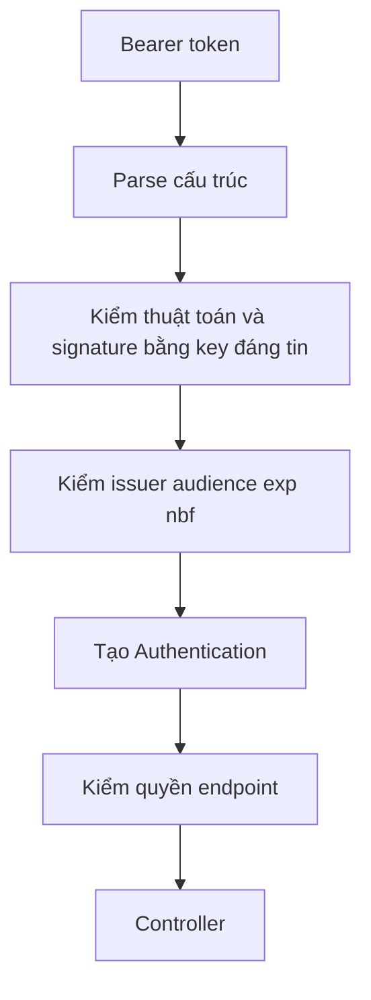

# Lesson 01 · JWT: đọc được chưa có nghĩa tin được

> Mục tiêu: nhìn một token và giải thích dữ liệu nằm đâu, ai ký, ai kiểm, điều kiện nào khiến request bị từ chối. Chưa cần viết login.

## 1. Nối với request bạn đã hiểu

Trước đây request đi qua filter rồi mới tới MVC. Giờ client gửi thêm:

```http
GET /api/products
Authorization: Bearer <access-token>
```

Bearer nghĩa là ai giữ token hợp lệ có thể sử dụng nó. Token không tự chứng minh người cầm chính là chủ tài khoản ban đầu. Vì vậy phải dùng HTTPS, tránh log token và giới hạn tuổi thọ.

JWT là một định dạng mang claims. Trong bài ta dùng **JWT ký dạng JWS, ba đoạn**, không phải JWT mã hóa JWE năm đoạn.

```text
base64url(header).base64url(payload).base64url(signature)
```

## 2. Ba đoạn có ý nghĩa gì?

Header minh họa:

```json
{"alg":"RS256","typ":"JWT","kid":"shopcore-key-01"}
```

- `alg`: thuật toán ký; server chỉ chấp nhận thuật toán đã cấu hình, không làm theo token một cách mù quáng.
- `kid`: gợi ý chọn key trong tập key đáng tin; không phải quyền cho token chọn URL tải key tùy ý.
- `typ`: kiểu token. Không thay thế kiểm chữ ký hoặc audience.

Payload minh họa:

```json
{"iss":"https://auth.shopcore.example","sub":"42","aud":["shopcore-api"],"iat":1791350400,"nbf":1791350400,"exp":1791351000,"jti":"a-123","roles":["USER"]}
```

| Claim | Đọc bằng lời |
|---|---|
| iss | Ai phát hành? |
| sub | Danh tính chủ thể; trong shopcore dùng ID user ổn định |
| aud | Token được phát cho bên nhận nào? |
| iat | Cấp lúc nào? Không tự là kiểm tra hết hạn |
| nbf | Chưa được dùng trước thời điểm này |
| exp | Không được dùng từ thời điểm hết hạn |
| jti | ID token, hữu ích theo dõi/revocation nếu có cơ chế; không tự chống replay |
| roles | Claim tùy ứng dụng; chỉ tin sau validation và cần converter phù hợp |

Thời gian JWT là NumericDate theo giây, không phải milliseconds Java. Có thể cấu hình lệch đồng hồ nhỏ; không nới lệch hàng giờ để “chạy được”.

Signature được tính trên **hai đoạn đã encode, nối dấu chấm**, không chỉ trên JSON payload. Đổi payload hoặc header sẽ làm chữ ký cũ không khớp.

## 3. Ký không phải mã hóa

Base64URL chỉ là biểu diễn dữ liệu. Người cầm token đọc được header/payload. Chữ ký giúp kiểm tính toàn vẹn và nguồn phát hành theo key đã tin cậy, không giấu nội dung.

Vì vậy không nhét password, passwordHash, client secret hoặc dữ liệu nhạy cảm không cần thiết vào payload. ID user và role tối thiểu thường đủ. Token bị ký đúng vẫn có thể bị đánh cắp và replay.

RS256 dùng private key để ký, public key để kiểm. API giữ public key có thể kiểm token nhưng không nên có khả năng tạo chữ ký mới. Private key phải bảo vệ ngoài Git. Nếu mỗi lần restart sinh key mới thì token cũ không kiểm được; đó không phải key management production.

## 4. Decode và verify khác nhau



Đọc sơ đồ:

1. Parse chỉ giúp đọc các đoạn, chưa đủ tin thông tin.
2. Signature chứng minh token không bị sửa dưới key/algorithm chấp nhận.
3. Claims đặt giới hạn sử dụng: đúng chữ ký nhưng dành cho dịch vụ khác vẫn không nhận.
4. Authentication là danh tính đã xác thực trong request hiện tại.
5. Authentication hợp lệ chưa đảm bảo được phép gọi endpoint ADMIN.

Lỗi token hợp lệ về cú pháp nhưng signature sai/hết hạn/sai audience thường thành **401** ở Resource Server, không vào Controller. Token hợp lệ nhưng thiếu quyền thành **403**. Response JSON tùy entry point/handler đã cấu hình, không tự có ApiResponse của bạn.

## 5. Dùng thư viện thay vì tự kiểm chuỗi

Spring Resource Server dùng `JwtDecoder` để decode **và validate**, rồi chuyển claims thành Authentication. Đừng chỉ dùng Base64 decoder và tự set user vào SecurityContext.

Snippet bean dưới đây cần public key RSA đã nạp an toàn, import Security OAuth2 JOSE, và `OAuth2TokenValidator<Jwt>`:

```java
@Bean
JwtDecoder jwtDecoder(RSAPublicKey publicKey) {
    NimbusJwtDecoder decoder = NimbusJwtDecoder.withPublicKey(publicKey)
            .signatureAlgorithm(SignatureAlgorithm.RS256)
            .build();
    OAuth2TokenValidator<Jwt> issuerAndTime =
            JwtValidators.createDefaultWithIssuer("https://auth.shopcore.example");
    OAuth2TokenValidator<Jwt> audience = new JwtClaimValidator<List<String>>(
            "aud", values -> values != null && values.contains("shopcore-api"));
    OAuth2TokenValidator<Jwt> requiredExpiry = new JwtClaimValidator<java.time.Instant>(
            "exp", value -> value != null);
    OAuth2TokenValidator<Jwt> requiredSubject = new JwtClaimValidator<String>(
            "sub", value -> value != null && !value.isBlank());
    decoder.setJwtValidator(new DelegatingOAuth2TokenValidator<>(
            issuerAndTime, audience, requiredExpiry, requiredSubject));
    return decoder;
}
```

Giải thích:

- Builder giới hạn RS256 và public key tin cậy, không dùng key lấy từ URL token chỉ định.
- `createDefaultWithIssuer` có timestamp validator và issuer validator.
- Validator audience bổ sung hợp đồng API của ta.
- Contract access token của shopcore bắt buộc có `exp` và `sub` không rỗng. Timestamp validator mặc định có thể chấp nhận claim thời gian vắng mặt; **kiểm hạn nếu có** khác **bắt buộc có hạn**. Hai validator thêm vào kiểm sự hiện diện; bộ timestamp phía trên vẫn kiểm token hết hạn/chưa tới hạn. `nbf` là tùy chọn trong contract này.
- `setJwtValidator` thay bộ validator, nên phải **ghép**, không vô tình bỏ timestamp/issuer khi thêm audience.

Khi kiểm decoder thật, thêm case token ký đúng nhưng thiếu exp hoặc sub → 401 theo contract này. Không tự thêm điểm bắt thuộc các validator mới vào đề cũ. Tham khảo [JwtTimestampValidator](https://docs.spring.io/spring-security/site/docs/current/api/org/springframework/security/oauth2/jwt/JwtTimestampValidator.html) và đối chiếu phiên bản trong BOM.

Ví dụ này là đường cấu hình explicit public key; nếu dùng issuer discovery/JWK Set thì làm theo tài liệu và chính sách key rotation của provider. Không copy cả hai cách tùy tiện.

## 6. Bảng dự đoán

Giả sử route cần USER, server chấp nhận đúng issuer/audience/RS256, claims thời gian hợp lệ:

| Case | Kết quả |
|---|---|
| Đổi USER thành ADMIN nhưng giữ signature | 401 |
| Chữ ký đúng nhưng aud là billing-api | 401 |
| Đúng token nhưng chỉ có USER, route cần ADMIN | 403 |
| Token hết hạn | 401, client có thể thử refresh theo chính sách |
| Token bị đánh cắp còn hiệu lực | Có thể vẫn được nhận; chữ ký không biết ai đang cầm |

## 7. Tự kiểm tra bằng lời

Bạn không cần thuộc mọi class. Hãy nói được: “API kiểm key/algorithm, chữ ký, issuer, audience, thời gian rồi mới tin subject/role; sau đó mới phân quyền”. Đó là bản chất, không phải học thuộc thứ tự mọi filter.

## Tài liệu / video

- [RFC 7519: JWT và registered claims](https://www.rfc-editor.org/rfc/rfc7519.html), đọc mục 4 và 7 để tra định nghĩa.
- [RFC 8725: JWT Best Current Practices](https://www.rfc-editor.org/rfc/rfc8725.html), đọc kiểm algorithm, issuer và audience.
- [Spring Resource Server JWT](https://docs.spring.io/spring-security/reference/servlet/oauth2/resource-server/jwt.html), đọc decoding, validation và custom validators.
- Video gợi ý tìm: `JWT signature vs encryption RS256 issuer audience Spring Security`. Chưa xác minh video cụ thể; bỏ video dạy tin payload trước validation hoặc dùng secret yếu.

[Làm đề lesson 1](../../../Exams/de-kiem-tra/M3-3-jwt__2026-10-07__lesson1-lan1.md). Đáp án nằm riêng, mở sau khi trả lời.
