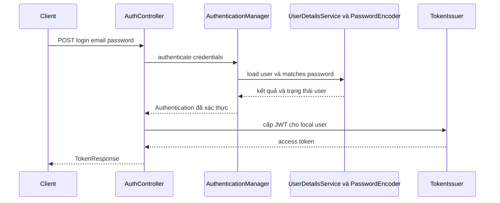

# Lesson 02 · Register → login → gọi API

> Mục tiêu: tách đường cấp token khỏi đường kiểm token, biết DTO nào được nhận/trả và vì sao stateless không phải “không dùng database”.

## 1. Hợp đồng nhỏ của shopcore

| Endpoint | Input | Thành công | Lỗi điển hình |
|---|---|---|---|
| POST /api/auth/register | email, password | 201 + UserResponse | 400 input, 409 trùng email |
| POST /api/auth/login | email, password | 200 + TokenResponse | 400 format, 401 credentials sai |
| GET /api/products | Bearer access token | 200 + page DTO | 401 thiếu/sai token |
| DELETE /api/products/10 | Bearer + ADMIN | 204 | 401 chưa xác thực, 403 thiếu quyền |

Register **không nhận role ADMIN từ client**. Role mặc định USER do server quyết định. DTO class request chỉ chứa field được phép; UserResponse không có passwordHash. TokenResponse có accessToken, tokenType = Bearer, expiresIn tính giây; refreshToken ở bài sau. Token response cần `Cache-Control: no-store` và không log body.

Ví dụ style DTO, Lombok phải có annotation processing:

```java
@Getter
@Setter
@NoArgsConstructor
public class LoginRequest {
    private String email;
    private String password;
}
```

Không trả object User vừa xác thực ra client để tiện. Entity chứa credential và trạng thái nội bộ.

## 2. Register thực sự làm gì?

```text
JSON → Request DTO → validation
→ Service chuẩn hóa email theo policy
→ kiểm trùng để báo lỗi dễ hiểu
→ BCrypt encode password
→ lưu User(role=USER, enabled=true)
→ Response DTO
```

Kiểm `existsByEmail` chưa chống race hai request cùng lúc. Database vẫn cần unique constraint trên giá trị định danh đã chuẩn hóa. Map lỗi vi phạm unique về 409 phù hợp, không lộ SQL ra client.

BCrypt hash có salt và chi phí tính toán để bảo vệ password. Không dùng SHA-256 đơn thuần cho mật khẩu người dùng. Mật khẩu raw chỉ tồn tại thời gian cần xử lý, không log.

## 3. Login và request sau login là hai đường



Manager chọn provider phù hợp; với password thường là DaoAuthenticationProvider. Provider tải user, kiểm password hash và trạng thái như disabled/locked. TokenIssuer chỉ được chạy sau khi xác thực thành công; không lấy email client gửi làm subject rồi ký luôn.

Resource Server **không tự tạo endpoint login/register**. Nó nhận access token ở các request sau và kiểm token. Đừng nghĩ thêm starter là có đủ auth feature.

## 4. Bearer request không đăng nhập lại bằng password

```text
Authorization header
→ BearerTokenAuthenticationFilter
→ AuthenticationManager / JwtAuthenticationProvider
→ JwtDecoder kiểm token
→ JwtAuthenticationConverter tạo authorities
→ SecurityContext cho request
→ authorization → MVC → Controller
```

Password không cần gửi lại trong mỗi request API. Với validation JWT offline, API cũng không nhất thiết query user/password database mỗi lần. Đổi user thành disabled hoặc sửa role trong DB vì vậy có thể chưa tác động tới token đã cấp; cần TTL ngắn hoặc chính sách kiểm trạng thái/revocation bổ sung.

`STATELESS` ở đây nghĩa Spring Security không dùng HTTP session để lưu/lấy authentication cho các request API. Vẫn có User DB, refresh state, logs, cache. Không tạo JSESSIONID để chứng minh login cho API; mỗi request mang credential riêng.

## 5. Đưa role vào Spring đúng cách

Spring mặc định thường ánh xạ `scope`/`scp` thành authority `SCOPE_x`. Claim custom `roles:["ADMIN"]` không tự biến thành `ROLE_ADMIN`.

```java
@Bean
JwtAuthenticationConverter jwtAuthenticationConverter() {
    JwtGrantedAuthoritiesConverter roles = new JwtGrantedAuthoritiesConverter();
    roles.setAuthoritiesClaimName("roles");
    roles.setAuthorityPrefix("ROLE_");
    JwtAuthenticationConverter converter = new JwtAuthenticationConverter();
    converter.setJwtGrantedAuthoritiesConverter(roles);
    return converter;
}
```

Nếu payload đã chứa `ROLE_ADMIN` thì không thêm prefix lần nữa; hãy chọn một contract nhất quán. Ví dụ bài dùng payload ADMIN, authorities ROLE_ADMIN. Subject là local user ID; tên principal không bắt buộc là email.

## 6. API chain minh họa có ranh giới

Giả định: chỉ Bearer header và JSON body, không auth cookie/Basic, không browser login trong chain này. `JwtDecoder` đã cấu hình như bài 1; CORS cần policy riêng nếu có frontend khác origin.

```java
@Bean
@Order(1)
SecurityFilterChain apiChain(HttpSecurity http,
        JwtAuthenticationConverter converter) throws Exception {
    return http
            .securityMatcher("/api/**")
            .csrf(csrf -> csrf.disable())
            .sessionManagement(session -> session
                    .sessionCreationPolicy(SessionCreationPolicy.STATELESS))
            .authorizeHttpRequests(auth -> auth
                    .requestMatchers(HttpMethod.POST, "/api/auth/register", "/api/auth/login",
                            "/api/auth/refresh")
                    .permitAll()
                    .requestMatchers(HttpMethod.DELETE, "/api/products/**").hasRole("ADMIN")
                    .anyRequest().authenticated())
            .oauth2ResourceServer(oauth -> oauth.jwt(jwt -> jwt
                    .jwtAuthenticationConverter(converter)))
            .build();
}

@Bean
@Order(2)
SecurityFilterChain fallbackChain(HttpSecurity http) throws Exception {
    return http.authorizeHttpRequests(auth -> auth.anyRequest().denyAll()).build();
}
```

Đọc từng khối: matcher chọn chain; stateless chọn cách giữ auth; rules chọn ai được vào; Resource Server chọn cách xác thực token. Fallback không bỏ các URL khác ngoài bảo vệ. M3-4 sẽ thay fallback bằng browser chain, không để hai chain cùng order tùy tiện.

`permitAll()` không có nghĩa bỏ mọi filter: request login kèm Bearer hỏng vẫn có thể bị filter từ chối trước Controller. Client không nên gửi token cũ vào login; nếu thiết kế muốn bỏ qua token cho auth routes thì cần chain/resolver riêng có kiểm thử.

Route refresh được khai báo trước cho Lesson 03: không đòi access token còn hạn, nhưng AuthService phải kiểm refresh credential thật. Client gọi refresh bằng JSON credential, **không gắn access token hết hạn**; nếu gắn Bearer hỏng, Resource Server vẫn có thể chặn trước permitAll. Public rule không tự tạo endpoint hay cho phép cấp token mà không kiểm credential.

CSRF chỉ được tắt theo giả định nêu trên. Khi chuyển refresh vào cookie, phải xét lại chống CSRF, không viện lý do “JWT luôn an toàn”.

## 7. Lỗi nằm đâu?

- JSON sai → MVC binding/validation, thường 400 qua cơ chế MVC.
- Password sai trong AuthService/Controller gọi manager → cần map AuthenticationException thành 401 an toàn, không để catch-all biến thành 500.
- AppException EMAIL_ALREADY_EXISTS → ControllerAdvice map 409 theo ErrorCode.
- Bearer invalid trước MVC → AuthenticationEntryPoint của Security, 401.
- User đúng thiếu role → AccessDeniedHandler hoặc xử lý method authorization thích hợp, 403.

Không trả chi tiết “email tồn tại nhưng password sai” nếu không muốn tạo kênh dò tài khoản. Không phản hồi stack trace.

## Tài liệu / video

- [Spring Resource Server JWT](https://docs.spring.io/spring-security/reference/servlet/oauth2/resource-server/jwt.html): authentication flow, authorities converter.
- [Spring Password Storage](https://docs.spring.io/spring-security/reference/features/authentication/password-storage.html): PasswordEncoder và adaptive hashing.
- [Spring Session Management](https://docs.spring.io/spring-security/reference/servlet/authentication/session-management.html): ý nghĩa session policy.
- Video tìm: `Spring Security AuthenticationManager JwtDecoder JwtAuthenticationConverter stateless`. Ưu tiên bean DSL, không dùng WebSecurityConfigurerAdapter cũ.

[Đề lesson 2](../../../Exams/de-kiem-tra/M3-3-jwt__2026-10-07__lesson2-lan1.md).
