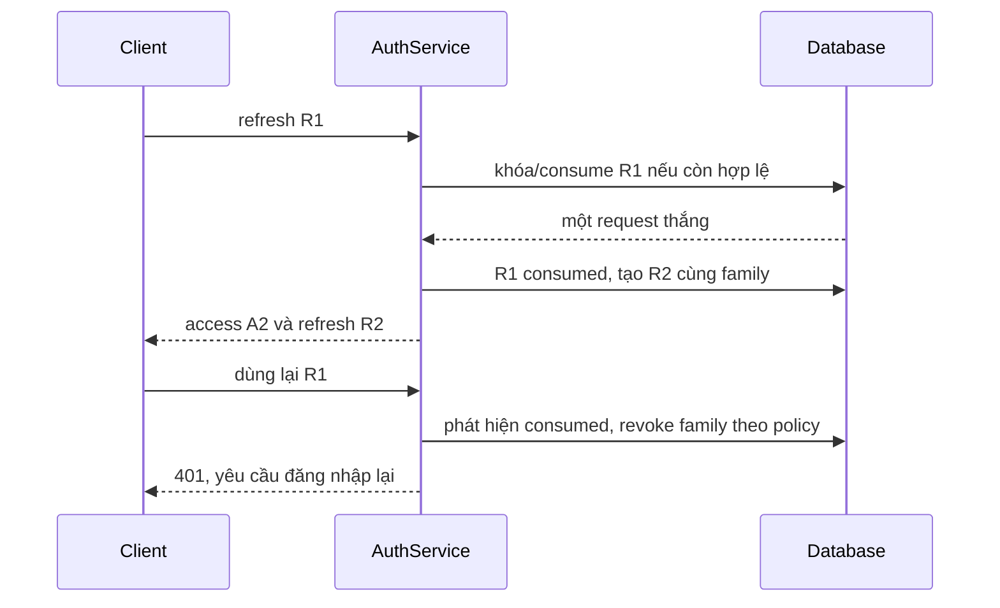

# Lesson 03 · Access ngắn hạn, refresh có trạng thái

> Mục tiêu: dự đoán token nào còn dùng được sau refresh/logout, biết vì sao cần DB và vì sao transaction sai có thể làm mất hiệu lực bảo vệ.

## 1. Vì sao hai loại token?

Access token gửi tới API thường xuyên, nên nếu lộ cần giới hạn thời gian thiệt hại. Refresh token chỉ gửi tới endpoint cấp token mới, có tuổi thọ dài hơn và phải được bảo vệ kỹ hơn.

Ví dụ policy học tập, không phải con số bắt buộc mọi hệ thống:

| Loại | Tuổi thọ | Dùng ở đâu | Server giữ gì |
|---|---|---|---|
| Access JWT | 10  phút | Authorization Bearer gọi API | public key, validators; có thể không lưu từng token |
| Refresh ngẫu nhiên | tối đa 7 ngày theo family | POST /api/auth/refresh | hash token, user, family, hạn, trạng thái |

Roadmap bỏ opaque **access token + introspection server**. Dùng refresh token ngẫu nhiên không mâu thuẫn: API vẫn xác thực access JWT, không gọi introspection cho mỗi API request.

## 2. Model đủ để hình dung

```text
refresh_token
  id
  token_hash        UNIQUE
  user_id           FK users
  family_id         liên kết một phiên đăng nhập/thiết bị
  expires_at
  consumed_at       null khi chưa dùng
  revoked_at        null khi chưa thu hồi
  replaced_by_id    token kế tiếp, nếu có
```

Family cũng có thể là bảng riêng có revoked_at và absolute_expires_at. Cần policy rõ: hết hạn tuyệt đối sau 7 ngày hay trượt theo hoạt động? Bài chọn **hạn tuyệt đối của family**, không kéo dài vô hạn mỗi refresh.

Token raw sinh từ CSPRNG (ví dụ SecureRandom 32 bytes rồi Base64URL), chỉ trả cho client, DB lưu SHA-256 hash. SHA-256 phù hợp tra token ngẫu nhiên entropy cao; **không suy ra SHA-256 đủ an toàn cho password** do password dễ đoán hơn nhiều. Không ghi raw refresh vào log hoặc URL.

## 3. Contract endpoint

```http
POST /api/auth/refresh
Content-Type: application/json

{"refreshToken":"<secret-random-string>"}
```

Thành công: 200, TokenResponse chứa access mới và refresh mới, `Cache-Control: no-store`. Không bắt access token còn hạn mới cho refresh, vì mục đích là cấp access khi nó hết hạn. Endpoint public ở mức access authentication nhưng **vẫn phải xác thực refresh credential**.

Refresh sai/hết hạn/đã thu hồi theo policy → 401, thông báo chung. Format body sai → 400. Nếu user bị disabled thì không cấp tiếp. Roles của token mới lấy theo trạng thái hiện tại, không copy mù quáng roles từ access cũ.

## 4. Rotation là đổi refresh sau mỗi lần dùng



R1 không còn dùng như refresh thành công được nữa. Nhưng A1 và A2 là access token khác: chúng không tự mất hiệu lực chỉ vì R1 consumed.

Family giúp thu hồi chuỗi token sau khi phát hiện reuse. Hệ thống không chắc reuse do attacker hay retry mạng; thiết kế client single-flight refresh, xử lý timeout và policy retry cẩn thận. Không hứa vừa nghiêm tuyệt đối vừa không bao giờ đăng xuất nhầm.

## 5. Race và transaction: liên hệ kiến thức PostgreSQL

Nếu hai request đọc R1 “chưa dùng” cùng lúc rồi cùng update, có thể cấp R2 và R3. Chỉ `@Transactional` mặc định chưa chắc ngăn được.

Chọn một chiến lược có bảo đảm:

- Pessimistic row lock khi lấy R1, khóa family phù hợp nếu cần kiểm revoke đồng thời.
- Hoặc atomic conditional update: `UPDATE ... SET consumed_at = ... WHERE ... consumed_at IS NULL ...`; chỉ request affectedRows=1 được cấp tiếp.
- Consume R1 và insert R2 cần cùng transaction. Constraint unique token_hash là lớp bảo vệ bổ sung, không thay thế điều kiện consume.

Pseudocode giao dịch, không phải full implementation:

```text
transaction rotateOrDeny(rawRefresh):
    hash raw, tìm và khóa token/family
    nếu missing/expired/revoked/user disabled: trả Denied
    nếu consumed:
        đánh dấu family revoked
        trả DeniedReuse
    đánh dấu old consumed
    tạo new refresh với family và hạn hợp lệ
    trả Rotated(userId, rawNewRefresh)

caller ngoài transaction:
    result = rotateOrDeny(raw)
    nếu Denied: trả/throw lỗi 401
    nếu Rotated: cấp access và trả TokenResponse
```

Điểm quan trọng: **commit revocation trước khi báo lỗi ra ngoài transaction**. Nếu trong cùng `@Transactional` bạn set revoked rồi throw RuntimeException, rollback mặc định có thể hoàn tác cả revoked. Một service bean transaction trả kết quả, caller khác chuyển kết quả thành AppException là một cách; phải gọi qua proxy đúng, không self-invocation.

Nếu ký access hoặc gửi response thất bại sau commit, refresh cũ có thể đã consumed mà client chưa nhận token mới. Đây là bài toán recovery/policy, không “được transaction bảo đảm mọi thứ kể cả mạng”.

## 6. Logout thu hồi cái gì?

Giả sử 10:00 cấp A1 hạn 10:10 và R1; 10:03 logout revoke family:

```text
R1 / refresh con cùng family → không cấp token mới
A1 → có thể vẫn được API offline nhận đến hạn (có clock skew)
```

Muốn A1 bị chặn ngay phải thêm state/check: denylist jti đến hết hạn, token version/user state check, hoặc cơ chế tương đương. Đổi lại thêm DB/cache lookup và vận hành. Không claim “stateless tuyệt đối, logout tức thì và không state” cùng lúc.

Logout local không tự logout Google; thu hồi Google authorization cũng là hành động khác, học M3-4.

## 7. Token nằm ở đâu trên client?

- Header access giảm ambient credential CSRF, nhưng script bị XSS vẫn có thể lấy/sử dụng token tùy cách lưu.
- localStorage không phải nơi “an toàn tuyệt đối”; XSS đọc được.
- HttpOnly cookie hạn chế script đọc trực tiếp, nhưng browser tự gửi nên phải xem CSRF, SameSite/Secure và ranh giới origin.
- Bài dùng refresh JSON body để nhìn flow; không phải khuyến nghị frontend production duy nhất. Khi đổi sang cookie phải đổi threat model và security config tương ứng.

## Tài liệu / video

- [RFC 9700: OAuth 2.0 Security Best Current Practice](https://www.rfc-editor.org/rfc/rfc9700.html), mục refresh token protection để hiểu rotation/replay.
- [Spring transaction rollback](https://docs.spring.io/spring-framework/reference/data-access/transaction/declarative/rolling-back.html): exception và rollback.
- [JWT BCP](https://www.rfc-editor.org/rfc/rfc8725.html): giới hạn tin cậy token.
- Video tìm: `refresh token rotation reuse detection transaction rollback token family`. Đây là từ khóa, không phải video đã kiểm chứng.

[Đề lesson 3](../../../Exams/de-kiem-tra/M3-3-jwt__2026-10-07__lesson3-lan1.md).
