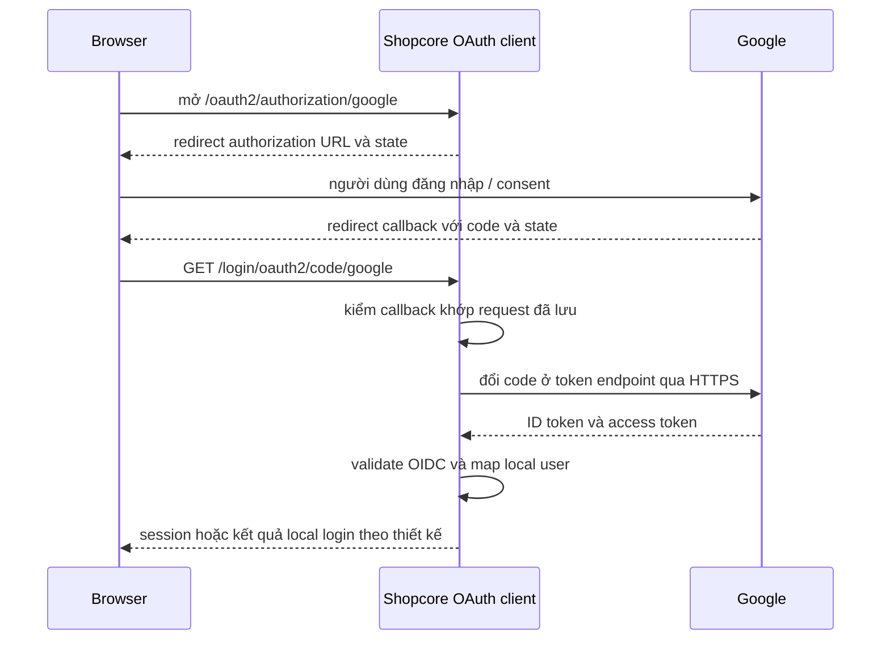

# Lesson 01 · OAuth2 không phải JWT; OIDC không phải phân quyền nội bộ

> Mục tiêu: kể được một lần Google Login bằng vai trò và token, không học thuộc mọi grant của OAuth.

## 1. Bài toán mới

Login password ở M3-3: shopcore trực tiếp kiểm password người dùng. Google Login: shopcore không được nhận password Google. Người dùng xác thực với Google, rồi shopcore nhận kết quả theo giao thức và ánh xạ sang user nội bộ.

OAuth2 là framework ủy quyền truy cập tài nguyên. OIDC thêm lớp xác thực danh tính lên OAuth2. JWT chỉ là định dạng token, không phải toàn bộ quy trình đăng nhập. Một OAuth access token không bắt buộc có dạng JWT.

## 2. Bốn vai trò đặt vào ví dụ thật

| Vai trò | Trong ví dụ |
|---|---|
| Resource owner | Bạn, người dùng sở hữu/quản lý dữ liệu Google của mình |
| Client | Backend shopcore xin quyền và nhận callback, không phải chỉ browser |
| Authorization server | Google cấp code/token sau xác thực và consent phù hợp |
| Resource server | Google API/UserInfo phục vụ tài nguyên theo access token |

Nếu shopcore cũng cung cấp API riêng, nó là Resource Server trong **một quan hệ khác**: nhận token dành cho shopcore. Cùng một app có thể mang nhiều vai trò; đừng vì tên “client” mà kết luận phải là React.

## 3. Ba thứ thường bị gọi chung là token

| Thứ nhận được | Dùng để làm gì? | Không được suy ra |
|---|---|---|
| Authorization code | Đổi lấy tokens tại token endpoint; ngắn hạn, một lần | Không gửi code như Bearer gọi API |
| ID token OIDC | Thông tin xác thực cho OAuth client, gồm issuer/sub/audience | Không phải vé gọi mọi API |
| Google access token | Gọi tài nguyên Google trong scope được cấp | Không tự có quyền ADMIN của shopcore |

ID token audience thường là client ID đăng ký Google. Access JWT M3-3 có audience shopcore-api. Khác hợp đồng nên không dùng thay nhau chỉ vì cả hai có chữ “token”.

Scope `openid` yêu cầu OIDC; `profile`, `email` xin các thông tin tương ứng. Scope email không tự trao quyền quản trị, không có nghĩa được đọc Gmail. Không xin quyền Google Drive/Gmail nếu feature chỉ cần login.

## 4. Authorization code flow qua backend

Ý nghĩa từng đoạn:

1. Browser bắt đầu flow tại shopcore, không gọi Google bằng client secret.
2. Shopcore lưu thông tin request ban đầu để so với callback. `state` đi cùng request giúp liên kết lượt đi/lượt về.
3. Người dùng nhập password trên Google, không vào form backend của ta.
4. Callback qua browser mang **code**, không phải client secret hay access JWT nội bộ.
5. Backend đổi code qua kết nối server-to-server; confidential client dùng credential theo cấu hình provider. Nếu dùng PKCE còn gửi code_verifier.
6. Thư viện kiểm token và danh tính theo provider tin cậy; rồi app quyết định user nội bộ được đăng nhập không.
7. Thành công ở Google chưa bảo đảm tài khoản local được phép hoạt động.

## 5. state, nonce, PKCE: ba ràng buộc khác nhau

| Cơ chế | Ràng buộc chính |
|---|---|
| state | Callback với authorization request/lượt browser đã khởi tạo; chống giả mạo callback/login CSRF khi triển khai đúng |
| nonce | ID token với request xác thực OIDC; giúp chống dùng lại kết quả ngoài lượt mong đợi |
| PKCE | Code với bí mật code_verifier của client đã khởi tạo; challenge gửi lúc xin code, verifier khi đổi code |

Chúng không phải ba tên cho cùng một field. Không tự tắt kiểm state để chữa lỗi “authorization_request_not_found”. Tìm nguyên nhân mất session/cookie hoặc callback sai host.

Spring/provider có cơ chế mặc định phụ thuộc client và phiên bản. Bài yêu cầu hiểu mục đích, không khẳng định mọi confidential client tự bật PKCE trong mọi cấu hình; muốn dựa vào PKCE phải xác minh authorization request thực tế có challenge.

## 6. Ai validate ID token?

Dùng OAuth2/OIDC client library theo provider đáng tin. Cần kiểm signature bằng key tin cậy, issuer, audience client ID, thời gian và các ràng buộc OIDC liên quan (ví dụ nonce nếu đã gửi). Đừng chỉ Base64 decode rồi lấy email.

Google cung cấp `sub` là định danh tài khoản ổn định; app dùng cùng issuer để xác định external identity. Email là thuộc tính có thể đổi, không phải khóa định danh bền vững. Bài 3 sẽ giải thích chuyện trùng email và liên kết tài khoản.

## 7. Liên hệ Backend → AI Engineer

AI app cũng cần biết ai đang dùng tài nguyên, quota thuộc ai, ai xem được conversation. Google Login giải quyết nguồn danh tính; ownership/quota/local role vẫn là việc của backend, không phải LLM hay token Google quyết định.

## Tài liệu / video

- [OpenID Connect Core](https://openid.net/specs/openid-connect-core-1_0.html), đọc authentication, ID token và code flow.
- [Google OpenID Connect](https://developers.google.com/identity/openid-connect/openid-connect), đọc code flow, claims và validation.
- [OAuth Security BCP](https://www.rfc-editor.org/rfc/rfc9700.html), đọc redirect, PKCE và bảo vệ authorization response.
- Video tìm: `OAuth2 OpenID Connect authorization code state nonce PKCE explained`. Chưa kiểm chứng video cụ thể; tránh video nói OAuth2 luôn là JWT.

[Đề lesson 1](../../../Exams/de-kiem-tra/M3-4-oauth2__2026-10-07__lesson1-lan1.md).
