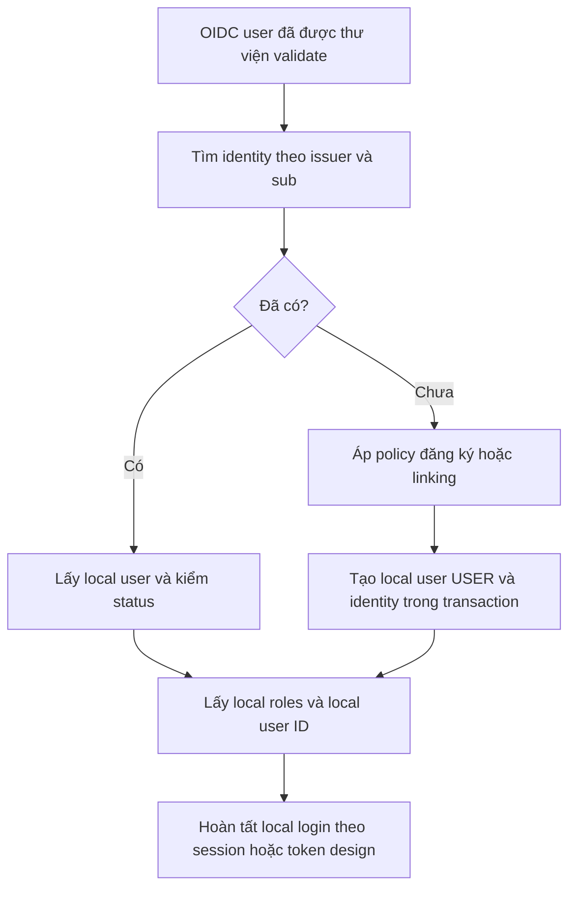

# Lesson 03 · Google xác nhận danh tính; shopcore quyết định tài khoản

> Mục tiêu: map user đúng, không tạo lỗ hổng account linking; hiểu điểm nối tới JWT/session và cách kiểm chứng.

## 1. Hai model thay vì nhét mọi thứ vào email

```text
users
  id, display_name, status, local_roles, created_at

external_identities
  id, issuer, subject, user_id, email_snapshot
  UNIQUE(issuer, subject)

local_credentials (nếu có password login)
  user_id UNIQUE, password_hash
```

Hoặc giữ passwordHash nullable trong User nếu schema đơn giản, nhưng phải phân biệt federated-only với local-password user. Không tạo password giả “google123” cho người dùng Google.

Khóa external identity là **issuer + sub đã validate**. Email có thể đổi, không đủ xác định bền vững; snapshot email chỉ là thông tin hiển thị/liên hệ theo policy. Google có quy tắc issuer chấp nhận cụ thể; dùng issuer đã được thư viện xác minh và chuẩn hóa có chủ đích, không tin chuỗi issuer client tự gửi.

## 2. Flow mapping



Đọc từng nhánh:

1. Input không phải JSON email từ browser; nó là kết quả OIDC đã được xác minh.
2. Identity đã tồn tại → giữ local user cũ dù email đổi.
3. User local disabled → từ chối dù Google xác thực thành công.
4. Identity mới → theo policy, không tùy tiện ghép vào tài khoản có cùng email.
5. Tạo User và identity cần transaction; DB unique `(issuer, subject)` chống hai callback cùng tạo trùng. Xử lý conflict bằng đọc lại mapping hợp lệ, không tự chuyển sang user khác.
6. Local roles do database/policy shopcore quyết định. Email đuôi công ty không mặc định là ADMIN.

## 3. Cùng email không nghĩa cùng local account

Ví dụ local user 42 có email a@example.com và password; Google identity mới gửi email đó nhưng `(issuer,sub)` chưa có trong DB.

**Không tự auto-link chỉ vì email bằng nhau**, kể cả email_verified=true nếu chưa có chính sách linking đủ an toàn. Cần user chứng minh quyền sở hữu local account, ví dụ đăng nhập local trước rồi chủ động liên kết Google qua flow được ràng buộc với user hiện tại; có thể yêu cầu reauthentication theo mức rủi ro.

Giữ destination user ID trong trạng thái server đáng tin, không lấy `linkToUserId=42` client gửi làm quyền. Một identity không được đồng thời gắn hai user. Unlink phải đảm bảo user không mất mọi cách đăng nhập theo policy.

## 4. Điểm mở rộng Spring

Với OIDC scope openid, có thể dùng custom `OidcUserService` delegate mặc định để tải/validate thông tin theo framework rồi thêm bước mapping local. Authorities mapper hoặc principal wrapper đưa local roles/local ID vào Authentication theo thiết kế. Success handler chạy sau authentication để chọn nơi redirect/kết quả.

```text
OAuth2LoginAuthenticationFilter
→ provider / OIDC validation
→ OidcUserService delegate + mapping local
→ local authorities/principal
→ lưu SecurityContext theo browser design
→ success handler
```

Không chỉ map ở success handler nhưng vẫn để session chứa authorities không đúng policy local. Nếu chỉ cập nhật database, chưa chắc principal hiện tại tự dùng local roles; phải nối mapping vào Authentication có hiệu lực.

Nếu mapping từ chối vì user disabled, chuyển lỗi theo OAuth2 authentication flow, không cho success handler cấp local token trước khi kiểm status. AppException style có thể dùng ở service nội bộ, nhưng adapter OAuth cần chuyển lỗi thích hợp.

## 5. Session hay local JWT? Chọn rõ

**Cách A, đơn giản cho browser:** session local, browser gửi cookie; endpoint được cấu hình nhận session và giữ chống CSRF. Cần kiểm quyền local trong principal, không gọi nó là API Bearer stateless.

**Cách B, nối với M3-3:** sau Google validation + mapping + kiểm status, app cấp **JWT của shopcore** cho local user theo policy. API `/api/**` chỉ nhận JWT này, kiểm issuer/audience/roles local. Cách chuyển credential tới client phải thiết kế an toàn; không redirect `?access_token=...&refresh_token=...`.

Có thể dùng BFF giữ token phía server/session hoặc một lần handoff ngắn hạn có ràng buộc và đổi qua backchannel phù hợp; đây là nhận diện lựa chọn, không yêu cầu tự xây protocol trong module. Chưa chọn cách delivery thì chưa được claim login-to-API end-to-end hoàn tất.

ID token Google không thay local JWT. Google access token để gọi Google API theo scope, không làm ADMIN của shopcore. Nếu không cần Google API, đừng lưu provider token dài hạn không cần thiết; nếu cần, phải bảo vệ mã hóa/quyền truy cập/rotation phù hợp, không plaintext logs.

## 6. Logout có ba ý khác nhau

- Local logout: xóa session hoặc revoke local refresh family; JWT access cũ tuân policy expiry/revocation M3-3.
- Google session: người dùng có thể vẫn đăng nhập Google trên browser, lần sau login nhanh; local logout không tự xóa nó.
- Thu hồi Google consent/tokens: hành động khác, ảnh hưởng quyền app với Google, không chỉ cookie session local.

Đừng hứa “logout khỏi mọi nơi” chỉ vì đã invalidate session shopcore.

## 7. Kế hoạch test không cần Google thật cho mọi case

| Case | Cần chứng minh |
|---|---|
| Cùng issuer/sub, email đổi | Một local user cũ, không sinh user mới |
| Identity mới, email trùng | Không auto-link nếu chưa chứng minh ownership |
| Local user disabled | Login local bị từ chối |
| Claim/email có chữ admin | Không tự cấp local ADMIN |
| Hai callback đồng thời | Unique mapping, không tạo hai identity cho một pair |
| Mock oidcLogin() | Rule/Controller với principal mock, không chứng minh Google signature/state/code exchange |
| Smoke test provider thật | Redirect, callback, credentials, consent và mapping chạy trong môi trường thử |

Test mock và unit mapping giúp kiểm business policy. Một smoke test thật vẫn cần trước khi khẳng định deliverable Google Login đã chạy. Không dùng tài khoản/secret production trong CI.

## Tài liệu / video

- [Google OIDC claims và sub](https://developers.google.com/identity/openid-connect/openid-connect).
- [Spring OAuth2 Login Advanced](https://docs.spring.io/spring-security/reference/servlet/oauth2/login/advanced.html): OIDC UserService, authorities mapping, handlers.
- [Spring MockMvc OAuth2 tests](https://docs.spring.io/spring-security/reference/servlet/test/mockmvc/oauth2.html): oidcLogin() và giới hạn giả lập.
- Video tìm: `Spring OidcUserService local user account linking issuer subject`. Đánh giá video bằng policy linking, không chỉ nhìn login thành công.

[Đề lesson 3](../../../Exams/de-kiem-tra/M3-4-oauth2__2026-10-07__lesson3-lan1.md).
