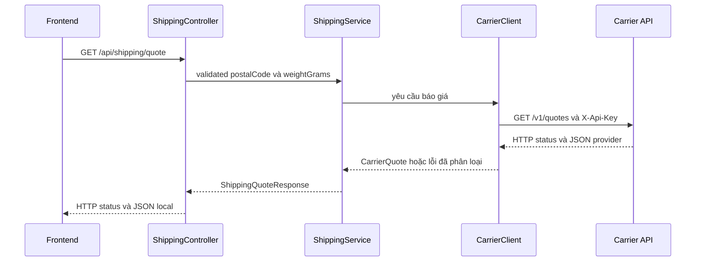

# Lesson 01 · Từ Service gọi ra một API khác

> Mục tiêu: nhìn thấy hai HTTP request độc lập và biết DTO/client/service làm gì. Chưa cần học toàn bộ reactive programming.

## 1. Bạn đang vừa là server, vừa là client

Frontend gửi request tới shopcore. Shopcore cần báo giá vận chuyển nên lại gửi request tới carrier. **Carrier không phải Repository của shopcore**: đó là một hệ thống có network, credential, schema và lỗi riêng.



Đọc từng bước:

1. MVC bind query của frontend; validation input là việc phía shopcore.
2. Service quyết định khi nào cần báo giá, không Controller tự ghép HTTP tới provider.
3. CarrierClient che chi tiết URL/header/HTTP codec khỏi nghiệp vụ.
4. Provider response được decode thành DTO **của provider**.
5. Service map sang response DTO **của shopcore**, không mặc định trả nguyên payload provider.
6. Hai HTTP status độc lập: provider 401 không có nghĩa frontend thiếu JWT (bài 2).

Repository chỉ xuất hiện nếu nghiệp vụ cần dữ liệu local. Không bắt mọi request phải qua Repository nếu không đọc/ghi DB.

## 2. Contract xuyên suốt bốn bài

Local request:

```http
GET /api/shipping/quote?postalCode=700000&weightGrams=500
Authorization: Bearer <shopcore-access-token>
```

Input: postalCode đúng6 chữ số, weightGrams từ 1 đến30000. Bài chưa triển khai validator; thực hành có thể dùng request DTO/constraint đúng phiên bản MVC, không giả định @Schema tự validate.

Provider request (giả lập, không gọi được host này):

```http
GET /v1/quotes?postalCode=700000&weightGrams=500
Host: carrier.example
X-Api-Key: <backend-provider-key>
```

Provider 200:

```json
{"amount":25000,"currency":"VND"}
```

Local200, body gọn chưa dùng wrapper trong ví dụ này:

```json
{"fee":25000,"currency":"VND","provider":"demo-carrier"}
```

Nếu app bạn bọc `ApiResponse<ShippingQuoteResponse>`, cần mô tả đúng wrapper ở OpenAPI. Hai cách đều được; không viết docs body gọn rồi runtime lại bọc thêm data mà không cập nhật.

## 3. Chọn WebClient, không phải đổi framework server

WebClient là HTTP client của Spring, hỗ trợ reactive/nonblocking. OpenFeign là hướng declarative interface, thường thêm Spring Cloud và compatibility cần quản lý. Chọn WebClient vì roadmap cho phép, API rõ và nối được tới streaming/external AI sau này.

OpenFeign không “sai”; tài liệu hiện đánh dấu feature-complete và gợi ý Spring HTTP Service Clients cho hướng mới. Không cần học thêm cả hai trong14h. RestClient cũng là lựa chọn imperative hiện đại đáng biết, nhưng bài giữ đúng nhánh WebClient của roadmap.

Source hiện MVC; khi thực hành Boot4 dùng starter `spring-boot-starter-webclient`, version do Boot BOM quản lý. Không cần thay starter MVC thành WebFlux server chỉ để gọi ra ngoài. Chưa sửa POM trong bộ bài này.

## 4. Config có ranh giới

```yaml
integrations:
  carrier:
    base-url: https://carrier.example
    api-key: ${CARRIER_API_KEY}
```

Host là config do server quản lý. Không nhận full URL tùy ý từ user rồi gọi: có nguy cơ SSRF tới localhost/internal network/cloud metadata. Query dùng URI builder/template, không nối chuỗi thô cho URL chứa dữ liệu user.

Không forward JWT user tới carrier, trừ khi một hợp đồng token delegation đã được thiết kế rõ (ngoài scope). Token issuer/audience shopcore không phải credential của provider. Không log X-Api-Key, Authorization hoặc payload nhạy cảm.

Bean minh họa dùng JDK connector để nhìn rõ connect timeout. WebClient vẫn là client chung; không học Reactor Netty config ở đây:

```java
@Bean
WebClient carrierWebClient(
        @Value("${integrations.carrier.base-url}") String baseUrl,
        @Value("${integrations.carrier.api-key}") String apiKey) {
    java.net.http.HttpClient transport = java.net.http.HttpClient.newBuilder()
            .connectTimeout(Duration.ofMillis(300))
            .followRedirects(java.net.http.HttpClient.Redirect.NEVER)
            .build();
    return WebClient.builder()
            .baseUrl(baseUrl)
            .clientConnector(new JdkClientHttpConnector(transport))
            .defaultHeader("X-Api-Key", apiKey)
            .codecs(codecs -> codecs.defaultCodecs().maxInMemorySize(64 * 1024))
            .build();
}
```

Ý nghĩa: dùng lại client bean, giới hạn connect 300 ms và buffer 64 KiB, không tự theo redirect sang host khác cùng secret. Đây không phải tổng timeout; bài 2 thêm deadline. Tự builder như ví dụ giữ code nhỏ nhưng không tự nhận mọi customizer/observability của Boot-managed builder; app thật nên cân nhắc inject builder rồi cấu hình trên bản clone theo policy.

HTTPS vẫn kiểm certificate, không dùng trust-all để chữa lỗi TLS. JDK transport/resources cần lifecycle phù hợp ứng dụng; đoạn bean không phải hướng dẫn vận hành connection pool production.

## 5. DTO provider là class

```java
public class CarrierQuote {
    private BigDecimal amount;
    private String currency;

    public CarrierQuote() {}
    public BigDecimal getAmount() { return amount; }
    public void setAmount(BigDecimal amount) { this.amount = amount; }
    public String getCurrency() { return currency; }
    public void setCurrency(String currency) { this.currency = currency; }
}
```

No-args + setters hỗ trợ decode JSON vào class. Có thể dùng Lombok tương đương; BigDecimal tránh sai số double cho tiền. Không dùng entity local làm DTO provider chỉ vì tên field gần nhau.

## 6. Một call đơn giản trước khi thêm resilience

```java
public CarrierQuote getQuote(String postalCode, int weightGrams) {
    return webClient.get()
            .uri(builder -> builder.path("/v1/quotes")
                    .queryParam("postalCode", postalCode)
                    .queryParam("weightGrams", weightGrams)
                    .build())
            .retrieve()
            .bodyToMono(CarrierQuote.class)
            .block();
}
```

Giải thích từng dòng:

- `get()` chọn HTTP method outbound; không liên quan tự động tới method inbound.
- `uri(...)` tạo URL đúng query contract.
- `retrieve()` chuẩn bị lấy response; mặc định4xx/5xx thành WebClientResponseException.
- `bodyToMono(...)` mô tả việc decode một body; `Mono` biểu diễn kết quả thành công/rỗng/lỗi, không phải DTO ngay lập tức.
- `.block()` subscribe và chờ kết quả đồng bộ; không có subscribe/return reactive pipeline phù hợp thì request chưa chắc chạy.

Đoạn này **chưa đủ để dùng an toàn**: chưa có deadline tổng, chưa xử lý empty body/invalid fields, chưa error mapping. Bài2 thay bằng client có policy rõ; không copy đoạn đầu làm implementation cuối.

Trong MVC đồng bộ, block ở client boundary có thể chấp nhận nhưng servlet thread vẫn bị giữ lúc chờ. Không block trong reactive event loop; `.block()` không biến code thành “nonblocking end-to-end”. Tránh subscribe thủ công rồi trả 200 trước khi biết external call xong.

## 7. Map và transaction

Service đổi amount→fee, thêm provider theo contract local. Provider đổi tên field thì chỉ adapter/DTO provider cần sửa, không bắt frontend thay ngay.

Không mở transaction JPA rồi chờ network nhiều giây nếu không cần; có thể giữ connection/lock vô ích. DB transaction không bao được side effect của provider: rollback local không hủy đơn/payment đã tạo ở remote. Với call ghi, cần idempotency/compensation policy phù hợp, không tự retry.

## Tài liệu / video

- [Spring WebClient](https://docs.spring.io/spring-framework/reference/web/webflux-webclient.html) và [synchronous use](https://docs.spring.io/spring-framework/reference/web/webflux-webclient/client-synchronous.html): client reactive dùng ở boundary đồng bộ.
- [WebClient configuration](https://docs.spring.io/spring-framework/reference/web/webflux-webclient/client-builder.html): connector, buffer và timeout.
- [Boot REST clients](https://docs.spring.io/spring-boot/reference/io/rest-client.html); [Boot4 migration guide](https://github.com/spring-projects/spring-boot/wiki/Spring-Boot-4.0-Migration-Guide): starter client phù hợp Boot4.
- [OpenFeign hiện tại](https://docs.spring.io/spring-cloud-openfeign/reference/): chỉ đọc quyết định phạm vi, không học thêm cả framework.
- Video tìm: `Spring WebClient MVC block retrieve bodyToMono external API`. Chưa verify video cụ thể; bỏ video nói block luôn nonblocking.

[Đề lesson 1](../../../Exams/de-kiem-tra/M3-5-openapi-client__2026-10-07__lesson1-lan1.md).
