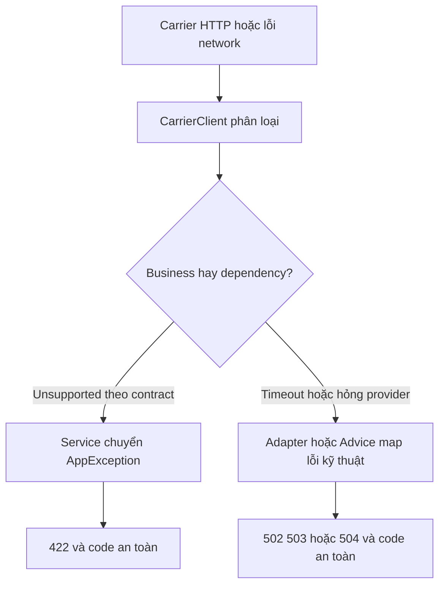

# Lesson 02 · External API chậm/hỏng: đừng trả thành công giả

> Mục tiêu: hiểu deadline, retry có giới hạn và error mapping theo hợp đồng. Đọc code theo từng khối, không học thuộc operator.

## 1. Ba loại giới hạn không giống nhau

| Giới hạn | Bảo vệ điều gì? |
| --- | --- |
| Connect timeout | Không chờ thiết lập kết nối vô hạn; không bao toàn bộ request khi tái dùng connection |
| Per-attempt deadline | Một lần thử từ subscribe tới nhận/decode kết quả không chờ quá lâu |
| Overall deadline | Giới hạn cả các lần thử và backoff trong operation client |

Nếu chỉ có connect timeout300ms, connection đã nối nhưng provider không trả body thì vẫn có thể chờ lâu. Response/read timeout của transport cũng không nên mặc định hiểu là tổng ngân sách gồm retry, queue và decode.

Policy học tập: mỗi attempt tối đa800ms; retry tối đa1 lần; backoff100ms có jitter25%; tổng client operation1800ms. Hai attempts tối đa khoảng 1600 ms + backoff, vẫn phải có timeout ngoài làm chốt. Những con số là ví dụ, cần đo theo SLO thật, không copy cho mọi dịch vụ.

Overall ở đây không bao thời gian trước/sau client call trong MVC. Timer/scheduler không là bảo đảm hard realtime khi CPU bị nghẽn.

## 2. Retry là gửi lại request

GET báo giá theo contract là read-only/idempotent nên có thể thử lại một số lỗi tạm. Retry không sửa được postalCode sai, API key sai hoặc JSON provider sai schema.

| Tình huống | Policy bài này |
| --- | --- |
| Provider 502/503/504 | Retry một lần trong budget |
| Attempt timeout800ms | Retry một lần vì GET an toàn theo contract |
| Provider 404 unsupported | Không retry, business result |
| Provider 401 | Không retry, kiểm credential backend |
| Provider 429 | Không retry ngay; local 503, cân nhắc Retry-After/quota theo policy sau |
| JSON sai/empty/amount âm | Không retry mù quáng, contract failure |
| Transport failure chưa phân loại | Không retry tự động trong snippet bảo thủ này |

Provider 429 khác local rate limit user: nếu shopcore tự rate-limit user có thể trả 429. Mapping503 ở đây là **policy dependency quota** đã cho, không chuẩn bắt buộc mọi API.

POST tạo payment bị timeout có thể đã thành công remote. Retry tùy tiện có thể trừ tiền hai lần. Chỉ retry ghi khi provider có idempotency contract thật, cùng key/payload và khả năng reconcile phù hợp; tự thêm header tên Idempotency-Key không khiến provider tự hỗ trợ.

## 3. Lỗi đi về frontend theo hai tầng



- Client biết status/schema provider, không trả raw body cho frontend.
- Service chuyển business unsupported thành ErrorCode tương ứng; không bắt mọi Exception thành AppException business.
- Technical errors có thể map code/message ở Advice theo style bạn quen.
- Advice ở đây xử lý exception từ lời gọi client trong MVC; lỗi JWT xảy ra trước MVC vẫn thuộc Security handlers.

Mapping cụ thể dùng ở bài:

| Lỗi client | Local HTTP | Lý do |
| --- | --- | --- |
| UNSUPPORTED | 422 | Input đúng format nhưng khu vực không phục vụ theo provider contract |
| TEMPORARY / TRANSPORT / BAD_RESPONSE | 502 | Dependency không cung cấp kết quả hợp lệ |
| RATE_LIMIT | 503 | Dependency quota làm feature tạm không khả dụng |
| TIMEOUT | 504 | Chờ dependency quá ngân sách |

Không nhầm provider 404 với Product không tồn tại local 404; không nhầm provider 401 với Bearer user 401. Error body ví dụ `{"code":"SHIPPING_PROVIDER_TIMEOUT","message":"Không lấy được báo giá đúng thời hạn"}`. Không đưa API key, URL chứa secret, stacktrace hoặc provider body vào message.

## 4. Client đầy đủ policy minh họa

Đoạn dưới dùng CarrierQuote class bài 1, WebClient bean bài 1, Reactor Mono/Retry, java.time.Duration, java.util.concurrent.TimeoutException; imports cần khi thực hành. Đây là adapter minh họa, chưa gắn vào app. Enum/exception được đặt cùng class để bạn có đủ code đọc, không yêu cầu kiến trúc production phải lồng class.

```java
public class CarrierClient {
    public enum Kind { UNSUPPORTED, TEMPORARY, RATE_LIMIT, TIMEOUT, TRANSPORT, BAD_RESPONSE }

    public static class RemoteCallException extends RuntimeException {
        private final Kind kind;
        public RemoteCallException(Kind kind) {
            super("Carrier call failed: " + kind.name());
            this.kind = kind;
        }
        public Kind getKind() { return kind; }
    }

    private final WebClient webClient;
    public CarrierClient(WebClient webClient) { this.webClient = webClient; }

    private static RemoteCallException classify(int status) {
        if (status == 404) return new RemoteCallException(Kind.UNSUPPORTED);
        if (status == 429) return new RemoteCallException(Kind.RATE_LIMIT);
        if (status == 502 || status == 503 || status == 504) {
            return new RemoteCallException(Kind.TEMPORARY);
        }
        return new RemoteCallException(Kind.BAD_RESPONSE);
    }

    private static boolean retryable(Throwable error) {
        return error instanceof RemoteCallException remote
                && (remote.getKind() == Kind.TEMPORARY || remote.getKind() == Kind.TIMEOUT);
    }

    public CarrierQuote getQuote(String postalCode, int weightGrams) {
        return webClient.get()
                .uri(builder -> builder.path("/v1/quotes")
                        .queryParam("postalCode", postalCode)
                        .queryParam("weightGrams", weightGrams)
                        .build())
                .retrieve()
                .onStatus(status -> status.value() != 200, response ->
                        response.releaseBody().thenReturn(classify(response.statusCode().value())))
                .bodyToMono(CarrierQuote.class)
                .switchIfEmpty(Mono.error(new RemoteCallException(Kind.BAD_RESPONSE)))
                .flatMap(quote -> {
                    if (quote.getAmount() == null || quote.getAmount().signum() < 0
                            || !"VND".equals(quote.getCurrency())) {
                        return Mono.error(new RemoteCallException(Kind.BAD_RESPONSE));
                    }
                    return Mono.just(quote);
                })
                .onErrorMap(DecodingException.class, error -> new RemoteCallException(Kind.BAD_RESPONSE))
                .onErrorMap(DataBufferLimitException.class, error -> new RemoteCallException(Kind.BAD_RESPONSE))
                .onErrorMap(WebClientResponseException.class, error -> new RemoteCallException(Kind.BAD_RESPONSE))
                .onErrorMap(WebClientRequestException.class, error -> new RemoteCallException(Kind.TRANSPORT))
                .timeout(Duration.ofMillis(800))
                .onErrorMap(TimeoutException.class, error -> new RemoteCallException(Kind.TIMEOUT))
                .retryWhen(Retry.backoff(1, Duration.ofMillis(100))
                        .jitter(0.25)
                        .filter(CarrierClient::retryable)
                        .onRetryExhaustedThrow((spec, signal) -> signal.failure()))
                .timeout(Duration.ofMillis(1800))
                .onErrorMap(TimeoutException.class, error -> new RemoteCallException(Kind.TIMEOUT))
                .block();
    }
}
```

## 5. Đọc code thành từng khối

1. `onStatus` xử lý mọi status khác200 theo contract demo; release body không giữ raw payload lỗi. Provider trả 204/redirect cũng không bị giả thành báo giá hợp lệ.
2. Decode thành DTO chưa đủ: empty body, amount null/âm hoặc currency lạ đều bị chặn. Đây là validation **response provider**, khác validation input frontend.
3. Mapping lỗi decode/buffer/transport tạo category an toàn. WebClient có thể bọc lỗi đọc body như vượt buffer hoặc media type không hỗ trợ trong WebClientResponseException dù status200; mapper response exception giữ chúng ở BAD_RESPONSE, không lọt ra thành lỗi500 chung. Ví dụ không log raw exception cause; app thật có thể giữ cause cho logging đã scrub, không trả cause ra client.
4. Timeout trước retry áp cho từng attempt. Retry backoff1 nghĩa **một lần thử lại**, tổng tối đa hai lần gọi, không phải tổng một lần.
5. Filter chỉ retry hai nhóm cho phép. Retry hết thì ném lỗi cuối, tránh wrapper RetryExhausted làm Advice mất loại lỗi.
6. Timeout sau retry giới hạn toàn operation. Lỗi overall timeout được map lần cuối; không chạy lại cả operation vô hạn.
7. block giữ boundary đồng bộ ở MVC; không dùng snippet này trong reactive event loop.

Đây chưa phải mọi lỗi runtime có thể có: bug lập trình hoặc cấu hình sai trước call vẫn cần được phân loại/log đúng khi tích hợp, không bắt tất cả Exception rồi giả thành unsupported. Contract phải có Content-Type JSON; test fixture cần cả media type đúng/sai và body vượt giới hạn, không chỉ happy path.

## 6. Fallback và quan sát

Không dùng `onErrorReturn(new CarrierQuote(0, "VND"))` để “app không crash”: frontend hiểu phí0 là báo giá thật. Nếu business chấp nhận cache/stale, phải có contract chỉ rõ source/timestamp/stale, không âm thầm đổi ý nghĩa.

Đo latency, số attempts, status category, timeout và correlation ID; tránh labels chứa user ID/token/postal code hàng triệu giá trị. Không log secret hoặc dữ liệu khách hàng không cần thiết. Đặt budget sao cho một inbound request không nhân tải retry ở nhiều tầng (gateway × service × client).

Để kiểm policy, dùng fixture 503 lần đầu rồi 200 và đếm2 attempts;404 phải chỉ1 attempt; pipeline không có kết quả phải thành timeout. Mock `ExchangeFunction` giả response kiểm được status/codec/retry, **không kiểm DNS/TLS/socket/connector thật**. Muốn kiểm transport dùng mock HTTP server qua connector thật; không cần gọi provider production để tạo mọi lỗi.

## 7. Bài đọc nhỏ

Provider trả 503 lần 1 và 200 lần 2 → thành công sau backoff, không local 503 ngay. Provider 404 → không retry, Service map 422. Provider 401 → BAD_RESPONSE 502, kiểm key backend. Timeout vẫn không chứng minh provider chưa nhận request; may mắn GET này chỉ đọc.

## Tài liệu / video

- [Spring retrieve/onStatus](https://docs.spring.io/spring-framework/reference/web/webflux-webclient/client-retrieve.html).
- [Reactor RetryBackoffSpec](https://projectreactor.io/docs/core/release/api/reactor/util/retry/RetryBackoffSpec.html): filter, jitter, exhausted behavior.
- [WebClient configuration/timeouts](https://docs.spring.io/spring-framework/reference/web/webflux-webclient/client-builder.html).
- [WebClient testing](https://docs.spring.io/spring-framework/reference/web/webflux-webclient/client-testing.html): mock HTTP server giúp kiểm network behavior.
- Video tìm: `WebClient timeout retryWhen backoff onStatus idempotency`. Chưa verify video cụ thể; luôn hỏi retry áp trước hay sau deadline.

[Đề lesson 2](../../../Exams/de-kiem-tra/M3-5-openapi-client__2026-10-07__lesson2-lan1.md).
