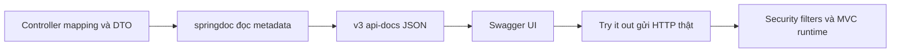

# Lesson 03 · OpenAPI là hợp đồng, Swagger UI là màn hình xem hợp đồng

> Mục tiêu: mô tả đúng endpoint, input, DTO, lỗi và status. Không nghĩ thêm annotation là runtime tự làm đúng.

## 1. Ba tên hay bị gọi chung

| Tên | Vai trò |
| --- | --- |
| OpenAPI | Specification mô tả HTTP API dưới dạng dữ liệu có cấu trúc |
| springdoc-openapi | Thư viện đọc Spring mappings/types/annotations để sinh OpenAPI |
| Swagger UI | Giao diện đọc spec và cho thử request |

OpenAPI không phải Controller và không thực thi nghiệp vụ. Swagger UI không tự tạo database, không tự cấp JWT, không sửa timeout client. Annotation-first nghĩa lấy code đang có làm nguồn mô tả và bổ sung annotations, không dựng pipeline codegen contract-first ở module này.

## 2. Thêm đúng dependency khi thực hành

Shopcore hiện Boot4.1.1/Java21, MVC. Chọn `org.springdoc:springdoc-openapi-starter-webmvc-ui`, nhánh3.x cho Boot4. Theo trang chính thức kiểm ngày2026-10-07, stable đang hiển thị3.1.1. Không copy springdoc1.x/2.x hoặc Springfox từ tutorial Boot2/3.

```xml
<dependency>
    <groupId>org.springdoc</groupId>
    <artifactId>springdoc-openapi-starter-webmvc-ui</artifactId>
    <version>3.1.1</version>
</dependency>
```

Springdoc không được mặc định coi là dependency đã do Boot BOM chọn version; kiểm compatibility matrix và integration thật. Trang matrix hiện ghi rõ Boot4 tương ứng springdoc3.x, bảng chi tiết có Boot4.0.x/3.0.x; không vì vậy claim bản4.1.1 hiện tại đã được ta boot-test với3.1.1. Đây là lựa chọn để thử, chưa sửa POM hoặc chạy app.

Default endpoints khi app có cấu hình phù hợp:

```text
/v3/api-docs          OpenAPI JSON
/v3/api-docs.yaml     OpenAPI YAML
/swagger-ui.html     entry point UI, có thể redirect sang /swagger-ui/index.html
```

Nếu có context path/custom springdoc path, URL đổi theo config. UI200 nhưng JSON 401/redirectHTML thì UI vẫn không load spec được.

## 3. Luồng sinh và sử dụng tài liệu



Giải thích:

1. @GetMapping/@RequestParam cho biết route/input, type DTO cho biết shape cơ bản.
2. Annotations như @Operation/@Schema bổ sung ý nghĩa, ví dụ và responses.
3. Spec được xuất ra JSON; không đảm bảo mọi business error được suy ra tự động.
4. UI chỉ đọc spec, không thay backend.
5. Try it out vẫn gửi request thật qua Security, validation và Service. DELETE vẫn xóa thật, không là sandbox.

## 4. DTO public là phần hợp đồng

Ví dụ dưới dùng Lombok như style bạn quen; cần annotation processing. Schema annotate đúng field thật, không tạo field ảo bằng lời mô tả:

```java
@Getter
@Setter
@NoArgsConstructor
public class ShippingQuoteResponse {
    @Schema(description = "Phí vận chuyển, đơn vị theo currency", example = "25000",
            minimum = "0", requiredMode = Schema.RequiredMode.REQUIRED)
    private BigDecimal fee;

    @Schema(description = "Mã tiền tệ", example = "VND",
            allowableValues = {"VND"}, requiredMode = Schema.RequiredMode.REQUIRED)
    private String currency;

    @Schema(description = "Tên provider logic, không phải credential", example = "demo-carrier",
            requiredMode = Schema.RequiredMode.REQUIRED)
    private String provider;
}
```

`@Schema(minimum="0")` mô tả, **không tự cấm runtime trả fee âm**. `requiredMode` nói field phải xuất hiện trong schema contract; không thay @NotNull hoặc logic validate. Cần Service/mapper thật bảo đảm DTO đúng, test response để phát hiện drift.

Entity không phải API schema mặc định. Không xuất passwordHash, refresh token, API key chỉ vì IDE sinh getters. @Schema(hidden=true) chỉ ẩn tài liệu, **không bảo đảm Jackson ngừng serialize field**; không đưa secret vào response DTO ngay từ đầu.

## 5. Endpoint có annotations theo contract

Snippet minh họa method trong ShippingController, có ShippingService field `shippingService`. Jakarta Validation cần provider/starter khi thực hành; constraints trực tiếp trên parameter dùng method validation MVC hiện đại. Không thêm @Validated class tùy tiện nếu đang muốn dùng MVC builtin validation; đối chiếu phiên bản module M1-4.

```java
@Operation(operationId = "getShippingQuote", summary = "Lấy báo giá vận chuyển")
@ApiResponses({
    @io.swagger.v3.oas.annotations.responses.ApiResponse(responseCode = "200", description = "Báo giá hợp lệ",
        content = @Content(mediaType = "application/json", schema = @Schema(implementation = ShippingQuoteResponse.class))),
    @io.swagger.v3.oas.annotations.responses.ApiResponse(responseCode = "400", description = "Input sai"),
    @io.swagger.v3.oas.annotations.responses.ApiResponse(responseCode = "401", description = "Thiếu hoặc sai Bearer token"),
    @io.swagger.v3.oas.annotations.responses.ApiResponse(responseCode = "403", description = "Thiếu quyền"),
    @io.swagger.v3.oas.annotations.responses.ApiResponse(responseCode = "422", description = "Khu vực chưa hỗ trợ"),
    @io.swagger.v3.oas.annotations.responses.ApiResponse(responseCode = "502", description = "Provider trả kết quả không hợp lệ"),
    @io.swagger.v3.oas.annotations.responses.ApiResponse(responseCode = "503", description = "Provider quota tạm không khả dụng"),
    @io.swagger.v3.oas.annotations.responses.ApiResponse(responseCode = "504", description = "Provider quá hạn")
})
@GetMapping("/api/shipping/quote")
public ResponseEntity<ShippingQuoteResponse> quote(
        @Parameter(description = "Mã bưu chính 6 chữ số", example = "700000")
        @RequestParam("postalCode") @Pattern(regexp = "[0-9]{6}") String postalCode,
        @Parameter(description = "Khối lượng theo gram, từ 1 tới 30000", example = "500")
        @RequestParam("weightGrams") @Min(1) @Max(30000) int weightGrams) {
    return ResponseEntity.ok(shippingService.quote(postalCode, weightGrams));
}
```

Giải thích: @Operation đặt tên/summary; @Parameter mô tả input; @ApiResponses mô tả các kết quả; @GetMapping và method thực sự xử lý HTTP. M3-5 không bắt bạn thuộc full syntax annotations.

Các responses lỗi ở snippet chỉ có description, **chưa mô tả đầy đủ body schema**. Khi app thực hành đã có ApiError/ErrorResponse, bổ sung @Content/@Schema cho từng status theo body thật; không copy schema 200 cho lỗi. Lỗi401/403 của filters có thể khác body Advice nếu chưa chuẩn hóa handlers.

Dùng full-qualified annotation ApiResponse để tránh trùng tên class wrapper `com.shopcore.common.ApiResponse<T>`. Java không có import alias như một số ngôn ngữ khác.

## 6. Wrapper, generic và pagination

Nếu runtime trả `ApiResponse<PageResponse<ProductResponse>>`, spec phải thể hiện data/content và metadata thật, không chỉ array Product. Type concrete trên Controller thường giúp springdoc suy ra generics; nếu raw ResponseEntity/Object làm schema mơ hồ, cải thiện signature hoặc dùng DTO concrete/annotation thích hợp rồi kiểm JSON xuất ra.

Không tạo DTO trùng chỉ để trang trí khi generic đã được suy ra đúng. Cũng không claim `@Schema(implementation = ApiResponse.class)` raw đủ mô tả nested generic trong mọi trường hợp. Kiểm spec là bằng chứng cuối của tài liệu, không chỉ nhìn annotation.

Ví dụ contract phân trang cần nói page0-based, size tối đa100, sort allowlist nếu có. @Parameter example chỉ là ví dụ, không tự set defaultValue/range runtime.

## 7. Những gì docs không tự làm

- Ghi response201 không đổi Controller200 thành 201.
- Ghi minimum1 không thay validation.
- Ghi bearerAuth không bật SecurityFilterChain (bài 4).
- Ghi timeout 504 không tạo client timeout.
- Ẩn endpoint/field trong docs không chặn HTTP/serialize nó.

Tài liệu phải phản ánh runtime; không dùng docs để “hợp thức hóa” code đang sai.

## Tài liệu / video

- [springdoc official](https://springdoc.org/): dependencies, endpoints, compatibility matrix và FAQ schema/security.
- [OpenAPI3.1.1 specification](https://spec.openapis.org/oas/v3.1.1.html): paths, parameters, responses, components.
- [Spring MVC validation](https://docs.spring.io/spring-framework/reference/web/webmvc/mvc-controller/ann-validation.html): phân biệt validation runtime với metadata docs.
- Video tìm: `springdoc OpenAPI Spring Boot 4 schema ApiResponse Swagger UI`. Kiểm version trước; chưa xác minh video cụ thể.

[Đề lesson 3](../../../Exams/de-kiem-tra/M3-5-openapi-client__2026-10-07__lesson3-lan1.md).
