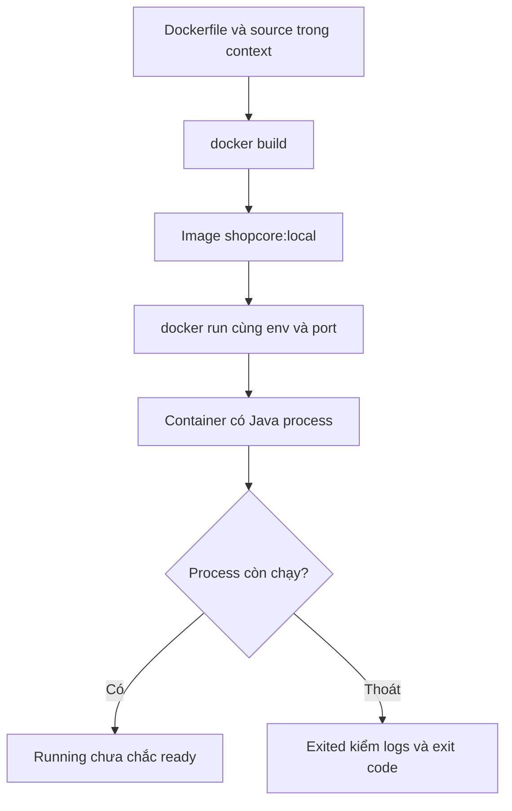

# Lesson 01 · Docker đóng gói gì, chạy gì?

> Mục tiêu: phân biệt bản đóng gói và process đang chạy; hiểu vòng đời, port, filesystem. Không cần thuộc kiến trúc kernel chi tiết.

## 1. Từ Java bạn đang dùng tới Docker

Không Docker:

```text
source → Maven build → executable JAR → JRE/JDK trên máy → Java process
```

Có Docker:

```text
source + Dockerfile + build context → image
image + runtime config → container → Java process
```

Image là nội dung/layers và cấu hình để tạo container. Container là instance có process, network và writable layer riêng; không phải mỗi image chỉ được chạy một lần. Hai container cùng image có thể khác env/ports/data.

Docker không sửa lỗi Java, không tự tạo CRUD, không tự thêm JDBC driver. Một image tốt vẫn có thể crash vì config thiếu hoặc app lỗi.

## 2. Container khác VM

Linux container cô lập process/resources nhưng chia sẻ kernel Linux của môi trường Docker chạy. VM thường có guest kernel riêng. Docker Desktop trên Mac/Windows chạy Linux containers trong VM quản lý bởi Desktop; không claim image Linux chạy trực tiếp trên kernel macOS.

`Docker CLI → Docker Engine → container runtime → process` là mô hình vừa đủ. Không cần học namespaces/cgroups sâu ở bài này; cũng không coi container là boundary an toàn tuyệt đối hoặc mount Docker socket tùy tiện.

## 3. Luồng build và run



Ý nghĩa: build không chạy app lâu dài; run tạo container từ image; process chính thoát thì container thường dừng. `-d` chỉ chạy background, không bảo đảm thành công. JVM nhận tín hiệu dừng qua process chính; lesson 2 dùng exec-form ENTRYPOINT để tránh shell wrapper không chuyển tín hiệu đúng.

## 4. Bộ lệnh tối thiểu, đọc theo trạng thái

Ví dụ **chỉ chạy khi đã build image và cấu hình đủ**, không thực thi capstone trong bài:

```bash
docker image ls
docker build -t shopcore:local .
docker run -d --name shopcore-dev -p 127.0.0.1:8081:8080 shopcore:local
docker ps
docker ps -a
docker logs --tail 100 shopcore-dev
docker stop shopcore-dev
docker start shopcore-dev
```

Chạy build tại thư mục chứa Dockerfile theo bài 2, không root cả folder học. docker ps chỉ container running; ps -a có exited. stop giữ container và writable layer; start lại container cũ, không build source mới.

Để xóa **container dev đã dừng, không có dữ liệu cần giữ**:

```bash
docker rm shopcore-dev
```

rm container khác rmi image. Không dùng system prune/volume prune để “sửa mọi lỗi”; có thể xóa tài nguyên của project khác. Không chạy rm/up/down ở tên project không kiểm rõ.

## 5. Port có hai phía

```text
Browser máy bạn → localhost:8081 → Docker publish → container:8080 → app
```

`-p 127.0.0.1:8081:8080`: bind host loopback 8081 tới container 8080. Nếu app thực sự nghe 9090, mapping 8080 không tự đổi app sang 8080. App trong container thường cần listen 0.0.0.0, không chỉ 127.0.0.1, để nhận qua container interface.

`EXPOSE 8080` trong Dockerfile chỉ metadata về port dự kiến, không publish ra host. Không publish DB/Redis ra toàn mạng để tiện nếu chỉ app cần gọi chúng.

Nếu host 8081 đã bận, đổi **host side**8082; không bắt đổi Java server.port nếu container side vẫn 8080. Không dùng “0.0.0.0 trong browser”; đó là bind address, URL truy cập local thường localhost.

## 6. localhost thuộc về ai?

| Code/lệnh chạy ở đâu? | localhost là gì? |
|---|---|
| Browser/curl trên máy Mac | Máy host bạn |
| Trong app container | App container đó |
| Trong DB container | DB container đó |

App và DB trong hai container: JDBC `localhost:5432` thường sai, vì app tìm DB trong chính nó. Compose dùng DNS service name như `db:5432`, học bài 3. Docker Desktop có host.docker.internal để gọi dịch vụ trên host khi thật sự cần; không lấy đó thay service name cho DB trong cùng Compose.

## 7. Image immutable, container data có thể mất

Image không thay khi bạn sửa file trong writable layer container. Xóa/recreate container mất writable layer đó; tạo container mới từ image cũ không có sửa đổi thủ công trong container cũ.

DB/data cần named volume/bind mount theo policy. Volume bền hơn vòng đời container nhưng không tự là backup. Docker commit container không phải workflow chuẩn để lưu dữ liệu DB hoặc build source; giữ Dockerfile/source và backup dữ liệu đúng cách.

## 8. Image tag và máy M-series

Tag là tên tham chiếu, có thể trỏ sang image mới; latest không có nghĩa an toàn/cố định. Digest nhận diện nội dung cụ thể; dùng tag nhánh rõ khi học, release thật pin/review digest và cập nhật bảo mật.

CPU image phải tương thích engine: arm64 và amd64 khác. Image multi-platform hỗ trợ nhiều kiến trúc; ép linux/amd64 trên Mac ARM có thể chạy qua emulation chậm hoặc lỗi. Không chữa exec format error bằng thêm RAM một cách mù quáng.

## Tài liệu / video

- [Docker: container là gì](https://docs.docker.com/get-started/docker-concepts/the-basics/what-is-a-container/).
- [Dockerfile reference](https://docs.docker.com/reference/dockerfile/): EXPOSE, ENTRYPOINT, USER.
- [Compose networking](https://docs.docker.com/compose/how-tos/networking/): host vs container port.
- Video tìm: `Docker image vs container Java port mapping localhost explained`. Chưa verify video cụ thể; ưu tiên video cho thấy logs/ps thay vì chỉ run thành công.

[Đề lesson 1](../../../Exams/de-kiem-tra/M4-1-docker__2026-10-07__lesson1-lan1.md).
