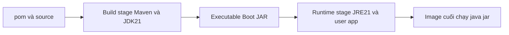

# Lesson 02 · Từ source Java tới image chạy được

> Mục tiêu: đọc từng dòng Dockerfile, biết dòng nào build-time/runtime và vì sao thứ tự COPY ảnh hưởng cache.

## 1. Build context là ranh giới file

Giả sử sau này đặt Dockerfile trong shopcore và chạy tại đó:

```bash
docker build -t shopcore:local .
```

Dấu chấm là context, không phải tên image. COPY chỉ đọc file trong context đã qua .dockerignore, không tùy ý lấy file ngoài context bằng ../. Dockerfile nằm chỗ khác qua -f không tự đổi context.

Không build từ root folder học chứa Exams/Notes/secrets khi chỉ cần source shopcore. Context lớn làm build chậm và tăng nguy cơ gửi file không cần cho builder.

## 2. Multi-stage: builder giữ công cụ, runtime giữ artifact



Giải thích: build stage compile/package; chỉ JAR được copy qua runtime stage; Maven/source/cache dependency không tự nằm trong final image. Đây là multi-stage theo runtime packaging, chưa tách các lớp nội bộ Boot JAR bằng layertools.

## 3. Dockerfile đầy đủ để đọc

Giả định POM hiện có artifact shopcore/version 0.0.1-SNAPSHOT, Spring Boot Maven plugin tạo executable JAR, không module con. File chỉ là mẫu trong Markdown, chưa tạo Dockerfile capstone:

```dockerfile
# syntax=docker/dockerfile:1
FROM maven:3.9-eclipse-temurin-21 AS build
WORKDIR /build

COPY pom.xml .
RUN --mount=type=cache,target=/root/.m2 mvn -B dependency:go-offline

COPY src ./src
RUN --mount=type=cache,target=/root/.m2 mvn -B -DskipTests package \
    && cp target/shopcore-0.0.1-SNAPSHOT.jar /build/app.jar

FROM eclipse-temurin:21-jre-jammy AS runtime
WORKDIR /app
RUN groupadd --system app && useradd --system --gid app --home-dir /app app
COPY --from=build --chown=app:app /build/app.jar /app/app.jar
USER app
EXPOSE 8080
ENTRYPOINT ["java", "-jar", "/app/app.jar"]
```

## 4. Giải nghĩa từng dòng/khối

- `FROM ... AS build`: chọn Maven/JDK 21, đặt tên stage. Docker không dùng JDK IntelliJ của host để compile trong stage này.
- `WORKDIR /build`: nơi lệnh RUN/COPY relative làm việc; không phải thư mục project trên host.
- `COPY pom.xml .`: đưa metadata dependency vào trước source để cache ổn định.
- `dependency:go-offline`: tải trước nhiều dependencies/plugins. Không hứa mọi profile/plugin đều build offline hoàn toàn; package có thể vẫn cần mạng.
- `--mount=type=cache,target=/root/.m2`: cache Maven giữa build steps/builds với BuildKit. Cache này không phải volume dữ liệu PostgreSQL và không copy vào final stage.
- `COPY src ./src`: source thay đổi thường hơn POM. Sửa Java sẽ invalid lớp này và package, không nhất thiết invalid bước dependency phía trước.
- `-DskipTests`: policy ví dụ build packaging nhanh, **không chứng minh test pass**. CI M4-2 cần test gate; có thể bỏ flag khi build đã có fixture/config test phù hợp.
- `cp ...jar /build/app.jar`: chọn đúng executable JAR; version đổi phải cập nhật hoặc cấu hình tên artifact ổn định. Không `COPY target/*.jar` mù khi có nhiều JAR/original artifact.
- `FROM ...jre...`: stage runtime mới, giữ Java runtime cùng major 21. Chọn image theo kiến trúc/tag hiện có; không claim pinned digest ở đây.
- `USER app` và chown: Java không chạy root, artifact đọc được. Volume/secret mount vẫn phải có permissions cho user runtime.
- `EXPOSE`: metadata, chưa publish port.
- Exec-form `ENTRYPOINT`: Java process nhận stop signal trực tiếp hơn shell-form; không dùng `java &` rồi shell thoát.

Temurin jammy có groupadd/useradd theo nền Ubuntu; không copy lệnh này sang Alpine mà không đổi công cụ. Runtime image không cần compiler Maven chỉ để chạy JAR.

## 5. Cache bằng ví dụ

| Thay đổi | Cache dự kiến |
|---|---|
| Sửa ProductService.java | POM/dependency layer có thể reuse; source/package chạy lại |
| Đổi dependency trong pom.xml | COPY POM và dependency/package bị invalid |
| Sửa file target/ ngoài context ignore | Không tự ảnh hưởng source build trong container |
| Đổi base image digest/flags | Có thể invalidate các bước phụ thuộc |

Docker so instruction/input cache, không “biết business code có quan trọng không”. Cache mount giúp Maven tái dùng artifact dù layer cần chạy lại; cache không là bảo đảm reproducible build khi dependencies/snapshot/base tag mutable.

## 6. .dockerignore khác .gitignore

```text
.git
.idea
.DS_Store
target
.env
.env.*
secrets
*.log
```

.dockerignore giảm file gửi tới builder; .gitignore ngăn Git track file mới phù hợp. Cần cả hai cho secrets. File đã commit không được xóa khỏi history chỉ bằng thêm ignore.

Không `COPY . .` rồi RUN rm secret để “image cuối an toàn”: secret có thể đã vào layer/cache/context. Không đặt credential bằng ENV/ARG trong Dockerfile. Runtime secrets ở bài 4; build secrets khi tải private dependency cần cơ chế BuildKit secret mount, ngoài thực hành chính của bài này.

## 7. Build mới khác chạy lại container cũ

Sửa source→build image mới→recreate container để dùng image mới. `docker start` container cũ không tự nhận image rebuilt; tag cùng tên không thay process đang chạy. Compose `up --build` có thể build/recreate theo config/image; bài 3–4 giải thích.

Nếu mount host target lên /app trong dev, có thể che artifact image; đừng debug JAR “biến mất” bằng build vô hạn mà không xem mounts.

## 8. Những lỗi đọc được

- UnsupportedClassVersionError: JAR compile Java 21 nhưng runtime 17 không đọc class version đó; kiểm compiler target/runtime image.
- no main manifest attribute: có thể đang chạy plain JAR thay executable Boot JAR; kiểm packaging/plugin/artifact.
- COPY not found: kiểm context/.dockerignore/path, không phải lỗi Java.
- Build success nhưng app exits: logs/config/dependency ở runtime, không suy ra Dockerfile build sai mọi trường hợp.
- exec format error: kiểm image CPU platform hoặc executable/shebang, không chỉ Java version.

## Tài liệu / video

- [Docker multi-stage](https://docs.docker.com/build/building/multi-stage/).
- [Build cache optimization](https://docs.docker.com/build/cache/optimize/) và [build context](https://docs.docker.com/build/concepts/context/).
- [Dockerfile reference](https://docs.docker.com/reference/dockerfile/): RUN, COPY, USER, ENTRYPOINT.
- [Spring Boot container images](https://docs.spring.io/spring-boot/reference/packaging/container-images/index.html): nhận diện hướng đóng gói, chưa yêu cầu buildpacks/layertools.
- Video tìm: `Spring Boot Docker multi stage Maven JRE build cache dockerignore`. Chưa verify video cụ thể; xem kỹ secrets và test flags.

[Đề lesson 2](../../../Exams/de-kiem-tra/M4-1-docker__2026-10-07__lesson2-lan1.md).
