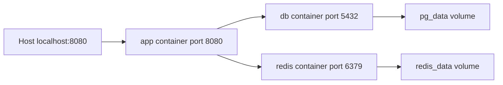

# Lesson 03 · Một app, nhiều container: ai gọi ai, dữ liệu nằm đâu?

> Mục tiêu: đọc topology app/db/redis, dùng đúng service DNS và hiểu volume trước khi chạy lệnh xóa.

## 1. Compose giải quyết việc gì?

Thay vì gõ nhiều docker run rồi tự nối network/mount/env, Compose khai báo desired setup bằng YAML. Service là định nghĩa vai trò; container là instance được tạo. Dockerfile build image app, Compose ghép services chạy cùng nhau; không thay nhau.

CLI hiện dùng `docker compose` V2. Không cần top-level `version: "3.8"` chỉ để học theo video cũ; Compose Specification hiện đại mô tả các fields.

## 2. Topology của shopcore



Giải thích:

1. Host cần port publish để gọi app.
2. App dùng service names db và redis trên shared network, không dùng host published port.
3. DB/Redis không cần host ports nếu chỉ app truy cập. Docker exec có thể dùng CLI bên trong service để debug local.
4. Data volumes gắn vào đúng directory, không nằm trong image app.
5. Topology có Redis chưa chứng minh Service đã cache dữ liệu; Redis business học M5-1.

## 3. Compose skeleton, chưa đủ health/secrets

Đặt tại shopcore khi thực hành, cạnh Dockerfile bài 2. File dưới dùng env password như bước học để nhìn interpolation; bài 4 **thay bằng secret file và readiness**. Không paste skeleton rồi nghĩ đã đủ production:

```yaml
services:
  app:
    build:
      context: .
    image: shopcore:local
    ports:
      - "127.0.0.1:${APP_PORT:-8080}:8080"
    environment:
      SPRING_DATASOURCE_URL: jdbc:postgresql://db:5432/shopcore
      SPRING_DATASOURCE_USERNAME: shopcore
      SPRING_DATASOURCE_PASSWORD: ${DB_PASSWORD:?Set DB_PASSWORD for local study}
      SPRING_DATA_REDIS_HOST: redis
      SPRING_DATA_REDIS_PORT: "6379"
    depends_on:
      - db
      - redis
    networks: [backend, egress]
  db:
    image: postgres:16-alpine
    environment:
      POSTGRES_DB: shopcore
      POSTGRES_USER: shopcore
      POSTGRES_PASSWORD: ${DB_PASSWORD:?Set DB_PASSWORD for local study}
    volumes:
      - pg_data:/var/lib/postgresql/data
    networks: [backend]
  redis:
    image: redis:7.4-alpine
    command: ["redis-server", "--appendonly", "yes"]
    volumes:
      - redis_data:/data
    networks: [backend]
volumes:
  pg_data:
  redis_data:
networks:
  backend:
    internal: true
  egress:
```

Đây là cấu hình học local: Redis chưa ACL/password, không publish port, chỉ backend. PostgreSQL POSTGRES_USER do entrypoint tạo là superuser của cluster demo; app production cần user quyền tối thiểu riêng. Không lấy topology này làm checklist security production hoàn chỉnh.

## 4. Đọc YAML theo trách nhiệm

- `services`: ba roles chạy ba process/container, không ba Java packages.
- `build.context`: source để build app; `image`: tên/tag kết quả hoặc image cần dùng.
- `ports`: host→container; DB/Redis không publish nhưng app vẫn gọi qua network.
- `environment`: biến đi vào process container; Spring tự bind các property chuẩn nếu dependency tương ứng tồn tại.
- `depends_on` dạng list: order start, chưa chờ DB sẵn sàng, bài 4 sửa.
- `volumes` service-level: gắn data path; top-level: khai báo named volumes.
- `networks`: app cùng backend với dependencies; thêm egress để app gọi external API M3-5. App chỉ backend internal có thể không ra ngoài được.

Không thêm fixed container_name/IP vì thường không cần, dễ conflict/khó scale. Service name ổn định hơn IP container, IP có thể đổi sau recreate.

## 5. Env ba nơi, không phải một

`.env`/shell của host có thể dùng để Compose interpolate `${APP_PORT:-8080}` hoặc `${DB_PASSWORD:?...}`. Không có nghĩa mọi biến trong .env tự vào container; phải khai báo environment/env_file hoặc cơ chế khác.

Spring `${NAME:default}` khác Compose `${NAME:-default}`; đừng copy cú pháp default giữa hai tầng. `${NAME:?message}` giúp fail sớm khi thiếu/rỗng. Shell env có thể ảnh hưởng interpolation hơn file .env; dùng `docker compose config` kiểm kết quả nhưng đừng chia sẻ output chứa secret.

Env không encrypted vault: docker inspect/logging/debug có thể lộ cho người có quyền. Bài4 chuyển password sang file secret. .env thật và secrets phải ignore Git/build context.

## 6. Volume và lệnh quản lý

```bash
docker compose up --build -d
docker compose ps
docker compose logs --tail 100 app
docker compose stop
docker compose start
docker compose down
```

stop/start giữ containers; down gỡ containers/networks do project quản lý nhưng mặc định giữ named volumes. Sau up lại, PostgreSQL data trên volume còn nếu đúng project/volume/path.

**Lệnh nguy hiểm, không chạy trên dữ liệu cần giữ:** `docker compose down -v` có thể xóa named volumes do project quản lý và anonymous volumes; mất DB nếu chưa backup. External volumes có lifecycle khác, không bị Compose xóa theo cùng cách. Không dùng -v để chữa password sai trước khi hiểu hậu quả.

Named volume khác bind mount: named do Docker quản lý; bind trỏ path host như ./data:/... để thấy file trực tiếp nhưng permissions/platform phải quản lý. Mount vào directory có dữ liệu image sẽ che nội dung directory đó, không “merge tự do” theo mong muốn.

## 7. Cùng tên logic chưa chắc cùng dữ liệu

Compose project name thường dựa directory, có thể đặt qua -p/COMPOSE_PROJECT_NAME. Volume pg_data thường thành `<project>_pg_data`. Đổi project name rồi thấy DB rỗng có thể là đang dùng volume mới, chưa chắc dữ liệu cũ đã bị xóa.

Named volume không backup. Cần backup/restore kiểm chứng như PostgreSQL module; không tar directory DB đang ghi rồi mặc định coi backup nhất quán. Nâng major PostgreSQL cần quy trình migrate, không đổi tag 16→18 rồi dùng nguyên volume và mong tự nâng.

Volume path mẫu là cho PostgreSQL 16. Image 18+ có thay đổi layout mặc định; phải đọc đúng image major khi nâng, không copy path cũ tùy tiện.

Redis appendonly + volume giữ file persistence qua recreate nếu cấu hình đúng; durability phụ thuộc fsync/policy, không đồng nghĩa mọi cache write tồn tại sau crash. Cache vẫn không là nguồn dữ liệu gốc của Product.

## 8. Điều kiện để app thật dùng DB/Redis

POM hiện chưa JPA/JDBC driver/Redis. Các env chuẩn không tự thêm libraries hoặc repository code. Cần dependencies/config/entities/migrations/client logic khi thực hành; module Docker không triển khai thay các phần đó. Container app running với MVC đơn thuần chưa chứng minh query DB/PING Redis từ app.

## Tài liệu / video

- [Compose networking](https://docs.docker.com/compose/how-tos/networking/): DNS, ports, internal network.
- [Docker volumes](https://docs.docker.com/engine/storage/volumes/) và [Compose CLI](https://docs.docker.com/reference/cli/docker/compose/).
- [Compose interpolation](https://docs.docker.com/compose/how-tos/environment-variables/variable-interpolation/).
- [PostgreSQL official image](https://hub.docker.com/_/postgres), [Redis official image](https://hub.docker.com/_/redis): data directories và security warning.
- Video tìm: `Docker Compose Spring Boot PostgreSQL Redis localhost volumes networks`. Chưa verify video cụ thể; cảnh giác down -v vô điều kiện.

[Đề lesson 3](../../../Exams/de-kiem-tra/M4-1-docker__2026-10-07__lesson3-lan1.md).
