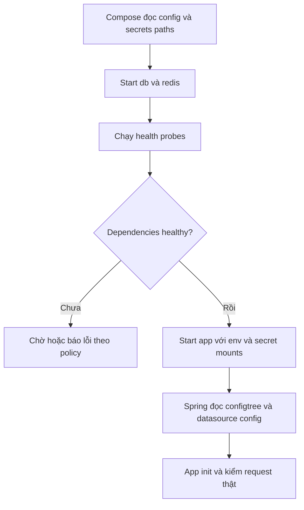

# Lesson 04 · Chạy đúng thứ tự chưa đủ: health, secrets và debug

> Mục tiêu: đọc cấu hình gần thực tế, biết nó bảo đảm gì/không bảo đảm gì; sửa lỗi dựa trên bằng chứng thay vì xóa volume hoặc mở hết ports.

## 1. Running, healthy, ready khác nhau

Running: process còn tồn tại. Healthy: lệnh probe gần đây pass theo cấu hình. Ready: ứng dụng sẵn sàng nhận loại request mong muốn; cần định nghĩa và probe phù hợp.

DB process running chưa chắc đã nhận kết nối. DB pg_isready pass cũng chưa chứng minh password app đúng, schema/migration xong hoặc nghiệp vụ chạy. Redis PING pass không chứng minh ProductService đã dùng cache.

`depends_on` dạng list chỉ order startup; `condition: service_healthy` chờ health của dependency khi start. Không giám sát liên tục để mọi lúc DB chết thì tự dừng/restart app. Docker healthcheck báo trạng thái, **không tự restart chỉ vì unhealthy**; restart policy thường tác động khi process exit theo policy.

## 2. Luồng khởi động



Đọc sơ đồ: secret mount phải có trước app; DB init chỉ tạo cluster khi volume trống; probes kiểm readiness giới hạn; Spring vẫn có thể fail do config/code. Nếu DB mất sau startup, app cần timeout/reconnect/resilience, không dựa vào depends_on để xử lý mọi runtime failure.

## 3. Compose đầy đủ mẫu học

**Thay skeleton bài 3 bằng cấu hình này khi thực hành**, không ghép hai services app cùng tên tùy ý. Vị trí dự kiến: shopcore/compose.yaml, Dockerfile và secrets/db_password.txt. Secret file local chỉ chứa password do bạn quản lý, không commit; trong bài không có password thật.

```yaml
services:
  app:
    build:
      context: .
    image: shopcore:local
    ports:
      - "127.0.0.1:${APP_PORT:-8080}:8080"
    environment:
      SERVER_PORT: "8080"
      SPRING_DATASOURCE_URL: jdbc:postgresql://db:5432/shopcore
      SPRING_DATASOURCE_USERNAME: shopcore
      SPRING_CONFIG_IMPORT: "configtree:/run/secrets/"
      SPRING_DATA_REDIS_HOST: redis
      SPRING_DATA_REDIS_PORT: "6379"
    secrets:
      - source: db_password
        target: spring.datasource.password
    depends_on:
      db:
        condition: service_healthy
      redis:
        condition: service_healthy
    networks: [backend, egress]
  db:
    image: postgres:16-alpine
    environment:
      POSTGRES_DB: shopcore
      POSTGRES_USER: shopcore
      POSTGRES_PASSWORD_FILE: /run/secrets/db_password
    secrets:
      - db_password
    volumes:
      - pg_data:/var/lib/postgresql/data
    healthcheck:
      test: ["CMD-SHELL", "pg_isready -h 127.0.0.1 -U \"$$POSTGRES_USER\" -d \"$$POSTGRES_DB\""]
      interval: 5s
      timeout: 3s
      retries: 10
      start_period: 10s
    networks: [backend]
  redis:
    image: redis:7.4-alpine
    command: ["redis-server", "--appendonly", "yes"]
    volumes:
      - redis_data:/data
    healthcheck:
      test: ["CMD", "redis-cli", "ping"]
      interval: 5s
      timeout: 3s
      retries: 10
      start_period: 5s
    networks: [backend]
volumes:
  pg_data:
  redis_data:
networks:
  backend:
    internal: true
  egress:
secrets:
  db_password:
    file: ./secrets/db_password.txt
```

Giới hạn: app chưa healthcheck HTTP vì source chưa endpoint health/Actuator; không giả /actuator/health tồn tại hoặc JRE có curl. Redis không auth/ACL trong local backend private, DB user demo là superuser; production phải giảm quyền và bảo vệ Redis phù hợp. Không publish 5432/6379 ra host. App có egress phục vụ external API; đây không thay firewall/security policy production.

## 4. Secret đi từ file tới property ra sao?

```text
host secrets/db_password.txt
→ Compose cấp db_password cho từng service được grant
→ db: /run/secrets/db_password → POSTGRES_PASSWORD_FILE entrypoint đọc
→ app: /run/secrets/spring.datasource.password
→ Spring configtree:/run/secrets/ đọc tên file làm property key
```

Compose không tự hiểu mọi `_FILE` env. PostgreSQL image hỗ trợ POSTGRES_PASSWORD_FILE; Spring datasource không tự có SPRING_DATASOURCE_PASSWORD_FILE theo cùng quy ước, nên bài dùng configtree đúng chức năng.

Configtree là đọc nội dung file thành property, không giải mã secret store. Secret mount local Compose không đồng nghĩa mã hóa file trên host hay bảo mật chống người có quyền Docker/root. Giữ file quyền truy cập phù hợp, không log/mở docker compose config rồi dán ra chat nếu chứa secret. User runtime app phải đọc được secret mount; long-syntax uid/gid/mode có giới hạn với file bind-backed local Compose, kiểm thực tế thay vì đoán.

Nếu process đang dùng password từ env cũ đồng thời configtree mới, property precedence có thể khiến env thắng; bỏ cấu hình cũ tránh hai nguồn mâu thuẫn. Runtime secret không được COPY vào image, không ARG/ENV secret trong Dockerfile.

## 5. Vì sao healthcheck dùng $$?

`${...}` hoặc `$NAME` có thể bị Compose interpolate ở host. `$$POSTGRES_USER` giữ dấu dollar để shell trong DB container expand POSTGRES_USER khi chạy probe. CMD-SHELL cho phép shell expansion; CMD list không tự có shell.

Probe pg_isready dùng -h 127.0.0.1 để kiểm TCP server, không chỉ temporary Unix socket lúc init. Nhưng pg_isready vẫn không xác minh password của app; muốn kiểm quyền thật dùng kết nối truy vấn đúng credential từ app/client phù hợp, không chỉ nhìn health xanh.

## 6. Đổi secret không tự đổi password DB cũ

POSTGRES_* tạo user/database/password khi init data directory trống. Volume đã chứa cluster: đổi secret/env rồi restart **không tự ALTER ROLE**. App dùng password mới trong khi DB giữ cũ sẽ authentication failed.

Cần rotation có kế hoạch: đổi credential trong DB và app/secret theo quy trình, kiểm kết nối, có rollback/recovery; không tự xóa volume để reset dữ liệu thật. Init scripts ở /docker-entrypoint-initdb.d cũng không chạy lại mỗi restart trên cluster có dữ liệu. Flyway migration là chuyện khác, không lấy init scripts thay migration mọi release.

## 7. Chạy và debug theo thứ tự

Khi app/source/secret đã chuẩn bị đủ, từ thư mục shopcore:

```bash
docker compose config --quiet
docker compose up --build -d
docker compose ps
docker compose logs --tail 100 db
docker compose logs --tail 100 redis
docker compose logs --tail 100 app
docker compose exec db pg_isready -h 127.0.0.1 -U shopcore -d shopcore
docker compose exec redis redis-cli ping
curl -i http://localhost:8080/
```

Root 404 có thể chứng minh server HTTP trả lời nhưng không có route /; không chứng minh CRUD/datasource/cache.401 có thể do Security, không phải Docker port sai. Dùng endpoint thật bạn đã có để kiểm business workflow khi thực hành.

Nếu host 8080 bận, APP_PORT đổi host side; SERVER_PORT trong container vẫn 8080. `docker compose restart app` không tự áp mọi config env/image mới; dùng up/recreate phù hợp. Khi debug không print raw secrets hoặc toàn bộ env ra log công khai.

## 8. Bảng lỗi → bằng chứng → sửa

| Triệu chứng | Kiểm trước | Hướng sửa |
|---|---|---|
| Build COPY not found | Context/.dockerignore/path | Đúng context, không lấy ../ tùy tiện |
| App exited ngay | Logs/exit code/config | Sửa nguyên nhân, không chỉ restart loop |
| Connection refused tới localhost:5432 | JDBC host trong app | Dùng db:5432 trên shared network |
| Password authentication failed | Secret/app config/cluster cũ | Kiểm credential thực, rotation đúng |
| DB healthy nhưng table missing | Migration/schema/DB đúng | Kiểm Flyway, không coi health là schema pass |
| Host curl không tới app | ps/port binding/app listen | Đúng host:container port/listen address |
| External API không gọi được | App network/egress/DNS/TLS | Không để app chỉ internal network nếu cần outbound |
| DB trống sau đổi folder/-p | Project/volume mounts | Tìm volume cũ, không vội kết luận bị xóa |

## 9. Bằng chứng để tự tin

Build artifact đúng; process chạy non-root; port route trả đúng; DB/Redis reachable theo service name; data test còn sau recreate đúng volume; secrets không ở image/Git; failure được chẩn đoán. Chỉ ba container running chưa đủ chứng minh app đã query DB/cached Redis.

Tương lai AI Engineer vẫn dùng các concept này để đóng gói API/worker/model service, quản lý config và kiểm runtime. Không cần nhảy Kubernetes/GPU orchestration trước khi hiểu process/network/data.

## Tài liệu / video

- [Compose startup order](https://docs.docker.com/compose/how-tos/startup-order/): service_healthy và dependency lifecycle.
- [Compose secrets](https://docs.docker.com/compose/how-tos/use-secrets/) và [Spring configtree](https://docs.spring.io/spring-boot/reference/features/external-config.html).
- [PostgreSQL image](https://hub.docker.com/_/postgres): _FILE, first initialization, data layout.
- [Docker networking](https://docs.docker.com/compose/how-tos/networking/) và [Redis image warning](https://hub.docker.com/_/redis).
- Video tìm: `Docker Compose healthcheck depends_on secrets Spring Boot configtree PostgreSQL`. Chưa verify video cụ thể; không bỏ qua volume/password lifecycle.

[Đề lesson 4](../../../Exams/de-kiem-tra/M4-1-docker__2026-10-07__lesson4-lan1.md).
