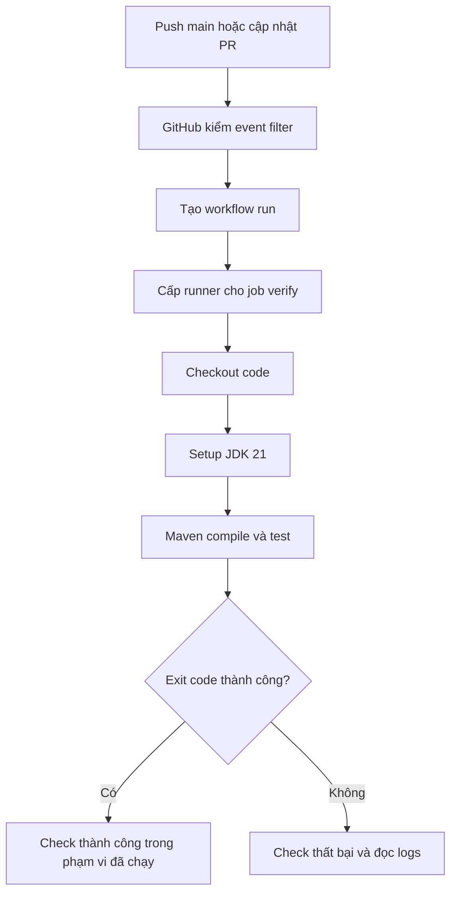

# Lesson 01 · Sau khi push code, ai chạy lệnh giúp bạn?

> Mục tiêu: tự kể được event → workflow run → job → runner → step; đọc YAML mà hiểu từng dòng đang yêu cầu ai làm gì.

## 1. CI giải quyết chuyện rất gần với bạn

Trên máy bạn, code chạy vì IntelliJ có JDK, thư viện đã tải và config local. Người khác clone code chưa chắc chạy được. CI lấy code được commit, dựng môi trường theo khai báo và chạy lệnh kiểm tra thay cho việc chỉ tin “máy tôi chạy được”.

Ví dụ bạn sửa `ProductService`, mở PR. CI phải trả lời: code compile được không, các test hiện có còn pass không? Nếu fail thì chưa nên xuất bản image từ phiên bản đó. CI không tự biết business rule nào chưa có test; bạn vẫn chịu trách nhiệm chọn phép kiểm đúng.

CI là continuous integration. Đưa image lên registry là xuất bản gói chạy, chưa phải đưa app đang chạy lên server. CD/deploy là bước khác, ngoài module này.

## 2. Sáu khái niệm, không phải sáu class Java

| Khái niệm | Hiểu đơn giản | Ví dụ |
|---|---|---|
| Event | Việc xảy ra làm GitHub xem có cần chạy không | PR mở/cập nhật, push main |
| Workflow | Công thức tự động hóa trong repo | `.github/workflows/ci.yml` |
| Workflow run | Một lần thực thi công thức | Run của PR #12 khi cập nhật code |
| Job | Một nhóm steps trên runner được chọn | verify, publish |
| Runner | Máy/môi trường thực thi job | GitHub-hosted Ubuntu |
| Step | Một action hoặc một lệnh | checkout, setup Java, Maven verify |

Đừng nhầm action với toàn workflow. `actions/setup-java` là action được tái sử dụng trong một step, không phải service Spring hoặc server của bạn.



Đọc từng mũi tên: event không chạy Java trực tiếp; GitHub chọn workflow trước. Runner được cấp mới có nơi chạy lệnh. Checkout đưa source lên runner; setup Java chuẩn bị compiler; Maven mới đọc POM và chạy build/test. Kết quả lệnh quay lại thành status check của commit/run.

## 3. File nằm ở đâu?

GitHub đọc workflow trong **`.github/workflows/` tại gốc repository GitHub**. Không đặt file chạy thật trong Notes, `src/main/resources` hoặc `shopcore/.github/workflows` nếu repo gốc là folder học đang chứa shopcore.

Layout dùng xuyên suốt bài:

```text
repository-root/
  .github/workflows/ci.yml
  shopcore/
    pom.xml
    mvnw
    .mvn/wrapper/maven-wrapper.properties
    src/
```

Mẫu dưới chỉ nằm trong Markdown để học, chưa kích hoạt workflow của repo.

## 4. Workflow đầu tiên

```yaml
name: shopcore-ci

on:
  pull_request:
    branches: [main]
  push:
    branches: [main]

permissions:
  contents: read

jobs:
  verify:
    runs-on: ubuntu-latest
    timeout-minutes: 15
    defaults:
      run:
        working-directory: shopcore
    steps:
      - name: Checkout source
        uses: actions/checkout@v6
        with:
          persist-credentials: false
      - name: Setup Java
        uses: actions/setup-java@v6
        with:
          distribution: temurin
          java-version: '21'
      - name: Verify
        run: bash ./mvnw -B -ntp verify -DfailIfNoTests=true
```

Không cần học thuộc. Đọc thành câu:

- `name`: tên workflow trên tab Actions, không tên file hoặc tên Docker image.
- `on`: chạy khi PR **nhắm vào main**, hoặc push **lên main**. PR có source branch `feature/product` vẫn chạy vì base branch là main. Push feature chưa có PR không khớp mẫu.
- `permissions.contents: read`: token chỉ cần đọc source; không xin write-all vì tiện.
- `jobs.verify`: ID job; `runs-on` chọn môi trường runner, không Java version. `ubuntu-latest` có thể đổi image OS theo thời gian; pin OS label cụ thể nếu cần policy ổn định hơn.
- `timeout-minutes`: giới hạn thời gian, tránh job treo vô hạn.
- `defaults.run.working-directory`: lệnh **run** ở `shopcore/`. Không tự đổi path cho mọi action `uses`.
- Checkout tải source theo ref/SHA của event. Mặc định PR thường test merge ref giữa PR và base, không luôn đúng head SHA của branch feature. Cần đọc run metadata nếu truy vết chính xác.
- Setup Java chọn Temurin JDK 21 phù hợp POM, không dùng JDK trên Mac của bạn.
- `bash ./mvnw`: chạy wrapper bằng bash, tránh phụ thuộc executable bit của script; file vẫn phải tồn tại và có line endings hợp lệ. `-B` chạy non-interactive, `-ntp` giảm download noise.
- Exit code khác 0 làm step fail mặc định. Các step thường tiếp theo bị skip; bài 2 sẽ cho report chạy khi fail.

Nếu branch chính tên khác main, đổi filters có chủ đích. Không đổi tên branch của người học trong bài.

## 5. Step cùng job và hai job khác nhau

Các steps thường chạy tuần tự cùng filesystem trong một job. Nhưng `cd` hoặc biến shell tạo ở step trước không tự tồn tại trong shell step sau; dùng working-directory, env hoặc cơ chế outputs phù hợp.

Các jobs độc lập có thể chạy song song, thường trên runner riêng. Job publish muốn đợi verify phải có `needs: verify`. Viết publish ở dưới verify trong YAML không tạo dependency.

`needs` tạo thứ tự/điều kiện, không vận chuyển `target/app.jar` giữa runners. Muốn dùng file từ job khác phải upload/download artifact; hoặc build lại từ source. Bài 3 chọn build lại bằng Dockerfile multi-stage và nói rõ đánh đổi.

## 6. PR không đồng nghĩa code đáng tin

PR có thể sửa cả script build/test. Fork PR thường có token read-only và không được nhận repository secrets; một số run cần approval theo policy. Không đổi sang `pull_request_target` rồi checkout/chạy code fork để lấy secrets: đó là chuyển code không tin cậy vào ngữ cảnh quyền cao.

Mẫu này không dùng self-hosted runner cho PR không tin cậy. Source, actions và scripts đều có thể chạy lệnh; review workflow cũng quan trọng như review Java.

## 7. Tự diễn tập trước khi đọc đáp án

Ba sự kiện: push `feature/a` chưa PR; mở PR feature/a → main; merge PR tạo push main. Với YAML trên, lần lượt: không chạy; chạy verify; chạy verify lại. Hai run PR và main là hai ngữ cảnh/code snapshot có thể khác nhau, không phải GitHub vô tình chạy một lệnh trùng vô nghĩa.

Nếu Maven fail nhưng bạn thêm `continue-on-error: true`, status có thể không còn chặn đúng lỗi. Chưa cần cố làm check xanh; cần hiểu check đang xác nhận điều gì.

## Tài liệu / video

- [GitHub: Workflows](https://docs.github.com/en/actions/concepts/workflows-and-actions/workflows): phân biệt workflow/job/step.
- [Workflow syntax](https://docs.github.com/en/actions/reference/workflows-and-actions/workflow-syntax): vị trí file, on, defaults, needs.
- [Events reference](https://docs.github.com/en/actions/reference/workflows-and-actions/events-that-trigger-workflows): PR base/ref và fork behavior.
- [Checkout action](https://github.com/actions/checkout/tree/v6): ref và credentials. [Setup Java](https://github.com/actions/setup-java/tree/v6): inputs Java.
- Video tìm: `GitHub Actions workflow jobs steps runner pull request Java explained`. Đây là từ khóa, chưa xác minh video cụ thể; ưu tiên video mở logs của một run thất bại.

[Làm đề lesson 1](../../../Exams/de-kiem-tra/M4-2-ci__2026-10-07__lesson1-lan1.md).
