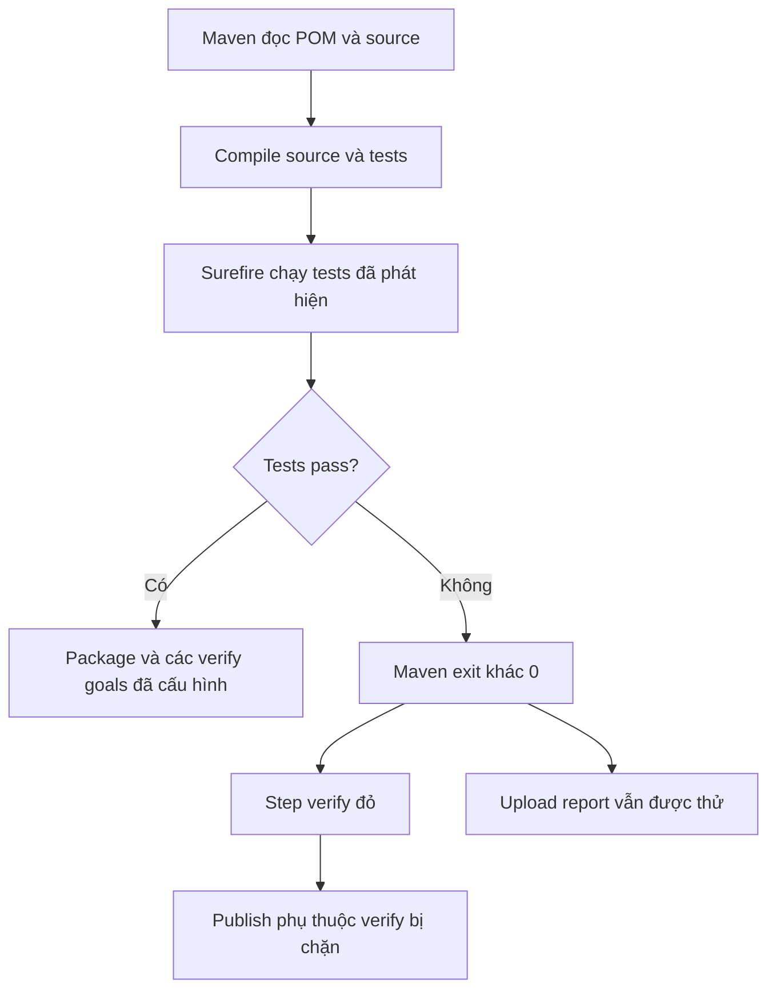

# Lesson 02 · Test phải chạy thật, cache chỉ giúp chạy nhanh

> Mục tiêu: hiểu Maven gate, biết chứng cứ test đã chạy, phân biệt cache với artifact và giữ report khi build thất bại.

## 1. Maven verify không phải một loại test mới

Trong project Java thông thường, lifecycle đi qua compile → test → package → verify. Gọi phase cuối để Maven đi qua các phase trước đó; không cần viết `mvn test` rồi `mvn package` rồi `mvn verify` liên tiếp chỉ để đảm bảo đủ, vì có thể chạy test lặp.

`verify` chỉ chạy plugin/goals được bind trong POM. Nó **không tự sinh integration test**, không tự cấu hình Failsafe/JaCoCo, không tự đảm bảo coverage 70%. Unit test thường chạy bởi Surefire; integration test qua Failsafe cần cấu hình và conventions thích hợp. M4-3 mới đào sâu coverage gate.

Mẫu dùng:

```bash
bash ./mvnw -B -ntp verify -DfailIfNoTests=true
```

`failIfNoTests` ở Surefire giúp fail nếu không tìm được test thay vì mặc định cho qua trong tình huống đó. Không thay cho kiểm số test đúng kỳ vọng, không chứng minh assertions chất lượng, không tự bật mọi plugin test khác.

## 2. Chuyện gì xảy ra khi test fail?



Đây là hai nhánh khác nhau: giữ report để tìm lỗi, nhưng không biến lỗi thành thành công. Nếu compile fail trước Surefire, có thể chưa có test report; logs compiler mới là bằng chứng cần xem.

`-DskipTests` trong Dockerfile M4-1 chỉ phục vụ packaging, **không dùng làm lệnh test gate**. `|| true`, `continue-on-error` hoặc cấu hình ignore test failure có thể che lỗi; không dùng để “CI xanh cho đẹp”.

## 3. CI xanh với contextLoads nghĩa là gì?

Shopcore hiện có:

```java
@SpringBootTest
class ShopcoreApplicationTests {
    @Test
    void contextLoads() {
    }
}
```

Test này thử khởi tạo Spring context với config đang dùng. Nó không gọi mọi endpoint, không test duplicate SKU, transaction rollback hoặc JWT authorization. Khi thêm datasource/secret bắt buộc, contextLoads có thể fail vì môi trường test chưa chuẩn bị đủ, không nhất thiết logic Product sai.

Bạn hoãn học viết test chuyên sâu vẫn có thể học **cách chạy/đọc test** ở CI. Nhưng không đổi tên build skip test thành test passed. Khi quay lại Testing, thêm phép kiểm hữu ích cho business rules.

## 4. Cache Maven: lấy lại dependency, không lấy lại điểm pass

Runner sạch chưa có các JAR cần thiết, phải tải Maven dependencies. Cache giữ dữ liệu có thể tái tạo để run sau tải ít hơn, thường là Maven local repository; setup-java phiên bản dùng trong bài còn hỗ trợ cache wrapper/JDK theo cấu hình của action.

Mẫu setup:

```yaml
- uses: actions/setup-java@v6
  with:
    distribution: temurin
    java-version: '21'
    cache: maven
    cache-dependency-path: |
      shopcore/pom.xml
      shopcore/.mvn/wrapper/maven-wrapper.properties
```

Hash các file ảnh hưởng dependency giúp phân biệt cache identity. Source Java đổi mà POM không đổi: nhiều dependency còn tái dùng được, nhưng source vẫn phải compile/test. POM hoặc wrapper đổi: key có thể đổi, cache miss là bình thường, không phải app fail.

Không viết `if: cache-hit != true` lên step test. Cache hit không có nghĩa code mới đã được test. Cache mất/hết hạn thì workflow đúng vẫn tải lại và chạy được, chỉ chậm hơn.

Đừng lưu credentials/settings có secrets hoặc DB dữ liệu thật vào cache. PR/cache có trust scope và khả năng đọc riêng; không coi cache là secret store. Cache Maven trên runner cũng **không tự đi vào** `/root/.m2` của Docker build stage: hai filesystem/cơ chế cache khác nhau.

## 5. Cache khác artifact

| Cache | Artifact |
|---|---|
| Tối ưu dữ liệu tái tạo được | Giữ đầu ra của run để xem/tải/dùng tiếp |
| Ví dụ dependencies | Ví dụ test XML, report, JAR |
| Miss vẫn có thể build lại | Phải chọn đúng file/run/retention |
| Không là bằng chứng tests pass | Report cung cấp chi tiết nhưng phải đọc đúng run |

Upload report không tự publish image và không truyền filesystem qua `needs`. Artifact cũng không phải kho bí mật: report có thể chứa URL, dữ liệu test hoặc log nhạy cảm; tránh upload cả workspace/.env.

## 6. Workflow có test gate và report

Đây là bản mở rộng lesson 1, vẫn một file `ci.yml`, không tạo workflow trùng:

```yaml
name: shopcore-ci
on:
  pull_request:
    branches: [main]
  push:
    branches: [main]
permissions:
  contents: read
jobs:
  verify:
    runs-on: ubuntu-latest
    timeout-minutes: 15
    defaults:
      run:
        working-directory: shopcore
    steps:
      - uses: actions/checkout@v6
        with:
          persist-credentials: false
      - uses: actions/setup-java@v6
        with:
          distribution: temurin
          java-version: '21'
          cache: maven
          cache-dependency-path: |
            shopcore/pom.xml
            shopcore/.mvn/wrapper/maven-wrapper.properties
      - name: Verify
        run: bash ./mvnw -B -ntp verify -DfailIfNoTests=true
      - name: Keep test reports
        if: ${{ always() }}
        uses: actions/upload-artifact@v6
        with:
          name: test-reports-${{ github.run_id }}-${{ github.run_attempt }}
          path: |
            shopcore/target/surefire-reports/
            shopcore/target/failsafe-reports/
          if-no-files-found: ignore
          retention-days: 7
```

Report path tính từ workspace root của action, không từ defaults.run working-directory. Mẫu có Failsafe path để đón report nếu sau này cấu hình, **không có nghĩa Failsafe đang chạy**.

`always()` cho step report cơ hội chạy dù step trước fail; không đảm bảo vẫn upload được nếu runner bị mất/hủy cưỡng bức. `ignore` chỉ bỏ lỗi thiếu report, không xóa trạng thái fail của Maven. Retention 7 ngày là policy ví dụ, không backup dài hạn. Run ID/attempt giúp phân biệt lần chạy lại.

## 7. Nếu tests cần PostgreSQL

Chưa thêm service DB vào workflow mặc định vì source hiện chưa dùng datasource. Sau này có hai lựa chọn dễ nhận diện: service container tạm của job, hoặc Testcontainers do tests quản lý. Cần health/readiness, schema/migration và data riêng, không dùng DB production.

Nếu Maven chạy trực tiếp trên runner Ubuntu, DB service publish cổng ra runner thì URL thường dùng `localhost:<mapped-port>`. Nếu job chạy trong container cùng network service, có thể dùng tên service `db:5432`. Đừng bê `db:5432` của Compose M4-1 sang mọi kiểu CI mà không hỏi **Java đang chạy ở đâu**.

App profile test do Spring quản lý; `-P...` là Maven profile, không đồng nghĩa Spring profile. Chọn config có chủ đích, không hard-code production secret để contextLoads đỡ fail.

## 8. Đọc bằng chứng thay vì chỉ nhìn màu

Kiểm JDK/Maven version, command thực thi, số tests được phát hiện, failures/errors/skipped, report của đúng run. Một test bị disabled/skipped không phải đã pass assertion. “No tests to run” hoặc chỉ contextLoads cần được diễn giải đúng, không phóng đại thành test coverage đầy đủ.

Tự dự đoán: sửa Java, cache hit, một assertion fail → vẫn compile/test, Maven đỏ, report được thử upload, publish phải bị chặn. Nếu câu trả lời của bạn là “cache hit thì bỏ test”, quay lại mục 4.

## Tài liệu / video

- [Maven lifecycle](https://maven.apache.org/guides/introduction/introduction-to-the-lifecycle.html) và [Surefire test goal](https://maven.apache.org/surefire/maven-surefire-plugin/test-mojo.html): verify, failIfNoTests, skip behavior.
- [GitHub Maven tutorial](https://docs.github.com/en/actions/tutorials/build-and-test-code/java-with-maven): chạy build trên runner.
- [Setup Java v6](https://github.com/actions/setup-java/tree/v6): cache và cache-dependency-path.
- [Dependency caching](https://docs.github.com/en/actions/reference/workflows-and-actions/dependency-caching): scope và cache không dùng cho secrets.
- [Upload artifact v6](https://github.com/actions/upload-artifact/tree/v6): path, retention, if-no-files-found.
- Video tìm: `GitHub Actions Maven verify cache surefire test reports failure`. Từ khóa tìm, chưa xác minh video cụ thể.

[Làm đề lesson 2](../../../Exams/de-kiem-tra/M4-2-ci__2026-10-07__lesson2-lan1.md).
