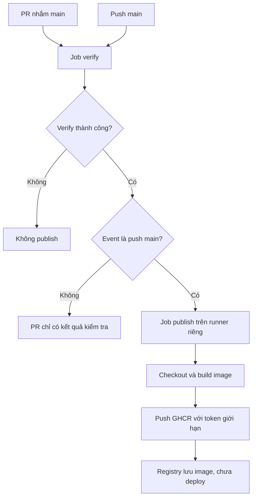

# Lesson 03 · Test xanh rồi mới xuất bản image

> Mục tiêu: hiểu gate giữa hai jobs, cấp quyền đúng chỗ, tạo tên image/tag truy vết được và không nhầm publish với deploy.

## 1. Hai nhánh của cùng workflow



`needs: verify` kiểm kết quả job trước. `if` kiểm event/ref có được phép publish không. Hai điều kiện khác nhau: code đúng nhưng đến từ PR vẫn không publish; push main nhưng verify fail cũng không publish.

Mẫu lựa chọn đơn giản: PR chạy Maven, main chạy Maven rồi Docker build/push. **PR chưa được kiểm Dockerfile** trong mẫu này; lỗi Dockerfile có thể chỉ xuất hiện khi push main. Nâng cấp hợp lý về sau là job build image `push: false` cho PR, không login/quyền registry. Không được báo rằng mẫu đã có bước đó.

## 2. Cần có gì trước khi dùng mẫu?

- Repo GitHub có source và wrapper được commit, Actions được phép chạy.
- Dockerfile thật tại `shopcore/Dockerfile` và `.dockerignore`, theo M4-1. Hiện bài Docker mới cung cấp Markdown mẫu, nên chưa thể coi job này chạy được ngay.
- Branch chính đúng filter main. Người có quyền merge được xem là trusted trong thiết kế cơ bản này; phải review thay đổi workflow/scripts.
- GHCR/package policy cho phép repo publish. Package đã tồn tại dưới owner có thể cần cấp repository access riêng; không “sửa” bằng token toàn quyền.

GitHub-hosted Ubuntu có Docker phù hợp cho cách dùng này; action major dùng Node runtime mới cần runner tương thích. Không triển khai self-hosted runner ở bài cơ bản.

## 3. Workflow đầy đủ để đọc và đối chiếu

Đây là bản thay cho YAML lesson 1–2, không phải tạo thêm workflow trùng. Các majors đã đối chiếu metadata official; tags có thể thay đổi theo thời gian, production pin full SHA có kiểm chứng.

```yaml
name: shopcore-ci

on:
  pull_request:
    branches: [main]
  push:
    branches: [main]

permissions:
  contents: read

concurrency:
  group: ${{ github.workflow }}-${{ github.ref }}
  cancel-in-progress: ${{ github.event_name == 'pull_request' }}

jobs:
  verify:
    runs-on: ubuntu-latest
    timeout-minutes: 15
    defaults:
      run:
        working-directory: shopcore
    steps:
      - uses: actions/checkout@v6
        with:
          persist-credentials: false
      - uses: actions/setup-java@v6
        with:
          distribution: temurin
          java-version: '21'
          cache: maven
          cache-dependency-path: |
            shopcore/pom.xml
            shopcore/.mvn/wrapper/maven-wrapper.properties
      - name: Verify
        run: bash ./mvnw -B -ntp verify -DfailIfNoTests=true
      - name: Keep test reports
        if: ${{ always() }}
        uses: actions/upload-artifact@v6
        with:
          name: test-reports-${{ github.run_id }}-${{ github.run_attempt }}
          path: |
            shopcore/target/surefire-reports/
            shopcore/target/failsafe-reports/
          if-no-files-found: ignore
          retention-days: 7

  publish:
    needs: verify
    if: ${{ github.event_name == 'push' && github.ref == 'refs/heads/main' }}
    runs-on: ubuntu-latest
    timeout-minutes: 20
    permissions:
      contents: read
      packages: write
    steps:
      - uses: actions/checkout@v6
        with:
          persist-credentials: false
      - name: Choose image name
        id: image
        shell: bash
        run: echo "name=ghcr.io/${GITHUB_REPOSITORY_OWNER,,}/shopcore" >> "$GITHUB_OUTPUT"
      - name: Setup Buildx
        uses: docker/setup-buildx-action@v4
      - name: Login to GHCR
        uses: docker/login-action@v4
        with:
          registry: ghcr.io
          username: ${{ github.actor }}
          password: ${{ secrets.GITHUB_TOKEN }}
      - name: Build and push
        id: build
        uses: docker/build-push-action@v7
        with:
          context: ./shopcore
          file: ./shopcore/Dockerfile
          push: true
          tags: ${{ steps.image.outputs.name }}:sha-${{ github.sha }}
          labels: |
            org.opencontainers.image.source=${{ github.server_url }}/${{ github.repository }}
          cache-from: type=gha,scope=shopcore-main
          cache-to: type=gha,mode=max,scope=shopcore-main
```

## 4. Đọc từng phần của publish

1. `needs` chặn publish nếu verify không success theo điều kiện mặc định. Không thêm `always()` vào publish để vượt gate.
2. `if` cho chạy duy nhất push main; push tag hoặc workflow event khác không tự được phép. PR job không cần packages write.
3. Runner publish mới nên phải checkout lại. JAR ở runner verify không tự xuất hiện; Dockerfile multi-stage build lại source của run.
4. Image name chuẩn hóa owner về lowercase vì registry name có ràng buộc chữ thường. `${VAR,,}` là Bash lowercase, khác GitHub expression `${{ ... }}`.
5. `id: image` và ghi `$GITHUB_OUTPUT` tạo output có thể dùng ở step sau. `name:` là tên hiển thị, không tự là ID.
6. Buildx chuẩn bị builder. Login tạo quyền xác thực tới registry; không login DB hoặc ứng dụng shopcore.
7. `context: ./shopcore` dùng path source đã checkout. Chỉ định path context rõ để tránh default Git context của build action bỏ qua file thay đổi ở steps trước. `file` chọn Dockerfile; không tự đổi context.
8. `push: true` gửi image sau build; label source nối package với repository trong điều kiện registry hỗ trợ. Không thay cho kiểm repository access của package đã có.
9. Tag `sha-...` giúp truy vết commit. `github.sha` trên push là commit main được workflow xử lý; không dùng PR merge SHA để gọi là release main trong mẫu.
10. GHA cache lưu build cache theo scope; không là kho image release. Maven cache runner và Docker cache là hai cơ chế. Cache mount Maven bên trong Dockerfile không mặc định được GHA layer cache giữ nguyên qua mọi builder/run; không hứa tối ưu đó khi chưa kiểm.

Mẫu build lại nên **không khẳng định JAR đã test và JAR trong image giống từng byte**: cùng source nhưng base tags/dependencies mutable có thể khác. Nếu cần promote đúng binary, thiết kế artifact handoff và kiểm digest; ngoài yêu cầu cơ bản, không giả đã làm.

## 5. Token và secrets: chỉ cấp khi cần

`GITHUB_TOKEN` do GitHub cấp cho job, quyền bị giới hạn bởi workflow/job và policy. `packages: write` chỉ ở publish, không write-all. GHCR trong workflow cùng repo thường dùng token này; không cần tạo PAT/AWS key chỉ để học.

Nếu denied: kiểm package owner/name, repository access, org policy và token permission. Không paste token vào chat hoặc log; không dùng `echo` secrets. Registry token **không được COPY/ARG/ENV vào Docker image**. Secret datasource/JWT runtime chỉ cấp lúc chạy app, không đưa vào build để test đỡ fail.

Fork PR thường không có repository secrets/quyền ghi; đừng đổi event sang pull_request_target rồi chạy code fork để vượt hạn chế. Action được dùng cũng là code của bên thứ ba: chọn official, pin full SHA khi hardening và review nâng cấp.

## 6. Tag, digest và câu “đã push rồi”

Tag như sha-commit là quy ước đặt tên, không cơ chế chống ghi đè tuyệt đối. Re-run cùng commit có thể thay nội dung nếu input build mutable; digest mới xác định nội dung image cụ thể. Ghi digest output của step build và đối chiếu package khi cần truy vết.

Mẫu không gắn latest để tránh hiểu latest là phiên bản đúng nhất. Concurrency hủy run PR cũ cùng ref để bớt tốn tài nguyên; main không chủ động hủy run đang chạy theo cấu hình này. Không coi concurrency group là hàng đợi FIFO bảo đảm chạy đủ mọi commit.

Image build xong trên runner nhưng push fail → chưa có publication thành công. Push thành công → image nằm ở registry, chưa có container mới trên server. Pull private package cần quyền phù hợp; package không tự public chỉ vì repository public.

## 7. Nếu repo có gốc khác

| Vị trí | Repo hiện tại có thư mục shopcore | Shopcore chính là repo root |
|---|---|---|
| Workflow | `.github/workflows/ci.yml` | `.github/workflows/ci.yml` |
| run working-directory | `shopcore` | `.` hoặc bỏ defaults |
| Cache POM | `shopcore/pom.xml` | `pom.xml` |
| Cache wrapper path | `shopcore/.mvn/wrapper/maven-wrapper.properties` | `.mvn/wrapper/maven-wrapper.properties` |
| Report paths | `shopcore/target/...` | `target/...` |
| Docker context | `./shopcore` | `.` |
| Dockerfile path | `./shopcore/Dockerfile` | `./Dockerfile` |

Không copy nguyên mẫu rồi sửa duy nhất working-directory và cho rằng mọi action path đã đổi theo.

## Tài liệu / video

- [GHCR](https://docs.github.com/en/packages/working-with-a-github-packages-registry/working-with-the-container-registry): permissions, package visibility và repo access.
- [GITHUB_TOKEN](https://docs.github.com/en/actions/tutorials/authenticate-with-github_token): quyền từng job.
- [Build push action v7](https://github.com/docker/build-push-action/tree/v7), [login v4](https://github.com/docker/login-action/tree/v4), [Buildx v4](https://github.com/docker/setup-buildx-action/tree/v4): inputs và runtime yêu cầu.
- [Docker GHA cache](https://docs.docker.com/build/ci/github-actions/cache/): cache mounts và build layers.
- [Secure use](https://docs.github.com/en/actions/reference/security/secure-use): SHA pinning và untrusted input.
- Video tìm: `GitHub Actions Spring Boot GHCR needs packages write Docker Buildx`. Từ khóa chưa xác minh video cụ thể; tránh hướng dẫn cấp write-all hoặc chạy fork với secrets.

[Làm đề lesson 3](../../../Exams/de-kiem-tra/M4-2-ci__2026-10-07__lesson3-lan1.md).
