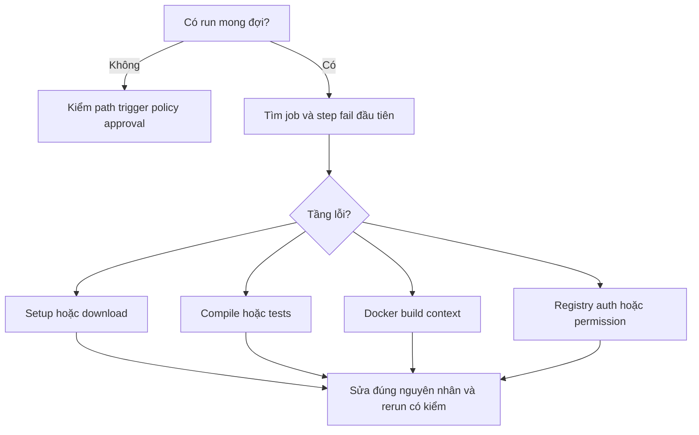

# Lesson 04 · Đọc CI đỏ, hiểu CI xanh

> Mục tiêu: xác định lỗi ở tầng nào, hiểu badge/required check và biết cần bằng chứng gì trước khi nói pipeline đã hoàn thành.

## 1. Không có run khác với run fail

Mở tab Actions: tìm đúng workflow, event, ref/SHA và thời điểm. Không thấy run thì kiểm file đã commit đúng `.github/workflows/` ở repo root chưa, event/base branch có khớp không, workflow/Actions có disabled không, PR có cần approval không. YAML sai có thể được báo như lỗi cấu hình/check chứ không tới Maven.

Không có run không thể sửa bằng thay ProductService. Run bị skipped cũng không giống tests đã pass.

## 2. Đọc từ step đầu tiên fail



Sơ đồ không bảo bạn chạy lại mọi thứ. Nó tách lỗi môi trường/download khỏi lỗi source/test, build context và registry. Job publish skipped sau verify fail thường là **gate hoạt động đúng**, không phải lỗi của job publish.

| Dấu hiệu | Kiểm tiếp | Không chữa bằng |
|---|---|---|
| mvnw/POM not found | Checkout, path, working-directory | Skip test |
| invalid target release 21 | JDK/Maven version thực trong step | Đổi Java source tùy tiện |
| Could not resolve dependency | Repo/network/credential cho dependency | Ignore mọi failure |
| Tests failures/errors | Test name, assertion, stack trace, report | continue-on-error để xanh |
| Spring context fail vì datasource | Test profile/DB readiness/config | Credentials production |
| Docker COPY not found | context/file/.dockerignore | packages write |
| GHCR denied/unauthorized | Login/package owner/access/policy | Token toàn quyền, log token |
| Publish skipped trên PR | Event/ref và policy | Ép PR được push |

## 3. Đọc test report có ý nghĩa

Tìm tên test fail và nguyên nhân gốc trong chain exception; assertion fail khác lỗi khởi tạo Spring context. Kiểm tests run/failures/errors/skipped và thời gian. Report upload `always()` không đổi Maven fail thành pass; thiếu report khi compile fail là điều có thể xảy ra.

Trước rerun, hỏi: lỗi mạng tạm thời hay lỗi xác định được trong source/config? Rerun lỗi download có thể hữu ích; rerun cùng assertion fail mãi không sửa logic. Rerun xanh sau nhiều lần đỏ cũng có thể là flaky test; cần ghi nhận, không giấu bằng rerun đến khi xanh.

Không upload `.env`, settings chứa credentials hoặc dump DB thật để “có đủ logs”. Chỉ thu thông tin cần thiết và lọc dữ liệu nhạy cảm; secret masking không đảm bảo mọi biến thể secret đều được che.

Ví dụ **log giả định để tập đọc**, không phải kết quả chạy tests hiện tại:

```text
[INFO] Tests run: 4, Failures: 1, Errors: 0, Skipped: 0
[ERROR] ProductServiceTests.rejectDuplicateSku: expected conflict but got success
[ERROR] Failed to execute goal ... maven-surefire-plugin ... There are test failures
```

Đọc thành bốn ý: Surefire đã phát hiện/chạy bốn test; một assertion không đạt kỳ vọng; cần xem test duplicate SKU và code liên quan; Maven verify fail nên publish needs verify bị chặn. Không kết luận lỗi GHCR vì chưa tới login/push. Nếu thay dòng giữa bằng lỗi ApplicationContext/datasource, hướng điều tra chuyển sang config test và dependency trước khi kết luận duplicate SKU sai.

## 4. Một run đang kiểm phiên bản nào?

PR mặc định thường checkout merge ref; push main là commit đã nằm trên main. Rerun gắn với run/event/ref ban đầu, không tự checkout code mới bạn vừa push theo mặc định checkout của mẫu. Code sửa mới cần run của commit mới để kết luận.

Ghi tối thiểu: workflow file, run URL/ID, event, SHA, command, test counts, kết quả jobs, image tag/digest nếu đã publish. Cache hit, badge hoặc một ảnh chụp “success” thiếu SHA không đủ chứng minh phiên bản đang xem đã được kiểm.

## 5. Badge là đường link trạng thái, không phải gate

Ví dụ đặt ở README khi đã có repo/workflow thật, thay OWNER/REPO bằng tên đúng:

```markdown
[](https://github.com/OWNER/REPO/actions/workflows/ci.yml)
```

`ci.yml` là tên **file workflow**, không phải `name: shopcore-ci`. Branch/event filters làm badge phản ánh ngữ cảnh main push đã chọn; badge không đảm bảo mọi PR xanh, không là chứng nhận security hay chất lượng tests. Nó có thể hiển thị trạng thái run trước do caching/cập nhật, nên xem run cụ thể khi cần kết luận.

Repo private có giới hạn hiển thị/truy cập cho người không có quyền. Thêm Markdown badge không tạo workflow, không chạy test và không chặn merge.

## 6. Muốn PR đỏ không merge được thì làm sao?

Cần branch protection/ruleset yêu cầu đúng status check của job verify trên branch được bảo vệ, với repo policy phù hợp. Workflow chạy test nhưng không có rule thì người có quyền vẫn có thể merge dù đỏ; quyền bypass/admin cũng cần hiểu và kiểm.

Không chọn publish làm required check cho PR trong mẫu vì publish cố ý skipped trên PR. Chọn tên check thực xuất hiện trên GitHub, tránh nhiều workflows có job name gây nhập nhằng.

Mẫu không thêm path filters để tránh một required workflow bị bỏ qua khi PR chỉ đổi docs và check chờ mãi. Nếu thêm filters hoặc merge queue về sau, kiểm interaction với required checks/merge_group trước; không cần triển khai trong module này.

## 7. Review workflow như review code

- Quyền đọc source ở verify, packages write chỉ ở publish main; không thay bằng write-all.
- Action major tag dễ đọc nhưng mutable. Pin full SHA đã xác minh, review PR nâng cấp thay vì tự bịa SHA.
- Tránh đưa PR title/body trực tiếp vào shell script qua expression. Nếu cần xử lý, đưa qua env và quote; vẫn không thực thi input như command.
- Không dùng pull_request_target + checkout/chạy fork code để nhận secrets. Hosted runner sạch giảm tồn dư, không có nghĩa code không tin cậy trở thành an toàn.
- Cache/report/image không chứa token/JWT secret/DB password thật. AWS OIDC/deploy ở M6B-3, không thêm long-lived AWS key vào CI cơ bản.

Các điểm này giúp CI tương lai cho Python/model service cũng an toàn hơn: pipeline có thể kiểm schema/eval, nhưng kết quả chỉ có nghĩa theo phép kiểm đã viết, không bảo đảm AI luôn trả lời đúng.

## 8. Tự kiểm deliverable mà không phóng đại

Khi thực hành thật: mở PR có lỗi compile/test có chủ đích trên dữ liệu thử, xác nhận verify đỏ và không publish; sửa lỗi, xác nhận run đúng commit xanh; merge/push main, xác nhận verify thành công rồi publish thành công và GHCR có tag/digest tương ứng; kiểm badge đúng file/branch và rule chặn PR đỏ nếu đã cấu hình.

Không cần deploy server để chứng minh CI publish; cũng không được nói app đang chạy trên AWS chỉ vì image ở GHCR. Không cần tạo project mới hoặc xóa dữ liệu thật để thử pipeline.

Bộ bài học này chưa kích hoạt remote workflow, chưa có quyền repo/package để thay bạn cấu hình ruleset, chưa push image. Đó là giới hạn kiểm chứng, không phải lỗi được giấu sau badge.

## Tài liệu / video

- [Workflow badge](https://docs.github.com/en/actions/how-tos/monitor-workflows/add-a-status-badge): file/branch/event.
- [Workflow syntax](https://docs.github.com/en/actions/reference/workflows-and-actions/workflow-syntax): needs, conditions, concurrency, filters.
- [Events reference](https://docs.github.com/en/actions/reference/workflows-and-actions/events-that-trigger-workflows): PR ref và rerun context.
- [Re-running workflows](https://docs.github.com/en/actions/how-tos/manage-workflow-runs/re-run-workflows-and-jobs): rerun dùng SHA/ref của event ban đầu.
- [Secure use reference](https://docs.github.com/en/actions/reference/security/secure-use): injection, permissions, SHA pinning.
- [Protected branches](https://docs.github.com/en/repositories/configuring-branches-and-merges-in-your-repository/managing-protected-branches/about-protected-branches): required checks và bypass.
- Video tìm: `GitHub Actions debug failed workflow required status checks badge Maven`. Từ khóa chưa xác minh video cụ thể; ưu tiên có ví dụ đỏ → đọc log → sửa, không chỉ copy YAML xanh.

[Làm đề lesson 4](../../../Exams/de-kiem-tra/M4-2-ci__2026-10-07__lesson4-lan1.md).
