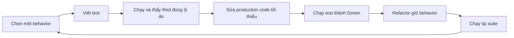

# Lesson 01 · TDD: biết test đang bắt lỗi gì

> Mục tiêu: nhìn một rule nhỏ và tự kể được vì sao test đỏ, sửa gì để xanh, refactor gì mà không đổi kết quả. Không cần học thuộc framework.

## Tài liệu / video liên quan

- [JUnit User Guide](https://docs.junit.org/current/user-guide/): tìm Writing Tests, Assertions, Parameterized Tests. Theo BOM project, không thay dependency chỉ vì guide mới hơn.
- [JUnit assertions API](https://docs.junit.org/current/api/org.junit.jupiter.api/org/junit/jupiter/api/Assertions.html): đọc assertEquals/assertThrows.
- Video để tìm trên YouTube: `TDD Java red green refactor boundary testing`. Đây là từ khóa tìm kiếm, không phải link video đã thẩm định. Đọc code nhỏ dưới đây trước.

## 1. TDD khác “viết thêm test sau cùng” ở đâu?

Bạn đã biết viết Service. TDD đổi thứ tự một chút:



Giải thích từng bước: chọn behavior trước để biết mong đợi; test diễn tả input/output; Red xác nhận test có khả năng phát hiện phần chưa làm; Green là implementation đáp ứng case đó; Refactor cải thiện cấu trúc trong khi giữ hành vi. Cuối cùng chạy lại toàn suite để không làm hỏng case trước. Không cần commit mỗi lần đỏ, nhất là không đẩy branch main đang hỏng; có thể giữ log/commit trên nhánh học để ghi quá trình.

Viết production code xong mới test vẫn có ích, nhưng không có bằng chứng đã đi theo chu trình test-first. Không gọi mọi test fail là Red tốt: lỗi download dependency, import, DB không kết nối là lỗi setup; cần sửa setup để test fail do behavior chưa đúng. Compilation failure vì API chưa tồn tại có thể là bước thiết kế ban đầu, nhưng nên có stub compile được rồi quan sát assertion fail để biết đang kiểm gì.

## 2. Contract cụ thể của feature

Tạo rule phí nội bộ cho shopcore, **không gọi API vận chuyển bên ngoài**:

| Input subtotal VND | Kết quả fee VND |
|---|---:|
| null | IllegalArgumentException |
| Âm | IllegalArgumentException |
| 0 đến dưới500000 | 30000 |
| Từ500000 | 0 |

Tiền đã là tổng hợp lệ của ứng dụng, không làm tròn hoặc quy đổi ngoại tệ trong policy. `0` hợp lệ theo contract này. Tên exception ở rule thuần chỉ để học: khi tích hợp, Service/Advice có thể map lỗi input theo contract HTTP đã có, không có HTTP tự sinh từ exception Java.

Các case500000/499999/500001 quan trọng vì phát hiện lỗi `>` thay vì `>=`. Case250000 giúp phát hiện implementation trả0 cho mọi input. Không tự bịa thêm rule “subtotal phải >0” khi contract cho0.

## 3. JUnit đủ để đọc bài

`@Test` đánh dấu test method; `assertEquals(expected, actual)` fail khi không bằng; `assertThrows` yêu cầu hành động thực sự ném đúng loại exception. Tên test nói behavior, không `test1`.

AAA:

```text
Arrange: policy và subtotal500000.
Act: gọi fee(subtotal).
Assert: fee bằng0 theo giá trị tiền.
```

Không thay Act bằng tạo output mong đợi; phải gọi code thật đang được kiểm. Assert phải có oracle độc lập từ contract, không copy lại công thức implementation để hai nơi cùng sai.

## 4. Red đầu tiên

Đặt test trong `shopcore/src/test/java/com/shopcore/shipping/ShippingFeePolicyTest.java`; class production tương ứng trong `src/main/java/com/shopcore/shipping/`. Chưa cần annotation Spring.

Test đầu tiên:

```java
package com.shopcore.shipping;

import java.math.BigDecimal;
import org.junit.jupiter.api.Test;
import static org.junit.jupiter.api.Assertions.assertEquals;

class ShippingFeePolicyTest {
    @Test
    void free_at_threshold() {
        ShippingFeePolicy policy = new ShippingFeePolicy();
        BigDecimal fee = policy.fee(new BigDecimal("500000"));
        assertEquals(0, fee.compareTo(BigDecimal.ZERO));
    }
}
```

Stub để compile được:

```java
package com.shopcore.shipping;

import java.math.BigDecimal;

public class ShippingFeePolicy {
    public BigDecimal fee(BigDecimal subtotal) {
        return new BigDecimal("30000");
    }
}
```

Chạy từ thư mục shopcore:

```bash
bash ./mvnw -Dtest=ShippingFeePolicyTest test
```

Stub trả30000, compareTo(0) trả1 nên assertion expected0 fail: đây là Red đúng lý do. Không sửa expected thành1 cho xanh vì contract vẫn yêu cầu miễn phí.

## 5. Green tối thiểu không phải hard-code mãi

Với đúng một test, `return ZERO` làm test xanh nhưng chưa thực thi toàn rule. Vòng sau thêm case dưới ngưỡng, thấy fail, rồi triển khai phân nhánh. Tiếp tục thêm input không hợp lệ. Một Green nhỏ là điểm dừng tạm của vòng TDD, không là giấy chứng nhận đủ feature.

Implementation sau các vòng:

```java
package com.shopcore.shipping;

import java.math.BigDecimal;

public class ShippingFeePolicy {
    private static final BigDecimal FREE_FROM = new BigDecimal("500000");
    private static final BigDecimal STANDARD_FEE = new BigDecimal("30000");

    public BigDecimal fee(BigDecimal subtotal) {
        if (subtotal == null || subtotal.signum() < 0) {
            throw new IllegalArgumentException("subtotal must not be negative");
        }
        if (subtotal.compareTo(FREE_FROM) >= 0) {
            return BigDecimal.ZERO;
        }
        return STANDARD_FEE;
    }
}
```

Luồng: guard input trước → so giá trị với500000 → nhánh miễn phí hoặc phí chuẩn. `compareTo` so giá trị số; `BigDecimal.equals` còn xét scale, nên `0` và `0.00` không equals dù cùng giá trị tiền. Bài không kiểm format JSON/scale, chỉ giá trị phí.

## 6. Suite ngắn đủ nhìn hành vi

Đây là **bản thay thế test đầu tiên**, không tạo hai class trùng tên. Dependencies theo starter-test hiện có; parameterized API do BOM cung cấp.

```java
package com.shopcore.shipping;

import java.math.BigDecimal;
import org.junit.jupiter.api.Test;
import org.junit.jupiter.params.ParameterizedTest;
import org.junit.jupiter.params.provider.ValueSource;
import static org.junit.jupiter.api.Assertions.assertEquals;
import static org.junit.jupiter.api.Assertions.assertThrows;

class ShippingFeePolicyTest {
    private final ShippingFeePolicy policy = new ShippingFeePolicy();

    @ParameterizedTest
    @ValueSource(longs = {0, 250000, 499999})
    void fee_below_threshold(long subtotal) {
        BigDecimal actual = policy.fee(BigDecimal.valueOf(subtotal));
        assertEquals(0, actual.compareTo(new BigDecimal("30000")));
    }

    @ParameterizedTest
    @ValueSource(longs = {500000, 500001})
    void free_at_or_above_threshold(long subtotal) {
        assertEquals(0, policy.fee(BigDecimal.valueOf(subtotal))
                .compareTo(BigDecimal.ZERO));
    }

    @Test
    void reject_negative() {
        assertThrows(IllegalArgumentException.class,
                () -> policy.fee(new BigDecimal("-1")));
    }

    @Test
    void reject_null() {
        assertThrows(IllegalArgumentException.class, () -> policy.fee(null));
    }
}
```

Parameterized methods chạy từng giá trị thành case riêng: suite này7 invocations, không phải4 behavior samples. Không kiểm số7 như mục tiêu kinh doanh; chỉ biết đọc report thay vì đếm method bằng mắt.

## 7. Refactor làm gì?

Thay magic numbers thành constants, đặt tên rõ hoặc tách rule khỏi Service quá dài. Behavior/contract vẫn giữ; chạy lại suite sau refactor. Nếu đồng thời đổi threshold600000, đó là đổi requirement/behavior, phải cập nhật contract và test tương ứng, không gọi là refactor thuần.

Test không nên assert policy gọi private method nào hoặc dùng if/switch. Hai implementation đúng cùng contract đều nên pass. Interaction test chỉ có ý nghĩa khi interaction là một phần behavior, ví dụ không lưu DB sau khi reject request; Lesson02 sẽ giải thích.

## 8. Bài tập và tự kiểm

Chưa nhìn code: nếu lỡ đổi `>=` thành `>`, case nào đỏ? Nếu trả0 vô điều kiện, case nào đỏ? Nếu guard null bị xóa, test assertThrows IllegalArgumentException có phát hiện NullPointerException khác loại không?

Bài thực hành tùy thời điểm: đi lại các vòng từ stub, lưu output red đúng assertion, green, refactor và suite xanh. Không cần tạo cả CRUD để học TDD. Đọc đáp án sẵn không phải bằng chứng bạn đã tự đi các vòng.

Checklist: kể được3 bước, tách setup failure khỏi behavior failure, chọn boundary, viết oracle, hiểu BigDecimal, giữ regression suite. [Làm đề Lesson01](../../../Exams/de-kiem-tra/M4-3-tdd-coverage__2026-10-07__lesson1-lan1.md).
