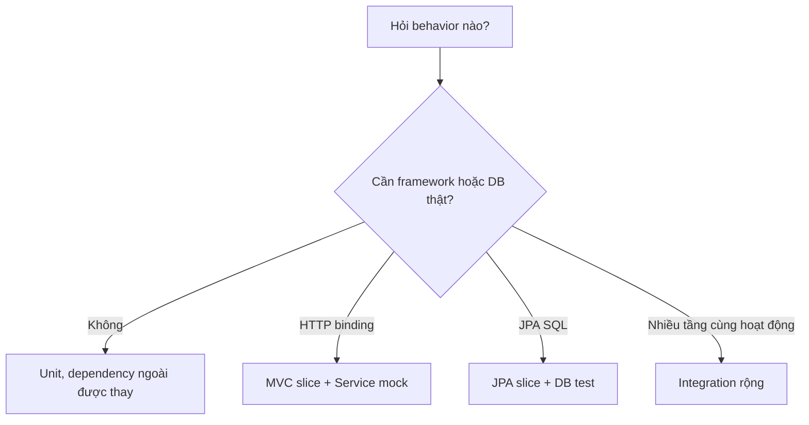

# Lesson 02 · Chọn tầng test: đang kiểm thật phần nào?

> Mục tiêu: không dùng Spring context/DB cho mọi phép tính; cũng không dùng mock rồi kết luận HTTP, SQL và transaction đều đúng.

## Tài liệu / video liên quan

- [Boot testing applications](https://docs.spring.io/spring-boot/reference/testing/spring-boot-applications.html): đọc WebMvcTest, DataJpaTest, SpringBootTest.
- [Testing web layer](https://spring.io/guides/gs/testing-web/): một lát MVC với collaborator mock.
- [Mockito reference](https://javadoc.io/doc/org.mockito/mockito-core/latest/org/mockito/Mockito.html): mock, stubbing, verify. Theo version BOM, không tự thêm latest.
- [Spring test transactions](https://docs.spring.io/spring-framework/reference/testing/testcontext-framework/tx.html): đọc rollback, flush và thread boundary.
- Video tìm: `Spring Boot 4 WebMvcTest MockitoBean unit integration test`. Kiểm package/version, không copy MockBean từ tutorial Boot2 vào Boot4.

## 1. Test nào trả lời câu hỏi nào?

| Điều muốn biết | Tầng phù hợp | Không tự chứng minh |
|---|---|---|
| 500000 có miễn phí? | Unit ShippingFeePolicy | JSON, DB, Security |
| Service đọc giá và nhân quantity trước policy? | Unit Service, mock reader | SQL trong reader đúng |
| Query param sai có400, JSON success có fee? | MVC slice | Service nghiệp vụ thật/DB |
| Query/filter/unique/FK đúng trên PostgreSQL? | JPA slice + PostgreSQL test | Full HTTP/auth chain |
| HTTP → Service → DB phối hợp đúng? | Integration context/HTTP + DB test | Mọi race/performance/provider live |

Slice là integration của một lát framework, không category loại trừ tuyệt đối với integration. Ở đây gọi “integration rộng” khi nhiều tầng thật phối hợp. Chọn theo rủi ro, không một tỷ lệ pyramid cố định cho mọi hệ thống.



Đi từ câu hỏi ở A. Nếu cần Java thuần, C nhanh và khoanh lỗi tốt. Nếu cần chuyển query/JSON/status, D chạy MVC thật. E giữ ORM/database vì đó là phần muốn kiểm. F kiểm đường nối, đổi lại setup/chạy chậm hơn. Không chọn F chỉ vì tên có chữ “integration” nghe chắc hơn.

## 2. Mock là thế thân có kịch bản, không là database tí hon

`when(reader.findPrice(10L)).thenReturn(...)`: bạn lập trình mock trả kết quả cho input đó. Nó không SELECT SQL, không kiểm FK, không tham gia transaction thực. `verify` kiểm interaction đã xảy ra, không thực thi implementation dependency.

Không mock chính method đang cần kiểm rồi assert kết quả đã stub: đó là tự xác nhận kịch bản của Mockito, không business code. Unstubbed method có default return tùy kiểu, thường null/empty/0; phải đọc lỗi setup thay vì kết luận production sai. Stub chỉ phần test cần; over-stubbing/verifyNoMoreInteractions mọi nơi làm suite dễ vỡ khi refactor hợp lệ.

## 3. Ví dụ Service nhỏ, contract đủ để test

Tiếp nối policy Lesson01. Feature quote một Product: quantity>0, lấy unit price qua reader, không có Product thì AppException PRODUCT_NOT_FOUND; có thì subtotal=price×quantity rồi tính phí. Reader trả giá hợp lệ theo dữ liệu đã validate. Service dưới đây Java thuần; khi ghép Spring cần đăng ký bean/implementation reader, không chỉ copy file là app có endpoint.

`UnitPriceReader.java`:

```java
package com.shopcore.shipping;

import java.math.BigDecimal;
import java.util.Optional;

public interface UnitPriceReader {
    Optional<BigDecimal> findPrice(Long productId);
}
```

`ShippingQuoteService.java`:

```java
package com.shopcore.shipping;

import java.math.BigDecimal;
import com.shopcore.common.AppException;
import com.shopcore.common.ErrorCode;

public class ShippingQuoteService {
    private final UnitPriceReader reader;
    private final ShippingFeePolicy policy;

    public ShippingQuoteService(UnitPriceReader reader, ShippingFeePolicy policy) {
        this.reader = reader;
        this.policy = policy;
    }

    public BigDecimal quote(Long productId, int quantity) {
        if (quantity <= 0) {
            throw new AppException(ErrorCode.INVALID_PARAMETER);
        }
        BigDecimal price = reader.findPrice(productId)
                .orElseThrow(() -> new AppException(ErrorCode.PRODUCT_NOT_FOUND));
        return policy.fee(price.multiply(BigDecimal.valueOf(quantity)));
    }
}
```

Không thêm một repository Spring Data giả vào đây rồi tưởng đã test JPA. Reader là collaborator nhỏ đại diện nguồn giá; adapter thật về sau có thể dùng repository đã có trong shopcore. Không cần học Hexagonal đầy đủ để dùng constructor injection.

## 4. Unit test có mock và assertion thật

```java
package com.shopcore.shipping;

import java.math.BigDecimal;
import java.util.Optional;
import org.junit.jupiter.api.Test;
import com.shopcore.common.AppException;
import com.shopcore.common.ErrorCode;
import static org.junit.jupiter.api.Assertions.assertEquals;
import static org.junit.jupiter.api.Assertions.assertThrows;
import static org.mockito.Mockito.mock;
import static org.mockito.Mockito.when;
import static org.mockito.Mockito.verifyNoInteractions;

class ShippingQuoteServiceTest {
    private final UnitPriceReader reader = mock(UnitPriceReader.class);
    private final ShippingQuoteService service =
            new ShippingQuoteService(reader, new ShippingFeePolicy());

    @Test
    void quantity_affects_subtotal() {
        when(reader.findPrice(10L)).thenReturn(Optional.of(new BigDecimal("250000")));
        assertEquals(0, service.quote(10L, 2).compareTo(BigDecimal.ZERO));
    }

    @Test
    void missing_product_has_business_error() {
        when(reader.findPrice(999L)).thenReturn(Optional.empty());
        AppException ex = assertThrows(AppException.class,
                () -> service.quote(999L, 1));
        assertEquals(ErrorCode.PRODUCT_NOT_FOUND, ex.getErrorCode());
    }

    @Test
    void invalid_quantity_does_not_read_price() {
        AppException ex = assertThrows(AppException.class,
                () -> service.quote(10L, 0));
        assertEquals(ErrorCode.INVALID_PARAMETER, ex.getErrorCode());
        verifyNoInteractions(reader);
    }
}
```

Luồng case đầu: stub giá250000 → gọi Service thật quantity2 → subtotal500000 → policy thật trả0 → assertion số tiền. Nếu quên nhân quantity, fee30000 và test đỏ. Ba test không dùng Spring/DB. Policy thật là collaborator thuần nhỏ; đây vẫn là phép kiểm hẹp của logic Service, không full-stack integration.

Case lỗi phải assert error code, không chỉ “ném bất cứ AppException nào”. Interaction không đọc giá khi quantity sai thuộc contract đã nêu; verify này có ý nghĩa. Không yêu cầu mọi private method phải được verify.

Nếu Mockito báo không thể initialize inline mock maker/self-attach agent, đó là setup failure, không bằng chứng Service sai. Trên môi trường chặn self-attach, cấu hình Mockito agent đúng version dependency vào test JVM theo [Mockito agent setup](https://javadoc.io/doc/org.mockito/mockito-core/latest/org.mockito/org/mockito/Mockito.html#0.3). ArgLine phải giữ cả JaCoCo agent và `-javaagent:<đường-dẫn-mockito-core-đúng-version.jar>`; không thay cả dòng chỉ để một tool chạy. Kiểm JAVA_HOME/JDK21. Ví dụ kiểm chất lượng của bộ bài dùng explicit Mockito agent; không pin một Mockito khác BOM vào shopcore.

## 5. MVC slice: JSON/status thật, Service là mock

Contract minh họa thêm: `GET /api/v1/shipping/quote?productId=10&quantity=2` trả200 `{"fee":0,"currency":"VND"}`. Controller dùng `@RequestParam Long productId`, `@RequestParam int quantity`, gọi quote và dựng response DTO class có getter fee/currency. Đây là case đọc HTTP, không request DTO body.

Snippet test chỉ áp dụng **khi Controller/DTO/bean và policy test đã được tạo theo contract**; không phải file độc lập copy vào shopcore hiện tại là compile được:

```java
import org.springframework.boot.webmvc.test.autoconfigure.WebMvcTest;
import org.springframework.test.context.bean.override.mockito.MockitoBean;

@WebMvcTest(ShippingQuoteController.class)
class ShippingQuoteControllerTest {
    @Autowired MockMvc mvc;
    @MockitoBean ShippingQuoteService service;

    @Test
    void valid_query_is_serialized() throws Exception {
        when(service.quote(10L, 2)).thenReturn(BigDecimal.ZERO);
        mvc.perform(get("/api/v1/shipping/quote")
                .param("productId", "10").param("quantity", "2"))
                .andExpect(status().isOk())
                .andExpect(jsonPath("$.fee").value(0))
                .andExpect(jsonPath("$.currency").value("VND"));
    }
}
```

Imports còn lại: Autowired, MockMvc, JUnit Test, BigDecimal, Mockito.when, MockMvcRequestBuilders.get, MockMvcResultMatchers.status/jsonPath. Boot4 có starter-webmvc-test như POM hiện tại. Không dùng import WebMvcTest package Boot3.

Giả định snippet không có Security dependency/filter chặn route. Khi ứng dụng thật có Security, slice cần cấu hình filter/auth phù hợp hoặc tách bài kiểm MVC không-auth có chủ đích. Tắt filters chỉ loại coverage Security của test đó, không chứng minh API public/an toàn. Auth tests giữ chain và kiểm401/403/USER/ADMIN riêng. Service mock trả0 chứng minh JSON/status/binding, **không chứng minh subtotal hay miễn phí đúng**.

Thêm case quantity=abc: binding int fail trước Service, kỳ vọng400 và không gọi Service. quantity=0 parse được; nếu muốn400 cần validation hoặc Service/handler theo contract, không có int tự cấm0. POST JSON sai format là case khác, không nhét vào endpoint GET này.

## 6. Repository và integration: cái gì phải là thật?

`@DataJpaTest` kiểm mapping/repository với DB. Boot4 cần module/starter data-jpa-test phù hợp khi thêm JPA; POM hiện tại chỉ có webmvc-test, **chưa đủ JPA/driver/Testcontainers**. Đọc BOM/official trước khi thêm. Muốn kiểm đặc tính PostgreSQL, dùng PostgreSQL test cô lập thay vì mặc định H2 giống hệt PG.

Kịch bản repository (pseudocode, không giả có đủ entity JPA trong workspace):

```text
Seed Category và Product trong DB test.
Gọi repository tìm giá Product.
Nếu đang kiểm dữ liệu được ghi: flush, clear persistence context, đọc lại.
Assert giá/ID/missing result từ DB thật, không assert entity trong cache rồi kết luận SQL đúng.
Với UNIQUE/FK: ép flush để lỗi SQL xảy ra trong phạm vi assertThrows nếu constraint không deferred.
```

`save()` không luôn phát SQL/commit ngay. Flush đẩy SQL nhưng chưa commit; constraint deferred có thể chỉ phát lỗi lúc commit, cần test transaction boundary tương ứng. Rollback của test giúp cô lập nhưng không thay thử commit khi rule cần kiểm commit.

`@SpringBootTest` mặc định không luôn start server thật. RANDOM_PORT mới mở server cổng ngẫu nhiên; client và server thường ở thread/transaction khác. `@Transactional` trên test không tự rollback mọi DB write của request HTTP phía server: cần DB/schema/container test riêng và cleanup đúng phạm vi. Không nối DB prod hoặc xóa toàn database dùng chung để dọn test.

## 7. Không có một test “chứng minh mọi thứ”

Một suite tốt kết hợp: unit để business boundary, slice để HTTP/SQL specifics, ít integration cho wiring/boundary rủi ro. `contextLoads` chỉ khởi tạo context với config test; không gọi quote/CRUD để chứng minh business rules. MockMvc không mở socket HTTP server thật; chạy RANDOM_PORT cũng không tự test TLS/provider ngoài.

External client cần fixture/HTTP stub theo M3-5, không gọi provider trả phí trong unit test. Thời gian/ngẫu nhiên dùng dependency như Clock/seed khi behavior phụ thuộc, không sleep chờ may mắn. Không bắt tool nâng cao ở lesson này, nhưng phải nói đúng phần thật và phần giả.

## 8. Bài tập

Cho5 rủi ro: threshold sai, quantity không nhân, JSON field thiếu, JPQL filter sai, Bean không inject được. Gán tầng test và kể phần thật/mock cho từng cái. Sau đó xem unit quote test: nếu mock reader trả đúng giá, có suy ra query PostgreSQL đúng không?

[Đề Lesson02](../../../Exams/de-kiem-tra/M4-3-tdd-coverage__2026-10-07__lesson2-lan1.md). Nhớ: **thay dependency bằng mock là cách khoanh phạm vi, không cách chứng minh dependency thật đúng**.
