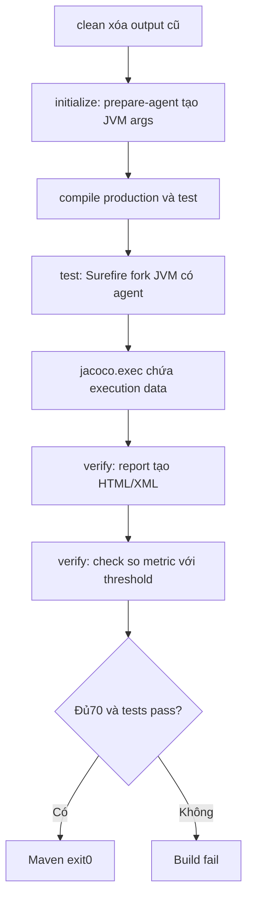

# Lesson 03 · JaCoCo: đo gì, chặn ở đâu?

> Mục tiêu: giải thích được “70% của cái gì”, đọc report mà không nhầm với chất lượng assertion, và hiểu agent → execution data → report/check trong Maven.

## Tài liệu / video liên quan

- [Coverage counters](https://www.jacoco.org/jacoco/trunk/doc/counters.html): line, branch, instruction; exception handling không được tính như branch if/switch.
- [prepare-agent](https://www.jacoco.org/jacoco/trunk/doc/prepare-agent-mojo.html): agent, argLine và late evaluation.
- [report](https://www.jacoco.org/jacoco/trunk/doc/report-mojo.html) và [check](https://www.jacoco.org/jacoco/trunk/doc/check-mojo.html): phân biệt tạo báo cáo với kiểm giới hạn.
- [Release history](https://www.jacoco.org/jacoco/trunk/doc/changes.html): chọn release hỗ trợ Java đang dùng, không dùng version SNAPSHOT ở đầu trang docs trunk.
- Video tìm: `JaCoCo Maven prepare agent report check line branch coverage`. Kiểm có check goal, không chỉ UI report.

## 1. Coverage trả lời “đã chạy qua”, không “đã kiểm đúng”

```java
@Test
void no_useful_assertion() {
    new ShippingFeePolicy().fee(new BigDecimal("500000"));
}
```

Code production chạy qua và có thể được ghi coverage. Nhưng test không phát hiện đổi kết quả0 thành30000 nếu không ném exception. Test không assertion đôi khi có mục đích như contextLoads kiểm khởi tạo không lỗi; không vì thế suy ra business result đúng. Với tiền, phải kiểm fee theo contract.

100% coverage không chứng minh mọi input, race, Security, SQL hay assertion đã đúng. Ngược lại thấp không tự biết nguyên nhân: có thể nhiều class chưa test, scope rộng, agent mất hoặc test không được phát hiện. Phải đọc test report và logs trước khi thêm test vô nghĩa.

## 2. Ba metric và phạm vi

| Metric | Ý nghĩa để học |
|---|---|
| LINE | Dòng có bytecode đã được thực thi; một dòng có thể chỉ chạy một phần |
| BRANCH | Nhánh của if/switch được đi qua; không đồng nhất với mọi business case/exception |
| INSTRUCTION | Lệnh bytecode đã thực thi, không số dòng source |

Không lấy phần trăm Instruction ở trang đầu rồi nói đã đạt gate LINE. Line coverage có thể100 trong khi branch50, ví dụ cùng một dòng if chỉ có nhánh true chạy. Try/catch không tự được tính như nhánh if/switch; vẫn phải test đường lỗi hữu ích.

Mẫu module này chọn:

```text
element=BUNDLE: tổng một Maven module.
counter=LINE; value=COVEREDRATIO; minimum=0.70.
Tất cả production classes được phân tích trong module, không excludes ngầm.
```

Maven module không phải “module học M4-3”. Nếu chỉ một class policy được test, tổng toàn shopcore có thể dưới70: đây là thông tin scope, không bug JaCoCo. Một class được70 không đồng nghĩa mọi class70; BUNDLE không phải CLASS. Repo nhiều Maven module cần policy/aggregate riêng, ngoài scope bài này.

Ví dụ số liệu giả định: covered70/missed30 →70%; covered69/missed31 →69%, fail. Covered700/missed300 toàn bundle có thể đạt dù một Service0%; vì vậy review rủi ro từng class/rule vẫn cần. Số hiển thị HTML làm tròn không là lý do nâng kết quả thật dưới ngưỡng thành pass.

## 3. Đường chạy khi gõ clean verify



Agent đi vào JVM chạy test, ghi dấu phần production code thực thi. exec không phải HTML và không nói assertion đã đúng. report ghép class files + execution data để dựng báo cáo. check phân tích số đo để quyết định vi phạm rule; tạo report không tự bật check. Nếu test fail trước verify, Maven dừng, có thể chưa sinh HTML dù có exec; test logs mới là bằng chứng chính.

**Quan trọng:** report/check có thể skip khi không có execution data. Không mặc định “không data = check tự coi0% và fail”. Lesson04 thêm kiểm file trên run sạch để gate không im lặng đi qua.

Ý tưởng kiểm bổ sung: sau clean verify, yêu cầu `target/jacoco.exec` và XML report tồn tại, không rỗng (`test -s <file>` trong shell). Thiếu file thì fail. Đây chỉ bắt missing-data, không thay check70 khi đã có dữ liệu; Lesson04 ghép vào workflow đầy đủ.

## 4. POM mẫu để đọc và ghép, không ghi đè POM của bạn

Giữ parent/dependencies/plugins Boot đang có. Đây là fragment thêm/merge vào **properties và build/plugins đã tồn tại**; không thêm hai build hay hai cấu hình Surefire trùng nhau. Chọn JaCoCo0.8.13 ổn định hỗ trợ Java21; không gọi đây là release mới nhất. Boot BOM quản lý JUnit/test dependencies; plugin JaCoCo được pin riêng để dễ tái hiện.

```xml
<properties>
    <jacoco.version>0.8.13</jacoco.version>
    <jacocoArgLine></jacocoArgLine>
</properties>
```

```xml
<plugins>
    <plugin>
        <groupId>org.apache.maven.plugins</groupId>
        <artifactId>maven-surefire-plugin</artifactId>
        <configuration>
            <failIfNoTests>true</failIfNoTests>
            <forkCount>1</forkCount>
            <reuseForks>true</reuseForks>
            <argLine>@{jacocoArgLine}</argLine>
        </configuration>
    </plugin>
    <plugin>
        <groupId>org.jacoco</groupId>
        <artifactId>jacoco-maven-plugin</artifactId>
        <version>${jacoco.version}</version>
        <executions>
            <execution>
                <id>coverage-agent</id>
                <phase>initialize</phase>
                <goals><goal>prepare-agent</goal></goals>
                <configuration>
                    <propertyName>jacocoArgLine</propertyName>
                    <append>true</append>
                </configuration>
            </execution>
            <execution>
                <id>coverage-report</id>
                <phase>verify</phase>
                <goals><goal>report</goal></goals>
            </execution>
            <execution>
                <id>coverage-check</id>
                <phase>verify</phase>
                <goals><goal>check</goal></goals>
                <configuration>
                    <haltOnFailure>true</haltOnFailure>
                    <rules>
                        <rule>
                            <element>BUNDLE</element>
                            <limits>
                                <limit>
                                    <counter>LINE</counter>
                                    <value>COVEREDRATIO</value>
                                    <minimum>0.70</minimum>
                                </limit>
                            </limits>
                        </rule>
                    </rules>
                </configuration>
            </execution>
        </executions>
    </plugin>
</plugins>
```

Surefire version được parent Boot quản lý; nếu project không có parent/pluginManagement phù hợp thì pin bản compatible đã kiểm, không để Maven chọn version cổ. XML fragment không phải pom.xml độc lập.

`@{jacocoArgLine}` được Surefire đọc muộn để nhận giá trị JaCoCo vừa thiết lập. Property rỗng giúp placeholder an toàn khi agent chưa chạy, **không bảo đảm coverage được thu**. Nếu đã có JVM args/Mockito agent, nối thêm sau placeholder theo cấu hình project, không ghi đè mất agent của bên kia. Không dùng forkCount0 cho mẫu on-the-fly này: JVM không fork theo argLine thì có thể không instrument test code đúng cách.

append=true cho phép các lượt fork/suite của **cùng build** bổ sung execution data. Vì vậy luôn clean trước gate để không lấy data stale từ code/test cũ. Không cache/copy target/jacoco.exec từ run trước để “tiết kiệm”.

## 5. Chạy ở đâu và đọc gì?

Từ `shopcore/`:

```bash
bash ./mvnw -B -ntp clean verify -DfailIfNoTests=true
```

Từ repo học có thư mục shopcore: `cd shopcore` trước; không gọi wrapper từ root rồi đo nhầm project. `mvn test` chỉ tới phase test, chưa đi tới report/check bind verify. IDE Run Test có thể dùng coverage engine khác hoặc không có JaCoCo agent; màu xanh IDE không thay Maven gate.

| File/log | Dùng để biết |
|---|---|
| target/surefire-reports | Tests nào thực sự chạy, failures/errors/skips |
| target/jacoco.exec | Agent có ghi dữ liệu; không tự chứng minh report/gate đúng |
| target/site/jacoco/index.html | Xem class/method/line/branch để tìm gap |
| target/site/jacoco/jacoco.xml | Số đếm máy đọc, dùng kiểm artifact |
| Maven check log và exit code | Rule thật có được áp dụng, vi phạm có fail |

Không import exec thay HTML. Không khẳng định có exec là chắc đủ70; còn phải check rule/scope, đúng class bytecode, đúng run. Với code generated, tool có filter nhất định; không cần đoán số getter Lombok. Excludes phải có lý do được review, thống nhất report và check; không exclude cả Service/Controller để làm đẹp số.

## 6. Debug theo triệu chứng

| Triệu chứng | Kiểm trước |
|---|---|
| Test pass, check báo60% | Metric/scope đúng? Class/rule nào chưa test? Bổ sung case hữu ích, không hạ threshold |
| No execution data | prepare-agent có chạy? argLine bị ghi đè? fork? skip? output có stale? |
| Chỉ có HTML, build không fail ở60% | check execution có bind verify? haltOnFailure/skip có bị đổi? |
| HTML80% nhưng gate fail | HTML khác run/metric/scope? Branch vs LINE? report/check excludes khác? |
| IDE xanh, CI đỏ | JDK/BOM/config/profile/test discovery/verify và coverage policy có giống? |

Gate không là cơ chế chống người có quyền sửa CI: review POM/workflow/threshold/excludes cần thiết. Không gọi một con số là security guarantee.

## 7. Bài tập

Tính covered21/missed9; covered20/missed10 có đạt0.70 không? Vì sao cần ghi LINE và BUNDLE bên cạnh70? Dự đoán `mvn test`, `mvn clean verify -DskipTests`, hoặc argLine chỉ `-Xmx512m` ảnh hưởng gì. Không cần thuộc toàn XML, cần chỉ đúng mắt xích bị thiếu.

[Đề Lesson03](../../../Exams/de-kiem-tra/M4-3-tdd-coverage__2026-10-07__lesson3-lan1.md). Nhớ: **report để xem, check để chặn; cả hai cần dữ liệu của run thật**.
