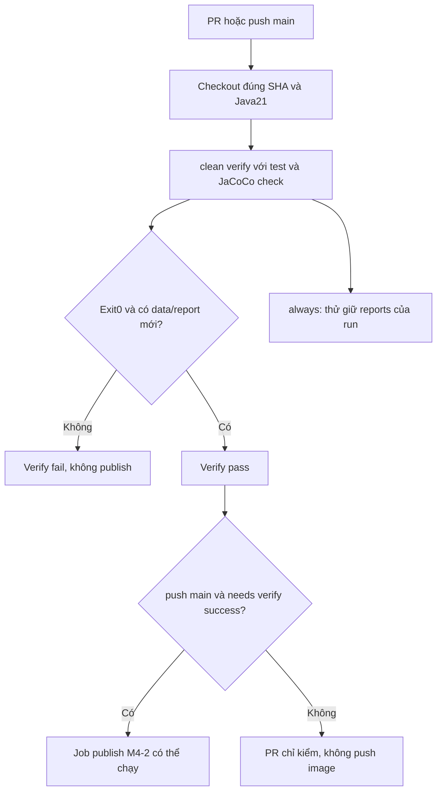

# Lesson 04 · CI fail thật, test có ích thật

> Mục tiêu: ghép coverage vào gate M4-2, kiểm cả đường thất bại, không biến upload artifact hoặc badge thành bằng chứng chất lượng.

## Tài liệu / video liên quan

- [Maven Failsafe usage](https://maven.apache.org/surefire/maven-failsafe-plugin/usage.html): integration-test và verify cần bind khi dùng IT conventions.
- [Surefire test discovery](https://maven.apache.org/surefire/maven-surefire-plugin/examples/inclusion-exclusion.html): tên test mặc định; đừng assume mọi file chứa chữ Test đều chạy.
- [GitHub workflow syntax](https://docs.github.com/en/actions/reference/workflows-and-actions/workflow-syntax): shell, conditions, needs, permissions.
- [Storing workflow artifacts](https://docs.github.com/en/actions/tutorials/store-and-share-data): giữ report đúng run, không làm pass lỗi build.
- Video tìm: `GitHub Actions Maven JaCoCo coverage check fail pipeline`. Ưu tiên video cho thấy cố tình coverage thấp làm step fail, không chỉ badge.

## 1. Nối test gate, coverage gate, publish gate



Checkout giữ source của run; verify làm các kiểm đã cấu hình; exit khác0 hoặc thiếu artifact mới phải fail; publish dùng needs và điều kiện event. Nhánh giữ report phục vụ debug dù fail, không sửa kết quả verify. Push image vẫn không deploy AWS. Nếu compile fail, chưa có test report là hợp lý, không che compile error bằng thông báo thiếu report.

## 2. Workflow verify có thể ghép vào M4-2

Mẫu hoàn chỉnh cho job verify ở layout repo học chứa shopcore. Đây là **bản thay thế phần verify của workflow cũ**, không thêm workflow trùng chạy hai lần. Job publish GHCR giữ từ M4-2 với `needs: verify` và điều kiện push main; snippet này chưa tự publish.

Prerequisite: POM đã merge fragment Lesson03; production/test source đúng; không dùng flag skip/ignore failure. Không tự sửa file workflow thật trong tài liệu này.

```yaml
name: shopcore-ci
on:
  pull_request:
    branches: [main]
  push:
    branches: [main]
permissions:
  contents: read
jobs:
  verify:
    runs-on: ubuntu-latest
    timeout-minutes: 15
    defaults:
      run:
        working-directory: shopcore
        shell: bash
    steps:
      - uses: actions/checkout@v6
        with:
          persist-credentials: false
      - uses: actions/setup-java@v6
        with:
          distribution: temurin
          java-version: '21'
          cache: maven
          cache-dependency-path: shopcore/pom.xml
      - name: Verify tests and coverage
        run: |
          bash ./mvnw -B -ntp clean verify -DfailIfNoTests=true
          test -s target/jacoco.exec
          test -s target/site/jacoco/jacoco.xml
      - name: Keep reports even on failure
        if: ${{ always() }}
        uses: actions/upload-artifact@v6
        with:
          name: test-coverage-${{ github.run_id }}-${{ github.run_attempt }}
          path: |
            shopcore/target/surefire-reports/
            shopcore/target/failsafe-reports/
            shopcore/target/site/jacoco/
          if-no-files-found: warn
          retention-days: 7
```

Bash ở Actions chạy với fail-on-error: Maven fail thì step fail, không đi tiếp kiểm file rồi vô tình ghi đè exit status. Không thêm `|| true`/continue-on-error. `test -s` đòi file tồn tại và không rỗng. Trên output sạch, agent/report skip không data sẽ bị chặn. File có tồn tại **không thay** threshold check; hai kiểm bổ sung nhau.

Root repo là chính shopcore? Bỏ working-directory, cache-dependency-path thành pom.xml, artifact paths thành target/... . `uses` paths tính từ workspace, không theo working-directory của run. Cache .m2 giúp tải dependency, không cache target/report và không bỏ verify khi cache hit. Actions major tags ở đây theo mẫu M4-2; production pin full SHA đã xác minh, không bịa SHA.

## 3. Unit tests và IT không tự chạy cùng chỉ vì gõ verify

Surefire mặc định thường phát hiện Test*/ *Test/ *Tests/ *TestCase theo convention. `ProductRepositoryIT` không tự được tính là test chỉ vì có @Test; muốn dùng IT naming cần Failsafe/config includes phù hợp. Tên file không quyết định test có DB: slice tên *Test vẫn có thể chạy bằng Surefire.

Khi thực sự có IT, thêm plugin Failsafe vào build/plugins, không thay Surefire. Parent Boot quản lý version nếu có; kiểm effective-pom. Cấu hình dưới chỉ là phần mở rộng, không bắt tạo IT rỗng để lấy điểm:

```xml
<plugin>
    <groupId>org.apache.maven.plugins</groupId>
    <artifactId>maven-failsafe-plugin</artifactId>
    <configuration>
        <argLine>@{jacocoArgLine}</argLine>
        <failIfNoTests>true</failIfNoTests>
    </configuration>
    <executions>
        <execution>
            <goals>
                <goal>integration-test</goal>
                <goal>verify</goal>
            </goals>
        </execution>
    </executions>
</plugin>
```

Đặt Failsafe trước JaCoCo trong plugins để verify kết quả IT trước report/check. Các test JVM cùng nhận agent và append vào exec cùng run; không cần report-aggregate cho một module. Dùng clean verify tới phase verify để Failsafe xác nhận failure, không chỉ integration-test. Test DB phải có config/dữ liệu cô lập Lesson02; no tests với failIfNoTests=true là lỗi khi đã chọn bật IT suite. Chưa có IT thì chưa thêm plugin này, không flag skip để giả đủ suite.

JaCoCo không instrument server ngoài JVM test chỉ vì test client có agent. RANDOM_PORT server trong cùng JVM có thể được ghi; app chạy container riêng cần instrument/thu data riêng, ngoài mẫu. Không mặc định HTTP test ngoài process làm toàn server được coverage.

## 4. Ma trận chứng minh gate

Chạy trên nhánh/fixture an toàn, không sửa main để đỏ. Lưu SHA/config/run/output khi kiểm:

| Case kiểm có chủ đích | Kỳ vọng |
|---|---|
| Assertion sai | Test fail → verify fail, publish chặn |
| Tests pass, LINE bundle60%, data có thật | JaCoCo check fail ở0.70, publish chặn |
| Tests pass, LINE bundle≥70%, data/report mới | Verify pass, publish chỉ có thể chạy nếu event/quyền đúng |
| Không phát hiện test khi failIfNoTests=true | Surefire fail, không gọi là “0 test pass” |
| Agent/report không tạo data nhưng Maven exit0 | test -s fail trên clean run |
| Cache hit | Vẫn chạy cùng các kiểm trên |

Muốn biết coverage gate hoạt động, chọn case dưới70 trong khi assertions vẫn pass; một assertion fail chỉ chứng minh test gate. Muốn biết no-data gate, quan sát log skipped data và kiểm file fail, không nhận report cũ. Đừng hạ threshold/exclude class để làm xanh case âm.

## 5. Test tốt cần assertion và dữ liệu đáng tin

Ví dụ xấu `assertNotNull(fee)` vẫn pass khi trả sai tiền. Sửa assert giá trị theo bảng rule, input0, dưới/tại/trên ngưỡng và invalid, không chỉ happy path. Không copy lại biểu thức `subtotal>=...` vào test làm expected; oracle phải từ ví dụ contract.

Một manual fault-check dễ hiểu: trên bản nhánh tạm, đổi `>=` thành `>`; case500000 phải fail. Đổi fee30000 thành1; below-threshold phải fail. Sau kiểm phục hồi đúng file của chính mình và chạy lại suite. Đây là phép kiểm độ nhạy nhỏ, **không bắt cài PIT hoặc gọi là full mutation testing**. Nếu test vẫn xanh khi behavior bị phá, tìm assertion/stub/scope sai.

Không thêm hàng chục getter tests chỉ để đạt70, không exclude business code tùy tiện, không đặt assertTrue(true), không mock SUT. Review cả error paths và case dữ liệu biên quan trọng dù coverage tổng đã đạt. Threshold là sàn kỹ thuật, không điểm chất lượng nghiệp vụ.

## 6. Determinism và flaky tests

Test dùng `now()`/random/provider thật/data dùng chung có thể hôm nay xanh mai đỏ không do code đổi. Dùng Clock fixed, seed/case cố định, test fixtures cô lập, HTTP stub cho external API; không sleep vài giây rồi mong đúng. Đừng rerun tới xanh rồi gọi lỗi đã giải quyết. Ghi nguyên nhân, sửa hoặc quarantine có trách nhiệm/ticket theo team, không âm thầm bỏ test bảo vệ rule.

AI Engineer: unit test pricing/validation/client schema bằng dữ liệu định trước; output model probabilistic cần đánh giá/eval riêng. Java coverage không đo chất lượng câu trả lời model hoặc khả năng suy luận. Module này học nền kiểm chứng, chưa dạy bộ eval AI.

## 7. Bằng chứng deliverable nhỏ gọn

Trong shopcore, giữ: contract rule; danh sách test cases có oracle; log Red đúng behavior → Green → Refactor; source/tests; POM metric/scope/threshold; Maven clean verify và report của đúng run; case coverage dưới70 bị chặn; CI verify/publish dependency đúng. Không cần tạo project mới hoặc triển khai AWS.

Nếu hiện chỉ muốn học concept: làm đề bằng lập luận và phân tích code. Được chấm hiểu biết, nhưng chưa ghi đã có feature TDD/CI thực tế khi chưa làm. [Đề Lesson04](../../../Exams/de-kiem-tra/M4-3-tdd-coverage__2026-10-07__lesson4-lan1.md).
