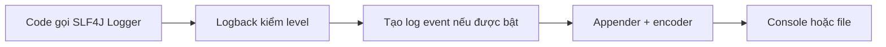

# Lesson 01 · Log để điều tra, không phải để in mọi thứ

> Mục tiêu: chọn sự kiện, mức log và dữ liệu đủ để tìm lỗi mà không lộ bí mật; hiểu SLF4J khác Logback.

## Tài liệu / video

- [SLF4J Manual](https://www.slf4j.org/manual.html): facade, provider, parameterized và fluent API.
- [Logback Architecture](https://logback.qos.ch/manual/architecture.html): logger, appender, layout và effective level.
- Video: tìm `SLF4J Logback logger appender levels Java`, `Spring Boot safe logging sensitive data`. Đây là từ khóa tìm kiếm, không phải video đã xác minh.

## 1. Từ trải nghiệm code của bạn

Bạn gọi `POST /products`, nhận500. `ApiResponse` chỉ nói lỗi chung. Cần biết request nào, feature nào, xảy ra lúc nào và exception nào để điều tra. Log phục vụ người vận hành; response phục vụ client. Hai hợp đồng khác nhau.

```text
Response: status500 + thông báo an toàn + requestId.
Log nội bộ: thời điểm + mức + logger + event + requestId + chi tiết đã kiểm soát.
```

Không trả stack trace cho client. Cũng không nghĩ “log nội bộ thì ghi password được”: log có thể bị gửi đến hệ thống khác và được nhiều người truy cập.

## 2. Ai làm gì khi gọi logger?



Ý nghĩa từng bước:

1. Code gọi API logging; SLF4J là mặt giao tiếp, không tự là nơi lưu log.
2. Logback là implementation xử lý lời gọi. Level cấu hình quyết định có ghi event không.
3. Event mang message, mức, logger, thread, thời gian và context liên quan.
4. Appender quyết định gửi đi đâu; encoder định dạng bytes, ví dụ text hoặc JSON.
5. Console chỉ là một đích xuất. Chưa có collector thì chưa có hệ thống tìm kiếm log tập trung.

Starter Spring Boot hiện tại đã kéo logging mặc định. Không thêm nhiều SLF4J provider cùng lúc để “chắc chắn có log”; kiểm dependency tree nếu xuất hiện cảnh báo multiple providers.

## 3. Mức log là quyết định vận hành

| Mức | Ví dụ chính sách của shopcore |
|---|---|
| TRACE | Chi tiết cực nhỏ khi điều tra có giới hạn |
| DEBUG | Nhánh xử lý/metadata kỹ thuật để debug |
| INFO | Sự kiện đáng quan sát trong hoạt động bình thường |
| WARN | Dấu hiệu bất thường hoặc suy giảm có thể phục hồi |
| ERROR | Thao tác thất bại bất ngờ cần điều tra |

Không có quy tắc mọi404 là ERROR. Product không tồn tại do người dùng nhập ID cũ là kết quả dự kiến; có thể DEBUG hoặc không log riêng. Provider timeout sau hết retry khiến feature thất bại có thể ERROR. Một lần retry đã phục hồi có thể WARN theo chính sách. Phải giải thích dựa trên tác động, không chỉ nhìn status.

Threshold INFO thường cho INFO/WARN/ERROR, bỏ DEBUG/TRACE. Logger theo package có thể có level riêng; appender/filter còn có thể chặn thêm. `--debug` của Boot không có nghĩa toàn bộ logger của app thành DEBUG.

```yaml
logging:
  level:
    root: INFO
    com.shopcore: DEBUG
```

Với cấu hình này, DEBUG của `com.shopcore.product` có thể xuất hiện dù root INFO; không suy luận “root luôn chặn tất cả DEBUG”. Production nên dùng mức ít ồn và bật debug có mục tiêu, có thời hạn.

## 4. Viết log có nội dung tìm được

Đoạn sau là class minh họa hoàn chỉnh, không tự động thành Spring bean:

<!-- verify: com/shopcore/logging/SafeProductLog.java -->
```java
package com.shopcore.logging;

import org.slf4j.Logger;
import org.slf4j.LoggerFactory;

public class SafeProductLog {
    private static final Logger log = LoggerFactory.getLogger(SafeProductLog.class);

    public void created(long productId) {
        log.info("event=product_created productId={}", productId);
    }

    public void details(long productId) {
        log.debug("event=product_lookup productId={}", productId);
    }
}
```

`product_created` là tên event ổn định. `productId` là giá trị có thể tra cứu; vẫn cần chính sách quyền truy cập/retention. `SafeProductLog` chỉ đóng gói ví dụ để test, **không bắt bạn tạo service log riêng cho mọi feature**. Thực tế logger thường là field trong class đang xử lý.

`{}` truyền tham số cho logger. Nó không biến input thành dữ liệu an toàn, không tự che JWT. Với log text, dữ liệu có xuống dòng vẫn có nguy cơ gây nhầm dòng log; Lesson03 dùng encoder JSON nhưng vẫn cần chọn dữ liệu.

```java
log.debug("details={}", buildExpensiveDetails());
```

Java tính `buildExpensiveDetails()` trước khi gọi logger, dù DEBUG tắt. Đặt phần tính tốn kém trong `if (log.isDebugEnabled())` hoặc dùng supplier thích hợp của fluent API. Tham số hóa tránh tự ghép message nhưng không trì hoãn mọi biểu thức Java.

## 5. Exception: giữ nguyên luồng và tránh ghi trùng

Ví dụ cục bộ, giả sử `log`, `id` và `repository` đã tồn tại:

```java
try {
    return repository.findById(id);
} catch (RuntimeException ex) {
    log.error("event=product_lookup_failed productId={}", id, ex);
    throw ex;
}
```

Throwable cuối giúp logger ghi stack trace; không chỉ `ex.getMessage()` vì mất vị trí lỗi. Tuy nhiên **đây chỉ là vị trí minh họa**: nếu GlobalExceptionHandler đã ghi cùng lỗi thì bỏ log ở đây, để một nơi sở hữu việc ghi stack trace. Catch chỉ để log rồi throw thường không cần thiết.

Rủi ro quan trọng: stack trace chứa message và cause; chúng cũng có thể chứa secret từ driver/provider. Chỉ ghi throwable vào sink đã được kiểm soát khi exception an toàn; nếu có dữ liệu nhạy cảm, dùng metadata phân loại an toàn và cơ chế redaction được kiểm, không giả định stack trace tự sạch. Không dump SQL parameters, Authorization, DTO password hoặc response provider.

Luồng lỗi không đổi vì thêm log:

```text
Repository ném lỗi → Service để lỗi đi lên
→ Advice xử lý exception trong MVC → response an toàn.
Log là dấu vết; không tự sửa lỗi hoặc thay cơ chế trả status.
```

Lỗi xảy ra trước MVC ở filter không tự được Advice bắt; đã học M3-2 sẽ thấy Security dùng entry point/denied handler. Lesson02 đặt requestId bao quanh các nhánh này.

## 6. Ngân sách log

Không log mọi vòng lặp/mọi entity tại INFO. Nhiều log gây tốn CPU/I/O, dung lượng, khó tìm event thật, có thể tăng chi phí lưu trữ. Nếu ghi file cần rotation/retention và quyền đọc; container thường ghi stdout để nền tảng thu gom. Log không thay metric tổng số lỗi/latency, không thay audit trail có yêu cầu bảo toàn.

Với request gọi model: metadata có thể gồm operation, provider đã được duyệt, duration, outcome; không mặc định ghi prompt/completion hoặc API key. Chưa cần xây hệ thống observability đầy đủ ở bài này.

## 7. Thử dự đoán

Root INFO, logger feature không override: `details(10)` im lặng, `created(10)` ghi event. Nếu test dùng appender, kiểm level/message/ID, không chỉ kiểm “không throw”. Một lỗi có3stack trace giống nhau từ Repository/Service/Advice cần chọn owner và bỏ bản trùng, không phải hạ tất cả xuống DEBUG để giấu lỗi.

## Chốt bài

Log tốt trả lời “sự kiện nào, ở đâu, kết quả gì”, không tiết lộ “mọi dữ liệu đang có”. SLF4J là API; Logback xử lý và xuất log. Chọn level theo tác động; một lỗi không cần được ghi lại ở tất cả các lớp.

[Làm đề Lesson01](../../../Exams/de-kiem-tra/M4-4-logging-hexagonal__2026-10-07__lesson1-lan1.md).
