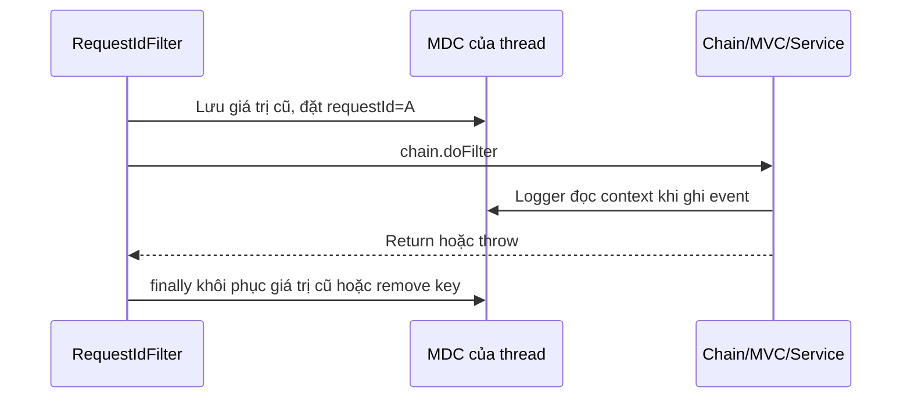

# Lesson 02 · RequestId đi theo request bằng cách nào?

> Mục tiêu: thấy rõ nơi đặt, đọc và dọn MDC; không nhầm requestId với token, session hoặc distributed trace.

## Tài liệu / video

- [Logback MDC](https://logback.qos.ch/manual/mdc.html): context theo thread và cleanup.
- [OncePerRequestFilter API](https://docs.spring.io/spring-framework/docs/current/javadoc-api/org/springframework/web/filter/OncePerRequestFilter.html): REQUEST/ASYNC/ERROR dispatch.
- [Spring Security Servlet Architecture](https://docs.spring.io/spring-security/reference/servlet/architecture.html): filter chain, lỗi Security trước Controller.
- Video: tìm `Spring Boot MDC request ID OncePerRequestFilter finally`, `MDC ThreadLocal executor propagation`. Không cần học OpenTelemetry implementation.

## 1. Vì sao có ID mà chưa cần tracing?

Hai người cùng gọi API. Console có log Service, Repository xen kẽ; timestamp gần nhau không cho biết dòng nào thuộc ai. Gắn cùng `requestId` vào các log của một lần xử lý sẽ nhóm chúng được.

```text
requestId=A event=product_lookup productId=10
requestId=B event=product_lookup productId=20
requestId=A event=product_found productId=10
```

RequestId chỉ để đối chiếu. Không dùng nó để cấp quyền, nhận diện người đăng nhập hoặc chống gọi trùng. Correlation ID có thể đại diện một tác vụ gồm nhiều request/retry; hệ thống phải thống nhất ý nghĩa, không tự coi mọi ID là duy nhất toàn cầu và đáng tin.

## 2. MDC thực chất là gì?

MDC là map context gắn với thread đang log, ví dụ `MDC.put("requestId", "A")`. Khi code sâu hơn trên **cùng thread** ghi log, backend logging có thể lấy map này. Bạn không phải thêm tham số requestId vào mọi Service method.

Nhưng Tomcat tái sử dụng thread. Nếu requestA kết thúc mà không dọn, requestB có thể bị gắn nhầm A. Đây là lỗi sai dấu vết và có thể gây lộ liên hệ giữa request.



Mũi tên xuống chain không phải gọi thẳng Controller: còn Security, DispatcherServlet, binding và Advice như các module trước. `finally` chạy cả khi chain ném exception; nó dọn context, **không có nghĩa đã xử lý lỗi**.

## 3. Filter mẫu cho xử lý synchronous

Mẫu nhận đúng một header ID có ký tự/độ dài hợp lệ; không có hoặc sai thì sinh UUID. Đây là chính sách minh họa: production public ingress có thể luôn sinh server ID hoặc chỉ nhận ID từ proxy tin cậy. ID do client gửi dù hợp lệ vẫn không đáng tin cho audit/auth. Không log raw header bị từ chối.

<!-- verify: com/shopcore/logging/RequestIdFilter.java -->
```java
package com.shopcore.logging;

import jakarta.servlet.FilterChain;
import jakarta.servlet.ServletException;
import jakarta.servlet.http.HttpServletRequest;
import jakarta.servlet.http.HttpServletResponse;
import java.io.IOException;
import java.util.Collections;
import java.util.List;
import java.util.UUID;
import java.util.regex.Pattern;
import org.slf4j.MDC;
import org.springframework.web.filter.OncePerRequestFilter;

public class RequestIdFilter extends OncePerRequestFilter {
    private static final Pattern SAFE_ID = Pattern.compile("[A-Za-z0-9_-]{1,64}");

    @Override
    protected void doFilterInternal(HttpServletRequest request,
            HttpServletResponse response, FilterChain chain)
            throws ServletException, IOException {
        String previous = MDC.get("requestId");
        String requestId = resolveId(request);
        MDC.put("requestId", requestId);
        try {
            response.setHeader("X-Request-ID", requestId);
            chain.doFilter(request, response);
        } finally {
            if (previous == null) {
                MDC.remove("requestId");
            } else {
                MDC.put("requestId", previous);
            }
        }
    }

    private String resolveId(HttpServletRequest request) {
        List<String> values = Collections.list(request.getHeaders("X-Request-ID"));
        if (values.size() == 1 && SAFE_ID.matcher(values.getFirst()).matches()) {
            return values.getFirst();
        }
        return UUID.randomUUID().toString();
    }
}
```

Đọc theo thứ tự:

1. Giữ `previous` để không phá context của scope bao ngoài nếu có.
2. Kiểm header; allowlist ASCII và giới hạn64 tránh nhận tùy ý chuỗi dài/xuống dòng.
3. Đặt MDC trước khi chain chạy; header response cho client đối chiếu.
4. Để downstream xử lý. Filter không catch business exception và tự biến mọi lỗi thành500.
5. Dọn đúng key trong finally. Không `MDC.clear()` bừa làm mất các key do tracing/thành phần khác sở hữu.

### Đăng ký đúng một lần

<!-- verify: com/shopcore/logging/RequestIdFilterConfiguration.java -->
```java
package com.shopcore.logging;

import org.springframework.boot.web.servlet.FilterRegistrationBean;
import org.springframework.context.annotation.Bean;
import org.springframework.context.annotation.Configuration;
import org.springframework.core.Ordered;

@Configuration(proxyBeanMethods = false)
public class RequestIdFilterConfiguration {
    @Bean
    FilterRegistrationBean<RequestIdFilter> requestIdFilterRegistration() {
        var registration = new FilterRegistrationBean<>(new RequestIdFilter());
        registration.setOrder(Ordered.HIGHEST_PRECEDENCE + 10);
        registration.addUrlPatterns("/*");
        return registration;
    }
}
```

Boot servlet mặc định đăng ký Spring Security sau mức này; nếu hệ thống đã chỉnh order thì kiểm lại chain thật. Mục tiêu là ID được đặt **trước Security** để log401/403 cũng có context. Không đồng thời thêm `@Component` lên filter hoặc `addFilterBefore` trong Security vì dễ đăng ký hai chỗ. Thứ tự filter khác thứ tự xử lý các Controller.

## 4. Lỗi bắt ở đâu và ID còn không?

| Nhánh synchronous bên trong chain | Nơi xử lý response thường gặp | MDC lúc handler ghi log |
|---|---|---|
| JSON lỗi, validation, AppException | MVC resolver/Advice phù hợp | Vẫn có vì filter chưa kết thúc |
| Security từ chối401/403 | EntryPoint/AccessDeniedHandler | Có nếu filter đứng trước Security |
| Filter downstream ném lỗi chưa xử lý | Container/error mechanism | Có trong stack đang được bọc; không hứa ở error redispatch |

`@RestControllerAdvice` không bao toàn bộ filter chain. `finally` cleanup xong mà container thực hiện ERROR dispatch khác thì sample này không bảo đảm ID còn đó. Header cũng có thể bị thay/reset ở cơ chế lỗi khác; kiểm integration thật trước khi hứa contract cho mọi lỗi.

## 5. Giới hạn quan trọng: async và dispatch

Tên OncePerRequestFilter không nghĩa “chạy đúng một lần cho mọi cách xử lý request”. Default bỏ qua async/error dispatch; ví dụ chỉ nhắm request synchronous. Nếu dùng async phải thiết kế propagation/lifetime theo dispatch/thread; không chỉ bỏ cleanup để giữ ID.

`CompletableFuture`, executor hay thread mới không tự nhận MDC của thread gọi. Cách tổng quát: chụp map ở lúc submit, trên worker lưu map cũ, cài map đã chụp, chạy task, finally khôi phục/remove. Có thể dùng TaskDecorator; vẫn cần kiểm tính tương thích với executor/cơ chế tracing đang dùng. Không truyền context giữa request không liên quan.

Distributed tracing còn có trace/span, quan hệ cha-con và truyền context qua service. Một requestId trong MDC chưa cung cấp các thông tin ấy. Không giả tên `traceId` cho UUID rồi tuyên bố đã có tracing.

## 6. Tự kiểm bằng hai request

- RequestA gửi `X-Request-ID: demo_A`: trong chain và response cùng ID.
- Sau A, key biến mất nếu trước đó không có; key khác như `tenantMarker` giữ nguyên.
- RequestB không gửi header: có ID mới, không dùng lại A.
- Chain ném exception: finally vẫn dọn, exception vẫn đi lên.
- Header quá dài hoặc trùng nhiều giá trị: UUID mới, không echo raw input.

Đây là các phép kiểm ở mức filter giả lập; kiểm401/403/order hoặc ERROR dispatch phải dùng ứng dụng thật với Security/container phù hợp. Không lẫn “filter unit test đạt” với “mọi request production đều có ID”.

[Làm đề Lesson02](../../../Exams/de-kiem-tra/M4-4-logging-hexagonal__2026-10-07__lesson2-lan1.md).
