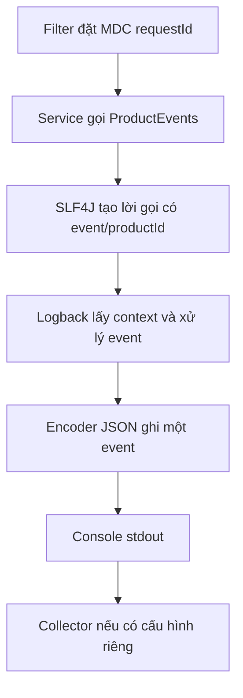

# Lesson 03 · Biến log thành dữ liệu tìm kiếm được

> Mục tiêu: xuất JSON đúng bằng logging backend; phân biệt message, field theo event, MDC theo request và response JSON.

## Tài liệu / video

- [Spring Boot Logging](https://docs.spring.io/spring-boot/reference/features/logging.html): phần Structured Logging, Logstash, custom configuration.
- [SLF4J fluent API](https://www.slf4j.org/manual.html): `atInfo`, `addKeyValue`, `log`.
- [OWASP Logging Cheat Sheet](https://cheatsheetseries.owasp.org/cheatsheets/Logging_Cheat_Sheet.html): dữ liệu không nên ghi, quyền truy cập và kiểm log injection.
- Video: tìm `Spring Boot structured logging logstash MDC`, `Spring Boot structured logging 3.4`. Video3.4 giúp hiểu nguồn gốc tính năng; đối chiếu dependency/config với Boot4.1.1 của project, không downgrade project theo video.

## 1. JSON log khác JSON response

Response JSON đi ra client. JSON log đi ra console/file/collector để vận hành tìm kiếm. Cùng dạng JSON không có nghĩa cùng nội dung hoặc cùng nơi nhận.

```text
Controller trả DTO → HTTP message converter → client.
Code gọi logger → Logback encoder → log output.
```

Không dùng ApiResponse để bọc từng log. Không trả log nội bộ trong HTTP body. RequestId là cầu nối tra cứu, không làm hai luồng trở thành một.

## 2. Text có được không?

Text dễ nhìn bằng mắt, nhưng tìm chuỗi `500` có thể trúng giá500, productId500, hoặc status500. Structured log có field rõ để lọc theo tên và kiểu dữ liệu. Nó vẫn cần collector/index/query phù hợp nếu muốn tìm kiếm tập trung.

```json
{"level":"INFO","message":"product_created","requestId":"demo_A","productId":10}
```

Đây là hình minh họa tối giản, không phải cam kết mọi format đều có đúng field ấy. ECS và Logstash khác schema. Chọn một format rồi đọc output thật trước khi viết query/dashboard.

## 3. Cấu hình tối thiểu của Boot hiện tại

Trong `src/main/resources/application.yml` dùng cấu hình chung sau. Không cần tạo file Logback XML khi starter mặc định đủ dùng.

<!-- verify: resources/application.yml -->
```yaml
spring:
  application:
    name: shopcore
  main:
    banner-mode: "off"

logging:
  level:
    root: INFO
    com.shopcore: INFO
  structured:
    format:
      console: logstash
```

Boot hỗ trợ ECS/GELF/Logstash; ví dụ chọn Logstash để field dễ đọc. Encoder biến event thành JSON, không phải bật database Logstash hay Elasticsearch. Tên format không tự cài server thu gom log.

Profile dev có thể override `logging.level.com.shopcore: DEBUG`; prod giữ INFO. Nếu file nền đã bật JSON mà dev muốn text, phải override/xóa đúng property structured format, không chỉ sửa `logging.pattern.console` rồi nghĩ JSON tắt. Bài này dùng JSON cho cả hai để ít biến số.

## 4. Một event với field riêng

Class sau là ví dụ độc lập, có thể được gọi từ application/service hoặc adapter phù hợp:

<!-- verify: com/shopcore/logging/ProductEvents.java -->
```java
package com.shopcore.logging;

import org.slf4j.Logger;
import org.slf4j.LoggerFactory;

public class ProductEvents {
    private static final Logger log = LoggerFactory.getLogger(ProductEvents.class);

    public void created(long productId) {
        log.atInfo()
                .addKeyValue("event", "product_created")
                .addKeyValue("productId", productId)
                .log("Product created");
    }
}
```

`addKeyValue` thêm dữ liệu cho **event này**; `.log()` mới kết thúc lời gọi. `requestId` không cần truyền vào vì filter Lesson02 đã đặt MDC trên thread. `productId` không nên nhét vào MDC rồi quên dọn vì event tiếp theo có thể nói về Product khác.

Output minh họa rút gọn:

```json
{"@timestamp":"2026-10-07T10:00:00Z","level":"INFO","logger_name":"com.shopcore.logging.ProductEvents","message":"Product created","requestId":"demo_A","event":"product_created","productId":10}
```

Giá trị thời gian/logger/thread phụ thuộc runtime; đừng so sánh nguyên dòng byte trong test. Kiểm field có ý nghĩa. Không dùng tên custom trùng field nền như `message`, `level`, `@timestamp`; thống nhất schema để tránh xung đột.

## 5. Luồng đầy đủ của một dòng JSON



Filter sở hữu context request, event sở hữu metadata hành động, encoder sở hữu cách biểu diễn. Nếu MDC không có requestId thì encoder không tự đoán ra. Nếu level chặn INFO thì đổi format JSON cũng không làm event xuất hiện. Collector là bước ngoài ứng dụng, không được coi là đã có chỉ vì console xuất JSON.

## 6. Đừng tự ghép JSON

```java
log.info("{\"name\":\"" + name + "\"}");
```

Nếu `name` có dấu nháy hoặc newline, tự ghép sai có thể phá cấu trúc. Khi logger đã xuất JSON, cách trên còn tạo một chuỗi JSON nằm bên trong field `message`, không tự thành field `name` có kiểu rõ ràng. Dùng key/value API cho metadata đã được cho phép; không log tên người thật chỉ để thử escaping.

Encoder đúng escape ký tự theo JSON, nhưng **escaping không phải redaction**. Password được escape vẫn là password bị lộ. Không log raw request body/Authorization/JWT, entity chứa dữ liệu riêng tư, prompt hoặc provider response nguyên văn. Kiểm cả message/cause của exception; tên field an toàn không đảm bảo giá trị an toàn.

## 7. Debug khi đã bật JSON mà vẫn không đúng

1. Xác nhận profile/env/command line đang có hiệu lực, không chỉ nhìn file đang mở.
2. Kiểm có `logback-spring.xml` hoặc appender custom ghi text không. Custom config phải hỗ trợ structured encoder; property không tự sửa mọi XML cũ.
3. Phân biệt dòng do Logback ghi với `System.out.println`, banner hoặc process khác. Không ép mọi stdout đều là JSON bằng suy đoán.
4. Parse các dòng event thực tế, kiểm requestId/level/field. Kiểm cả sau lỗi để phát hiện context rò rỉ.

Nếu xuất file cần rotation/retention, giới hạn dung lượng và quyền truy cập. Docker stdout cũng cần giới hạn lưu giữ ở runtime/collector. Đổi sang JSON không tự giải quyết disk đầy hoặc quyền đọc log.

## 8. Phép kiểm nhỏ, có bằng chứng

Tạo một request có ID `demo_A`, một request không ID và một request lỗi. Với từng event của ứng dụng:

- Parse được JSON; timestamp/mức/logger/message có nghĩa.
- Request đầu có đúng ID, request sau không thừa ID cũ.
- Field event/productId đúng, productId là số nếu encoder giữ kiểu số.
- Không có password/token/body trong dữ liệu đầu ra, kể cả log exception đã chọn.
- Dữ liệu giả lập có nháy/newline được encode thành một event JSON hợp lệ, không tạo một event giả.

Filter mock và encoder test tách rời chưa chứng minh order thật của Security hoặc collector đã ingest được. Thử app thật khi làm deliverable, nhưng hiện tại có thể học bằng dự đoán và đọc output mẫu.

## Chốt bài

MDC = context theo thread/request. Key/value = metadata của event. JSON = định dạng xuất. Collector = nơi thu gom. Tracing = quan hệ các span/service. Năm thứ liên quan nhưng không thay thế lẫn nhau.

[Làm đề Lesson03](../../../Exams/de-kiem-tra/M4-4-logging-hexagonal__2026-10-07__lesson3-lan1.md).
