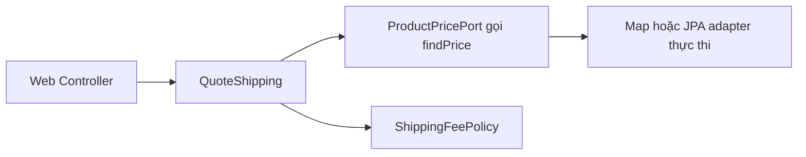
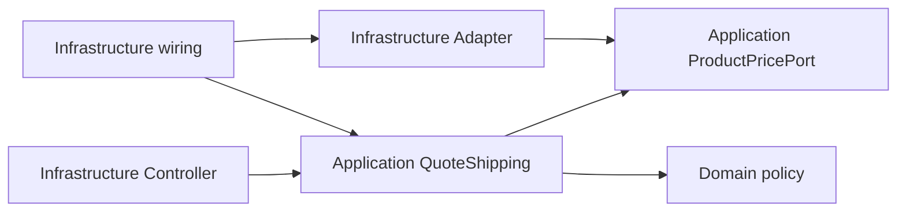

# Lesson 04 · Hexagonal: giữ nghiệp vụ khỏi chi tiết bên ngoài

> Mục tiêu: chuyển hiểu biết3lớp thành hiểu biết ranh giới phụ thuộc. Chỉ skeleton một feature, không học DDD/C4 đầy đủ.

## Tài liệu / video

- [Alistair Cockburn: Hexagonal Architecture](https://alistair.cockburn.us/hexagonal-architecture): bài gốc về bên trong/bên ngoài và thay adapter.
- [Spring: @Bean và @Configuration](https://docs.spring.io/spring-framework/reference/core/beans/java/basic-concepts.html): nối Java object thành bean.
- Video: tìm `Alistair Cockburn hexagonal architecture ports adapters`, `Java hexagonal runtime flow dependency direction`. Phân biệt code mẫu tự chọn với quy định của framework.

## 1. Từ3lớp quen thuộc đến câu hỏi mới

Controller gọi Service gọi Repository vẫn có thể ổn. Nhưng nếu Service import `JpaRepository`, `ResponseEntity`, SDK provider và dữ liệu bảng trực tiếp thì nghiệp vụ bị gắn vào nhiều công nghệ. Đổi web thành job hoặc đổi DB có thể lan vào rule.

Hexagonal tập trung ranh giới **bên trong nghiệp vụ và bên ngoài công nghệ**. Không phải vẽ đúng sáu cạnh; không cần sáu layer hoặc sáu interface.

| Package của skeleton | Trách nhiệm |
|---|---|
| `domain` | Rule và khái niệm nghiệp vụ độc lập HTTP/DB |
| `application` | Use case phối hợp rule và các port cần dùng |
| `infrastructure` | Web, persistence/provider adapter, cấu hình wiring |

Tên package là lựa chọn của module. Kiến trúc được quyết định bởi **dependency**, không chỉ tên folder. Dự án có thể chia theo feature rồi mỗi feature có3package.

## 2. Feature minh họa thống nhất với M4-3

Báo phí vận chuyển theo Product và số lượng:

- ProductID/số lượng dương; Product phải tồn tại.
- Unit price không âm, lấy qua port.
- Tổng tiền = unit price × quantity, dùng BigDecimal.
- Tổng dưới500000 VND phí30000; từ500000 miễn phí.

Đây là rule học, không tích hợp provider vận chuyển. Không cần query SQL/JPA mới để hiểu kiến trúc.

```text
com.shopcore.shipping
  domain/ShippingFeePolicy.java
  application/ProductPricePort.java
  application/ProductMissingException.java
  application/QuoteShipping.java
  infrastructure/MapProductPriceAdapter.java
  infrastructure/ShippingConfiguration.java
  infrastructure/ShippingController.java
```

Mỗi file Java dưới đây là một file riêng, không dán tất cả vào một class. Core dùng Java thuần; adapter mẫu dùng dữ liệu giả chỉ để xem luồng. **Không thay repository thực của shopcore bằng map khi làm production.**

## 3. Domain: biết rule, không biết REST

<!-- verify: com/shopcore/shipping/domain/ShippingFeePolicy.java -->
```java
package com.shopcore.shipping.domain;

import java.math.BigDecimal;

public class ShippingFeePolicy {
    public BigDecimal calculate(BigDecimal subtotal) {
        if (subtotal == null || subtotal.signum() < 0) {
            throw new IllegalArgumentException("Subtotal must be non-negative");
        }
        return subtotal.compareTo(new BigDecimal("500000")) >= 0
                ? BigDecimal.ZERO : new BigDecimal("30000");
    }
}
```

Domain không hỏi request đang ở URL nào. So sánh BigDecimal bằng `compareTo` cho rule giá trị, không dùng `equals` để phân biệt sai500000và500000.00. Không cần tạo interface `ShippingFeePolicyInterface` chỉ vì có chữ Hexagonal.

## 4. Application: cần giá, không cần biết giá lưu đâu

<!-- verify: com/shopcore/shipping/application/ProductPricePort.java -->
```java
package com.shopcore.shipping.application;

import java.math.BigDecimal;
import java.util.Optional;

public interface ProductPricePort {
    Optional<BigDecimal> findPrice(long productId);
}
```

Port mô tả **nhu cầu của use case**, không kéo `Pageable`, `ResponseEntity`, JPA Entity hoặc SDK DTO vào core. Đây là outbound port vì use case gọi ra bên ngoài để lấy dữ liệu. `Optional.empty()` nghĩa không tìm thấy; lỗi kết nối không nên giả thành empty, nếu không sẽ trả nhầm404.

<!-- verify: com/shopcore/shipping/application/ProductMissingException.java -->
```java
package com.shopcore.shipping.application;

public class ProductMissingException extends RuntimeException {
    public ProductMissingException(long id) {
        super("Product not found: " + id);
    }
}
```

<!-- verify: com/shopcore/shipping/application/QuoteShipping.java -->
```java
package com.shopcore.shipping.application;

import com.shopcore.shipping.domain.ShippingFeePolicy;
import java.math.BigDecimal;

public class QuoteShipping {
    private final ProductPricePort prices;
    private final ShippingFeePolicy policy;

    public QuoteShipping(ProductPricePort prices, ShippingFeePolicy policy) {
        this.prices = prices;
        this.policy = policy;
    }

    public BigDecimal quote(long productId, int quantity) {
        if (productId <= 0 || quantity <= 0) {
            throw new IllegalArgumentException("Product ID and quantity must be positive");
        }
        BigDecimal unitPrice = prices.findPrice(productId)
                .orElseThrow(() -> new ProductMissingException(productId));
        return policy.calculate(unitPrice.multiply(BigDecimal.valueOf(quantity)));
    }
}
```

Use case validate input có ý nghĩa nghiệp vụ, hỏi port, tính subtotal, gọi domain. Nếu unit price âm do adapter sai, policy từ chối; đây không phải lỗi400 của client gửi unit price vì client không gửi giá. Outer exception mapping phải phân biệt nguồn lỗi, không map tất cả IllegalArgumentException thành400 một cách vô điều kiện.

`QuoteShipping` là điểm vào use case (inbound API của application). Module nhỏ này không bắt tạo thêm interface inbound; có thể thêm khi thật sự cần contract/multiple adapters. Method Java của use case không phải HTTP endpoint.

## 5. Adapter: thực hiện lời hứa của port

<!-- verify: com/shopcore/shipping/infrastructure/MapProductPriceAdapter.java -->
```java
package com.shopcore.shipping.infrastructure;

import com.shopcore.shipping.application.ProductPricePort;
import java.math.BigDecimal;
import java.util.Map;
import java.util.Optional;

public class MapProductPriceAdapter implements ProductPricePort {
    private final Map<Long, BigDecimal> prices;

    public MapProductPriceAdapter(Map<Long, BigDecimal> prices) {
        this.prices = Map.copyOf(prices);
    }

    @Override
    public Optional<BigDecimal> findPrice(long productId) {
        return Optional.ofNullable(prices.get(productId));
    }
}
```

Adapter implement interface phía application. JPA adapter sau này có thể giữ JpaRepository, đọc ProductEntity, chuyển `price` ra BigDecimal. Core không phải import JPA để nhận được giá. In-memory, fake test và JPA là các implementation có thể thay thế nếu cùng giữ nghĩa contract; không hứa đổi DB chỉ sửa đúng một file cho mọi trường hợp.

## 6. Wiring: ai new object và inject ai?

<!-- verify: com/shopcore/shipping/infrastructure/ShippingConfiguration.java -->
```java
package com.shopcore.shipping.infrastructure;

import com.shopcore.shipping.application.ProductPricePort;
import com.shopcore.shipping.application.QuoteShipping;
import com.shopcore.shipping.domain.ShippingFeePolicy;
import java.math.BigDecimal;
import java.util.Map;
import org.springframework.context.annotation.Bean;
import org.springframework.context.annotation.Configuration;

@Configuration(proxyBeanMethods = false)
public class ShippingConfiguration {
    @Bean
    ProductPricePort productPricePort() {
        return new MapProductPriceAdapter(Map.of(10L, new BigDecimal("250000")));
    }

    @Bean
    ShippingFeePolicy shippingFeePolicy() {
        return new ShippingFeePolicy();
    }

    @Bean
    QuoteShipping quoteShipping(ProductPricePort prices, ShippingFeePolicy policy) {
        return new QuoteShipping(prices, policy);
    }
}
```

`@Bean` đăng ký object Java thuần vào Spring. Spring đưa đúng implementation của port vào constructor; interface tự nó không thể được `new`. Nếu có nhiều bean ProductPricePort phải chọn rõ bằng qualifier/profile/config, không trông Spring đoán đúng.

Đây là composition root ngoài core. Dùng `@Service` trong application cũng là trade-off nhiều dự án chấp nhận; skeleton này chọn thuần Java để nhìn ranh giới rõ. Không tuyên bố một annotation là tự động làm hỏng mọi kiến trúc.

## 7. Web adapter và DTO ở ngoài

<!-- verify: com/shopcore/shipping/infrastructure/ShippingController.java -->
```java
package com.shopcore.shipping.infrastructure;

import com.shopcore.shipping.application.QuoteShipping;
import java.math.BigDecimal;
import org.springframework.web.bind.annotation.GetMapping;
import org.springframework.web.bind.annotation.RequestParam;
import org.springframework.web.bind.annotation.RestController;

@RestController
public class ShippingController {
    private final QuoteShipping quoteShipping;

    public ShippingController(QuoteShipping quoteShipping) {
        this.quoteShipping = quoteShipping;
    }

    @GetMapping("/api/shipping-quote")
    public QuoteResponse quote(@RequestParam("productId") long productId,
            @RequestParam("quantity") int quantity) {
        return new QuoteResponse(quoteShipping.quote(productId, quantity));
    }

    public static class QuoteResponse {
        private final BigDecimal fee;

        public QuoteResponse(BigDecimal fee) { this.fee = fee; }
        public BigDecimal getFee() { return fee; }
    }
}
```

GET với `productId=10&quantity=1` → phí30000; quantity2 → phí0. ResponseDTO là class, không expose entity. Ví dụ tối thiểu bỏ wrapper để nhìn kiến trúc; khi tích hợp shopcore có thể trả `ResponseEntity<ApiResponse<QuoteResponse>>` ở Controller, không đưa wrapper ấy vào domain.

**Mẫu Controller chưa có error mapping hoàn chỉnh**: trong shopcore, Advice phía web cần map ProductMissingException sang business response404 tương ứng ErrorCode, lỗi input dương sang400 và lỗi dữ liệu giá/DB bất ngờ sang5xx an toàn. Có thể dùng exception input chuyên biệt để phân loại chắc hơn. Không nhập ErrorCode chứa HttpStatus vào core rồi gọi đó là hoàn toàn độc lập Spring. Nếu tiếp tục dùng AppException hiện tại ở application, ghi nhận coupling đó như trade-off, không cần rewrite toàn hệ thống để học skeleton.

## 8. Hai sơ đồ phải đọc khác nhau

**Luồng gọi lúc chạy:**



Request vào Controller, use case cần giá nên gọi object qua interface. Object thực tế là adapter Spring đã inject. Có giá thì rule tính phí. Port không phải một service mạng nằm giữa và không tạo thêm HTTP request.

**Chiều phụ thuộc import/implements:**



Điểm khác: adapter **phụ thuộc vào port**, use case không import adapter. Runtime gọi ra ngoài nhưng source dependency hướng về contract bên trong. Đây là Dependency Inversion bạn đã học SOLID, không phải “đổi mũi tên cho đẹp”.

## 9. Làm ít nhưng đúng

Test use case bằng fake port trả250000: quantity1→30000, quantity2→0; empty→ProductMissingException; quantity0 bị từ chối trước khi gọi port. Chạy không Spring/DB chứng minh rule/use case không cần infrastructure để thực thi. Chưa chứng minh JPA mapping, transaction hay HTTP Advice đúng.

Khi đổi sang provider AI: application định nghĩa nhu cầu như `TextGenerationPort`; adapter giữ SDK/timeout/credential mapping. Không biến mọi class thành port, không cho domain nhận SDK response rồi lộ dữ liệu ra API. Core độc lập không có nghĩa bỏ transaction; chọn transaction boundary use case phù hợp và kiểm integration ở phần học sau.

Checklist tự đọc code: core import gì? Ai implement port? Ai wiring? DTO/entity map ở đâu? Nếu ba folder mới nhưng application vẫn gọi `new JpaAdapter()` thì chưa đạt mục tiêu.

[Làm đề Lesson04](../../../Exams/de-kiem-tra/M4-4-logging-hexagonal__2026-10-07__lesson4-lan1.md).
