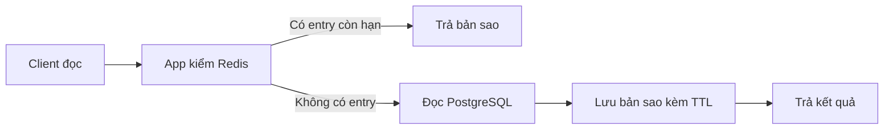

# Lesson 01 · Redis đang giữ cái gì?

> Mục tiêu: hiểu key/value, string/hash và TTL; đọc được lệnh Redis trước khi thêm annotation Spring.

## Tài liệu / video

- [Redis keys và expiration](https://redis.io/docs/latest/develop/using-commands/keyspace/).
- [SET](https://redis.io/docs/latest/commands/set/), [TTL](https://redis.io/docs/latest/commands/ttl/), [EXPIRE](https://redis.io/docs/latest/commands/expire/).
- [Redis hashes](https://redis.io/docs/latest/develop/data-types/hashes/).
- Video: tìm `Redis strings hashes TTL redis-cli beginner`, `Redis cache aside explained`. Đây là từ khóa, không phải link video đã xác minh.

## 1. Từ DB bạn đã biết

Product thật được lưu trong PostgreSQL. Mỗi lần client list Product, app có thể query cùng dữ liệu nhiều lần. Nếu danh sách ít đổi và nhiều người đọc cùng truy vấn, app có thể giữ một **bản sao có thể bỏ đi** trong Redis.

```text
PostgreSQL: nguồn gốc Product của feature này.
Redis: bản sao kết quả đọc, mất thì có thể query DB dựng lại.
```

Redis là server dữ liệu qua network, không phải một HashMap nằm ngay trong JVM Service. Nhiều instance app có thể dùng chung Redis. Nó vẫn có độ trễ network, serialization, giới hạn RAM và khả năng lỗi. Nhanh không có nghĩa mọi request cần thêm Redis.

Redis có thể dùng ngoài caching và có tùy chọn persistence; bài này chỉ dùng vai trò cache. Không suy “Redis không bao giờ giữ dữ liệu bền vững” từ cấu hình lab không persistence.

## 2. Key/value không phải table/row

```text
key:   shopcore:dev:product:10
type:  string
value: {"id":10,"name":"Keyboard"}
```

Redis string chứa chuỗi bytes, có thể là JSON hoặc dữ liệu khác. Redis không tự hiểu object Product/JPA từ bytes ấy; client/serializer chịu trách nhiệm chuyển đổi. Tên key là quy ước của app, dấu `:` không tự tạo folder hay foreign key.

Hash là một key chứa các field/value:

```text
key: shopcore:dev:product:10:fields
  name -> Keyboard
  price -> 250000
```

Đừng nhầm Redis hash với Java HashMap hoặc thuật toán hash password. Một hash hữu ích khi cần đọc/sửa vài field; một JSON string tiện để cache nguyên snapshot DTO. Không bắt mọi DTO phải dùng hash.

## 3. Redis lab tối thiểu, không sửa project

Nếu có Docker, chạy server riêng chỉ trên localhost, chọn port16379để tránh đụng6379:

```bash
docker run --rm -d --name shopcore-redis-lab \
  -p 127.0.0.1:16379:6379 redis:7.4-alpine \
  redis-server --save "" --appendonly no
docker exec -it shopcore-redis-lab redis-cli
```

Nếu port đã dùng, chọn port khác và sửa app config tương ứng. Server không auth này chỉ dành cho lab local, không public Internet; production cần network isolation, ACL/auth/TLS thích hợp. Không log password kết nối. `--rm` xóa container khi dừng; lab này không mount dữ liệu và không persistence.

Các lệnh dưới đây nhập **bên trong redis-cli**, không phải câu SQL hay shell command:

```text
PING
SET m51:demo:string "Keyboard" EX 60
GET m51:demo:string
TYPE m51:demo:string
TTL m51:demo:string
HSET m51:demo:hash name "Keyboard" price "250000"
HGET m51:demo:hash name
HGETALL m51:demo:hash
EXPIRE m51:demo:hash 60
TTL m51:demo:hash
DEL m51:demo:string m51:demo:hash
```

PING→PONG. SET tạo string có TTL; GET lấy value; TYPE cho kiểu Redis. HSET đặt field của hash, HGET đọc một field, HGETALL đọc toàn hash. EXPIRE áp expiration cho key hash trong ví dụ. DEL bỏ đúng hai key mẫu, không tác động DB Product.

Không chạy FLUSHALL/FLUSHDB trên Redis dùng chung để “làm sạch cache test”. Dừng lab từ terminal bằng `docker stop shopcore-redis-lab`.

## 4. TTL: bản sao được sống bao lâu?

TTL trả số giây còn lại; `-1` là key tồn tại nhưng không expiration, `-2` là key không tồn tại. TTL có thể về0trước khi key biến mất, nên không coi0là key vĩnh viễn.

```text
t=0:  SET key value EX 60
t=20: GET key → value; TTL còn xấp xỉ40
t>60: GET key → không có; app phải xử lý cache miss
```

GET thường không làm TTL nhảy lại60. Ghi SET mới không kèm expiration thường bỏ TTL cũ; nếu muốn giữ cần policy/lệnh phù hợp như KEEPTTL hoặc set TTL lại. Đừng tách `SET` rồi `EXPIRE` mà coi chắc chắn đã atomic: process có thể chết giữa hai lệnh. SET với EX/PX gắn value và TTL trong cùng lệnh.

Trong Redis7.4có hash-field expiration, nhưng bài dùng **TTL toàn key**. Không nói Redis hash không bao giờ hỗ trợ TTL field; chỉ là tính năng đó ngoài bài học cơ bản.

## 5. Redis có tự cập nhật theo PostgreSQL không?

Không. DB đổi Product.name không tự sửa JSON/hash cũ. App phải bỏ/cập nhật cache theo chính sách, hoặc chấp nhận cũ đến lúc hết TTL. TTL giúp giới hạn tuổi của từng entry, không đảm bảo ngay sau update là dữ liệu mới.



Có entry còn hạn là **hit**. Không có là **miss**. App, không phải Redis, quyết định gọi DB và nạp cache. Đọc miss không đồng nghĩa Product không tồn tại; chỉ là cache chưa có dữ liệu. Product có tồn tại hay không phải hỏi nguồn gốc dữ liệu.

## 6. Key phải có phạm vi

`products` quá mơ hồ nếu dev/prod dùng chung Redis. Dùng prefix theo app/môi trường/schema: `shopcore:dev:v1:productLists::...`. Cache không thay quyền truy cập. Nếu kết quả khác theo tenant/user thì key chung là nguy cơ lộ dữ liệu, kể cả TTL chỉ10giây.

Không cache password/token hoặc dữ liệu riêng tư chỉ vì đang lưu “tạm”. Key/value cũng có thể được operator nhìn thấy; mã hóa Base64 không phải bảo mật. Bài sau chỉ cache public catalog.

## 7. Tự dự đoán trước khi thi

`SET m51:demo:a x EX 60`, rồi `SET m51:demo:a y` → còn value y nhưng TTL thường thành-1. `GET` một hash bằng lệnh string → WRONGTYPE, không tự chuyển hash thành JSON. Cache mất/expire → miss, không xóa Product gốc.

[Làm đề Lesson01](../../../Exams/de-kiem-tra/M5-1-redis__2026-10-07__lesson1-lan1.md).
