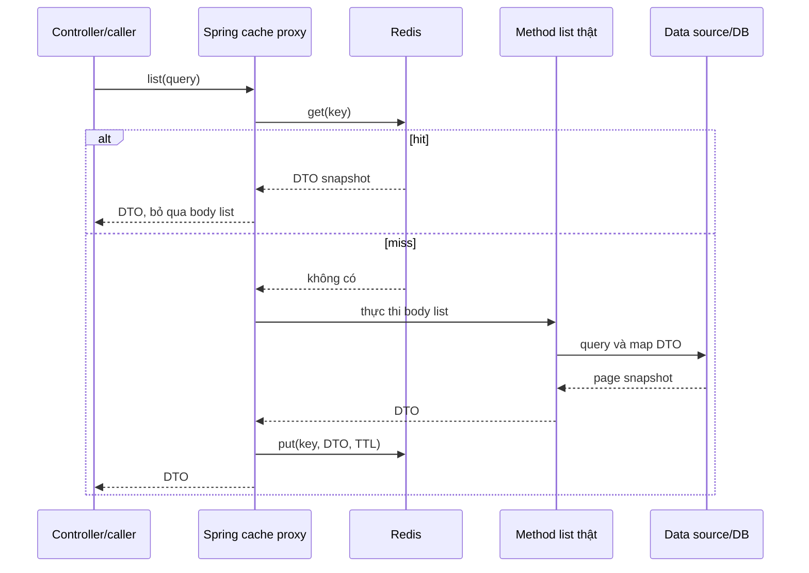

# Lesson 02 · Cache-aside và Spring Cache thực sự chạy thế nào?

> Mục tiêu: theo dấu hit/miss qua proxy và thiết kế product-list key không trả nhầm trang/filter.

## Tài liệu / video

- [Spring Cache abstraction](https://docs.spring.io/spring-framework/reference/integration/cache/strategies.html).
- [Annotation caching](https://docs.spring.io/spring-framework/reference/integration/cache/annotations.html): @Cacheable, key và self-invocation.
- [Boot caching](https://docs.spring.io/spring-boot/reference/io/caching.html), [Redis Cache](https://docs.spring.io/spring-data/redis/reference/redis/redis-cache.html).
- [JacksonJsonRedisSerializer](https://docs.spring.io/spring-data/redis/reference/api/java/org/springframework/data/redis/serializer/JacksonJsonRedisSerializer.html): typed JSON cho Spring Data Redis4/Jackson3.
- [RedisCacheWriter configurer](https://docs.spring.io/spring-data/redis/reference/api/java/org/springframework/data/redis/cache/RedisCacheWriter.RedisCacheWriterConfigurer.html): ghi deferred/async và immediateWrites.
- Video: tìm `Spring Cache cacheable proxy self invocation`, `Spring Data Redis cache TTL serialization`. Đối chiếu phiên bản, không copy Jackson2 config vào Boot4 một cách máy móc.

## 1. Cache-aside do ứng dụng điều phối

```text
Đọc key → hit: trả snapshot từ cache, không chạy query body.
         miss: query nguồn dữ liệu → map DTO → put cache + TTL → trả DTO.
```

Không phải Redis gọi PostgreSQL thay bạn. Với Spring Cache, interceptor quanh method làm việc đọc/ghi cache; body method làm query khi miss. Không cần vừa viết GET/SET thủ công vừa gắn @Cacheable cho cùng luồng nếu không có lý do rõ.

## 2. Proxy đứng giữa Controller và Service



Vẫn có HTTP binding/Controller/response như M1-2. Chỉ thêm interceptor cache quanh lời gọi bean. Controller không cần tự hỏi Redis. Khi hit, business/body trong method không chạy; **đừng đặt kiểm quyền bắt buộc chỉ trong body có thể bị bỏ qua**. Cache authorization-dependent result cần boundary/key riêng và kiểm Security thích hợp.

`new ProductCatalogRead(...)` không đi qua Spring proxy. `this.list(...)` trong cùng object cũng không đi qua proxy mặc định. Annotation là metadata, không tự biến mọi lời gọi Java thành cached call. Bean phải được Spring quản lý và caching được bật.

## 3. Dependencies/config kết nối

shopcore đã có web/JSON. Khi tích hợp, thêm hai starter sau vào dependencies POM, không tự pin version ngoài BOM:

```xml
<dependency>
    <groupId>org.springframework.boot</groupId>
    <artifactId>spring-boot-starter-cache</artifactId>
</dependency>
<dependency>
    <groupId>org.springframework.boot</groupId>
    <artifactId>spring-boot-starter-data-redis</artifactId>
</dependency>
```

Trong config local cho lab16379của Lesson01:

```yaml
spring:
  data:
    redis:
      host: localhost
      port: 16379
      connect-timeout: 500ms
      timeout: 500ms
shopcore:
  cache:
    prefix: "shopcore:dev:v1:"
```

Timeout500ms chỉ là giá trị lab, không SLA chung. App và Redis cùng Docker network thì host là service name, không localhost của container app. Password production lấy từ external config, không commit. Có custom CacheManager dưới đây nên không trông `spring.cache.redis.time-to-live` tự ghi đè mọi bean Java do bạn tạo.

## 4. Contract query: chuẩn hóa trước khi dùng key

Một public request có category, keyword, page, size, sort. Cùng truy vấn về nghĩa nên ra cùng key; khác kết quả thì không được đụng key. **Chuẩn hóa keyword giống nhau trong key và query DB thật**. Mẫu chọn tìm không phân biệt hoa/thường, trim đầu/cuối, không tự xóa khoảng trắng ở giữa từ.

<!-- verify: com/shopcore/catalog/ProductListQuery.java -->
```java
package com.shopcore.catalog;

import java.nio.charset.StandardCharsets;
import java.util.Base64;
import java.util.Locale;
import java.util.Set;

public class ProductListQuery {
    private static final Set<String> SORTS = Set.of("id,asc", "price,asc", "price,desc", "name,asc");
    private final Long categoryId;
    private final String keyword;
    private final int page;
    private final int size;
    private final String sort;

    public ProductListQuery(Long categoryId, String keyword, int page, int size, String sort) {
        if (categoryId != null && categoryId <= 0) throw new IllegalArgumentException("Invalid category");
        if (page < 0 || size < 1 || size > 100) throw new IllegalArgumentException("Invalid page/size");
        this.keyword = keyword == null ? "" : keyword.trim().toLowerCase(Locale.ROOT);
        if (this.keyword.length() > 100) throw new IllegalArgumentException("Keyword too long");
        this.sort = sort == null ? "id,asc" : sort.trim().toLowerCase(Locale.ROOT);
        if (!SORTS.contains(this.sort)) throw new IllegalArgumentException("Unsupported sort");
        this.categoryId = categoryId;
        this.page = page;
        this.size = size;
    }

    public Long getCategoryId() { return categoryId; }
    public String getKeyword() { return keyword; }
    public int getPage() { return page; }
    public int getSize() { return size; }
    public String getSort() { return sort; }

    public String cacheKey() {
        String encoded = Base64.getUrlEncoder().withoutPadding()
                .encodeToString(keyword.getBytes(StandardCharsets.UTF_8));
        return "category=" + (categoryId == null ? "all" : categoryId)
                + "|keyword=" + encoded + "|page=" + page + "|size=" + size + "|sort=" + sort;
    }
}
```

Constructor validate trước khi proxy lookup, nên input sai không được hợp thức hóa bằng cache hit. Base64 tránh keyword chứa dấu phân cách làm key mơ hồ, **không bảo mật keyword**. Không cần nhớ Base64 API để thi; cần biết key không bỏ sót tham số hay collision do ghép tùy ý.

Sort name/price cần tie-breaker ID ổn định trong query thực để paging không đảo ngẫu nhiên giữa các lần đọc. Key đúng không tự sửa query thiếu ORDER BY. Mẫu public nên không có tenant; thêm tenant/locale/visibility nếu chúng làm đổi kết quả, hoặc không cache chung.

## 5. Cache một DTO snapshot, không entity LAZY

Mỗi block là một file riêng. DTO dùng class như bạn quen; getter/setter viết tường minh để thấy serializer cần dữ liệu nào. Có thể dùng Lombok tương đương trong project.

<!-- verify: com/shopcore/catalog/ProductRow.java -->
```java
package com.shopcore.catalog;

import java.math.BigDecimal;

public class ProductRow {
    private Long id;
    private String name;
    private BigDecimal price;
    public ProductRow() {}
    public ProductRow(Long id, String name, BigDecimal price) {
        this.id = id; this.name = name; this.price = price;
    }
    public Long getId() { return id; }
    public void setId(Long id) { this.id = id; }
    public String getName() { return name; }
    public void setName(String name) { this.name = name; }
    public BigDecimal getPrice() { return price; }
    public void setPrice(BigDecimal price) { this.price = price; }
}
```

<!-- verify: com/shopcore/catalog/ProductListPage.java -->
```java
package com.shopcore.catalog;

import java.util.List;

public class ProductListPage {
    private List<ProductRow> content;
    private int page;
    private int size;
    private long totalElements;
    private int totalPages;
    public ProductListPage() {}
    public ProductListPage(List<ProductRow> content, int page, int size, long totalElements) {
        this.content = content; this.page = page; this.size = size; this.totalElements = totalElements;
        this.totalPages = (int) Math.ceil((double) totalElements / size);
    }
    public List<ProductRow> getContent() { return content; }
    public void setContent(List<ProductRow> content) { this.content = content; }
    public int getPage() { return page; }
    public void setPage(int page) { this.page = page; }
    public int getSize() { return size; }
    public void setSize(int size) { this.size = size; }
    public long getTotalElements() { return totalElements; }
    public void setTotalElements(long totalElements) { this.totalElements = totalElements; }
    public int getTotalPages() { return totalPages; }
    public void setTotalPages(int totalPages) { this.totalPages = totalPages; }
}
```

Đây là shape tối thiểu tương tự PageResponse đã học. Constructor nhận snapshot đã hợp lệ; query constructor bảo đảm size dương trong luồng mẫu. Public production DTO có thể thêm invariant/validation. Không dùng DTO này cho mọi cache với kiểu dữ liệu khác.

Cache content **và metadata**, không chỉ list items; nếu tạo/xóa Product thì totalElements/totalPages cũng đổi. Map từ JPA Page sang DTO trong service/data adapter khi session còn phù hợp; không để Redis serializer tự đi qua relation LAZY hoặc cache PageImpl nội bộ của framework.

## 6. Data source contract và read bean

<!-- verify: com/shopcore/catalog/ProductCatalogSource.java -->
```java
package com.shopcore.catalog;

public interface ProductCatalogSource {
    ProductListPage findList(ProductListQuery query);
    void rename(long productId, String newName);
}
```

Đây là port dữ liệu mẫu, **chưa phải JPA implementation**. Contract: findList dùng đúng query đã normalize, filter đồng thời, order ổn định, trả page DTO không null kể cả content rỗng. rename ghi nguồn gốc, ID không tồn tại ném business exception. Project thật dùng repository/adapter và mapping bạn đã có; không coi port interface tự có data.

<!-- verify: com/shopcore/catalog/ProductCatalogRead.java -->
```java
package com.shopcore.catalog;

import org.springframework.cache.annotation.Cacheable;

public class ProductCatalogRead {
    private final ProductCatalogSource source;
    public ProductCatalogRead(ProductCatalogSource source) { this.source = source; }

    @Cacheable(cacheNames = "productLists", key = "#p0.cacheKey()")
    public ProductListPage list(ProductListQuery query) {
        return source.findList(query);
    }
}
```

`#p0` là argument thứ nhất, tránh phụ thuộc việc compiler giữ tên parameter. Annotation không query DB khi hit. Kết quả rỗng là một DTO page hợp lệ nên có thể cache, khác null/error. Nếu method throw thì không có result để put. Chưa nói Redis lỗi sẽ tự fallback; Lesson04 phân biệt rõ.

## 7. Manager chọn Redis, TTL và serializer

<!-- verify: com/shopcore/catalog/CatalogCacheConfiguration.java -->
```java
package com.shopcore.catalog;

import java.time.Duration;
import java.util.Set;
import org.springframework.beans.factory.annotation.Value;
import org.springframework.cache.annotation.EnableCaching;
import org.springframework.context.annotation.Bean;
import org.springframework.context.annotation.Configuration;
import org.springframework.data.redis.cache.BatchStrategies;
import org.springframework.data.redis.cache.RedisCacheConfiguration;
import org.springframework.data.redis.cache.RedisCacheManager;
import org.springframework.data.redis.cache.RedisCacheWriter;
import org.springframework.data.redis.connection.RedisConnectionFactory;
import org.springframework.data.redis.serializer.JacksonJsonRedisSerializer;
import org.springframework.data.redis.serializer.RedisSerializationContext.SerializationPair;

@Configuration(proxyBeanMethods = false)
@EnableCaching
public class CatalogCacheConfiguration {
    @Bean
    RedisCacheManager cacheManager(RedisConnectionFactory connectionFactory,
            @Value("${shopcore.cache.prefix:shopcore:dev:v1:}") String prefix) {
        var serializer = new JacksonJsonRedisSerializer<>(ProductListPage.class);
        var defaults = RedisCacheConfiguration.defaultCacheConfig()
                .entryTtl(Duration.ofSeconds(60))
                .disableCachingNullValues()
                .computePrefixWith(name -> prefix + name + "::")
                .serializeValuesWith(SerializationPair.fromSerializer(serializer));
        var writer = RedisCacheWriter.create(connectionFactory, options -> options
                .batchStrategy(BatchStrategies.scan(1000))
                .immediateWrites());
        return RedisCacheManager.builder(writer)
                .cacheDefaults(defaults)
                .initialCacheNames(Set.of("productLists"))
                .disableCreateOnMissingCache()
                .transactionAware()
                .build();
    }

    @Bean
    ProductCatalogRead productCatalogRead(ProductCatalogSource source) {
        return new ProductCatalogRead(source);
    }
}
```

Boot tạo RedisConnectionFactory khi có starter/config kết nối. Bạn phải cung cấp bean ProductCatalogSource thực; không có thì app fail dependency, không phải Redis tự tạo repository. `@Bean` tạo object và Spring bọc proxy khi cần, như M1-1/M4-4.

Ý nghĩa cấu hình: chỉ cache productLists, value kiểu DTO xác định, TTL60, không cache null, prefix app/env/version; transactionAware để hoãn put/evict/clear đến commit khi có Spring transaction. SCAN batch tránh quét KEYS một lần lớn; nó không biến clear thành atomic hay miễn chi phí. Không thêm cache kiểu khác vào manager typed này mà không cấu hình serializer phù hợp.

**Hai loại “hoãn” khác nhau:** writer hiện tại có thể write/clear bất đồng bộ theo default. Mẫu chọn `immediateWrites()` để khi thao tác đã được gửi tới writer thì chờ nó thực hiện, giúp trace tuần tự có nghĩa rõ. Còn `.transactionAware()` bên ngoài vẫn có thể giữ yêu cầu tới after-commit rồi mới gọi writer. Immediate writer không ép commit DB sớm và không biến DB+Redis thành atomic. Không cần thuộc tên API khi thi, nhưng phải biết mẫu đã chọn policy này; copy writer default từ tutorial cũ có thể đổi timing.

Spring Data Redis default có thể là Java native serialization và không TTL. Vì vậy đừng giả mọi object class mặc định tự ra JSON60giây. Typed JSON giúp tránh deserialize thành LinkedHashMap khi mong ProductListPage; round-trip phải được test. Không bật polymorphic typing cho mọi class tùy ý chỉ để “hết lỗi cast”.

## 8. Trace hai lời gọi

Caller tạo query `(null, " Java ", 0, 10, "id,asc")`: keyword thành `java`; proxy dùng key tương ứng. Lần đầu miss→source chạy1lần→DTO được serialize. Lần hai cùng nghĩa query hit→source vẫn chỉ1lần. Page1hoặc keywordkhác phải có key khác. Hit vẫn deserialize/qua network, không miễn phí.

Controller có thể bọc DTO bằng ApiResponse như cũ, nhưng cache nên giữ data DTO không chứa requestId/time của HTTP response cũ. Caching không có nghĩa response của mọi user/request giống hệt cả wrapper.

[Làm đề Lesson02](../../../Exams/de-kiem-tra/M5-1-redis__2026-10-07__lesson2-lan1.md).
