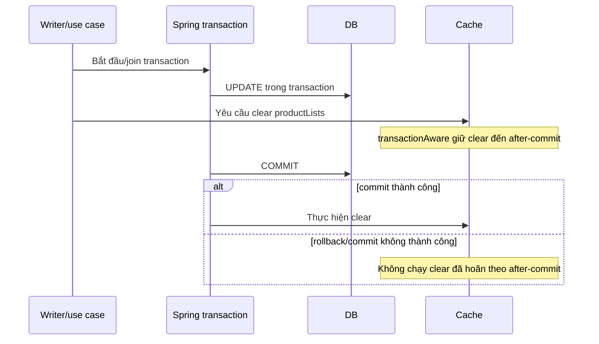

# Lesson 03 · Product đổi rồi, vì sao list vẫn cũ?

> Mục tiêu: biết bỏ cache nào, lúc nào; hiểu TTL/eviction không tạo strong consistency giữa DB và Redis.

## Tài liệu / video

- [Spring Cache annotations](https://docs.spring.io/spring-framework/reference/integration/cache/annotations.html): CacheEvict, CachePut, beforeInvocation, allEntries.
- [TransactionAwareCacheDecorator](https://docs.spring.io/spring-framework/docs/current/javadoc-api/org/springframework/cache/transaction/TransactionAwareCacheDecorator.html): deferred operations và giới hạn.
- [Redis cache writer](https://docs.spring.io/spring-data/redis/reference/redis/redis-cache.html): clear/batch/locking, không nhầm với transaction DB.
- Video: tìm `cache aside invalidation race condition`, `Spring CacheEvict transaction commit Redis`. Chưa yêu cầu triển khai distributed locks/outbox.

## 1. Cache là một bản chụp theo thời điểm

```text
t0: DB tên Keyboard → query list → cache tên Keyboard, TTL60.
t1: update DB tên Mechanical Keyboard.
t2: đọc cùng list key → cache vẫn Keyboard nếu chưa invalidate.
```

Đây không phải lỗi Jackson hoặc Controller. App đang trả snapshot hợp lệ theo key nhưng cũ theo thời gian. TTL60chỉ nói entry sống bao lâu từ lần ghi, không nói DB đổi thì entry tự mất.

TTL dài: hit nhiều hơn nhưng cũ lâu hơn và chiếm RAM lâu hơn. TTL ngắn: freshness tốt hơn trong nhiều tình huống nhưng tăng miss/DB load. Chọn theo mức chấp nhận cũ, tần suất đổi, hit ratio và chi phí query; không chọn60chỉ vì code mẫu dùng60.

## 2. Xóa key nào sau update?

List có thể đang cache:

```text
category=all, keyword=keyboard, page=0, sort=name
category=2, keyword=, page=1, sort=price
category=all, keyword=, page=0, sort=id
```

Đổi tên có thể làm Product vào/ra filter keyword hoặc đổi vị trí sort; đổi giá tác động sort; đổi category tác động nhiều filter. Tạo/xóa đổi totalElements/totalPages và có thể đẩy Product sang trang khác. Chỉ xóa `product:10` không xóa các list key chứa Product10.

Với shopcore nhỏ, chiến lược dễ kiểm: **sau mutation thành công, clear cache productLists**. Rộng hơn cần thiết nhưng dễ hiểu và an toàn hơn việc đoán một list key. Nếu có cache detail Product thì evict detail ID riêng nữa. Không dùng FLUSHALL vì sẽ xóa cache ứng dụng/môi trường khác.

## 3. CacheEvict mặc định làm gì?

<!-- verify: com/shopcore/catalog/ProductCatalogWrite.java -->
```java
package com.shopcore.catalog;

import org.springframework.cache.annotation.CacheEvict;
import org.springframework.transaction.annotation.Transactional;

public class ProductCatalogWrite {
    private final ProductCatalogSource source;
    public ProductCatalogWrite(ProductCatalogSource source) { this.source = source; }

    @Transactional
    @CacheEvict(cacheNames = "productLists", allEntries = true)
    public void rename(long productId, String newName) {
        if (productId <= 0 || newName == null || newName.isBlank()) {
            throw new IllegalArgumentException("Invalid rename input");
        }
        source.rename(productId, newName.trim());
    }
}
```

Đây là mutation nhỏ đủ xem cơ chế. Source thực phải update DB, xử lý Product missing bằng business exception đúng style shopcore. Đoạn mẫu không tự tạo CRUD đầy đủ. Thêm bean vào configuration có sẵn (không khai báo trùng cả @Service và @Bean):

<!-- verify: fragments/write-bean.java -->
```java
@Bean
ProductCatalogWrite productCatalogWrite(ProductCatalogSource source) {
    return new ProductCatalogWrite(source);
}
```

Mẫu thực tế cần transaction manager/transaction infrastructure cho persistence của project. Boot với JPA phù hợp thường tự cấu hình; không có thì thêm annotation không tự tạo transaction. Trong fixture kiểm chất lượng, transaction giả lập chỉ kiểm timing cache, không chứng minh rollback PostgreSQL.

`allEntries=true` nghĩa bỏ mọi entry trong **cache name productLists**, không phải toàn Redis. Key chỉ định thêm bị bỏ qua khi clear toàn cache. Mặc định beforeInvocation=false: nếu method ném exception thì annotation không thực hiện eviction sau thành công. `beforeInvocation=true` evict trước method kể cả method sau đó lỗi; có thể làm cache miss vô ích và cho reader nạp dữ liệu cũ trước commit. Nó không tự chữa consistency.

`@CachePut` luôn thực thi method rồi put kết quả vào key phù hợp, khác @Cacheable có thể bỏ body khi hit. Return của rename là void, và một ProductDTO không phải ProductListPage cho mọi page/filter; vì vậy không dùng CachePut thay invalidation list một cách máy móc.

## 4. Method return khác transaction commit

Với JPA, `save`/return method chưa chắc commit xong. Outer transaction có thể rollback hoặc commit fail. Nếu xóa cache trước commit, reader khác miss→đọc DB còn cũ→put cũ trở lại.



Trong Lesson02 manager đã `.transactionAware()`: thao tác put/evict/clear thông thường được deferred khi đang có Spring-managed transaction; không có transaction thì làm ngay. Không suy mọi API cache đều deferred: immediate operations như putIfAbsent/evictIfPresent và các thao tác force-immediate có giới hạn riêng. Không dùng beforeInvocation để giả after-commit.

Writer của mẫu đồng thời chọn `immediateWrites()`: sau khi decorator cho phép thực hiện, writer chờ thao tác Redis thay vì để write/clear async. Đây là lựa chọn để dễ kiểm luồng tuần tự, không vượt qua ranh giới transaction-aware hoặc ngăn race concurrent reader.

Wiring/order proxy phải được kiểm với transaction thật. Trường hợp outer transaction bao nhiều method đặc biệt quan trọng: method rename trả về nhưng outer chưa commit thì cache clear chưa nên xảy ra. Fixture có phép kiểm timing này; project cần kiểm integration DB của chính nó.

## 5. After-commit không tạo một transaction chung DB + Redis

DB đã commit nhưng Redis clear lỗi: dữ liệu DB vẫn mới, cache có thể cũ, client có thể thấy lỗi sau khi write thực sự thành công. Không thể rollback DB chỉ bằng việc ném exception từ Redis sau commit. Retry client có thể lặp mutation; phải hiểu idempotency của API.

Chính sách xử lý cache outage cần được quyết định, không bắt tất cả lỗi thành business404. Theo dõi lỗi eviction, TTL để cache cũ hết hạn, có thể retry invalidation/thiết kế cơ chế tin cậy hơn khi yêu cầu tăng. Outbox/CDC chỉ nhận diện ở đây, không bài code bắt buộc.

## 6. Race còn lại dù đã evict sau commit

```text
Reader R miss và đọc DB snapshot cũ, đang xử lý chậm.
Writer W commit dữ liệu mới rồi evict cache.
Reader R hoàn tất trễ và put snapshot cũ sau eviction.
Request sau lại hit bản cũ cho đến expire/invalidate tiếp.
```

Vì vậy “DB update rồi delete cache” không đủ chứng minh strong consistency cho mọi concurrent schedule. Transaction-aware không chặn reader khác nạp cũ. TTL là safety net theo tuổi entry, không bảo đảm age của dữ liệu tính từ lúc writer commit: reader/transaction kéo dài có thể put bản cũ muộn.

Ở module này cần **kể được timeline và nêu giới hạn**, không tự triển khai lock/version fencing. Nếu tồn kho/giá checkout cần quyết định chính xác, kiểm nguồn gốc/transaction phù hợp, đừng lấy cache catalog làm quyết định cuối. Có thể bỏ cache cho dữ liệu nhạy về correctness.

## 7. Mutation ngoài app cũng làm stale

Admin SQL trực tiếp, batch job hoặc service khác đổi DB không đi qua method có CacheEvict. Cache vẫn cũ. Có thể quy định một write path, tích hợp sự kiện invalidation, hoặc chấp nhận TTL theo yêu cầu. Không nói annotation tự theo dõi mọi thay đổi bảng.

Clear toàn list đơn giản nhưng giảm hit ratio và có chi phí quét key. SCAN batch tránh một lệnh KEYS lớn, không bảo đảm atomic clear trong lúc nhiều writer/reader. Khi scale lớn hơn cần đo/thiết kế key version hoặc invalidation có mục tiêu; chưa ép module nhỏ dùng cluster.

## 8. Kiểm không chỉ “update chạy được”

1. Prime ít nhất hai list key khác nhau; xác nhận hit không gọi source lại.
2. Mutation thành công → cả hai list bị bỏ → lần sau source chạy lại và DTO/metadata mới.
3. Input/business failure → cache không clear theo default.
4. Outer transaction chưa commit → cache còn; commit → clear; rollback → không chạy deferred clear.
5. Khi Redis clear fail sau DB commit hoặc reader put trễ → ghi nhận giới hạn, không tuyên bố atomic.

Test timing bằng transaction giả lập chứng minh cache synchronization, không tự chứng minh DB rollback hay race đã được giải quyết. Bạn chỉ cần hiểu lời hứa thật của code trước khi thêm annotation.

[Làm đề Lesson03](../../../Exams/de-kiem-tra/M5-1-redis__2026-10-07__lesson3-lan1.md).
