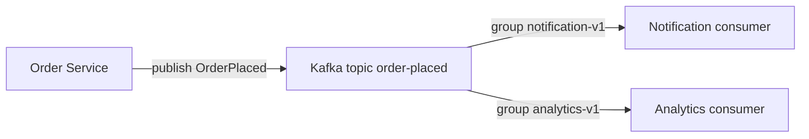

# Lesson 01 · Kafka lưu gì, ai đọc gì?

> Mục tiêu: nhìn được record nằm ở đâu, vì sao hai nhóm cùng đọc được một event, và vì sao tăng consumer không luôn tăng tốc.

## Tài liệu / video

- [Kafka introduction](https://kafka.apache.org/41/getting-started/introduction/): đọc producer, consumer, topic và partition.
- [Kafka design](https://kafka.apache.org/41/design/design/): đọc consumer position và delivery semantics.
- [Kafka quickstart](https://kafka.apache.org/41/getting-started/quickstart/): quan sát lệnh tạo topic, produce và consume.
- Video: tìm `Apache Kafka topic partition consumer group explained`, `Kafka offset retention replay`. Đây là từ khóa tìm kiếm, không phải video đã được kiểm chứng.

## 1. Nối với những gì bạn đã biết

Bạn đã biết request đi Controller → Service → Repository. Nếu Service tạo đơn rồi gọi email trực tiếp, request phải phụ thuộc tốc độ/lỗi của hệ thống email. Nếu muốn analytics cũng nhận thông tin, Service lại phải biết thêm một nơi.

Với event, ta công bố sự việc **đã xảy ra**: `OrderPlaced`. Consumer notification xử lý sau. Một consumer analytics có thể đọc độc lập. Các phần này vẫn có thể thuộc một monolith, không bắt buộc tách microservice.



Đọc từng mũi tên:

1. Service tạo event rồi producer ghi vào Kafka, không gọi thẳng method notification ở tiến trình khác.
2. Notification group đọc vị trí riêng của mình và xử lý.
3. Analytics group đọc vị trí riêng; notification đọc trước không lấy mất event của analytics.
4. HTTP response không cần chờ notification hoàn thành theo thiết kế async. Nhưng việc DB commit và publish có thể lệch nhau; Lesson 04 giải thích, không coi hình này là transaction atomic.

Kafka giải quyết **truyền và lưu luồng record**, không tự tạo nghiệp vụ Order, không đảm bảo email đã gửi chỉ vì publish thành công. Nếu chỉ vài việc nhỏ, đồng bộ hoặc background job đơn giản có thể đủ; Kafka thêm chi phí vận hành.

## 2. Record, topic, partition, broker

| Khái niệm | Hiểu bằng dữ liệu cụ thể |
|---|---|
| Record | Một lần ghi có key, value, timestamp, headers |
| Topic | Tên luồng: `order-placed` |
| Partition | Một log có thứ tự trong topic |
| Offset | Vị trí record trong một partition; không phải orderId |
| Broker | Server lưu/phục vụ partition |
| Replica | Bản sao partition để tăng khả năng chịu lỗi; không phải consumer thứ hai |

Ví dụ topic có ba partition:

```text
P0: offset 0 = E1(orderId=101), offset 1 = E4(orderId=101)
P1: offset 0 = E2(orderId=202)
P2: offset 0 = E3(orderId=303)
```

Offset `0` xuất hiện ở cả ba partition là bình thường. Định danh vị trí phải có **topic + partition + offset**. `eventId` là ID nghiệp vụ của event, không thay bằng offset khi cần chống trùng xuyên lần publish/replay.

Log append nghĩa là thêm record phía sau. Consumer đọc không xóa record ngay. Retention/compaction là policy riêng; lab này dùng topic thông thường, không dạy compacted topic hay Kafka Streams.

## 3. Ordering: phạm vi nào?

Kafka giữ thứ tự trong một partition, không có một thứ tự chung giữa cả ba partition. Consumer có thể thấy E2 trước E1 mà không vi phạm thứ tự của P0.

Nếu cần các event của một Order đi cùng partition, dùng key `orderId` ổn định. Với partitioner thông thường và số partition không đổi, cùng key đi cùng partition. Không hard-code “101 chắc chắn ở P0” nếu chưa kiểm partitioner. Tăng số partition hoặc thay thuật toán routing có thể đổi vị trí key; phải xét lại ordering.

Cùng partition cũng không sửa việc producer gửi nghiệp vụ sai thứ tự, hoặc listener tự đẩy sang nhiều worker rồi hoàn thành đảo thứ tự. Key giúp phạm vi ordering, không phải khóa database.

## 4. Consumer group là cách chia việc

Trong **traditional consumer group** của bài này, một partition tại một thời điểm được giao cho tối đa một consumer trong cùng group. Một consumer có thể giữ nhiều partition.

Ví dụ 3 partition:

| Consumer trong một group | Hiệu quả |
|---|---|
| 1 | Một consumer có thể đọc cả 3 partition |
| 2 | Có thể chia 2 partition và 1 partition |
| 3 | Có thể mỗi consumer 1 partition |
| 5 | Tối đa 3 consumer có partition, ít nhất 2 không được giao việc |

Không hứa chính xác consumer A luôn giữ P0; assignor và rebalance quyết định. Nếu notification và analytics **cùng group**, chúng chia việc, không mỗi bên nhận đủ event. Muốn hai nghiệp vụ độc lập, dùng hai group khác nhau.

Share groups/queue-style consumption là cơ chế khác, ngoài bài này. Không áp quy tắc traditional group cho mọi mode Kafka.

## 5. Offset đọc và offset commit khác nhau

Giả sử notification đã xử lý xong offsets 0, 1 của P0 và commit `2`. Nghĩa là lần khôi phục sau bắt đầu từ vị trí tiếp theo là 2, không phải đã xử lý record 2.

```text
poll lấy record 2 -> consumer position có thể tiến
business xử lý record 2 -> tạo notification
commit 3 -> lưu điểm khôi phục
```

Position đang đọc nằm trong client và có thể đi trước phần business đã hoàn thành. Committed offset là checkpoint của group. Commit offset không phải commit transaction JPA và không có nghĩa gửi email atomic.

Ví dụ crash nhỏ: DB đã tạo notification cho offset 2 nhưng app chết trước khi commit 3. Khi resume từ checkpoint cũ, offset 2 có thể được đọc lại. Ngược lại commit 3 trước khi làm business rồi chết có thể để notification thiếu. Lesson 03 sẽ tách từng timeline; ở đây chỉ cần thấy checkpoint và effect không tự đi cùng nhau.

Offset thực tế có thể có khoảng trống do cơ chế log/transaction/compaction; ví dụ 0,1,2 ở đây chỉ để dễ nhìn, không khẳng định mọi offset đều chứa record.

## 6. Retention, replay, lag

- Retention giới hạn lịch sử còn lưu; consumer quá chậm có thể mất cơ hội đọc dữ liệu đã hết hạn.
- Replay là đọc lại lịch sử còn tồn tại, chẳng hạn group mới hoặc reset offset có kiểm soát. Consumer phải chịu được xử lý lại.
- Lag thường là khoảng cách giữa cuối log và checkpoint/position được công cụ báo. Lag tăng kéo dài có thể do xử lý chậm, lỗi/retry hoặc thiếu capacity; lag thấp không chứng minh notification đúng.
- `auto.offset.reset=earliest` chỉ dùng khi không có committed offset hợp lệ, không làm group đọc lại từ đầu mỗi restart. `latest` có thể bỏ qua lịch sử khi khởi tạo group mới.

## 7. Lab quan sát nhỏ, không cần project mới

Docker Desktop đang chạy; port 9092 chưa bị chiếm. Image dưới đây cố định **4.1.2**, không tuyên bố là bản mới nhất. Một broker KRaft dùng cho học; không ZooKeeper, không HA, không authentication, chỉ bind localhost.

```bash
docker run --rm -d --name shopcore-kafka-lab \
  -p 127.0.0.1:9092:9092 apache/kafka:4.1.2

docker exec shopcore-kafka-lab /opt/kafka/bin/kafka-topics.sh \
  --bootstrap-server localhost:9092 --create \
  --topic order-placed --partitions 3 --replication-factor 1

docker exec shopcore-kafka-lab /opt/kafka/bin/kafka-topics.sh \
  --bootstrap-server localhost:9092 --describe --topic order-placed
```

Chờ broker sẵn sàng trước khi tạo topic; lệnh có thể phải chạy lại sau startup. Nếu topic đã tồn tại, đừng xóa tùy tiện dữ liệu thật. Port khác phải cấu hình cả listeners/advertised.listeners, không chỉ đổi `-p`: client dùng địa chỉ broker trả về sau bootstrap.

Gửi từng dòng bằng terminal tương tác:

```bash
docker exec -it shopcore-kafka-lab /opt/kafka/bin/kafka-console-producer.sh \
  --bootstrap-server localhost:9092 --topic order-placed \
  --property parse.key=true --property key.separator=:
```

Nhập `101:E1` rồi `101:E2`, sau đó Ctrl-C. Đây là string demo, **không dùng** listener JSON Lesson 02 để đọc các dòng này; lab Java dùng topic mới/sạch tương thích schema.

```bash
docker exec -it shopcore-kafka-lab /opt/kafka/bin/kafka-console-consumer.sh \
  --bootstrap-server localhost:9092 --topic order-placed \
  --group observation-v1 --from-beginning \
  --property print.partition=true --property print.offset=true \
  --property print.key=true

docker stop shopcore-kafka-lab
```

Hãy đọc partition/offset/key, không chỉ thấy E1/E2 rồi kết luận hiểu group. Container `--rm` không có volume lab riêng nên dữ liệu không được giữ cho lần tạo container sau; retention không phải lời hứa vượt việc xóa container.

## 8. Chốt bản chất

**Topic giữ record; partition giữ thứ tự; group giữ cách chia việc và checkpoint.** Consumer đọc không xóa event; commit offset không phải business transaction. Ba câu này cần diễn giải được bằng bảng trên, không cần học thuộc thuật ngữ.

[Làm đề Lesson 01](../../../Exams/de-kiem-tra/M5-2-kafka__2026-10-07__lesson1-lan1.md).
