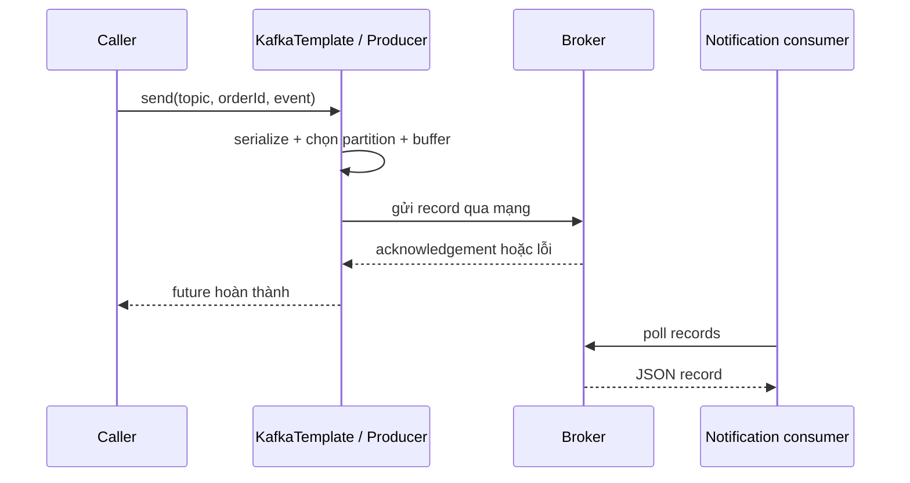

# Lesson 02 · Từ Java object đến record trong Kafka

> Mục tiêu: thiết kế event contract rõ ràng, gửi JSON bằng Spring Kafka và hiểu send thành công thật sự xác nhận điều gì.

## Tài liệu / video

- [Boot Kafka support](https://docs.spring.io/spring-boot/reference/messaging/kafka.html): auto-configuration và `spring.kafka.*`.
- [Sending messages](https://docs.spring.io/spring-kafka/reference/kafka/sending-messages.html): `KafkaTemplate`, future và send result.
- [Serialization](https://docs.spring.io/spring-kafka/reference/kafka/serdes.html): Jackson JSON và target type.
- [Producer config](https://kafka.apache.org/41/configuration/producer-configs/): `acks`, idempotence và timeouts.
- Video: tìm `Spring Kafka KafkaTemplate CompletableFuture JSON producer`, `Kafka producer acknowledgements idempotence explained`.

## 1. Event không phải Request DTO hoặc Entity

Request DTO là điều client muốn làm: `CreateOrderRequest`. Entity là trạng thái lưu DB, có thể có quan hệ LAZY. Event là điều đã xảy ra: `OrderPlacedEvent`. Response DTO trả lời HTTP request. Chúng phục vụ các hợp đồng khác nhau, không nên serialize cả Order entity để tiết kiệm một class.

Contract thống nhất cho module:

```json
{
  "eventId": "65062419-ef03-4501-843b-fbdfdb30c00a",
  "eventType": "OrderPlaced",
  "schemaVersion": 1,
  "orderId": 101,
  "customerId": 7,
  "total": 250000.00,
  "occurredAt": "2026-10-07T10:00:00Z"
}
```

| Field | Ý nghĩa |
|---|---|
| eventId | ID của lần xảy ra sự việc; retry cùng event giữ ID này |
| eventType/schemaVersion | Consumer nhận diện contract, không đoán theo Java package |
| orderId | Aggregate liên quan; dùng làm Kafka key trong bài |
| customerId | Đủ tạo notification trong app; không gửi email/password/token vào event |
| total | BigDecimal, không double cho tiền |
| occurredAt | Thời điểm sự việc theo ISO-8601 UTC; không phải offset hoặc thời điểm email xong |

Topic Java demo là `order-placed-json-v1`, tách khỏi topic string quan sát Lesson 01. Business event vẫn là `order-placed`; suffix là lựa chọn lab để tránh đọc nhầm dữ liệu khác schema.

Không đưa `ApiResponse`, HTTP status hoặc JPA proxy vào event. Header có thể mang correlation ID phục vụ trace, nhưng không mặc định có MDC xuyên thread/network và không để secret trong header.

## 2. Class event, đúng style bạn quen

Mẫu không cần Lombok để đọc được mọi method; dùng Lombok getter/setter/constructor tương đương vẫn hợp lệ. Trong shopcore đặt theo package dưới đây.

<!-- verify: com/shopcore/events/OrderPlacedEvent.java -->
```java
package com.shopcore.events;

import java.math.BigDecimal;

public class OrderPlacedEvent {
    private String eventId;
    private String eventType;
    private int schemaVersion;
    private Long orderId;
    private Long customerId;
    private BigDecimal total;
    private String occurredAt;

    public OrderPlacedEvent() {}

    public OrderPlacedEvent(String eventId, String eventType, int schemaVersion,
            Long orderId, Long customerId, BigDecimal total, String occurredAt) {
        this.eventId = eventId;
        this.eventType = eventType;
        this.schemaVersion = schemaVersion;
        this.orderId = orderId;
        this.customerId = customerId;
        this.total = total;
        this.occurredAt = occurredAt;
    }

    public String getEventId() { return eventId; }
    public void setEventId(String eventId) { this.eventId = eventId; }
    public String getEventType() { return eventType; }
    public void setEventType(String eventType) { this.eventType = eventType; }
    public int getSchemaVersion() { return schemaVersion; }
    public void setSchemaVersion(int schemaVersion) { this.schemaVersion = schemaVersion; }
    public Long getOrderId() { return orderId; }
    public void setOrderId(Long orderId) { this.orderId = orderId; }
    public Long getCustomerId() { return customerId; }
    public void setCustomerId(Long customerId) { this.customerId = customerId; }
    public BigDecimal getTotal() { return total; }
    public void setTotal(BigDecimal total) { this.total = total; }
    public String getOccurredAt() { return occurredAt; }
    public void setOccurredAt(String occurredAt) { this.occurredAt = occurredAt; }
}
```

No-arg constructor/setters giúp mapping rõ ràng. JSON đúng cú pháp vẫn có thể thiếu orderId hoặc sai version; deserialize không thay kiểm business contract ở consumer.

## 3. Dependency và cấu hình

Shopcore hiện dùng Java 21, Boot 4.1.1. Thêm dependency dưới vào **shopcore**, để Boot BOM chọn version; không pin jar Spring Kafka từ tutorial cũ. Không cần tạo project mới hoặc thêm Kafka Streams.

```xml
<dependency>
    <groupId>org.springframework.boot</groupId>
    <artifactId>spring-boot-starter-kafka</artifactId>
</dependency>
<dependency>
    <groupId>org.springframework.boot</groupId>
    <artifactId>spring-boot-starter-json</artifactId>
</dependency>
```

Kafka starter không tự bảo đảm Jackson JSON có mặt. Web starter hiện tại có thể đã kéo JSON vào; khai starter-json explicit giúp mẫu Kafka không phụ thuộc tình cờ vào phần web. Không thêm version riêng cho Jackson.

YAML cho cùng ứng dụng producer + consumer, broker lab Lesson 01 đang chạy. App trên host dùng localhost; nếu app trong container khác phải thiết kế listener nội bộ/advertised host phù hợp, không dùng localhost của container app để chỉ Kafka.

```yaml
spring:
  kafka:
    bootstrap-servers: ${KAFKA_BOOTSTRAP_SERVERS:localhost:9092}
    producer:
      acks: all
      key-serializer: org.apache.kafka.common.serialization.StringSerializer
      value-serializer: org.springframework.kafka.support.serializer.JacksonJsonSerializer
      properties:
        "[enable.idempotence]": true
        "[spring.json.add.type.headers]": false
    consumer:
      group-id: shopcore-notification-v1
      enable-auto-commit: false
      auto-offset-reset: earliest
      key-deserializer: org.apache.kafka.common.serialization.StringDeserializer
      value-deserializer: org.springframework.kafka.support.serializer.ErrorHandlingDeserializer
      properties:
        "[spring.deserializer.value.delegate.class]": org.springframework.kafka.support.serializer.JacksonJsonDeserializer
        "[spring.json.value.default.type]": com.shopcore.events.OrderPlacedEvent
        "[spring.json.use.type.headers]": false
        "[spring.json.trusted.packages]": com.shopcore.events
    listener:
      ack-mode: record
```

Giải thích nhóm cấu hình, không học thuộc chuỗi:

- Producer biến key thành bytes string và value thành JSON bytes. Kafka lưu bytes, không giữ instance Java.
- Không gửi tên Java class qua type header; consumer định sẵn target class contract. Không mở trusted packages `*` cho tiện.
- Consumer wrapper chuyển lỗi decode thành thông tin lỗi để container xử lý; không tự sửa JSON. Cấu hình DLT đủ cả object/bytes ở Lesson 05.
- Tắt auto-commit của Kafka client, chọn container quản lý checkpoint. `record` ở đây là **một record listener**, không phải Java record class.
- `acks=all` là acknowledgement từ các replica đang trong ISR theo policy broker, không phải mọi replica mọi lúc. Lab chỉ một replica nên không chứng minh chịu mất broker.
- Producer idempotence giảm duplicate do retry giao thức producer; không chống hai lần ứng dụng gọi publish cùng nghiệp vụ và không chống consumer side effect trùng.

## 4. Publisher đầy đủ một trách nhiệm

<!-- verify: com/shopcore/events/OrderEventPublisher.java -->
```java
package com.shopcore.events;

import java.util.concurrent.CompletableFuture;
import org.springframework.kafka.core.KafkaTemplate;
import org.springframework.kafka.support.SendResult;
import org.springframework.stereotype.Component;

@Component
public class OrderEventPublisher {
    public static final String TOPIC = "order-placed-json-v1";
    private final KafkaTemplate<String, Object> template;

    public OrderEventPublisher(KafkaTemplate<String, Object> template) {
        this.template = template;
    }

    public CompletableFuture<SendResult<String, Object>> publish(
            OrderPlacedEvent event) {
        if (event == null || event.getOrderId() == null || event.getOrderId() <= 0) {
            throw new IllegalArgumentException("Positive orderId required");
        }
        return template.send(TOPIC, event.getOrderId().toString(), event);
    }
}
```

`send` trả future: kết quả sẽ hoàn thành khi send được xác nhận hoặc thất bại. Cũng có lỗi xảy ra đồng bộ ngay khi gọi, ví dụ serialize/config hoặc chờ metadata quá lâu. “Async” không có nghĩa mọi lệnh gọi trả ngay tuyệt đối.

Caller phải quan sát cả future failure, không bỏ future rồi log “sent”. Có thể `whenComplete` ghi success/failure có eventId/partition/offset, hoặc chờ có timeout tại boundary thật sự cần kết quả. Không dùng `.get()` vô hạn trong HTTP rồi tưởng đã làm async tốt; timeout phía caller không chắc record chưa được broker nhận, retry phải giữ eventId.

Publisher chỉ kiểm orderId để chọn key; caller/domain tạo event hợp lệ và consumer kiểm lại contract. Không coi validation nhỏ này là đủ cho toàn event. Template dùng value `Object` để Lesson 05 có thể dùng chung cho event object và raw bytes của decode failure; method public vẫn chỉ nhận OrderPlacedEvent, không mở contract cho mọi object.

## 5. Luồng thực tế của send



1. Caller không đưa Request DTO xuống broker mà đưa event snapshot đã tạo.
2. Producer chuẩn bị bytes/routing; key orderId không phải eventId.
3. Broker nhận ghi theo durability policy. Future success không chờ N xử lý, vì N có thể đang tắt.
4. N chủ động poll; broker không gọi HTTP Controller của N.
5. DB transaction tạo Order không nằm trong sơ đồ; vấn đề dual-write được học riêng, không được bỏ qua chỉ vì happy path chạy.

## 6. Event evolution tối thiểu

Giữ tên/ý nghĩa field đã công bố. Thêm field tùy chọn có default phù hợp thường dễ tương thích hơn đổi `orderId` thành object hoặc đổi đơn vị tiền. Consumer cũ có thể bỏ qua field chưa biết, nhưng consumer mới vẫn phải xử lý event cũ thiếu field. Version phải có policy xử lý, không chỉ thêm số 2 rồi coi là xong.

Replay một event giữ `eventId`; một sự việc mới có ID mới. `orderId=101` có thể có OrderPlaced, OrderPaid, OrderCancelled; dùng orderId làm ID chống trùng mọi loại sẽ bỏ nhầm sự việc hợp lệ.

## 7. Bài quan sát

Tạo topic JSON có 3 partition, replication 1 như Lesson 01 nhưng tên `order-placed-json-v1`. Gửi hai event cùng orderId, eventId khác nhau; quan sát future partition/offset và JSON bằng console consumer. Tắt consumer trước khi gửi để thấy producer có thể thành công độc lập. Tắt broker để thấy send fail/timeout; không gán mọi lỗi này thành HTTP 404.

Không yêu cầu nộp code lúc chuẩn bị bài; khi tích hợp thật mới xác nhận toàn bộ flow. Mẫu publisher không tự giải quyết mất event sau DB commit.

[Làm đề Lesson 02](../../../Exams/de-kiem-tra/M5-2-kafka__2026-10-07__lesson2-lan1.md).
