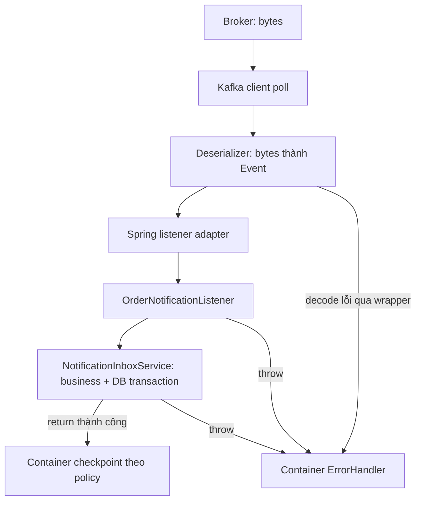

# Lesson 03 · Listener chạy trên luồng nào, commit lúc nào?

> Mục tiêu: nối bytes → DTO → nghiệp vụ → checkpoint, nhận diện chính xác nơi message có thể bị xử lý lại hoặc mất tác dụng nghiệp vụ.

## Tài liệu / video

- [Listener containers](https://docs.spring.io/spring-kafka/reference/kafka/receiving-messages/message-listener-container.html): record listener và AckMode.
- [Listener annotation](https://docs.spring.io/spring-kafka/reference/kafka/receiving-messages/listener-annotation.html): endpoint, group và concurrency.
- [KafkaConsumer API](https://kafka.apache.org/41/javadoc/org/apache/kafka/clients/consumer/KafkaConsumer.html): poll, position, commit và threading.
- [Consumer config](https://kafka.apache.org/41/configuration/consumer-configs/): auto commit, offset reset, max poll interval.
- Video: tìm `Spring Kafka record ack mode offset commit`, `Kafka at least once consumer crash duplicate`.

## 1. Không đi qua DispatcherServlet

HTTP request qua FilterChain/DispatcherServlet/Controller. Kafka record được listener container đọc bằng Kafka consumer client trên consumer thread. Không có HTTP request để `@RestControllerAdvice` trả ProblemDetail cho broker.



Đọc hình theo hai đường:

1. **Đường đúng:** poll nhận bytes, deserializer tạo OrderPlacedEvent, adapter gọi listener, listener gọi Service, Service commit DB, listener trả bình thường, container mới có thể checkpoint theo AckMode.
2. **Đường lỗi:** decode lỗi chưa vào business, hoặc listener/Service throw; error handler của Kafka container quyết định retry/recover/stop. Không phải AppException được HTTP advice bắt như một request MVC.
3. Không có mũi tên “broker gọi Service trực tiếp”. Producer/consumer có process và transaction độc lập.

`ErrorHandlingDeserializer` giúp đưa lỗi decode về cơ chế container; không có wrapper thì lỗi trước poll trả về có thể không được xử lý như một record business thông thường. Lỗi được đánh dấu và chuyển xử lý, không đưa null event xuống Service như một event hợp lệ.

## 2. Listener tối giản, không giấu lỗi

<!-- verify: com/shopcore/events/OrderNotificationListener.java -->
```java
package com.shopcore.events;

import org.springframework.kafka.annotation.KafkaListener;
import org.springframework.stereotype.Component;

@Component
public class OrderNotificationListener {
    private final NotificationInboxService inbox;

    public OrderNotificationListener(NotificationInboxService inbox) {
        this.inbox = inbox;
    }

    @KafkaListener(topics = OrderEventPublisher.TOPIC,
            groupId = "shopcore-notification-v1")
    public void onOrderPlaced(OrderPlacedEvent event) {
        inbox.accept(event);
    }
}
```

`NotificationInboxService` hoàn chỉnh nằm Lesson 04; nó tạo notification **trong DB ứng dụng**, không gọi SMTP. Listener gọi Spring bean qua proxy để transaction thực sự có hiệu lực. Annotation không tạo phép màu nếu bạn tự `new Service` hoặc thiếu transaction manager.

Không làm kiểu này:

```java
// Phản ví dụ: không dùng trong mẫu đúng.
try {
    inbox.accept(event);
} catch (Exception ex) {
    log.warn("failed", ex);
}
```

Catch rồi return làm container thấy listener thành công. Theo policy bình thường, offset có thể được commit dù business chưa xong. Muốn retry, lỗi phải được báo ra đúng error boundary; log không thay thế recovery.

## 3. Chọn AckMode RECORD để dễ trace

Mẫu dùng `enable-auto-commit=false`, record listener và `ack-mode=record`. Sau mỗi record listener trả thành công, container quản lý commit offset. Kafka poll vẫn có thể lấy nhiều record; “record mode” không có nghĩa mỗi poll chỉ nhận một record.

Không dùng manual ack chỉ vì nghĩ “manual chắc an toàn hơn”. Manual vẫn sai nếu ack trước DB commit hoặc ack trong finally. Batch mode có checkpoint theo batch, tăng cửa sổ redelivery; không mặc định xấu, nhưng cần hiểu ranh giới.

`@Transactional` ở Service với DB transaction manager commit nghiệp vụ DB trước khi method proxy trả; Kafka offset ở container là một commit khác. Bài **không** bật Kafka transactional listener, không tuyên bố EOS.

## 4. Ba timeline để hiểu delivery semantics

Giả sử committed offset đang là 8, record tiếp theo có offset 8.

### A. Commit sớm: có thể mất tác dụng nghiệp vụ

```text
poll 8 -> commit 9 -> app chết trước khi ghi notification
restart -> bắt đầu 9 -> notification cho record 8 chưa có
```

Đây là nguy cơ at-most-once khi checkpoint trước processing. Record có thể vẫn còn trong Kafka nhưng group đã vượt qua; “mất” ở đây là workflow không còn tự xử lý nó, không nhất thiết bytes bị xóa khỏi log.

### B. Xử lý trước, commit sau: có thể lặp

```text
poll 8 -> DB commit notification -> app chết trước commit offset 9
restart -> đọc lại 8 -> cần idempotent consumer
```

Đây là crash window điển hình của at-least-once. Không cam kết vô điều kiện mọi event luôn thành công: retention, lỗi không phục hồi, sai config hoặc record được chuyển DLT là giới hạn phải quản lý.

### C. Không lỗi: hai commit đều xong

```text
poll 8 -> DB commit notification -> listener return -> commit offset 9
restart -> đọc từ 9
```

Ba lần chạy happy path không chứng minh case B an toàn. Lesson 04 làm DB idempotency để case B không tạo notification mới lần hai.

## 5. Rebalance và việc chậm

Khi consumer join/leave hoặc lỡ hạn poll, group có thể rebalance và phân lại partition. Checkpoint đã commit giúp consumer mới tiếp tục. Phần business đã làm nhưng chưa checkpoint có thể bị đọc lại.

Nếu listener gọi mạng mất vài phút, vượt `max.poll.interval.ms`, partition có thể bị giao lại; tăng concurrency không sửa nghiệp vụ trùng. Cần timeouts, giới hạn work per poll, đủ capacity hoặc thiết kế job riêng. Không tự chuyển sang executor rồi return ngay: container có thể checkpoint trước khi background task hoàn thành, lại rơi vào case A.

KafkaConsumer không phải object thread-safe để nhiều worker tùy tiện poll/commit. Để container quản lý consumer và nhận biết ordering; song song theo partition có giới hạn đã học.

## 6. Kiểm một tình huống bằng tay

1. Consumer chạy group notification, publish một event hợp lệ và kiểm DB có notification.
2. Dừng consumer, publish event mới; producer có thể gửi thành công, DB notification chưa có.
3. Chạy lại cùng group, kiểm event còn trong retention được xử lý.
4. Nhìn committed offset và số notification, không chỉ log “received”.

```bash
docker exec shopcore-kafka-lab /opt/kafka/bin/kafka-consumer-groups.sh \
  --bootstrap-server localhost:9092 \
  --describe --group shopcore-notification-v1
```

Thử restart khác với cố tình crash đúng giữa DB commit và offset commit. Khi báo đã kiểm chứng phải nói rõ đã chạy loại nào; test trực tiếp gọi listener chỉ kiểm method, chưa kiểm container checkpoint.

## 7. Chốt và liên hệ AI Engineer

Một embedding worker cũng gặp tình huống xử lý xong rồi crash trước checkpoint. Re-delivery không được tạo thêm charge/job/output ngoài ý muốn. Chìa khóa là ranh giới business effect và durable idempotency, không phải thêm annotation cho đủ.

**Producer ack, DB commit và offset commit là ba sự kiện khác nhau.** Không nhớ tên API vẫn phải chỉ ra được crash nằm giữa hai sự kiện nào.

[Làm đề Lesson 03](../../../Exams/de-kiem-tra/M5-2-kafka__2026-10-07__lesson3-lan1.md).
