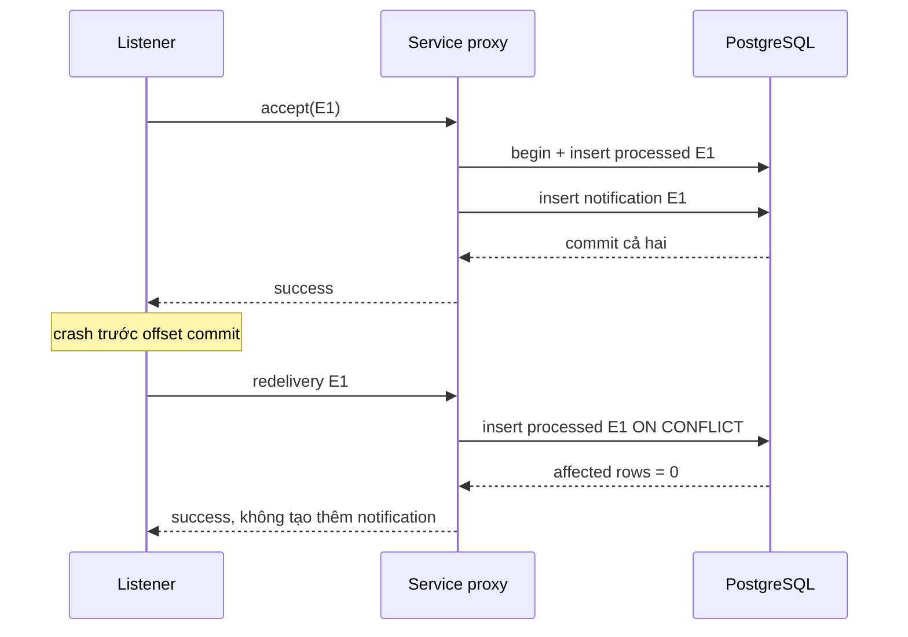

# Lesson 04 · Nhận hai lần, tác dụng nghiệp vụ một lần

> Mục tiêu: xử lý đúng crash window giữa business và checkpoint; không nhầm producer idempotence với consumer idempotency hoặc transaction DB với transaction Kafka.

## Tài liệu / video

- [Idempotent consumer pattern](https://microservices.io/patterns/communication-style/idempotent-consumer.html): durable dedup và transaction nghiệp vụ.
- [PostgreSQL INSERT](https://www.postgresql.org/docs/17/sql-insert.html): `ON CONFLICT DO NOTHING`.
- [Spring declarative transactions](https://docs.spring.io/spring-framework/reference/data-access/transaction/declarative/annotations.html): proxy và rollback.
- [Transactional outbox](https://microservices.io/patterns/data/transactional-outbox.html): nhận diện vấn đề dual-write.
- [Spring Kafka transactions](https://docs.spring.io/spring-kafka/reference/kafka/transactions.html): giới hạn đồng bộ các resource.
- Video: tìm `idempotent Kafka consumer database unique constraint`, `transactional outbox dual write problem`. Không yêu cầu tự triển khai CDC/Debezium ở bài này.

## 1. Chống trùng ở chỗ nào?

| Cơ chế | Bảo vệ phần nào? | Không tự bảo vệ gì? |
|---|---|---|
| Producer idempotence | Duplicate do producer retry giao thức được hỗ trợ | Hai lần app publish nghiệp vụ, notification bị lặp |
| Consumer durable dedup | Cùng eventId không lặp effect đã commit trong cùng phạm vi | Email provider ở ngoài transaction DB |
| Offset commit | Điểm resume của group | Không rollback DB hoặc SMTP |
| Kafka transaction/EOS | Phạm vi Kafka được thiết kế đúng | Không biến mọi API/DB/email ngoài Kafka thành exactly-once |

Idempotency nghĩa là thực hiện lại cùng thao tác không tạo thêm thay đổi ngoài ý muốn. Không bắt consumer chỉ được chạy đúng một lần; nó có thể được gọi lại nhưng nhận ra effect đã xong.

## 2. Tại sao Set hoặc exists rồi insert không đủ?

```text
Set trong RAM: restart mất Set; hai instance không dùng chung Set.
exists -> insert: hai transaction cùng thấy chưa có, cùng chạy effect.
mark processed -> commit -> effect: crash sau mark khiến retry bị bỏ qua dù effect chưa có.
effect -> commit -> mark processed: crash sau effect khiến retry tạo thêm effect.
```

Với effect nằm trong cùng DB, ta cần **unique constraint + transaction chung cho mark và effect**. Unique constraint mới là nơi phân xử race, không phải câu `if` trong Java.

## 3. Phạm vi notification của mẫu

Mẫu tạo một **in-app notification row**, không gọi email thật. Hai bảng PostgreSQL dùng cùng datasource, cùng transaction manager. Consumer identity cố định `notification-inbox-v1`, không dùng tên instance/pod; tên này là phạm vi effect, không bắt buộc trùng Kafka groupId.

<!-- verify-sql: inbox-schema.sql -->
```sql
CREATE TABLE processed_events (
    consumer_name VARCHAR(100) NOT NULL,
    event_id UUID NOT NULL,
    processed_at TIMESTAMPTZ NOT NULL DEFAULT CURRENT_TIMESTAMP,
    PRIMARY KEY (consumer_name, event_id)
);

CREATE TABLE notifications (
    event_id UUID PRIMARY KEY,
    order_id BIGINT NOT NULL CHECK (order_id > 0),
    customer_id BIGINT NOT NULL CHECK (customer_id > 0),
    total NUMERIC(19, 2) NOT NULL CHECK (total >= 0),
    occurred_at TIMESTAMPTZ NOT NULL,
    message TEXT NOT NULL
);
```

Bảng chỉ đủ minh họa Kafka inbox, không thay Order/customer schema thật. Nếu thêm FK ở shopcore thì phải tích hợp vào model sẵn có. Khi đưa vào project dùng Flyway version mới; không chạy CREATE TABLE này tùy tiện lên DB đang có bảng.

## 4. Code effect và dedup trong cùng transaction

Mẫu dùng JdbcTemplate để thấy SQL và unique race rõ ràng. Shopcore có thể dùng JPA/native query tương đương, nhưng không catch unique exception trong transaction PostgreSQL đã abort rồi cố chạy tiếp. `ON CONFLICT DO NOTHING` tránh lỗi transaction cho duplicate bình thường.

Khi tích hợp cần `spring-boot-starter-jdbc`, PostgreSQL driver, datasource và transaction manager. Không nói starter Kafka tự tạo database. Dùng JPA sẵn có cũng có thể cung cấp transaction infrastructure; đừng trộn hai datasource/manager mà tưởng cùng transaction.

<!-- verify: com/shopcore/events/InvalidEventException.java -->
```java
package com.shopcore.events;

public class InvalidEventException extends RuntimeException {
    public InvalidEventException(String message) {
        super(message);
    }
}
```

<!-- verify: com/shopcore/events/NotificationInboxService.java -->
```java
package com.shopcore.events;

import java.time.Instant;
import java.util.UUID;
import org.springframework.jdbc.core.JdbcTemplate;
import org.springframework.stereotype.Service;
import org.springframework.transaction.annotation.Transactional;

@Service
public class NotificationInboxService {
    private static final String CONSUMER = "notification-inbox-v1";
    private final JdbcTemplate jdbc;

    public NotificationInboxService(JdbcTemplate jdbc) {
        this.jdbc = jdbc;
    }

    @Transactional
    public void accept(OrderPlacedEvent event) {
        UUID eventId = validate(event);
        int inserted = jdbc.update("""
                INSERT INTO processed_events (consumer_name, event_id)
                VALUES (?, ?) ON CONFLICT DO NOTHING
                """, CONSUMER, eventId);
        if (inserted == 0) {
            return;
        }
        jdbc.update("""
                INSERT INTO notifications
                    (event_id, order_id, customer_id, total, occurred_at, message)
                VALUES (?, ?, ?, ?, CAST(? AS TIMESTAMPTZ), ?)
                """, eventId, event.getOrderId(), event.getCustomerId(),
                event.getTotal(), event.getOccurredAt(),
                "Order " + event.getOrderId() + " placed");
    }

    private UUID validate(OrderPlacedEvent event) {
        if (event == null || !"OrderPlaced".equals(event.getEventType())
                || event.getSchemaVersion() != 1
                || event.getOrderId() == null || event.getOrderId() <= 0
                || event.getCustomerId() == null || event.getCustomerId() <= 0
                || event.getTotal() == null || event.getTotal().signum() < 0
                || event.getTotal().scale() > 2
                || event.getTotal().precision() - event.getTotal().scale() > 17) {
            throw new InvalidEventException("Invalid OrderPlaced v1 fields");
        }
        try {
            Instant.parse(event.getOccurredAt());
            return UUID.fromString(event.getEventId());
        } catch (RuntimeException ex) {
            throw new InvalidEventException("Invalid eventId or occurredAt");
        }
    }
}
```

Đọc từng đoạn:

1. Validate contract trước dedup: JSON map được không có nghĩa fields hợp lệ. Bài chọn số tiền tối đa 17 chữ số phần nguyên và 2 chữ số thập phân cho `NUMERIC(19,2)`; đây là policy mẫu, không quy tắc mọi currency.
2. INSERT mark dựa unique key. Trùng đã commit thì affected rows bằng 0, method return thành công vì effect đã làm trước đó.
3. INSERT notification chỉ khi ta claim được event. Nếu insert này throw runtime exception, transaction rollback **cả mark và notification**.
4. `@Transactional` chỉ có tác dụng khi gọi bean proxy, cùng datasource/manager, có transaction infrastructure. Listener Lesson 03 inject Service bean.
5. Sau DB commit rồi crash trước offset commit, event đọc lại sẽ gặp mark đã có, không thêm notification.

Nếu hai transaction cùng eventId: một transaction có thể chờ transaction kia kết thúc tại unique constraint. Khi bên đầu commit, bên sau không insert; nếu bên đầu rollback, bên sau có thể insert và làm effect. Không chỉ kiểm tuần tự rồi kết luận đã kiểm concurrent race.

## 5. Timeline rollback và redelivery



Mũi tên commit DB xác nhận hai row, không xác nhận offset Kafka. Mũi tên redelivery là lần gọi mới sau restart/rebalance; nó không tiếp tục instance Java cũ. Return thứ hai là thành công hợp lệ của duplicate, không phải nuốt một lỗi chưa xử lý.

## 6. Nếu effect là gửi email ngoài DB?

DB transaction không rollback được email đã gửi. Đặt SMTP call giữa hai INSERT vẫn có crash window: email gửi xong, DB rollback, retry gửi nữa. Cần durable notification job/outbox và idempotency key do provider hỗ trợ, hoặc chấp nhận/giảm duplicate theo policy; không hứa exactly-once email chỉ bằng bảng processed_events.

Nếu provider không hỗ trợ idempotency, timeout có thể là “đã gửi nhưng chưa nhận kết quả”. Thiết kế nghiệp vụ phải thừa nhận trạng thái không chắc chắn. Mẫu in-app inbox cố ý giới hạn để chứng minh được effect atomic trong DB.

## 7. Chiều producer: DB Order và Kafka là dual-write

```text
DB commit Order -> app chết -> chưa send: Order có, event thiếu.
send Kafka -> DB rollback: event có, Order không hợp lệ.
DB commit -> afterCommit callback -> send: tránh gửi trước commit,
nhưng crash trước callback/send vẫn có thể mất event.
```

Outbox pattern: ghi Order và outbox event trong **một DB transaction**; relay đọc outbox đã commit, publish rồi đánh dấu. Relay có thể publish xong rồi crash trước đánh dấu, nên publish lại cùng eventId; consumer vẫn cần dedup. Chỉ học bản chất ở đây, không giao code CDC/relay production ngoài roadmap.

`@Transactional` đơn lẻ hoặc một Kafka transaction không làm PostgreSQL và Kafka thành một commit atomic chung. Synchronization hai resource cũng có failure ở commit resource thứ hai; không gọi đó là exactly-once toàn workflow.

## 8. Dedup cũng có vòng đời

Giữ processed marker đủ lâu cho retention/replay/business policy. Nếu xóa marker trong khi event còn có thể replay, effect có thể được làm lại. Không tái sử dụng eventId cho payload khác; nếu nghi ID collision/tampering, cần kiểm/audit payload identity thay vì lặng lẽ tin duplicate luôn đúng. Bài yêu cầu producer giữ contract này, chưa triển khai hash payload conflict detection.

Đổi groupId để replay không được ngẫu nhiên đổi consumer effect identity khiến mọi notification nhân đôi. Replay analytics mới có thể có effect scope riêng; phải quyết định có chủ đích.

## 9. Bằng chứng cần nhìn

- Gửi E1 hai lần: một processed row, một notification.
- Lỗi giữa mark/effect: cả hai không còn; retry hợp lệ làm được.
- Hai worker cùng E1: vẫn một effect.
- Restart/dùng bean instance khác: marker vẫn trong DB.
- Không đem kết quả DB inbox suy ra email hoặc outbox producer đã đúng.

[Làm đề Lesson 04](../../../Exams/de-kiem-tra/M5-2-kafka__2026-10-07__lesson4-lan1.md).
