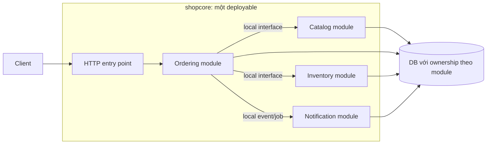
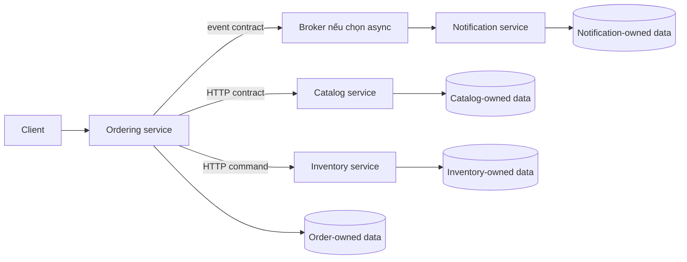

# Lesson 01 · Microservices khác chia package ở đâu?

> Mục tiêu: phân biệt ranh giới code, ranh giới nghiệp vụ và ranh giới triển khai. Hiểu modular monolith trước khi quyết định thêm network.

## Tài liệu / video

- [Monolithic architecture](https://microservices.io/patterns/monolithic.html): đơn vị triển khai và trade-off của lời gọi local.
- [Microservice architecture](https://microservices.io/patterns/microservices.html): độc lập triển khai và coupling.
- [Bounded Context — Martin Fowler](https://martinfowler.com/bliki/BoundedContext.html): phạm vi nhất quán của mô hình/ngôn ngữ.
- [AWS: decompose by business capability](https://docs.aws.amazon.com/prescriptive-guidance/latest/modernization-decomposing-monoliths/decompose-business-capability.html): chia theo năng lực nghiệp vụ.
- [Database per service](https://microservices.io/patterns/data/database-per-service.html): ownership logic không đồng nghĩa mỗi service một máy DB.
- Video: tìm `modular monolith vs microservices trade offs`, `bounded context product catalog order example`. Đây là từ khóa tìm, không phải video đã được kiểm chứng.

## 1. Nối với code bạn đã biết

Bạn quen `ProductController → ProductService → ProductRepository`. Ba lớp này chia **trách nhiệm kỹ thuật trong một feature**. Chúng không phải ba microservice.

```text
Controller: hiểu HTTP
Service: hiểu business rule
Repository: hiểu data access
```

`@Service` chỉ đánh dấu bean Spring. Mười class có annotation này vẫn có thể chạy trong cùng một JVM, cùng artifact triển khai. Đổi tên thành ProductMicroservice cũng không thay cách chạy.

Trong ví dụ shopcore, file model/DTO Product, Category hiện có là nền tảng. Order, Inventory và Notification dưới đây là **ví dụ thiết kế mở rộng**, không tuyên bố đã có implementation chạy trong repository.

## 2. Ba lựa chọn, không phải hai cực tốt/xấu

| Lựa chọn | Code/ranh giới | Triển khai | Đổi lại |
|---|---|---|---|
| Monolith rối | Các phần gọi/sửa dữ liệu nhau tùy tiện | Một đơn vị chính | Dễ bị coupling và khó sửa |
| Modular monolith | Chia module nghiệp vụ, contract/ownership rõ | Vẫn một đơn vị chính | Giữ local calls, nhưng phải kiểm soát boundary |
| Microservices | Các service nghiệp vụ giao tiếp qua contract | Có khả năng deploy riêng | Thêm network, failure modes và vận hành phân tán |

Monolith không có nghĩa một file hoặc chỉ một instance. Có thể chạy nhiều instance cùng artifact sau load balancer; scale database là bài toán riêng. Nhiều database cũng không tự biến ứng dụng thành microservices. Microservices không được định nghĩa bằng số dòng code, số repo hoặc chỉ bằng Docker/Kubernetes.

“Độc lập deploy” nghĩa là một thay đổi tương thích của service A có thể phát hành mà không bắt B/C cùng release. Vẫn cần contract compatibility và điều phối một số thay đổi lớn; không phải không bao giờ nói chuyện với team khác.

## 3. Sơ đồ cùng feature, khác cách chạy

### Modular monolith đề xuất



Đọc hình:

1. Client gửi HTTP vào một ứng dụng; không có network hop giữa các module chỉ vì ta tách package.
2. Ordering gọi contract nội bộ của Catalog/Inventory, không tự chọc Repository của bên kia.
3. Một DB dùng chung vật lý có thể có bảng/schema được phân owner. Đây là quy tắc thiết kế cần thực thi bằng code review/test/quyền khi phù hợp, không tự xuất hiện từ tên folder.
4. Nếu nghiệp vụ dùng cùng DB/resource và transaction manager, có thể thiết kế local transaction chung. Cùng JVM không tự làm mọi call atomic: HTTP/email/Kafka bên ngoài vẫn không nằm trong DB transaction.
5. Local event đồng bộ cũng chưa phải queue bền vững: process chết có thể mất việc chưa xử lý nếu không có cơ chế lưu/job/outbox.

### Nếu thực sự tách process



Khác biệt không chỉ là hình nhiều hộp hơn:

- HTTP call có timeout/network failure; lời gọi Java local không có cùng loại failure đó.
- Event có độ trễ/redelivery; broker acknowledgement không phải notification đã xử lý.
- Owner tự quản dữ liệu; một `@Transactional` ở Ordering không tự rollback database Inventory hoặc email.
- DB hình vẽ là ownership logic; có thể cùng server vật lý với schema/user riêng. Cùng server vẫn có shared resource/failure risk, không phải isolation tuyệt đối.
- Broker không bắt buộc để gọi là microservices. Modular monolith cũng có thể dùng Kafka, nên “có Kafka” không chứng minh đã là microservices.

## 4. Bounded context là ranh giới ý nghĩa

Một bounded context là phạm vi trong đó mô hình và cách dùng từ có ý nghĩa nhất quán. Cùng từ “Product” không bắt mọi bộ phận dùng cùng một Java Entity cho mọi việc.

Ví dụ thiết kế cho cửa hàng:

| Context | “Product” cần gì? | Rule thuộc context |
|---|---|---|
| Catalog | Tên hiển thị, SKU, mô tả, category, giá niêm yết | SKU/hiển thị catalog |
| Ordering | Product ID và snapshot tên/đơn giá lúc mua | Tổng tiền Order dựa thỏa thuận khi đặt |
| Inventory | SKU, lượng có, lượng giữ chỗ | Không giữ quá lượng cho phép theo policy |

Nếu đổi tên/giá Catalog hôm nay, Order lịch sử không nên tự mất thông tin đã chốt. Ordering có thể lưu snapshot line item thay vì chỉ tham chiếu Entity Product hiện tại. Snapshot là bản sao có mục đích, không tự trở thành owner của giá catalog hiện tại.

Đây là **ứng viên context**, cần hỏi domain expert và kiểm rule thực tế. Không suy “mỗi table = một context”, “Product/Category luôn phải tách” hoặc “mỗi bounded context luôn đúng một service”. Một deployable có thể chứa nhiều context; mapping triển khai là quyết định sau đó.

## 5. Chọn boundary theo câu hỏi nghiệp vụ

Với một feature, hãy hỏi:

1. Nó làm năng lực nghiệp vụ nào, ai chịu trách nhiệm?
2. Dữ liệu/rule nào nó sở hữu, phần khác được hỏi qua contract nào?
3. Những thay đổi nào thường đi cùng nhau? Rule nào cần cùng transaction?
4. Nếu tách, một request có phải chatty-call qua lại nhiều lần không?
5. Team/runtime/scale có thật sự cần độc lập, hay chỉ là cách đặt folder đẹp?

Đừng dựng Controller service, Business service và Repository service theo ba layer. Một feature CRUD sẽ bị chia thành nhiều network hops nhưng vẫn phải sửa/deploy cùng nhau. Chia theo năng lực như Catalog/Ordering là hướng **ứng viên**, không bảo đảm tự đúng nếu boundary của rule vẫn chồng chéo.

## 6. Ownership dữ liệu có nghĩa gì?

Giả sử đã tách Inventory service. Ordering không được UPDATE trực tiếp `inventory.stock` bằng credentials chung cho tiện. Làm vậy bypass rule giữ chỗ và buộc schema Inventory thành API ngầm.

Contract thay thế có thể là command `reserveItems` và result rõ ràng, hoặc event/workflow nếu business cho phép async. Query tổng hợp có thể dùng API composition hoặc read model cập nhật bằng event. Chấp nhận đổi lại độ trễ/consistency/chi phí, không chỉ nói “dùng Kafka là xong”. Không cần triển khai CQRS ở module này.

Database per service không bắt mua một máy DB cho mỗi service. Schema/private tables với access control có thể giữ ownership, nhưng shared DB host vẫn là điểm coupling vận hành. Cần phân biệt **ai được sửa dữ liệu** với **dữ liệu nằm trên máy nào**.

## 7. Distributed monolith: nhiều process, vẫn dính nhau

Dấu hiệu: cùng shared tables, mọi thay đổi phải release đồng loạt, request đi vòng A → B → C → A, shared Entity jar bắt các bên nâng version cùng lúc, hoặc một bên chết kéo cả chuỗi chết mà không có policy.

Tên “microservices” không đem lại độc lập nếu contract/data/ownership vẫn ràng chặt. Ngược lại, không phải mọi shared library đều xấu: utility ổn định không chứa business schema có thể phù hợp. Hãy xét coupling mà nó tạo ra, không đặt luật cấm mọi shared code.

## 8. Chốt bài bằng lời của bạn

**Layer chia trách nhiệm kỹ thuật; context chia ý nghĩa/rule nghiệp vụ; service chia đơn vị vận hành/triển khai.** Ba thứ liên quan nhưng không là một.

Giữ shopcore monolith có thể hợp lý ở giai đoạn học. Việc cần làm là hiểu/giữ boundary, không bắt tách project mới để chứng minh đã học microservices.

[Làm đề Lesson 01](../../../Exams/de-kiem-tra/M5-3-microservices__2026-10-07__lesson1-lan1.md).
