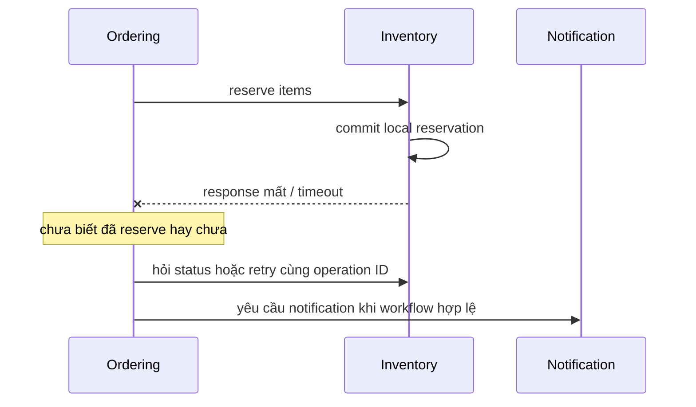

# Lesson 02 · Khi nào tách, và ghi quyết định thế nào?

> Mục tiêu: chọn kiến trúc bằng nhu cầu/bằng chứng, nhận diện chi phí mới và viết ADR có thể bị phản biện. Không tách service chỉ để dùng công nghệ vừa học.

## Tài liệu / video

- [AWS: Implementing microservices](https://docs.aws.amazon.com/whitepapers/latest/microservices-on-aws/microservices-on-aws.html): chọn theo use case và chi phí, không mặc định microservices.
- [AWS: Strangler fig](https://docs.aws.amazon.com/prescriptive-guidance/latest/modernization-decomposing-monoliths/strangler-fig.html): chuyển từng phần, có routing/migration.
- [Documenting Architecture Decisions — Michael Nygard](https://cognitect.com/blog/2011/11/15/documenting-architecture-decisions): context, decision, status, consequences.
- [AWS: ADR process](https://docs.aws.amazon.com/prescriptive-guidance/latest/architectural-decision-records/adr-process.html): ownership/review của quyết định.
- [Saga pattern](https://microservices.io/patterns/data/saga.html): chỉ đọc local transactions/compensation, không code orchestrator.
- [Circuit breaker pattern](https://microservices.io/patterns/reliability/circuit-breaker.html): nhận diện giới hạn failure isolation.
- Video: tìm `architecture decision record monolith microservices trade offs`, `strangler fig microservices migration explained`. Không giao service mesh, saga implementation hoặc AWS deployment ở bài này.

## 1. Không hỏi “microservices có tốt không?”

Hãy hỏi “với constraint này, lợi ích nào đủ trả chi phí nào?”. Tách process có thể hỗ trợ deploy/scale riêng, nhưng không tự làm query nhanh, giảm coupling domain hoặc biến team thiếu CI/CD thành team phát hành độc lập.

| Lý do ứng viên | Cần bằng chứng | Thử trước/đối chiếu |
|---|---|---|
| Team bị chặn release | Các thay đổi độc lập nhưng bị release chung; có owner/on-call riêng | Rõ module ownership, giảm shared code, cải thiện pipeline |
| Một workload cần scale riêng | Profile/load cho thấy bottleneck của phần đó | Query/index, cache có đo, async job hoặc scale monolith |
| Cần giới hạn blast radius | Failure/CPU/RAM của phần đó ảnh hưởng phần còn lại | Timeout, pool giới hạn, bulkhead, durable job |
| Runtime khác biệt | Ví dụ GPU/Python inference có nhu cầu thật | Worker riêng với contract tối thiểu, không tách mọi CRUD |

“Có nhiều user” chưa phải số đo. Endpoint chậm do N+1/thiếu index mà tách service vẫn chạy query cũ có thể còn thêm network. Một monolith có thể scale nhiều instance; chi phí scale phần không cần là trade-off, không phải không scale được.

## 2. Chi phí vận hành: ai làm các việc này?

| Mảng | Việc phát sinh khi nhiều service |
|---|---|
| Release | Build/deploy/config/rollback từng service, contract compatibility |
| Network | Discovery/routing, timeout, connection pool, retry budget |
| Security | Identity service-to-service, authz, TLS/secrets và rotation |
| Data | Ownership, migration, read model lag, backup/restore phối hợp |
| Observability | Correlation/trace xuyên process, metrics/logs, alert và owner |
| Reliability | Partial failure, resource limits, capacity và runbook |
| Testing | Contract, integration, failure path; unit test mỗi service chưa đủ |
| Cost | Compute, network, broker/storage, tooling và thời gian trực vận hành |

Không nhất thiết mỗi service cần toàn bộ một platform mới; managed service giảm một số việc nhưng không xóa trách nhiệm hiểu contract/failure/chi phí. Docker chỉ đóng gói, Kubernetes/service mesh không tự chọn boundary nghiệp vụ đúng.

## 3. Failure isolation không tự có

Ví dụ Ordering gọi Notification đồng bộ:

```text
Notification chậm -> request Ordering giữ thread/connection lâu
-> pool Ordering đầy -> request khác cũng chờ
-> hai process riêng vẫn có thể tạo cascading failure
```

Timeout giới hạn thời gian chờ, không chứng minh bên kia chưa làm gì. Retry cần idempotency và budget; retry ở nhiều tầng có thể khuếch đại tải. Backoff/jitter giảm retry đồng loạt, không tạo capacity mới. Circuit breaker tạm ngừng gọi dependency đang lỗi, không rollback remote side effect hoặc chữa dữ liệu.

Bulkhead ở đây hiểu là giới hạn/tách tài nguyên để một việc không chiếm hết pool. Nếu chuyển notification thành durable async job và business cho phép gửi trễ, đặt Order có thể không phải chờ SMTP. Khi đó phải quản backlog/retry/DLT/idempotency và trạng thái notification, không return “email đã gửi” ngay khi enqueue.

Hãy xác định **phần nào được phép degrade**. Có thể gửi notification trễ; không được báo payment thành công hoặc stock đã giữ khi chưa biết. Fail-open không phù hợp mọi nghiệp vụ.

## 4. Tách data làm transaction đổi bản chất



Giải thích từng bước:

1. Inventory sở hữu việc giữ chỗ và commit DB riêng.
2. Response mất không đảo ngược commit ấy; Ordering timeout là **không biết kết quả**, không chắc thất bại.
3. Retry cùng operation ID/status API giúp tránh reserve hai lần; đổi ID tùy tiện tạo một thao tác mới.
4. Chỉ notification khi state business hợp lệ theo policy, không vì đã gọi HTTP là coi thành công.

Một local `@Transactional` ở Ordering không rollback DB Inventory. Saga là chuỗi local transaction có bước bù nghiệp vụ khi cần; compensation không phải SQL rollback xuyên thời gian, có thể thất bại và cần retry/điều tra. Ví dụ release reservation hoặc refund là hành động mới, không “xóa mọi dấu vết”. Bài chỉ nhận diện, không triển khai orchestration.

Eventual consistency là chấp nhận các view khác nhau tạm thời theo thiết kế; vẫn phải có cơ chế delivery/reconcile và xử lý lỗi. Không có cơ chế đó thì “sau này sẽ đúng” chỉ là mong muốn. Catalog cache/read model không được dùng làm bằng chứng stock/payment hiện tại chính xác tuyệt đối.

## 5. Case study: giữ shopcore hay tách?

**Tất cả số liệu/đội ngũ bên dưới là giả định học, không phải benchmark hoặc tổ chức thực của project.**

### Case A: một người học, chưa có số đo production

Mục tiêu là hiểu backend và sau đó AI Engineer; chưa chứng minh bottleneck/nhu cầu release nhiều team. Hợp lý để **giữ một deployable**, hướng module theo nghiệp vụ, học contract và failure cases. Không phải vì monolith luôn thắng, mà vì chưa có lợi ích đủ chứng minh chi phí tách.

### Case B: notification thành bottleneck đã đo

Giả sử hai tuần số đo cho thấy job notification chiếm worker pool và backlog tăng, trong khi team owner có pipeline/on-call. Có thể chọn durable worker/service riêng cho notification. Cần chứng minh đã thử timeout/pool/batching/job phù hợp và design mới giải quyết đúng bottleneck. Nếu bottleneck là rate limit provider, thêm nhiều service không tự tăng quota.

### Case C: thêm inference Python/GPU

Có thể để shopcore CRUD/order là monolith và gọi một worker inference có contract riêng vì runtime/capacity khác. Cần jobId/idempotency, deadline, queue budget, auth/PII, model version và status. Đây không phải lý do tách Product/Category thành 10 service. Không triển khai AI pipeline trong module này.

Các phương án khác vẫn có thể đúng nếu assumption, evidence và consequences nhất quán. Không chấm theo khẩu hiệu “luôn monolith” hoặc “luôn microservices”.

## 6. Nếu quyết định tách: đi từng bước

```text
chọn một capability với owner/rule rõ
-> dựng contract và boundary nội bộ
-> đo baseline + đặt tiêu chí thành công
-> chuẩn bị ownership/migration/sync data
-> chuyển một phần traffic/workflow có kiểm soát
-> quan sát correctness/latency/error/backlog/cost
-> mở rộng hoặc rollback theo tiêu chí
```

Đây là hướng incremental/strangler, không phải bắt viết lại toàn hệ thống một lần. Khi phần cũ và mới cùng tồn tại, xác định một nguồn ghi/owner cho từng dữ liệu, không dual-write tùy tiện. Nếu dữ liệu đã biến đổi, rollback app version không bảo đảm rollback data; kế hoạch cutover/rollback phải nói phần đó.

“Sẵn sàng tách” bao gồm contract versioning, tests, observability, secrets, owner/runbook và data strategy. Số người/requests không có ngưỡng thần kỳ chung. Review trigger là tín hiệu điều tra lại, không là lệnh tự động tạo service.

## 7. ADR: ghi lý do để tương lai hiểu được

ADR là một ghi chú về **một quyết định kiến trúc quan trọng**, không phải checklist mọi công nghệ, không phải tài liệu chứng nhận implementation đã có.

Một ADR dùng trong module có:

- Title/ID, ngày, owner và status.
- Context: fact nào đã biết, assumption nào chưa đo, vấn đề/constraint.
- Options: giữ monolith, modularize, tách một phần; tiêu chí so sánh.
- Decision và lý do: chọn gì **bây giờ**, không chọn gì.
- Consequences: lợi ích, mặt trái, rủi ro và mitigation.
- Revisit triggers: bằng chứng nào làm xem xét lại, ai review, lấy dữ liệu ở đâu.
- Validation: sẽ kiểm thế nào, phần nào chưa kiểm/chưa implement.

`Proposed` là đang đề xuất; `Accepted` là đã được người/nhóm có thẩm quyền chấp thuận, không tự đồng nghĩa đã deploy. Thay quyết định thì tạo ADR mới và link `Superseded`/quan hệ thay thế, giữ lịch sử lý do cũ thay vì rewrite như nó chưa từng tồn tại.

Xem [template](ADR_TEMPLATE.md) và [ADR mẫu có giải thích](ADR_EXAMPLE_SHOPCORE_MONOLITH.md). Mẫu chỉ để đọc/so sánh, **không tự nộp thay bạn vào shopcore/docs**. Roadmap deliverable là ADR, không cần viết microservices code để hoàn thành phần kiến thức này.

## 8. Tự kiểm trước khi thi

Bạn nên phản biện được câu “tách service sẽ scale và không lỗi nữa”, đưa một alternative ít chi phí hơn, và viết quyết định thừa nhận mặt trái. Học architecture là chọn có lý do trong constraint, không nhớ tên mọi pattern.

[Làm đề Lesson 02](../../../Exams/de-kiem-tra/M5-3-microservices__2026-10-07__lesson2-lan1.md).
