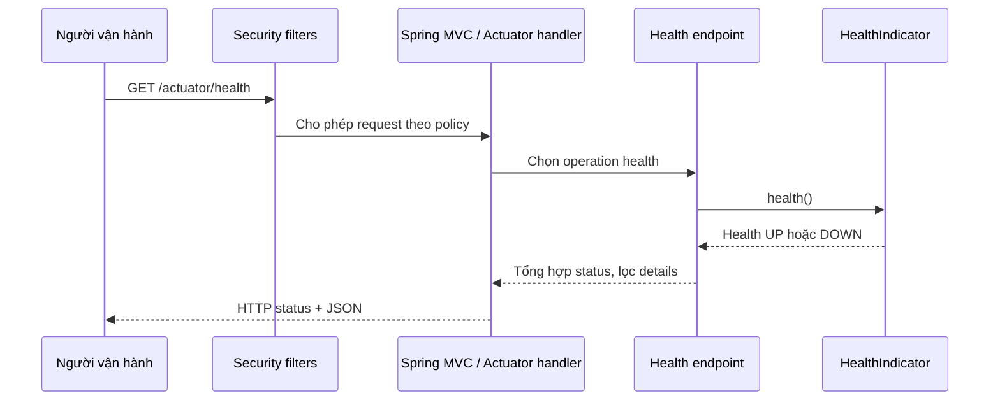

# Lesson 01 · Actuator: cửa quan sát, không phải cửa quản trị công khai

> Mục tiêu: hiểu health/info/metrics hoạt động ở đâu; expose an toàn; thêm indicator và giải thích đúng giới hạn của nó. Khoảng 4h gồm đọc, dự đoán kết quả và đề.

## Tài liệu / video

Đọc theo câu hỏi, không cần thuộc toàn bộ documentation:

1. [Actuator overview](https://docs.spring.io/spring-boot/reference/actuator/index.html): Actuator bổ sung khả năng vận hành gì?
2. [Endpoint access, exposure và security](https://docs.spring.io/spring-boot/reference/actuator/endpoints.html): ba lớp kiểm soát khác nhau thế nào?
3. [HealthIndicator API Boot 4](https://docs.spring.io/spring-boot/api/java/org/springframework/boot/health/contributor/HealthIndicator.html): contract trả Health.
4. [Monitoring over HTTP](https://docs.spring.io/spring-boot/reference/actuator/monitoring.html): đổi port không thay thế authentication/firewall.

Video: tìm YouTube `Spring Boot Actuator health endpoint security custom HealthIndicator`. Chọn video ghi rõ version; đối chiếu import/properties với Boot 4.1.1. Đây là từ khóa tìm, không phải video đã được kiểm chứng.

## 1. Từ câu hỏi thực tế đến công cụ

Giả sử Product API trả chậm. Có ba câu hỏi khác nhau:

| Câu hỏi | Công cụ phù hợp |
|---|---|
| Điều kiện kiểm tra hiện tại có đạt không? | Health |
| Trong khoảng thời gian đó có bao nhiêu request, mất bao lâu? | Metrics và hệ thống lưu chuỗi thời gian khi cần |
| Một request cụ thể đã làm gì, lỗi ở đâu? | Log có requestId; tracing là bước mở rộng |

Actuator cung cấp endpoint vận hành. Micrometer ghi số đo. Logger ghi sự kiện. Ba thứ hỗ trợ nhau, không thay thế nhau. `UP` chỉ nói các kiểm tra đã chọn đạt tại thời điểm kiểm tra; không chứng minh mọi business flow, authorization hay query đều đúng.

## 2. Nó đi qua luồng nào?



Giải nghĩa từng mũi tên:

1. Người vận hành gửi HTTP request giống khi gọi Product API.
2. Filter/security vẫn kiểm request. `permitAll` health không có nghĩa các endpoint khác cũng public.
3. MVC tìm handler Actuator được auto-configure, không gọi `ProductController` của bạn.
4. Health endpoint gọi contributor/indicator đã đăng ký trong ApplicationContext.
5. Indicator thực hiện một kiểm tra, trả object Health, chưa tự viết HTTP response.
6. Endpoint tổng hợp các kết quả và áp policy hiển thị details cho người gọi.
7. Framework serialize kết quả thành JSON; status tổng hợp quyết định HTTP status theo mapping.

Đây là mô hình đơn giản hóa cho servlet stack. Khi gọi `/actuator/metrics`, operation đọc MeterRegistry thay vì chạy health checks; nó không đi qua ProductService để tự suy luận business correctness.

## 3. Thêm dependency, không tạo project mới

Thêm vào `dependencies` của `shopcore/pom.xml`, giữ parent quản lý version:

```xml
<dependency>
    <groupId>org.springframework.boot</groupId>
    <artifactId>spring-boot-starter-actuator</artifactId>
</dependency>
```

Security sample dưới đây cần thêm `spring-boot-starter-security` nếu project chưa có. Không cần `micrometer-registry-prometheus` để xem `/metrics`.

Sau khi thêm, Boot auto-configure các bean phù hợp. Không cần tự viết HealthController. Khi không có Spring Security, đừng kỳ vọng Actuator tự tạo login bảo vệ info/metrics.

## 4. Ba cửa phải phân biệt

```text
Endpoint được phép tồn tại/đọc? -> access
Có đưa nó ra HTTP?             -> web exposure
Người gọi có được đi vào?      -> network + authentication/authorization
```

Boot 4 dùng `management.endpoint.<id>.access`. `read-only` chỉ cho operation đọc, **không có nghĩa chỉ OPS được đọc**. Exposure cũng không phải quyền người dùng. Mặc định chỉ health được expose qua HTTP; muốn info/metrics phải chọn rõ.

Trong YAML dưới đây, opt-in đúng ba endpoint; không expose `env`, `heapdump`, `loggers`. Heap dump có thể chứa dữ liệu trong RAM; loggers có operation đổi level. Sanitization một endpoint không khiến mọi dữ liệu vận hành trở nên an toàn để public.

<!-- verify-yaml: application.yml -->
```yaml
server:
  address: 127.0.0.1

spring:
  security:
    user:
      name: ops
      password: ${ACTUATOR_PASSWORD}
      roles: OPS

management:
  endpoints:
    access:
      default: none
    web:
      exposure:
        include: health,info,metrics
  endpoint:
    health:
      access: read-only
      show-details: when-authorized
      roles: OPS
      probes:
        enabled: true
      group:
        readiness:
          include: readinessState,uploadDirectory
    info:
      access: read-only
    metrics:
      access: read-only

shopcore:
  upload:
    directory: ${UPLOAD_DIRECTORY:./uploads}
```

Đây là **cấu hình lab localhost**, không phải security hoàn chỉnh cho production. `ACTUATOR_PASSWORD` lấy từ môi trường, không commit mật khẩu; thiếu placeholder khi được resolve làm app không khởi tạo được config tương ứng. Tạo thư mục uploads hoặc trỏ `UPLOAD_DIRECTORY` vào thư mục thử đã có trước khi mong health UP.

Nếu dùng `exclude` cùng `include`, exclude thắng. Không dùng `include: '*'` cho tiện rồi quên thu hẹp. Đổi management port/path chỉ thay địa chỉ, không thay quyền truy cập; firewall/private network và TLS vẫn cần theo môi trường. Không đưa HTTP Basic không mã hóa lên Internet.

## 5. Security: Actuator chain và application chain

Boot có security auto-configuration khi có dependency phù hợp. Nhưng khi bạn tự khai báo SecurityFilterChain, auto-config đó nhường cho bạn. Một chain chỉ match Actuator **không tự bảo vệ phần URL còn lại**.

Ví dụ độc lập sau có đủ hai chain. Nếu `shopcore` đã dùng JWT/OAuth2, giữ chain ứng dụng hiện tại và tích hợp policy Actuator đúng thứ tự; **không chép chain Basic đè JWT**.

<!-- verify: com/shopcore/observability/ActuatorSecurityConfiguration.java -->
```java
package com.shopcore.observability;

import org.springframework.boot.security.autoconfigure.actuate.web.servlet.EndpointRequest;
import org.springframework.context.annotation.Bean;
import org.springframework.context.annotation.Configuration;
import org.springframework.core.annotation.Order;
import org.springframework.security.config.annotation.web.builders.HttpSecurity;
import org.springframework.security.web.SecurityFilterChain;
import static org.springframework.security.config.Customizer.withDefaults;

@Configuration(proxyBeanMethods = false)
public class ActuatorSecurityConfiguration {
    @Bean
    @Order(1)
    SecurityFilterChain actuatorChain(HttpSecurity http) {
        http.securityMatcher(EndpointRequest.toAnyEndpoint());
        http.authorizeHttpRequests(auth -> auth
                .requestMatchers(EndpointRequest.to("health")).permitAll()
                .anyRequest().hasRole("OPS"));
        http.httpBasic(withDefaults());
        return http.build();
    }

    @Bean
    @Order(2)
    SecurityFilterChain applicationChain(HttpSecurity http) {
        http.authorizeHttpRequests(auth -> auth.anyRequest().authenticated());
        http.httpBasic(withDefaults());
        return http.build();
    }
}
```

Spring chọn **chain đầu tiên match**, không chạy cả hai chain nối tiếp cho cùng request. `@Order(1)` dành Actuator; fallback không đặt securityMatcher nên bao phần còn lại. `hasRole("OPS")` kiểm authority `ROLE_OPS`. Không disable CSRF toàn cục chỉ để thử một admin endpoint; mẫu chỉ đọc GET nên không cần workaround đó.

Kỳ vọng với mẫu này, health đang UP:

| Request | Kết quả |
|---|---|
| Anonymous GET health | 200, chỉ status, không details |
| Anonymous GET metrics/info | 401 |
| Đã đăng nhập nhưng chỉ ROLE_USER GET metrics | 403 |
| ROLE_OPS GET metrics/info | 200 |
| ROLE_OPS GET env | 404 vì không có endpoint được expose/cho phép |
| Anonymous GET URL ứng dụng | 401, fallback chain bảo vệ |

404 chưa đủ chứng minh security hoạt động: có thể endpoint chưa tồn tại. Phải kiểm endpoint đang tồn tại với anonymous, sai role và đúng role. 401/403 cũng không có nghĩa đã kiểm business permission cho Product.

## 6. Info không tự biết thông tin bạn muốn công bố

`GET /actuator/info` có thể trả `{}` nếu chưa có contributor cung cấp nội dung. Không phải mọi thông tin từ application.yml tự xuất hiện.

<!-- verify: com/shopcore/observability/ShopcoreInfoContributor.java -->
```java
package com.shopcore.observability;

import java.util.Map;
import org.springframework.boot.actuate.info.Info;
import org.springframework.boot.actuate.info.InfoContributor;
import org.springframework.stereotype.Component;

@Component
public class ShopcoreInfoContributor implements InfoContributor {
    @Override
    public void contribute(Info.Builder builder) {
        builder.withDetail("application", Map.of("name", "shopcore"));
    }
}
```

`InfoContributor` là bean; endpoint gọi `contribute`, gom nội dung rồi trả JSON. Chỉ đưa metadata chủ động cho phép công bố. Không đưa DB password, JWT secret, access token hoặc environment dump. Muốn build version thật phải có build metadata tương ứng; không điền một version giả rồi gọi đó là bản đang deploy.

## 7. Custom HealthIndicator: làm một phép kiểm, không đoán cả hệ thống

Tình huống minh họa: ứng dụng cần thư mục upload local. Đây là điều kiện lab, **không khẳng định source shopcore hiện tại đã có upload feature**. Ta kiểm thư mục tồn tại và Java báo writable, không ghi file, không gọi API tính tiền và không thay đổi dữ liệu.

<!-- verify: com/shopcore/observability/UploadDirectoryHealthIndicator.java -->
```java
package com.shopcore.observability;

import java.nio.file.Files;
import java.nio.file.Path;
import org.springframework.beans.factory.annotation.Value;
import org.springframework.boot.health.contributor.Health;
import org.springframework.boot.health.contributor.HealthIndicator;
import org.springframework.stereotype.Component;

@Component
public class UploadDirectoryHealthIndicator implements HealthIndicator {
    private final Path directory;

    public UploadDirectoryHealthIndicator(
            @Value("${shopcore.upload.directory:./uploads}") String directory) {
        this.directory = Path.of(directory);
    }

    @Override
    public Health health() {
        try {
            if (Files.isDirectory(directory) && Files.isWritable(directory)) {
                return Health.up().build();
            }
            return Health.down().withDetail("reason", "directory_unavailable").build();
        } catch (SecurityException exception) {
            return Health.down().withDetail("reason", "check_denied").build();
        }
    }
}
```

Giải thích:

1. Spring tạo bean, inject đường dẫn từ config qua constructor; không tạo lại bean cho mỗi request health.
2. Khi health endpoint cần kết quả, `health()` kiểm trạng thái hiện tại.
3. Trả `UP` khi hai điều kiện đạt; trả `DOWN` với reason đã giới hạn, không đưa absolute path/exception có secrets ra response.
4. Bean tên `uploadDirectoryHealthIndicator`, contributor ID là `uploadDirectory` sau khi bỏ suffix. YAML readiness gọi đúng ID đó.
5. Status DOWN/OUT_OF_SERVICE mặc định tương ứng HTTP 503; UP thường 200. Đừng nhầm body status với HTTP status, hoặc tự đổi mapping làm DOWN trả 200 mà không cân nhắc bên giám sát.

**Giới hạn:** writable check không đảm bảo lần ghi kế tiếp thành công, còn đủ dung lượng, hay remote filesystem không treo. File có thể đổi ngay sau kiểm tra (TOCTOU). Chỉ dùng mẫu trên filesystem local đã biết; probe mạng/DB phải có timeout thực của client/driver. Cảnh báo slow health indicator của framework không tự cắt lời gọi đang treo.

Không dùng “SELECT toàn bộ products”, gọi LLM thật, tạo đơn thử hoặc retry vô hạn trong health. Probe được gọi lặp lại; check nặng có thể trở thành nguồn tải và chi phí.

## 8. Liveness và readiness: hành động khác nhau

| Probe | Câu hỏi | Hành động thường gặp của nền tảng |
|---|---|---|
| Liveness | Tiến trình có bị kẹt/hỏng đến mức cần restart? | Restart instance |
| Readiness | Instance lúc này có nên nhận traffic mới? | Bỏ instance khỏi routing |

Các URL khi bật probes: `/actuator/health/liveness`, `/actuator/health/readiness`. Default readiness không tự bao mọi DB/Redis/provider; phải chọn dependency thật sự cần cho việc phục vụ. YAML lab thêm uploadDirectory vào readiness **vì giả định upload là bắt buộc trong lab**. Nếu upload chỉ là feature phụ, không nên loại cả catalog API khỏi routing vì nó.

Thư mục mất trong lab: root health DOWN, readiness DOWN; liveness vẫn UP vì không gắn dependency đó vào liveness. DB/provider hỏng chung mà gắn vào liveness của mọi instance sẽ dễ tạo vòng restart, không sửa được DB/provider.

Không cần Kubernetes để đọc hai endpoint. Khi dùng management port riêng, health ở port đó có thể UP dù app port không phục vụ; phải kiểm đường phục vụ thực, có thể cấu hình additional probe paths trên main port theo docs. Module này không yêu cầu triển khai cluster.

## 9. Thử theo thứ tự và tự dự đoán

Đặt env `ACTUATOR_PASSWORD` bằng secret lab của bạn; chạy shopcore với dependency, YAML, các class trên. Không dùng credential production trong shell lịch sử.

```bash
curl -i http://127.0.0.1:8080/actuator/health
curl -i http://127.0.0.1:8080/actuator/info
curl -i -u ops http://127.0.0.1:8080/actuator/info
curl -i -u ops http://127.0.0.1:8080/actuator/metrics
curl -i -u ops http://127.0.0.1:8080/actuator/env
curl -i http://127.0.0.1:8080/actuator/health/readiness
```

`curl -u ops` hỏi mật khẩu. Chỉ dùng Basic trên HTTP loopback cho lab; triển khai thật cần TLS và policy mạng phù hợp. Đọc cả status, headers và body; thử thư mục tồn tại/không tồn tại. Không xóa thư mục dữ liệu thật để thử lỗi.

### 9.1. Nhìn status để chọn chỗ kiểm, không đoán ngay nguyên nhân

Bảng này áp dụng cho **policy Basic của lab**, không phải mọi cấu hình Spring Security:

| Kết quả | Luồng dừng/tiếp thế nào? | Việc kiểm tiếp theo |
|---|---|---|
| Anonymous gọi metrics → 401 | Security yêu cầu xác thực; chưa đọc registry | Có gửi credentials hợp lệ chưa? |
| USER gọi metrics → 403 | Đã xác thực nhưng thiếu quyền OPS | Role và chain được chọn có đúng không? |
| OPS gọi env → 404 | Qua kiểm quyền nhưng endpoint không được đưa ra | Kiểm access, exposure và URL; không bật wildcard để chữa |
| OPS gọi metrics/tên-chưa-có → 404 | Metrics endpoint có thật, nhưng registry chưa có meter tên đó | Liệt kê tên meter, kiểm activity/config; khác với endpoint env không tồn tại |
| Health → 503 | Handler đã chạy và kết quả health tổng hợp không đạt | Đọc contributor với quyền phù hợp, kiểm dependency thực |
| Health → 200, Product → 500 | Health và business request đi qua hai handler khác nhau | Điều tra Product request bằng metrics/log, không kết luận từ UP |

Ví dụ: thư mục upload mất không nhất thiết làm process chết. Request health vẫn đi qua Security → Actuator handler → indicator; indicator trả DOWN, endpoint tổng hợp rồi trả 503. Đây là **kết quả phép kiểm**, không bắt buộc là một AppException do ProductService ném. Nền tảng gọi probe mới quyết định bỏ routing/restart theo loại probe; Actuator không tự restart JVM chỉ vì trả 503.

## 10. Tự kể lại bằng lời của bạn

“Actuator health là handler của framework, không phải ProductController. Endpoint gọi indicator, tổng hợp và lọc details. Access/exposure/quyền người gọi là ba chuyện khác nhau. Một probe đạt chỉ chứng minh điều kiện nó kiểm, không bảo đảm hệ thống luôn đúng.”

Làm [đề Lesson 01](../../../Exams/de-kiem-tra/M5-4-actuator__2026-10-07__lesson1-lan1.md) trước khi mở đáp án.
