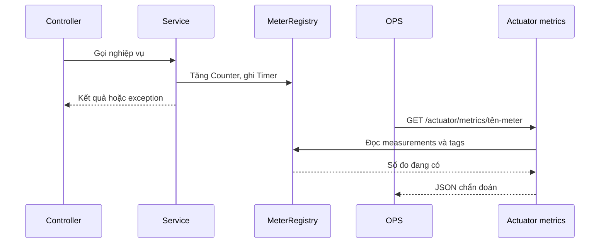

# Lesson 02 · Metrics: đếm đúng việc, đo đúng đoạn, tìm đúng log

> Mục tiêu: hiểu MeterRegistry, Counter, Timer; đọc số liệu có đơn vị/phạm vi; tránh cardinality cao và nối metrics với MDC. Khoảng 4h gồm bài học và đề.

## Tài liệu / video

1. [Boot Metrics](https://docs.spring.io/spring-boot/reference/actuator/metrics.html): auto-instrumentation và endpoint chẩn đoán.
2. [Micrometer meters](https://docs.micrometer.io/micrometer/reference/concepts/meters.html): tên + tags nhận diện meter.
3. [Counter](https://docs.micrometer.io/micrometer/reference/concepts/counters.html): đếm sự kiện, quan tâm rate khi vận hành.
4. [Timer](https://docs.micrometer.io/micrometer/reference/concepts/timers.html): count và duration, đo cả nhánh lỗi.
5. [Naming và tags](https://docs.micrometer.io/micrometer/reference/concepts/naming.html): giữ dimensions hữu hạn.
6. [Bài MDC đã có](../../M4_DevOps_Engineering/M4_4_Logging_Hexagonal/LESSON_02_REQUEST_ID_MDC_FILTER.md): requestId, ownership và cleanup.
7. [Metrics REST API](https://docs.spring.io/spring-boot/api/rest/actuator/metrics.html): fields, tag filter và mục đích chẩn đoán, không scrape endpoint JSON này làm backend production.

Video: tìm `Micrometer Counter Timer Spring Boot Actuator metrics cardinality`. Đối chiếu registry/version; không bắt cài Grafana chỉ để hiểu Timer. Các từ khóa không phải cam kết video cụ thể đã được xem.

## 1. Bức tranh trong bộ nhớ



1. Controller gọi Service như trước; metrics không thay kiến trúc 3-layer.
2. Đoạn code đã được instrument ghi số đo vào registry của instance này.
3. Nghiệp vụ tiếp tục trả kết quả/ném lỗi; metric không nuốt exception.
4. OPS dùng endpoint được bảo vệ từ Lesson 01.
5. Endpoint hỏi registry; nó không chạy lại nghiệp vụ để lấy số đo.
6. Registry trả measurements đã tích lũy trong phạm vi meter/instance.
7. JSON giúp chẩn đoán. Nó không tự là kho lịch sử nhiều ngày, không tự cộng mọi instance, không tự tạo alert.

## 2. Counter, Timer, Gauge khác nhau ở câu hỏi

| Loại | Ví dụ câu hỏi | Ý nghĩa |
|---|---|---|
| Counter | Bao nhiêu lần bắt đầu lookup? | Tăng dần với increment dương, không dùng để trừ |
| Timer | Bao nhiêu lookup đã kết thúc, mất tổng bao lâu? | Count + tổng duration; thêm thống kê tùy registry/config |
| Gauge | Hiện có bao nhiêu tác vụ đang chờ? | Giá trị tức thời có thể tăng/giảm; chỉ nhận diện ở module này |

Counter thường reset khi process restart; backend time-series cần xử lý reset khi tính rate. Không lấy Counter làm doanh thu, inventory hay sổ giao dịch bền vững. Số liệu nghiệp vụ cần lưu ở DB có contract phù hợp.

Timer đã đếm các lần được record. Không cần thêm Counter chỉ để đếm lại cùng một completion. Nếu dùng cả hai, phải giải thích hai boundary khác nhau, như **attempt bắt đầu** và **operation đã kết thúc** trong ví dụ dưới.

## 3. Custom metric dễ đọc, không cần AOP

Ta đo một lookup đồng bộ trong Service. Chỉ tên/tags hữu hạn: không ID, email, URL thô hay prompt. Helper nhận `Supplier<T>` để bọc đoạn nghiệp vụ đã có, không tự query DB và không tạo controller mới.

<!-- verify: com/shopcore/observability/CatalogLookupMetrics.java -->
```java
package com.shopcore.observability;

import java.util.function.Supplier;
import io.micrometer.core.instrument.Counter;
import io.micrometer.core.instrument.MeterRegistry;
import io.micrometer.core.instrument.Timer;
import org.springframework.stereotype.Component;

@Component
public class CatalogLookupMetrics {
    private final MeterRegistry registry;
    private final Counter attempts;
    private final Timer success;
    private final Timer error;

    public CatalogLookupMetrics(MeterRegistry registry) {
        this.registry = registry;
        this.attempts = Counter.builder("shopcore.catalog.lookup.attempts")
                .description("Synchronous lookup attempts started")
                .register(registry);
        this.success = Timer.builder("shopcore.catalog.lookup")
                .tag("outcome", "success").register(registry);
        this.error = Timer.builder("shopcore.catalog.lookup")
                .tag("outcome", "error").register(registry);
    }

    public <T> T measure(Supplier<T> operation) {
        attempts.increment();
        Timer.Sample sample = Timer.start(registry);
        Timer result = error;
        try {
            T value = operation.get();
            result = success;
            return value;
        } finally {
            sample.stop(result);
        }
    }
}
```

Đọc từng đoạn:

- Constructor đăng ký một Counter và hai Timer cùng tên nhưng khác tag. Cùng name + cùng tag set là cùng meter trong registry; không tạo metric name theo từng ID.
- `attempts.increment()` chạy ngay khi vào helper. Một operation đang chạy đã nằm trong attempts nhưng chưa nằm trong Timer count.
- `Timer.start` ghi mốc bắt đầu bằng clock của registry, không tự đếm event lúc này.
- `result = error` là mặc định phòng khi operation ném lỗi.
- Khi Supplier trả bình thường, đổi sang success, kể cả giá trị trả về là null. **Success ở đây nghĩa “trả bình thường”, không tự suy luận business correctness.** Nếu not-found phải coi là lỗi, Service phải thể hiện điều đó trong vùng đo, hoặc thiết kế outcome riêng hữu hạn.
- `finally` luôn ghi vào Timer tương ứng khi lời gọi kết thúc; exception vẫn truyền ra. Không cần catch rồi che mất AppException.
- Đây là helper **đồng bộ**. Nếu Supplier chỉ trả CompletableFuture còn công việc chạy sau đó, Timer sẽ chỉ đo thời gian tạo Future; muốn đo tác vụ async phải dừng khi completion xảy ra, ngoài scope mẫu này.

Tích hợp tại Service, đoạn minh họa không phải một class hoàn chỉnh:

```java
return lookupMetrics.measure(() -> {
    Product product = productRepository.findById(id)
            .orElseThrow(() -> new AppException(ErrorCode.PRODUCT_NOT_FOUND));
    return toResponse(product);
});
```

Giữ đúng enum/mapper/constructor của project bạn khi tích hợp. Vùng đo này bao lookup + mapping; nó không bao security filters, JSON binding, toàn bộ HTTP response hoặc network tới client. Nếu @Transactional đang dùng proxy, commit sau khi method trả cũng có thể nằm ngoài vùng helper. Luôn nói rõ boundary trước khi so hai số latency.

## 4. Metric không phải exception handler

Ví dụ `page=abc` bị reject ở binding trước khi vào Controller/Service: helper trên không được gọi, attempts không tăng. Nhưng HTTP observation của MVC vẫn có thể ghi request đó khi request hoàn tất.

Product not found ném AppException **bên trong** Supplier: error Timer được record; GlobalExceptionHandler có thể chuyển nó thành 404 sau đó. Helper không biết HTTP status cuối cùng. Do vậy `outcome=error` không đồng nghĩa mọi lần là HTTP 500.

Nếu bạn catch exception trong Supplier rồi trả fallback, helper thấy success theo contract đã chọn. Muốn thống kê fallback, đặt metric/outcome rõ ràng tại nơi quyết định fallback, không đoán từ HTTP 200.

### 4.1. Lần theo hai request lỗi bằng số đếm

Giả sử cùng một instance, không restart, không có request đồng thời. Trước khi thử: attempts = 3, success Timer COUNT = 2, error Timer COUNT = 1. Controller chỉ gọi helper sau khi Spring bind parameter thành công.

| Bước | Request A: `page=abc` | Request B: ID Product không tồn tại |
|---|---|---|
| Bind đầu vào | Không đổi `abc` thành int được | ID đổi thành Long được |
| Controller/Service | Chưa gọi method Controller | Controller gọi Service, Service vào helper |
| Counter attempts | Không tăng: vẫn 3 | Tăng ngay khi vào helper: thành 4 |
| Repository | Không được gọi bởi luồng này | Trả Optional rỗng; Service ném AppException |
| `finally` của helper | Chưa vào helper nên không chạy | Chạy, ghi error Timer: COUNT thành 2 |
| Exception đi đâu? | MVC xử lý lỗi binding, trả 400 theo policy | Lỗi tiếp tục ra ngoài helper; advice map AppException thành 404 |
| Sau response | Custom counts vẫn 3 / 2 / 1 | Custom counts thành 4 / 2 / 2 |

Ba số ở dòng cuối theo thứ tự **attempts / success / error**; mỗi cột bắt đầu độc lập từ cùng trạng thái ban đầu. Nếu chạy A rồi B tuần tự thì cũng ra các số trên, vì A không đổi custom meters.

Điểm dễ nhầm: helper không tự biết status 404. Nó chỉ biết Supplier kết thúc bằng exception nên chọn `outcome=error`. Advice xử lý exception sau đó mới quyết định HTTP response. HTTP observation có thể ghi cả A và B khi request hoàn tất; custom Service Timer chỉ ghi B. Vì vậy không so hai loại count rồi bắt chúng bằng nhau.

## 5. Đọc endpoint bằng ví dụ có số

Sau 3 lookup đã kết thúc: hai trả bình thường, một ném lỗi, không có thao tác nào đang chạy:

```text
shopcore.catalog.lookup.attempts: COUNT = 3
shopcore.catalog.lookup, outcome=success: COUNT = 2
shopcore.catalog.lookup, outcome=error:   COUNT = 1
```

Nếu đang có lookup thứ tư chưa xong, attempts = 4 nhưng tổng Timer count vẫn = 3. Đây không tự là mất metric. Nếu process restart giữa chừng thì bộ đếm RAM có thể mất/reset; không dùng đẳng thức này làm bằng chứng exactly-once.

```bash
curl -u ops http://127.0.0.1:8080/actuator/metrics
curl -u ops http://127.0.0.1:8080/actuator/metrics/shopcore.catalog.lookup.attempts
curl -u ops 'http://127.0.0.1:8080/actuator/metrics/shopcore.catalog.lookup?tag=outcome:success'
```

Đọc `name`, `baseUnit`, `measurements`, `availableTags`. Không đưa mật khẩu vào ví dụ URL. Chọn tag để thu hẹp series; khi không chọn tag, endpoint có thể cộng các measurements tương ứng của nhiều series cùng tên. Tránh cộng COUNT của Counter và Timer thành tổng số “hai loại request”.

Giả sử response Timer của một series ghi baseUnit seconds, COUNT = 4 và TOTAL_TIME = 0.8:

```text
Mean = 0.8 / 4 = 0.2 seconds = 200 ms
```

Đây là trung bình của những mẫu đó, **không phải p95**. p95 cần phân bố/percentile hoặc histogram được cấu hình và backend phù hợp. MAX có thể thuộc cửa sổ thời gian của implementation, không phải mặc định “chậm nhất từ ngày deploy”. Không tự coi cost SQL hoặc COUNT là milliseconds.

## 6. Metrics có sẵn: đừng đo lại mọi thứ

Boot có instrumentation HTTP tên mặc định `http.server.requests`. Sau khi request hoàn tất mới có mẫu; tag `uri` thường là route template như `/api/products/{id}`, không phải một series mỗi ID. Một số meter chỉ xuất hiện khi component tương ứng tồn tại hoặc có activity. Không có JPA/Hikari/DataSource thì không hứa có đầy đủ pool metrics.

```bash
curl -u ops http://127.0.0.1:8080/actuator/metrics/http.server.requests
```

Nếu 404, kiểm tên trong danh sách, xem đã có request hoàn tất chưa, có đổi tên observation không và endpoint có được expose/authorize không. Không kết luận ngay Actuator hỏng.

HTTP Timer và custom Service Timer thường khác duration vì bao khác đoạn. HTTP metric cũng không tự là distributed trace hoặc latency người dùng cuối. `/actuator/metrics` là endpoint chẩn đoán; exporter/Prometheus/retention/alerting là phần mở rộng, không cần dựng full stack trong module này.

## 7. Cardinality: vì sao không tag theo requestId?

Meter được nhận diện bởi name và tag values. Nếu có 2 outcome × 3 region, tối đa 6 tổ hợp đã là nhiều series. Thêm 100.000 requestId khác nhau có thể làm số series bùng lên; registry/export backend tốn RAM/storage/CPU. Với Timer histogram còn có nhiều bucket cho từng tổ hợp.

| Tag | Quyết định |
|---|---|
| outcome = success/error | Hữu hạn, phù hợp mẫu |
| operation = lookup/create | Được nếu tập operation có kiểm soát |
| productId/userId/requestId | Không dùng làm metric tag |
| uri = /products/123456 | Dùng template thay vì path thô |
| prompt/JWT/email | Không đưa vào metrics; vừa nhạy cảm vừa cardinality cao |

Đổi label thành hash không giảm số giá trị khác nhau. Không dùng tag theo exception message: nội dung thường không hữu hạn. Nếu cần nhóm lỗi, dùng code/category đã kiểm soát.

## 8. Liên hệ MDC: metric chỉ đường, log giải thích sự kiện

```text
Timer/error rate bất thường
-> Chọn instance + thời gian + operation
-> Tìm log phù hợp
-> Dùng requestId nối các dòng của một request
-> Kiểm DB/pool/provider liên quan
-> Sửa rồi đo lại dưới điều kiện tương đương
```

Không có mũi tên “metric tự tìm ra requestId”. Aggregate không chứa danh sách request. Log cần timestamp/instance/operation và correlation ID phù hợp. MDC thường gắn với thread; thread pool tái sử dụng nên filter phải remove/restore giá trị nó sở hữu trong finally. Async không tự mang MDC sang thread mới.

Không log token, raw prompt hay dữ liệu cá nhân chỉ để debug. RequestId giúp correlation, không phải authorization/idempotency key. Khi học AI, có thể dùng metric `provider`/`outcome` hữu hạn và Timer cho latency provider; lỗi provider không nhất thiết khiến liveness của API DOWN.

## 9. Một kịch bản chẩn đoán hoàn chỉnh

Root health UP nhưng Product API chậm:

1. Không phủ nhận latency chỉ vì UP: indicator không đo mọi request.
2. Đo request volume, error proportion và duration theo endpoint trên cùng khoảng thời gian, cùng instance/traffic; ghi cấu hình và thời điểm restart.
3. So với vùng custom Service Timer. Nếu Service thấp nhưng HTTP cao, điều tra đoạn ngoài Service; đây là gợi ý, chưa phải kết luận nguyên nhân.
4. Dùng log timestamp/instance/requestId; nếu liên quan DB thì xem query/pool metrics có thật, không “tăng pool cho nhanh” trước khi tìm bottleneck.
5. Sau thay đổi, đo lại với điều kiện tương đương; không so tổng cumulative count hai instance khác tuổi rồi nói throughput gấp đôi.

Ví dụ toán rate trong một instance, không restart: Counter tăng từ 120 lên 180 trong 30 giây ⇒ 2 attempts/s. Nếu reset/restart giữa hai mốc, phép trừ thẳng sai; nhiều instance cần rate/reset-aware aggregation của từng series. `/metrics` một mình không lo đầy đủ việc đó cho bạn.

## 10. Chốt cần nhớ

**Health kiểm điều kiện; Counter đếm sự kiện; Timer đo duration và count; log/MDC nối sự kiện cụ thể. Chỉ số có ý nghĩa khi biết đơn vị, boundary, tag và thời gian.**

Làm [đề Lesson 02](../../../Exams/de-kiem-tra/M5-4-actuator__2026-10-07__lesson2-lan1.md). Không cần thuộc code Supplier để đạt điểm; cần giải thích được lúc nào Counter tăng, Timer dừng và exception đi tiếp đâu.
