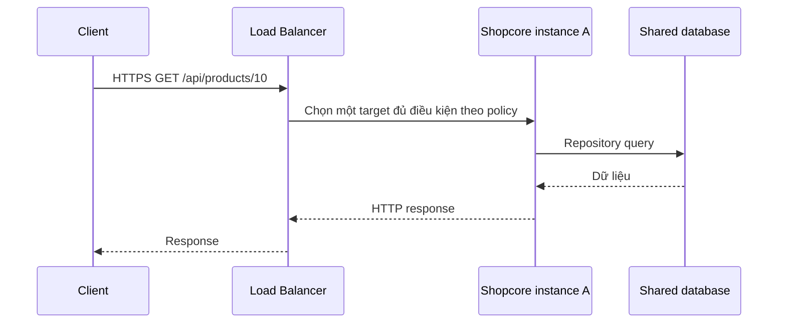

# Lesson 01 · Từ request đến nhu cầu scale: không bắt đầu bằng vẽ nhiều server

> Buổi 1 / 3h. Mục tiêu: hiểu capacity, latency, vertical/horizontal scaling và Load Balancer; chỉ ra state đang nằm ở đâu.

## Tài liệu / video

- [AWS Well-Architected: networking performance](https://docs.aws.amazon.com/wellarchitected/latest/framework/perf-04.html): liên hệ latency/bandwidth với lựa chọn hạ tầng.
- [Application Load Balancer](https://docs.aws.amazon.com/elasticloadbalancing/latest/application/introduction.html): listener, target và routing.
- [Target health checks](https://docs.aws.amazon.com/elasticloadbalancing/latest/application/target-group-health-checks.html): đọc cả trường hợp fail-open, không hứa tuyệt đối mọi LB chỉ gửi đến healthy target.
- [Bài Actuator](../M5_4_Actuator/LESSON_01_ENDPOINTS_SECURITY_HEALTH.md): readiness khác liveness.

Video: tìm `system design vertical horizontal scaling load balancer stateless application`. Ưu tiên video giải thích state và bottleneck, không chỉ danh sách công nghệ. Từ khóa chưa phải video đã verify.

## 1. Bạn biết code rồi: thêm một lớp câu hỏi

Trong một JVM, `Controller → Service → Repository` là quan hệ gọi method. System Design hỏi **những JVM, DB, cache và client ở đâu, giao tiếp bằng gì, dữ liệu được giữ ở đâu, khi tải tăng hoặc một phần hỏng thì chuyện gì xảy ra?**

Ví dụ Product API của shopcore là bối cảnh học. Mọi số liệu dưới đây là **giả định**, không phải benchmark source hiện tại:

```text
Peak: 1.000 request/giây (RPS), 90% đọc, 10% ghi.
Product list cho phép dữ liệu chậm tối đa khoảng 30 giây theo yêu cầu giả định.
Response list đã nén trung bình 20 KB.
Mục tiêu giả định: p95 latency <= 300 ms ở workload đã định.
```

Phải hỏi thêm: route nào chiếm tải, payload cỡ nào, burst dài bao lâu, concurrent users có thực sự cùng gửi request không, ngân sách/đội vận hành, lỗi nào chấp nhận được? “Có 1 triệu user” chưa cho biết RPS. Nêu functional requirements (list/create/update) và non-functional requirements (latency, availability, freshness, cost) riêng.

Không lấy “p95 ≤ 300 ms” làm yêu cầu thật của roadmap; đó là mục tiêu để tập thiết kế phép đo.

## 2. Đọc vài phép tính trước khi chọn máy

Với 1.000 RPS × 20 KB ≈ 20 MB/s payload ở đoạn truyền đang xét, chưa gồm headers/TLS/replication. Phải nói đoạn nào: client↔edge hay origin↔edge, không cộng mọi hop như một link.

Ở trạng thái ổn định, dùng mean latency 0,2 giây để ước lượng:

```text
Số request trung bình đang trong hệ thống ≈ RPS × mean time
≈ 1.000 × 0,2 = 200 request.
```

Đây là quan hệ trung bình có điều kiện ổn định, không dùng p95 thay mean để gọi là đẳng thức, không suy ra phải có 200 CPU thread hay DB connection. Request có thể chờ I/O, chỉ giữ DB connection một phần thời gian; một request có thể làm nhiều query.

Nếu đo được một instance đáp ứng mục tiêu tại 250 RPS, 1.000/250 = 4 chỉ là cận lý tưởng. Chọn headroom, dự phòng một instance mất, cùng DB/shared dependency và kiểm thử lại; không hứa nhân 4 máy là throughput đúng ×4.

## 3. Vertical và horizontal khác cách thêm năng lực

| Cách | Thay đổi | Lợi ích | Giới hạn |
|---|---|---|---|
| Vertical | Máy/JVM có thêm CPU, RAM, I/O | Đơn giản hơn ở giai đoạn đầu | Trần máy, chi phí, có thể cần restart, không tự có redundancy |
| Horizontal | Thêm instance chạy ứng dụng | Chia tải, hỗ trợ thay instance | State/routing/deploy phức tạp hơn, DB vẫn có thể nghẽn |

Hai cách có thể kết hợp. Scale không chỉ là “thêm app”: nếu DB đang chờ lock, tăng API replicas có thể tăng lượng truy cập vào DB và khiến chậm hơn. Scale-out không bắt buộc microservices: nhiều instance vẫn có thể chạy cùng một shopcore monolith.

## 4. Request qua Load Balancer ra sao?



Giải nghĩa từng bước:

1. Client gửi tới địa chỉ public của LB, không cần biết instance A/B cụ thể.
2. LB áp listener/routing và thuật toán chọn target. Một request thông thường chọn **một** instance, không broadcast cả A/B để “cả hai cùng xử lý cho nhanh”. TLS có thể terminate tại LB; mã hóa LB→app phải cấu hình riêng theo threat model.
3. Trong instance đó, MVC/Service/Repository chạy như bạn đã học; Repository vẫn gọi DB qua network.
4. DB trả kết quả; LB không tự tối ưu SQL và không tham gia transaction của Service.
5. App tạo response; lỗi business vẫn theo contract HTTP của app.
6. LB chuyển response tới client; không đảm bảo retry mọi POST an toàn.

LB không tự tạo thêm instance; autoscaling là quyết định khác cần metric/policy. Health check hỗ trợ loại target lỗi nhưng có độ trễ và policy riêng; ALB có trường hợp fail-open khi mọi target unhealthy. Thiết kế vẫn phải xét thất bại toàn bộ, không coi health check là bảo đảm không có request lỗi.

## 5. Stateless không nghĩa là không có dữ liệu

Stateless app theo request nghĩa request tiếp theo có thể xử lý ở instance khác mà không cần state chỉ nằm trong RAM của instance trước. Dữ liệu bền vững vẫn ở DB/object storage; session nếu cần có nơi chia sẻ phù hợp.

```text
POST create -> LB chọn A -> A lưu vào Map local.
GET mới tạo -> LB chọn B -> Map của B không có -> 404.
```

Hai Map không tự đồng bộ. Sticky session có thể tạm che lỗi này cho cùng một client nhưng không tạo durability, không cứu data khi A chết và còn lệch tải. JWT không đồng bộ Product Map; nó chỉ giải quyết một phần authentication state, còn refresh/revocation có contract riêng.

Upload file local cũng có vấn đề tương tự: A có ảnh, B không có. Khi cần scale thật, xem shared object storage; không yêu cầu cài S3 ở lesson này. In-memory cache có thể khác nhau giữa instances; phải có chính sách freshness/invalidation nếu dùng.

## 6. Tổng connection budget là của cả hệ thống

Nếu mỗi instance Hikari maxPool = 20, có 4 instance thì riêng chúng có thể cần đến 80 connection, chưa tính migration/admin/worker. Auto-scale lên 10 có thể thành 200; phải đối chiếu DB budget và tải thực, không copy một pool size rồi quên số replicas.

Đây là giới hạn cấu hình, không có nghĩa lúc nào 80 connection đều bận. Đừng chữa chờ SQL/lock bằng tăng pool vô hạn. Dùng metrics/queries ở M2-4/M5-4 để tìm nguyên nhân.

## 7. Bài tập quan sát nhỏ

Tự vẽ một app + một DB, ghi state RAM/local disk/DB. Sau đó vẽ hai app và hỏi với từng state: “request qua B có thấy việc A vừa làm không? A chết có mất không?” Chưa có workload thì ghi Unknown, không tự nhận shopcore đã production-ready.

Chốt: **Scale đúng phần bị giới hạn, sau khi biết workload và state. LB phân phối request; nó không chia sẻ dữ liệu hộ ứng dụng.**
