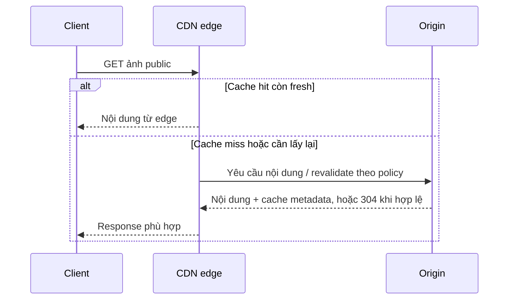

# Lesson 02 · Cache nằm ở đâu thì giảm tải được đến đó

> Buổi 2 / 3h. Mục tiêu: lần theo CDN hit/miss, phân biệt client/CDN/app/DB cache và không cache nhầm dữ liệu riêng tư.

## Tài liệu / video

- [CloudFront delivery flow](https://docs.aws.amazon.com/AmazonCloudFront/latest/DeveloperGuide/HowCloudFrontWorks.html): edge và origin.
- [HTTP Caching RFC 9111](https://www.rfc-editor.org/rfc/rfc9111.html): cache key, freshness, validation, private/no-store/no-cache.
- [Redis module đã có](../M5_1_Redis/README.md): cache-aside, TTL, invalidation; không học lại toàn Redis.

Video: tìm `CDN cache hit miss origin Cache Control private no cache no store`. Ưu tiên video có request/response headers, không coi mọi GET đều cache được.

## 1. CDN không phải một app server đặt gần người dùng

CDN có edge locations phục vụ nội dung theo cache policy. Origin là nơi lấy nội dung gốc: có thể là object storage cho ảnh hoặc HTTP backend. Ví dụ sản phẩm có ảnh public `/assets/keyboard-v2.webp`; API đơn hàng riêng tư thuộc contract khác.



Giải thích mũi tên:

1. Client đi tới edge theo phân giải/routing của CDN, không phải luôn gửi tới JVM shopcore.
2. Hit fresh: edge có representation phù hợp cache key, trả tại đó; origin không cần xử lý request này.
3. Miss: edge phải hỏi origin; expired có thể revalidate bằng validator nếu policy cho phép, không mặc định download toàn bộ lại.
4. Origin trả bytes/metadata mới hoặc 304 cho conditional request. 304 không có nghĩa ảnh rỗng: cache có bản cũ được xác nhận còn dùng được.
5. Edge trả client. CDN có thể giảm khoảng cách mạng và tải origin; không sửa được query chậm cho một request bắt buộc đi origin.

Đây là mô hình giản lược; nhiều CDN có thêm cache tầng giữa. Không yêu cầu nhớ topology vendor để hiểu hit/miss.

## 2. Bốn tầng cache, bốn phạm vi khác nhau

| Tầng | Ví dụ | Giảm được gì | Không tự giải quyết |
|---|---|---|---|
| Client/browser | Cache ảnh, conditional GET | Có thể tránh network hoặc giảm bytes | State dùng chung giữa mọi user |
| CDN/shared HTTP cache | Ảnh public, catalog public có policy | Bớt request tới origin/app | Invalidation DB, quyền business |
| App cache | Caffeine RAM / Redis cache-aside | Bớt query hoặc tính lại trong app | Client→app request vẫn đến nếu không hit ở tầng ngoài |
| DB cache | PostgreSQL shared buffers/OS cache | Bớt disk I/O cho data/index pages | SQL vẫn tốn CPU/lock/execution, không phải response cache |

“DB cache” ở đây là page/buffer cache, **không khẳng định PostgreSQL tự cache kết quả mọi SELECT**. Index và cache là hai ý khác nhau; SQL vẫn cần plan tốt và phân trang. Redis là process riêng nên có network hop; không hứa nhanh hơn RAM local cho mọi workload.

## 3. Cache key chính là câu hỏi “có phải cùng một dữ liệu không?”

`/products?page=0&size=20&sort=price,asc` khác page 1 hoặc sort desc. API còn có thể phụ thuộc category, currency, language, tenant hoặc quyền. Nếu cache key bỏ sót dimension làm response khác nhau, hai request bị coi nhầm cùng nội dung.

Ví dụ A xem giá dành riêng A, B xem giá của B. Nếu shared cache chỉ key bằng URL và cấu hình cho phép cache response riêng tư, B có thể nhận dữ liệu của A. Không chữa bằng chỉ đặt TTL nhỏ; dữ liệu sai quyền dù tồn tại 1 giây vẫn là lỗi.

Một policy đơn giản cho bài học: CDN cache ảnh public versioned; **không shared-cache response user-specific**. Muốn cache public catalog cần xác định contract, auth headers/cookies, key/query params, TTL và invalidation rõ. Không mở cache toàn bộ `/api/**` chỉ vì method GET. Authorization vẫn phải được áp đúng tại nơi phục vụ.

## 4. Header dễ nhầm

| Header directive | Đọc đúng |
|---|---|
| `Cache-Control: public, max-age=300` | Chủ động cho shared caching theo các điều kiện HTTP liên quan, freshness 300 giây |
| `private` | Không lưu trong shared cache; browser cache vẫn có thể lưu |
| `no-store` | Yêu cầu không lưu response; không phải cơ chế xóa mọi bản đã lưu trước đó |
| `no-cache` | Không có nghĩa “cấm lưu”; cần validation trước khi reuse theo rule |

Đây là nhận diện cơ bản, không thay toàn RFC/vendor config. Browser private cache và shared CDN cache không có cùng policy. CDN cache TTL/config có thể tương tác với headers; phải kiểm cấu hình thực tế, không chỉ nhìn một annotation backend.

Ảnh versioned `keyboard-v2.webp`: deploy ảnh mới thành `v3` và cập nhật reference giúp tránh chờ TTL bản cũ. Nếu overwrite cùng URL, phải cân nhắc purge/invalidation/TTL của tất cả tầng, không chỉ Redis.

## 5. TTL không phải cam kết mọi response mới nhất

Một timeline đơn giản:

```text
t0: CDN lưu catalog, TTL 30 giây.
t5: primary cập nhật tên sản phẩm.
t6: client hit CDN -> có thể vẫn thấy tên cũ.
t30: cache hết freshness; phải xử lý theo policy revalidate/refetch.
```

TTL kiểm thời gian dùng bản cache theo chính sách; dữ liệu gốc có thể đã cũ lúc fill vì read replica lag. Nếu cả app cache và CDN giữ stale độc lập, không tuyên bố “TTL 30 ở mỗi nơi thì stale tối đa chắc chắn 30”. Phải xét nguồn fill và timeline từng tầng; một tầng có thể fill từ tầng khác đã stale.

Khi cache miss hàng loạt hoặc Redis lỗi, fallback về DB có thể tạo tải đột biến. Cần TTL rải, giới hạn concurrency, request coalescing hoặc cơ chế phù hợp khi workload cho thấy cần; chỉ nhận diện, không bắt implement distributed lock ở module này.

## 6. Hit ratio giúp gì và không giúp gì?

Giả sử **riêng ảnh public** có 1.000 requests/giây, edge hit 90%; bỏ qua revalidation và tầng giữa:

```text
Origin fetch ≈ 1.000 × (1 − 0,9) = 100/giây.
```

Đó không tự là tổng RPS tới shopcore API. Ảnh có thể có origin object storage riêng; upload/write/uncacheable calls vẫn đi nguồn tương ứng. Phải phân biệt request hit ratio với byte hit ratio: 90% request nhỏ hit nhưng file lớn miss vẫn tốn bandwidth lớn.

Không lấy mean response time của hit rồi tuyên bố p95 của toàn bộ traffic thấp. Theo dõi hit/miss latency, origin load, freshness, correctness/privacy và cost cùng nhau.

## 7. Quyết định cho shopcore giả định

- Ảnh public versioned: ưu tiên CDN/object storage khi thật sự có feature và traffic.
- Product public list: bắt đầu query/index/pagination tốt; thêm cache nếu read repeat cao và freshness cho phép.
- Chi tiết nhạy cảm/user-specific: không public shared cache theo policy mặc định của bài.
- Create/update: ghi source of truth và có chiến lược invalidation cho các lớp đang dùng, không coi cache là DB.

Liên hệ AI: prompt/chat history của từng user không giống ảnh public. Một response LLM có context/quyền có thể không dùng lại được cho user khác; hash prompt không thay việc xác định cache key và privacy.

Chốt: **Đặt cache gần nơi cần giảm tải, và định nghĩa đúng dữ liệu nào được dùng lại cho ai trong bao lâu.**
