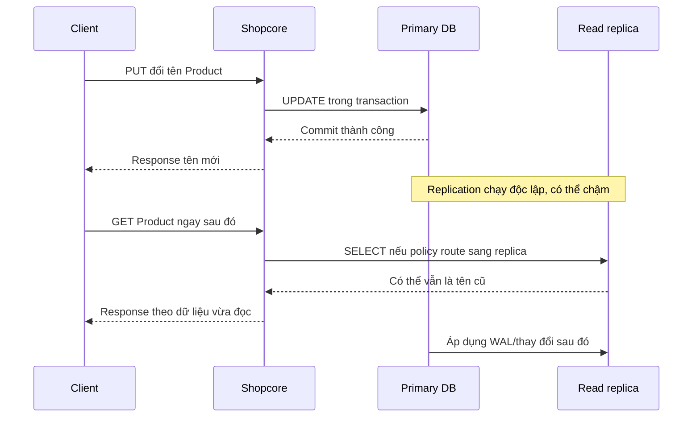

# Lesson 03 · Read replica: chia tải đọc, đổi lại phải nghĩ về dữ liệu cũ

> Buổi 3 / 3h. Mục tiêu: giải thích luồng write/read/replication, read-after-write và vì sao replica không tự là backup/failover/write scaling.

## Tài liệu / video

- [RDS read replicas](https://docs.aws.amazon.com/AmazonRDS/latest/UserGuide/USER_ReadRepl.html): đọc workload, replication và endpoint.
- [PostgreSQL streaming standby](https://www.postgresql.org/docs/current/warm-standby.html): WAL và synchronous/asynchronous trade-off.
- [PostgreSQL hot standby](https://www.postgresql.org/docs/current/hot-standby.html): đọc trên standby và hạn chế.
- [RDS Multi-AZ DB instance](https://docs.aws.amazon.com/AmazonRDS/latest/UserGuide/Concepts.MultiAZSingleStandby.html): ví dụ standby phục vụ HA không dùng cho read traffic; không đánh đồng với Multi-AZ DB cluster có readers.

Video: tìm `PostgreSQL read replica replication lag read after write primary replica`. Chọn video phân biệt HA, backup và scale reads; không bắt triển khai RDS.

## 1. Bắt đầu từ một database

Một app + primary DB có thể đủ rất lâu. Đầu tiên giảm query thừa/N+1, index theo query, phân trang và đo plan; không thêm replica chỉ vì “project lớn thường có”. Nếu tải còn lại chủ yếu là SELECT chấp nhận lag, replica là một lựa chọn.

Primary nhận ghi; replica duy trì bản sao qua cơ chế replication. Trong ví dụ này dùng **asynchronous replication**: primary có thể báo write thành công trước khi replica áp dụng thay đổi. Không biến mô hình này thành tuyên bố “mọi replication trên mọi DB đều async”.

## 2. Luồng của hai request khác nhau



Giải thích:

1. PUT đến app, không đến replica trực tiếp từ client.
2. App ghi primary bằng transaction; chưa phải distributed transaction giữa cả primary và replica.
3. Commit đạt contract của primary, không tự đồng nghĩa mọi replica cập nhật xong.
4. App có thể trả DTO chứa dữ liệu mới từ transaction, không cần query replica ngay.
5. GET là request riêng; routing policy quyết định nguồn đọc.
6. Nếu replica chưa replay xong, SELECT trả trạng thái cũ, thậm chí không thấy row vừa tạo.
7. App serialize dữ liệu nhận được; Jackson/DTO không sửa được replication lag.
8. Replication tiếp tục; khi bắt kịp, replica mới có phiên bản mới. Diagram cố ý đặt replay sau GET để minh họa stale read, không phải mọi request đều stale.

## 3. Một timeline để khỏi học thuộc thuật ngữ

```text
t=0 ms: primary commit Product 10 tên = New.
t=20 ms: GET tới replica; replica còn tên Old.
t=80 ms: replica replay commit đó.
t=100 ms: GET replica thấy New (nếu không có tầng cache cũ).
```

80 ms là số giả lập để hiểu, không phải độ trễ luôn có. Lag thay đổi theo tải/mạng/replay/query; không “sleep 100 ms là đảm bảo”. Read-after-write là yêu cầu client phải thấy việc vừa ghi; eventual catch-up không tự cho yêu cầu đó tại mọi thời điểm.

## 4. Route theo yêu cầu freshness, không chỉ theo GET/POST

| Luồng | Lựa chọn ban đầu có thể hợp lý |
|---|---|
| Product public list cho phép stale | Replica khi đo thấy cần, theo dõi lag |
| Admin vừa sửa cần thấy ngay | Đọc primary hoặc trả dữ liệu từ write response và quy định lần đọc sau |
| Kiểm tra invariant trước ghi | Đặt kiểm tra/constraint/transaction phù hợp trên primary |
| Report nặng chịu trễ | Replica/reporting riêng nếu phù hợp |

“Mọi SELECT sang replica” là quá thô: SELECT bên trong transaction ghi/invariant có thể cần consistency với primary. Kiểm SKU unique chỉ bằng đọc replica có thể không thấy SKU vừa được tạo; DB constraint primary mới là tuyến bảo vệ race cuối cùng.

`@Transactional(readOnly=true)` **không tự tạo hay route DataSource sang read replica**. Cần cấu hình routing/connection/transaction semantics rõ ràng, ngoài scope code lesson này. LB HTTP giữa app A/B không tự phân loại SQL vào primary/replica.

Khi dùng primary cho read-after-write, vẫn phải bypass/invalidate cache cũ; đổi DB route không chữa cached stale response ở CDN/app. Có thể dùng sticky-to-primary theo thời gian như compromise nhưng timeout cố định không chứng minh replica đã catch-up; document guarantee thực sự.

## 5. Thêm replica không tăng được mọi loại capacity

- Có thể giảm SELECT đủ điều kiện trên primary; writes vẫn tập trung primary.
- Không làm một query thiếu index tự nhanh; mỗi replica vẫn chạy query đó.
- Replica nhận WAL/replay tốn CPU/I/O/network/storage và tiền; tăng lag là dấu hiệu cần điều tra.
- App phải biết endpoint/routing; tạo replica mà vẫn tất cả query vào primary không giảm tải đọc.
- Read fallback về primary khi replica hỏng có thể đẩy quá tải ngược lại. Giới hạn/bảo vệ tải và degraded mode phải được cân nhắc.

PostgreSQL hot standby có thể có query conflict với replay; query có thể bị cancel theo cấu hình hoặc giữ replay chậm hơn. Nhận diện trade-off, không cần nhớ parameter tuning để thi module này.

## 6. Replica, HA và backup không cùng mục đích

| Khái niệm | Mục đích chính | Không tự bảo đảm |
|---|---|---|
| Read replica | Chia đọc chấp nhận policy freshness | Write scaling, zero lag |
| HA/failover | Tiếp tục phục vụ khi primary lỗi theo cơ chế đã thiết kế | Không mất dữ liệu trong mọi mode, zero downtime |
| Backup/PITR | Khôi phục về trạng thái trước lỗi/mất dữ liệu | Bản chạy nóng thay thế tức thì |

Nếu xóa nhầm row trên primary, replication có thể áp dụng xóa đó; replica không tự giữ bản trước lỗi như backup lịch sử. Async promotion có thể mất phần write chưa replay; cần hiểu RPO (lượng/thời gian dữ liệu chấp nhận mất) và RTO (thời gian khôi phục mục tiêu). Chỉ nhận diện hai khái niệm, không yêu cầu lập DR production.

RDS **Multi-AZ DB instance** standby không phục vụ read queries; không suy ra mọi sản phẩm mang tên Multi-AZ đều như vậy. Đây là lý do phải nói rõ topology/service, không chỉ từ khóa “replica”.

## 7. Tự kiểm

Hãy kể một PUT→GET trong ba trường hợp: primary read, replica read, cache hit. Chỉ rõ nơi có thể stale. Sau đó trả lời: nếu primary đang nghẽn writes/locks, vì sao thêm read replica có thể chưa giải quyết?

Liên hệ AI: dữ liệu retrieval/quyền tài liệu mới thay đổi mà replica/index/cache chưa kịp cập nhật có thể làm kết quả sai hoặc lộ quyền. Tách yêu cầu freshness theo luồng, không hứa “dữ liệu cuối cùng sẽ đúng” thay cho kiểm quyền ngay lúc truy cập.

Chốt: **Replica chia tải đọc có điều kiện; đổi lại phải nêu freshness và routing. Nó không phải công tắc consistency/HA/backup chung.**
