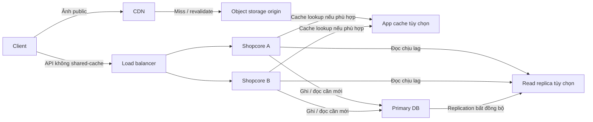

# Lesson 04 · Ghép thiết kế và chứng minh vì sao cần từng thành phần

> Buổi 4 / 3h. Mục tiêu: vẽ topology shopcore giả định, ghi bottleneck bằng evidence, đề xuất từng bước và kế hoạch đo lại. Không phải hai bài system design interview đầy đủ của M7-2.

## Tài liệu / video

- [AWS Architecture Center](https://aws.amazon.com/architecture/): đọc kiến trúc như tập trade-off, không lấy sơ đồ vendor làm yêu cầu bắt buộc.
- [AWS Well-Architected Framework](https://docs.aws.amazon.com/wellarchitected/latest/framework/welcome.html): cân nhắc performance, reliability, security và cost cùng nhau.
- [Actuator metrics lesson](../M5_4_Actuator/LESSON_02_METRICS_COUNTER_TIMER_MDC.md): đơn vị, time window, instance và log correlation.
- [Microservices ADR lesson](../M5_3_Microservices/LESSON_02_TRADEOFFS_EXTRACTION_ADR.md): ghi quyết định và điều kiện review.

Video: tìm `system design bottleneck measurement cache load balancer database replica tradeoffs`. Không cần luyện full interview tại đây.

## 1. Sơ đồ đề xuất, không phải hệ thống đã triển khai



Ý nghĩa từng nhóm mũi tên:

1. Client→CDN→object storage dành cho ảnh public; cache hit dừng ở edge nên không cần tới object origin.
2. Client→LB→A **hoặc** B cho một API call. Hai mũi tên biểu diễn lựa chọn target, không broadcast.
3. A/B→cache chỉ cho nghiệp vụ đã xác định key/freshness; cache hit có thể bỏ qua DB read. Diagram cấu trúc không bảo mọi request luôn đi qua cache.
4. A/B→primary cho writes và reads cần consistency theo policy.
5. A/B→replica chỉ cho reads chấp nhận lag, không cho ghi chung chung.
6. Primary→replica là replication, không phải app gửi hai INSERT. Response paths bỏ qua để hình đỡ rối; Lesson 01–03 đã giải thích response từng hop.

Cache/replica/object storage trong sơ đồ là đề xuất khi nhu cầu được xác nhận. Không khẳng định source hiện tại có tất cả. Bản đơn giản một app + một primary DB là điểm xuất phát hợp lệ, chưa có bằng chứng thì không bắt dựng toàn sơ đồ.

## 2. Bottleneck là nơi giới hạn mục tiêu, không phải nơi bạn thích tối ưu

Bảng **dữ liệu giả lập A**, cùng workload 500 RPS, dataset và time window:

| Chỉ số | Giá trị giả lập |
|---|---|
| HTTP p95 | 900 ms, mục tiêu giả định 300 ms |
| App CPU | 25% |
| DB CPU | 90% |
| Một route list | 21 SQL statements/request |
| Pool acquisition wait | Tăng khi burst |

Giả thuyết tốt: query pattern/N+1 hoặc DB work có thể giới hạn. CPU app thấp không chứng minh đủ mọi tài nguyên, pool wait cũng có thể là hậu quả query chậm. Đầu tiên trace/count SQL theo route, xem plan/buffers/locks và execution time; không kết luận chỉ bằng một %CPU.

Sau sửa N+1, giả sử route còn 2 query và latency giảm trong cùng workload. Đó là evidence hỗ trợ, chưa chứng minh mọi endpoint tốt. Chỉ cân nhắc replica nếu read load còn đáng kể và freshness cho phép. Thêm app trước có thể làm DB nhận tải lớn hơn.

Bảng **dữ liệu giả lập B**:

```text
App CPU 95%, DB CPU 20%, pool wait thấp.
Profiling cho thấy CPU dùng nhiều ở transform/serialize payload lớn.
```

Ở B, giảm payload/computation hoặc app scale có cơ sở hơn replica. Nếu chủ yếu ảnh lớn đi qua JVM và bandwidth origin cao, chuyển public assets tới CDN/object storage có thể đúng phần tải hơn; vẫn đo trước/sau.

## 3. Quy trình điều tra có thể lặp lại

1. **Định nghĩa workload:** route mix/read-write ratio, RPS/concurrency, payload, dữ liệu, cache warm/cold, duration, version, instance count.
2. **Lấy baseline:** latency distribution, throughput đạt, errors/timeouts, CPU/RAM/GC, pool wait, DB/query/locks, network, cache hit/miss. Không cần mọi dashboard, chọn theo giả thuyết.
3. **Viết giả thuyết có thể sai:** “N+1 route list làm tăng DB work”, không “DB chắc yếu”.
4. **Thay một việc có kiểm soát:** fetch/query fix, index, payload, cache hoặc scale theo evidence.
5. **Đo lại:** cùng điều kiện hoặc document khác biệt, lặp đủ để tránh warmup/cache/traffic đánh lừa. So cả correctness và freshness, không chỉ mean latency.
6. **Ghi quyết định:** lợi ích, cost, rủi ro mới, rollback và khi nào review. Không có improvement đủ đáng kể hoặc gây sai dữ liệu thì không giữ thay đổi chỉ vì đẹp sơ đồ.

EXPLAIN ANALYZE có thực thi SQL: kiểm dữ liệu/môi trường an toàn, đặc biệt DML. Không chạy load test phá dữ liệu production. Quan sát số liệu chưa đủ để tự suy nguyên nhân; kiểm bằng giả thuyết và phép so sánh.

## 4. Failure walkthrough: lần theo mỗi phần bị hỏng

| Sự cố | Câu hỏi thiết kế phải trả lời |
|---|---|
| A chết | LB phát hiện khi nào, request đang chạy ra sao, B còn capacity không? |
| Cache lỗi | Có fallback không, DB chịu surge không, có giới hạn/timeout không? |
| Replica lag/hỏng | Route freshness nào bị ảnh hưởng, fallback có quá tải primary không? |
| Primary lỗi | Writes/strong reads có thể fail; replica không tự thành writer nếu chưa có cơ chế promote/failover |
| Origin ảnh lỗi | Fresh cached object có thể còn phục vụ; miss/private traffic vẫn có thể fail |

Retry không tạo capacity; retry nhiều tầng có thể nhân tải. POST tạo resource cần idempotency contract phù hợp trước khi retry tự động; LB không tự bảo đảm exactly-once. Security boundary cũng phải có trên đường origin/private service, không chỉ ở sơ đồ public.

Không biến bài này thành chaos engineering production. Chỉ cần mô tả degraded behavior và cách kiểm an toàn.

## 5. Viết một trang design document

Dùng [template](DESIGN_TEMPLATE.md); chia rõ:

- **Facts:** nguồn code/config/measurement đã đọc, thời điểm và môi trường.
- **Assumptions:** những số/yêu cầu giả định để tập, chưa được xác nhận.
- **Unknowns:** query thực, workload, capacity, chi phí chưa đo.
- **Decision Proposed:** hiện giữ topology nào, thay gì trước, vì sao.
- **Validation:** phép đo và điều kiện chấp nhận/revert.

Hiện source shopcore được xem trong lần soạn có model/DTO/common nhưng chưa đủ business workload chạy để kết luận DB/CPU bottleneck. Vì vậy mẫu ghi Unknown là trung thực; không bịa load test hoặc làm deliverable hộ bạn.

## 6. Liên hệ hướng AI Engineer

Các bước vẫn dùng khi API gọi model provider: phân biệt CPU backend, network/provider latency, quota/token throughput và queue backlog. Thêm Java replicas không tự tăng quota/GPU capacity. Cache output phải theo privacy/context/freshness; không cache chung chat user chỉ vì “prompt gần giống”. Chưa học sharding/vector database/GPU scheduler ở module này.

## 7. Tự kể lại thiết kế theo một request

“Ảnh public có thể dừng ở CDN. API đến LB chọn một shopcore instance. Instance thực thi 3-layer; chỉ reads phù hợp mới dùng cache/replica, writes vào primary. Replica có lag. Tôi thêm thành phần khi số đo cho thấy nó giải quyết đúng bottleneck và chấp nhận được cost/correctness trade-off.”

Không cần thuộc sơ đồ; phải trả lời được **bỏ một thành phần đi thì luồng nào đổi và trade-off nào mất/được**.
