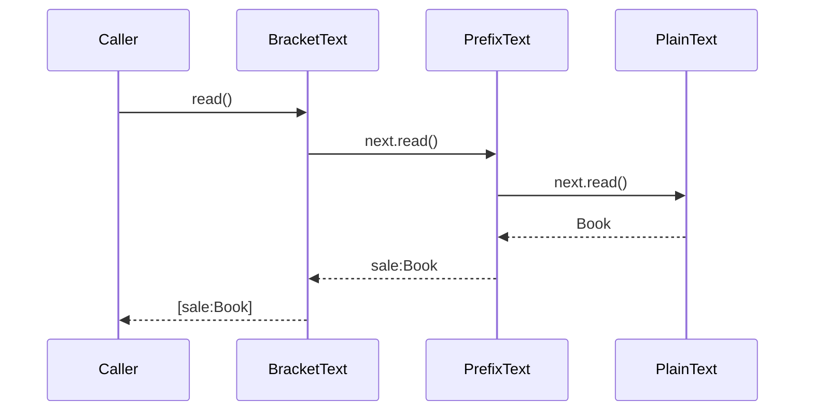

# Lesson 04 · Decorator, Proxy, Composite và chọn pattern có chủ đích

> Buổi 4 / 4h. Phân biệt các cấu trúc nhìn giống nhau bằng intent, theo trace wrapper/recursion, rồi review evidence thật trong shopcore.

## Tài liệu / video

- [Decorator](https://refactoring.guru/design-patterns/decorator): thêm responsibility bằng composition.
- [Proxy](https://refactoring.guru/design-patterns/proxy): kiểm soát truy cập object phía sau.
- [Composite](https://refactoring.guru/design-patterns/composite): xử lý leaf và group qua interface chung.
- [Spring proxying](https://docs.spring.io/spring-framework/reference/core/aop/proxying.html): đọc JDK/CGLIB, final và self-invocation trong proxy mode.
- Source để mở IDE: `shopcore/src/main/java/com/shopcore/common/ApiErrorResponse.java`, `PageResponse.java`, `GlobalExceptionHandler.java`. Tài liệu chỉ nhận xét source đọc được, không suy feature chưa có.

Video: tìm `Decorator vs Proxy Java delegation order`, `Composite pattern recursion tree Java`, `Spring AOP self invocation proxy explained`. Kiểm video có cả failure path, không chỉ diagram đẹp.

## 1. Vì sao không cứ kế thừa để thêm tính năng?

Giả định cần thêm prefix và bracket cho chuỗi hiển thị. Nếu subclass cho mọi tổ hợp, bạn sẽ có Plain, Prefix, Bracket, PrefixBracket, BracketPrefix... Khi số tùy chọn tăng, subclass combinations khó quản lý.

Decorator giữ cùng interface, chứa một object cùng interface và thêm behavior quanh lời gọi. [Decorator](https://refactoring.guru/design-patterns/decorator). Đây là ví dụ text thuần Java để học cơ chế, không feature format báo cáo đã có trong shopcore.

## 2. Code đủ để đọc delegation, access check và recursion

<!-- verify: learning/patterns/CompositionExample.java -->
```java
package learning.patterns;

import java.util.List;
import java.util.Objects;
import java.util.function.BooleanSupplier;

public final class CompositionExample {
    public interface TextSource { String read(); }
    public static final class PlainText implements TextSource {
        private final String value;
        public PlainText(String value) { this.value = Objects.requireNonNull(value); }
        public String read() { return value; }
    }
    public static final class PrefixText implements TextSource {
        private final TextSource next;
        private final String prefix;
        public PrefixText(TextSource next, String prefix) {
            this.next = Objects.requireNonNull(next);
            this.prefix = Objects.requireNonNull(prefix);
        }
        public String read() { return prefix + next.read(); }
    }
    public static final class BracketText implements TextSource {
        private final TextSource next;
        public BracketText(TextSource next) { this.next = Objects.requireNonNull(next); }
        public String read() { return "[" + next.read() + "]"; }
    }

    public static final class GuardedText implements TextSource {
        private final TextSource next;
        private final BooleanSupplier allowed;
        public GuardedText(TextSource next, BooleanSupplier allowed) {
            this.next = Objects.requireNonNull(next);
            this.allowed = Objects.requireNonNull(allowed);
        }
        public String read() {
            if (!allowed.getAsBoolean()) throw new SecurityException("access denied");
            return next.read();
        }
    }

    public interface Node { long count(); }
    public static final class Leaf implements Node {
        private final String name;
        public Leaf(String name) { this.name = Objects.requireNonNull(name); }
        public String getName() { return name; }
        public long count() { return 1; }
    }
    public static final class Group implements Node {
        private final List<Node> children;
        public Group(List<Node> children) { this.children = List.copyOf(children); }
        public long count() {
            long total = 0;
            for (Node child : children) total = Math.addExact(total, child.count());
            return total;
        }
    }
}
```

Giữ nested classes để xem đủ vai trong một file, không yêu cầu layout này trong app thật. Constructor reject dependencies null; interface có method đủ nhỏ để tự fake. Mẫu không dùng Spring/Security/JPA nên không được xem là implementation authorization production.

## 3. Trace Decorator: gọi vào từ ngoài, trả về từ trong

```java
CompositionExample.TextSource text = new CompositionExample.BracketText(
        new CompositionExample.PrefixText(new CompositionExample.PlainText("Book"), "sale:"));
String result = text.read();
```



1. Caller biết TextSource; object ngoài cùng là BracketText nên chạy read ở đó.
2. Để tính bracket, nó cần dữ liệu của next, tức PrefixText.read.
3. PrefixText cũng cần next.read, tức PlainText trả Book.
4. Return đi ngược: prefix thêm sale:, bracket bọc kết quả, caller nhận `[sale:Book]`.

Đổi thứ tự thành PrefixText(BracketText(PlainText), sale:) thì nhận `sale:[Book]`. **Thứ tự wrapper là behavior**, không chỉ cách viết constructor. Các wrapper trong mẫu không swallow exception; next throw thì caller nhận lỗi đó, không chuỗi rỗng giả thành công.

Chi phí: thêm object/indirection, debug call stack dài hơn. Hai transformation cố định, gọi helper trực tiếp có thể rõ hơn. Dùng Decorator khi cần composition tùy chọn quanh cùng contract; không gọi một class có field delegate bất kỳ là Decorator.

## 4. Proxy: cùng interface, trọng tâm là quyền đi tiếp

Proxy đại diện cho object thật và kiểm soát access; có thể liên quan access check, lazy loading, remote access hoặc caching tùy thiết kế. [Proxy](https://refactoring.guru/design-patterns/proxy). Mẫu GuardedText chỉ mô phỏng **protection proxy**:

```text
Caller → GuardedText.read
         → allowed.getAsBoolean()
           false → throw "access denied", không gọi next
           true  → next.read → giữ kết quả/error của next
```

Khác Decorator prefix: GuardedText quyết định **có được gọi** object phía sau hay không; prefix thêm behavior hiển thị. Cấu trúc đều chứa next cùng interface nên không phân loại chỉ từ UML. Intent chính và contract quan sát được quyết định cách gọi; có thiết kế kết hợp cả hai vai.

Allowed supplier được gọi ở **mỗi read**, không lưu boolean của user đầu tiên rồi dùng chung mãi. Nhưng lab vẫn không chứng minh user/permission đúng: production cần principal đáng tin, policy, tenant isolation, và tránh đường bypass đi thẳng object thật. Đổi check từ ngoài vào trong wrapper chain có thể thay side effects xảy ra trước khi deny; phải trace thứ tự.

Caching proxy thêm stale-data/invalidation/authorization-key concerns; retry wrapper có thể lặp side effects. Đừng thêm các behavior đó rồi gọi là refactor không thay đổi gì. Wrapper phải giữ contract phù hợp, không tự “an toàn” vì có interface.

## 5. Liên hệ Spring: proxy không nằm trong source method của bạn

Trong proxy-based Spring AOP, caller có thể giữ proxy; advice chạy khi lời gọi đi qua proxy tới target. Self-invocation như `this.otherMethod()` trên target không đi vòng ra proxy, nên annotation trên method đó không tự được intercept. JDK proxy dùng interfaces; CGLIB tạo subclass, final/private có các giới hạn interception. [Spring proxying](https://docs.spring.io/spring-framework/reference/core/aop/proxying.html).

```text
Caller → proxy → advice → target.method()       [đi qua proxy]
target.method() → this.otherMethod()           [gọi nội bộ target]
```

Hai mũi tên khác nhau: mũi đầu có điểm interception, mũi sau là lời gọi Java trực tiếp. Manual GuardedText unit test không kiểm Spring chọn proxy loại nào hoặc transaction rollback. Khi refactor bean/method có AOP, cần integration test đúng boundary; không suy Spring hoạt động từ mẫu wrapper xanh.

## 6. Composite: một leaf hay một group đều nhận cùng lời gọi

Giả định cây báo cáo: Root chứa Product leaf và một Group chứa hai leaf nữa. Caller muốn count, không phải tự `if leaf else loop group` ở mọi chỗ. Composite cho leaf và group cùng Node contract; group delegate recursively cho children. [Composite](https://refactoring.guru/design-patterns/composite).

```text
Root Group
├── Leaf("Book")              → count=1
└── Sub Group
    ├── Leaf("Pen")           → count=1
    └── Leaf("Keyboard")      → count=1
```

Trace `root.count()`:

1. Root bắt đầu total0, duyệt children theo thứ tự list.
2. Book trả1, Root total1.
3. Sub Group bắt đầu total0; Pen trả1, Keyboard trả1; Sub trả2.
4. Root cộng2 vào1 rồi trả3.

Caller chỉ biết Node.count. **Recursion ở Group.count gọi child.count**; gặp Leaf thì dừng bằng return1, không phải Spring tự duyệt cây. Empty group trả0. Math.addExact làm overflow long throw thay vì âm thầm wrap; đó là contract lab, không “vô hạn”.

## 7. Cây khác graph, count occurrences khác count unique

Mẫu cho phép cùng Leaf xuất hiện hai lần: count là **hai occurrences**, không tự deduplicate theo name/id. Nếu nghiệp vụ muốn số Product duy nhất thì cần rule khác và Set/key semantics, không đổi lén trong refactor.

Group copy danh sách và không có add/remove, giúp snapshot children không bị caller thay đổi qua list gốc. Các Group/Leaf có sẵn có thể lắp thành cây không tự trỏ vào chính mình bằng list sau khi tạo. Nhưng Node là interface mở: custom Node có thể tạo graph/cycle hoặc state mutable; mẫu không có general cycle detector. Cây rất sâu có nguy cơ stack overflow; graph thực tế cần quy tắc cycle, visited set, depth limit hoặc thuật toán phù hợp. Composite không tự giải các vấn đề đó.

Một JPA Category có children chưa đủ để claim đã triển khai Composite API; còn cần operation chung và delegation rõ. Recursion trên quan hệ LAZY có thể query nhiều hoặc gặp session đóng; pure Java count không chứng minh query count. Không biến entity tree thành JSON trực tiếp chỉ vì muốn dùng pattern.

## 8. So pattern bằng intent, không bằng hình dạng

| Pattern | Câu hỏi nhận diện | Dấu hiệu chưa đủ |
|---|---|---|
| Adapter | Contract nào không tương thích đang được translate? | Có field delegate |
| Decorator | Behavior bổ sung nào bao quanh cùng interface? | Có wrapper |
| Proxy | Access/lifecycle object thật được kiểm soát thế nào? | Có method cùng tên |
| Facade | Caller được giấu workflow subsystem nào? | Class tên Service/Facade |
| Composite | Leaf/group chung operation, group recurse ra sao? | Có List children |

Abstraction tốt giảm pain point cụ thể; không phải thêm một class tên pattern là đủ. Có thể giữ code không pattern nếu đã rõ, ổn định và dễ test.

## 9. Evidence hiện có trong shopcore

Tại lúc soạn, ApiErrorResponse và PageResponse có `@Builder`, handler gọi builder khi dựng response: **đã thấy builder-style construction**. DTO có setters/no-args/all-args theo class nên không được suy immutable hoặc invariant đã được bảo vệ ở mọi đường tạo.

Không thấy các role Factory/Adapter/Decorator được minh họa ở bài này trong nhóm source ấy; **không invent đã áp đủ Builder+Factory+Structural**. Spring/framework dùng cơ chế tạo/proxy ở runtime không tự chứng minh người học đã refactor một feature có chủ đích. Mở lại source mới nhất trước khi kết luận, không xem observation hôm nay là bất biến.

Gợi ý tương lai, chỉ **proposed**: nếu thêm SDK thật có contract khác thì Adapter là candidate; nếu thêm tùy chọn quanh cùng interface thì Decorator có thể phù hợp. Nếu chưa có nhu cầu này, không xây integration giả trong capstone chỉ để đủ tên pattern.

## 10. Quy trình chọn một thay đổi, không rewrite backend

1. Ghi pain point và source evidence, không bắt đầu bằng “hôm nay phải dùng Decorator”.
2. Chốt contract giữ lại: output/error, JSON, units, order/side effects, transaction/lifecycle và performance constraint nếu có.
3. So phương án đơn giản (helper/constructor/injection) với pattern; ghi lợi ích **và** types/indirection/test cost.
4. Baseline trước, một thay đổi nhỏ, test trước/sau theo scope; đụng bean/proxy/SDK/persistence cần integration tương ứng.
5. Log proposed/implemented/tested/merged trung thực, biết lúc dừng. Không lấy sample QA làm evidence toàn project.

Mini design theo roadmap sau này cần Builder + Factory + một Adapter/Decorator có nhu cầu thật, cùng rationale và test. Hiện tại chỉ đọc/thi lesson không hoàn thành deliverable, không tick checklist; capstone vẫn để nguyên theo quyết định học của bạn.

Liên hệ AI Engineer: provider adapter, pipeline facade, wrapper metrics/access có thể hữu ích nếu boundary thật. Đổi model/prompt/retry/token budget làm thay behavior/cost, không được giấu trong “áp pattern”; unit fake không thay model evaluation hoặc integration với provider.

Chốt: **Hãy kể được lời gọi đi vào đâu, return/throw đi ra đâu và giải quyết pain point gì; đó là hiểu pattern.**
